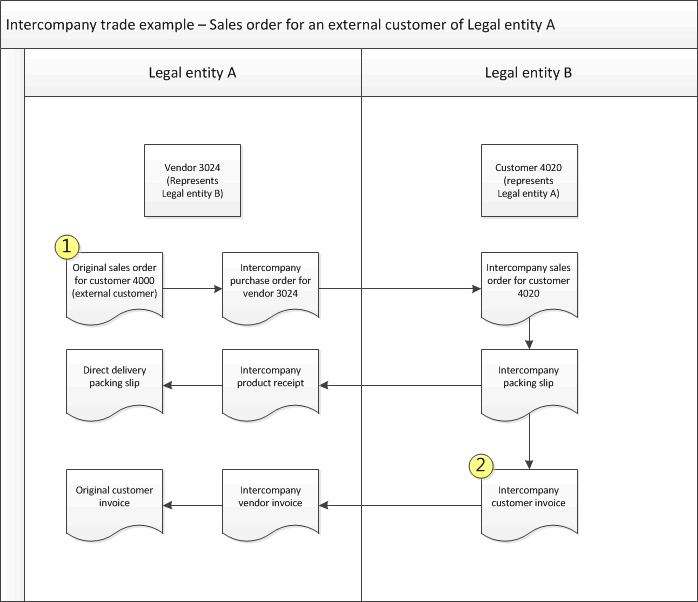

# Create and invoice an intercompany sales order for an external customer

[!include [banner](../../includes/banner.md)]

You can use intercompany trade to record the sale of a product from one legal entity to another legal entity that is in the same organization.

When you create the original sales order, you can automatically create an intercompany purchase order for the intercompany vendor. This automatically creates an intercompany sales order in the intercompany vendor's legal entity.

The following illustration shows the flow of the transactions when you create a sales order for an external customer, but the product must be ordered from a different legal entity in your organization before you can deliver the product to the customer. In this case, an intercompany purchase order is created for the vendor account that represents the other legal entity. In turn, an intercompany sales order is created in the other legal entity for the customer account that represents your legal entity. When an intercompany purchase order is invoiced, the invoice for the original sales order is automatically posted, if it is a direct delivery.

If you are using direct delivery, and you select **Packing slip** in the **Quantity** field on the **Posting invoice** page, the intercompany vendor invoice is based on the intercompany product receipt that was previously posted.

## Prerequisites

Before you begin, make sure that the following prerequisites are met to automatically post and print the intercompany invoices.

1. Go to **Sales and marketing \> Customers \> All customers**.
1. On the Action Pane, on the **General** tab, select **Intercompany**.
1. Go to **Procurement and sourcing \> Vendors \> All vendors**.
1. On the Action Pane, on the **General** tab, select **Intercompany**.
1. On the **Intercompany** page for either the vendor or the customer, in the **Purchase order policies** area, in the **Intercompany purchase order (direct delivery)** field group, select the **Post invoice automatically** check box.
1. In the **Purchase order policies** area, in the **Original sales order (direct delivery)** field group, select the **Post invoice automatically** check box. Select this check box if you want the invoice for the original sales order to be automatically printed when you post the intercompany vendor invoice.

> [!NOTE]
> The print settings for the invoice are determined by the setup for the module, document, or transaction on the **Print management setup** page.

## Create an original sales order for an external customer

Do these steps in legal entity A. This procedure corresponds to the box labeled 1 in the illustration.

1. Go to **Accounts receivable \> Sales orders \> All sales orders**.
1. From the **All sales orders** list page, create the original sales order. The field values are copied from the customer account to the sales order.
1. On the **Sales order** page, select **Header view** on the Action Pane.
1. On the **Intercompany settings** FastTab, select the **Autocreate intercompany orders** check box.
1. If you want the intercompany vendor to deliver the item directly to the external customer, select the **Direct delivery** check box.
1. When you have finished entering the sales order, close the **Sales order** page.

The intercompany purchase order is automatically created for all the items that have an assigned intercompany vendor, and then the intercompany sales order is created. An informational message tells you that an intercompany purchase order and intercompany sales order have been created. The message also contains links to those orders. If an item was not found, a red warning is displayed that means that the order creation process was not completed.

> [!NOTE]
> If you are creating several orders in different legal entities, and the items were not found in one of the legal entities, the order creation process stops, even for the legal entities that could fulfill their orders.

## Invoice an intercompany sales order

When an intercompany sales order is invoiced, the corresponding intercompany purchase order is automatically invoiced. Then, if the original sales order is a direct delivery order, the original sales order is automatically invoiced.

Do these steps in legal entity B. This procedure corresponds to the box labeled 2 in the illustration.

1. Go to **Accounts receivable \> Sales orders \> All sales orders**.
1. On the **All sales orders** list page, select the intercompany sales order.
1. On the Action Pane, select the **Invoice** tab, and then select **Invoice**.
1. Select the **Posting** check box.
1. Select the sales order, and then select **OK**.

The customer invoice for the intercompany sales order is automatically posted in legal entity B. The intercompany vendor invoice then is automatically created and posted in legal entity A. If the original sales order is set up as a direct delivery, the customer invoice is created for the original sales order in legal entity A.

> [!NOTE]
> Previously, for intercompany sales scenarios, if the vendor invoice workflow was configured in the intercompany purchasing company, the intercompany sales order could not be successfully invoiced. Therefore, the vendor invoice workflow had to be turned off for the intercompany purchasing company. 
> 
> This limitation has been fixed by a recent feature in release 10.0.25. Intercompany sales orders can now be invoiced when the vendor invoice workflow is configured in the intercompany purchasing company.
> 
> To enable this feature, follow these steps.
>
> 1. Select the intercompany sales legal entity.  
> 2. Go to **Accounts receivable \> Customers \> All customers**.
> 3. Select the customer for the intercompany purchasing company.
> 4. Go to **General \> Set up \> Intercompany**.
> 5. On the **Purchase order policies** tab, select the **Bypass vendor invoice workflow for intercompany vendor invoices** parameter.

[!INCLUDE[footer-include](../../includes/footer-banner.md)]
