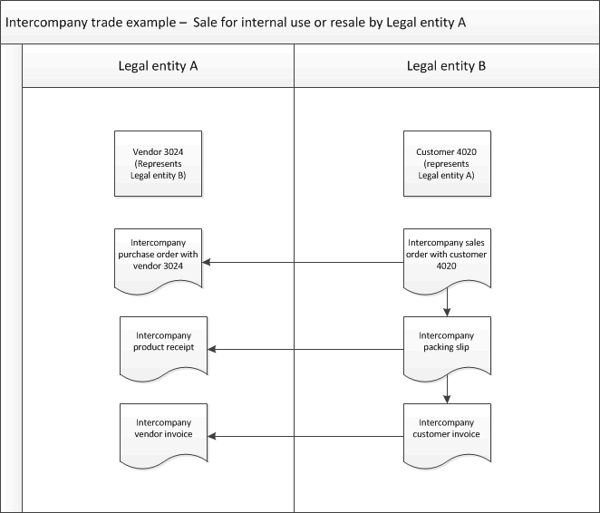

# Create an intercompany sales order for internal use

[!include [banner](../../includes/banner.md)]

Typically, an intercompany sales order is created automatically, based on an intercompany purchase order. You can also manually create an intercompany sales order, which then generates an intercompany purchase order in the intercompany customer's legal entity.

## Create an intercompany sales order manually

Do these steps in legal entity B, as shown in the illustration.

1. Go to **Accounts receivable \> Sales orders \> All sales orders**.
1. On the Action Pane, select **Sales order** to create a sales order.
1. On the **Create sales order** page, select a customer account. On the **General** FastTab, make sure that the **Intercompany** check box is selected. This indicates that the selected customer is an intercompany customer.
1. Enter or modify the information, select **OK**, and then complete the order lines as usual.

    The **Delivery address** field value is copied from the intercompany sales order header to the intercompany purchase order header. The **Item number** field value, including product dimensions, and the **Delivery date** and **Currency code** field values are copied from the intercompany sales order lines to the intercompany purchase order lines.

1. In the order header, select **Intercompany** to view the related intercompany purchase order.
1. On the order lines, select **Intercompany** to view information about on-hand inventory for intercompany trade.

> [!TIP]
> You can view intercompany sales orders on the **Intercompany orders** page.

> [!NOTE]
> When you work with intercompany, we recommend that you clear the **Delete order after invoicing** check box on the **Accounts receivable parameters** page. Otherwise, the related purchase order is deleted. We also recommend that you clear the **Delete purchase order after invoicing** check box on the **Accounts payable parameters** page.

[!INCLUDE[footer-include](../../includes/footer-banner.md)]
