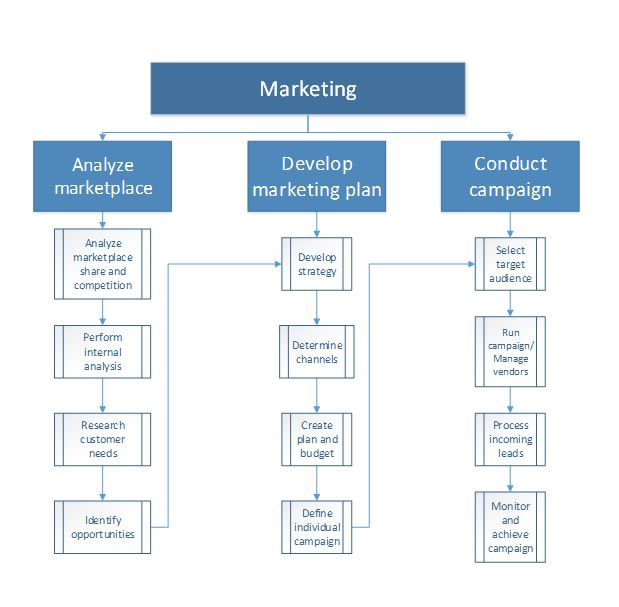
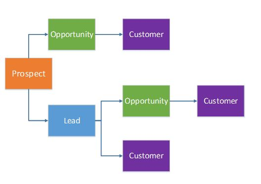
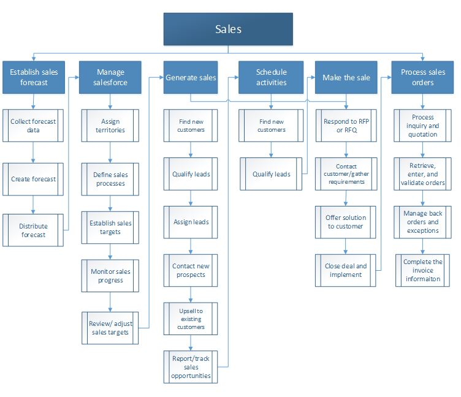

---
# required metadata

title: Sales and marketing overview
description: You can use Sales and marketing to obtain, store, and use various types of data in the sales flow. This data includes the original sales initiative, future follow-up action, and additional sales.
author: Henrikan
ms.date: 07/25/2019
ms.topic: overview
ms.prod: 
ms.technology: 

# optional metadata

# ms.search.form: 
# ROBOTS: 
audience: Application User
# ms.devlang: 
ms.reviewer: kamaybac
# ms.tgt_pltfrm: 
ms.collection: get-started
ms.assetid: 65ca9992-bbfa-4224-bf0e-067a25c7e6a4
ms.search.region: Global
# ms.search.industry: 
ms.author: henrikan
ms.search.validFrom: 2016-02-28
ms.dyn365.ops.version: AX 7.0.0

---

# Sales and marketing overview

[!include [banner](../includes/banner.md)]

You can use Sales and marketing to obtain, store, and use various types of data in the sales flow. This data includes the original sales initiative, future follow-up action, and additional sales.

## Marketing

You use marketing campaigns and activities to find and build relationships with potential customers, so that initial interactions can develop into sales relationships. The following process flow shows the business process for marketing. 

### Relationships

In sales and marketing, the initial interactions that you have with potential customers can occur in various situations. For example, you might find a prospective customer while you're attending a trade show, or you might have a possible lead with a customer after your organization runs a mass mailing campaign. It's very important that you understand the flow of a party’s entity before that party becomes a customer. The following graphic shows the flow of entity relationships as a potential customer becomes an actual customer. 

### Campaigns

A campaign targets the contacts for prospects, leads, opportunities, and customers that have been selected to participate in the campaign. In Supply Chain Management, you can create several types of campaigns, such as telemarketing, mailing, and email campaigns, to maximize your customer potential. As your campaign progresses and you receive positive responses, you can begin the sales process with those recipients who have responded positively to the campaign.

## Sales
You use the sales functionality to create quotations, up-sell and cross-sell to new and existing customers, create sales orders, and create sales invoices for customers. The following process flow shows the business process for sales. 

### Sales quotations

You create sales quotations to present customers an offer of the goods or services that you will be providing. A customer might request a quotation, or you might create a quotation in response to a request from a potential or existing customer. When the customer approves the sales quotation, you can convert it to a sales order.

### Up-sell/cross-sell

Up-selling and cross-selling are techniques for selling products when an order is entered for a customer. In up-selling, another product is suggested instead of the current product. In cross-selling, a product is suggested in addition to the current product. When you set up product lists, you can create specific rules to indicate when a product should be suggested as a cross-sell or up-sell product.

### Sales orders

When you create a new sales order, you must select the type of sales order to create. You have five options. **Note:** After you create a sales order, any order type can be changed, except the **Items requirements** type if the sales order has a status of **Delivered**.

| Sales order type  | Description                                                                                                                                                                                                                                                                                            |
|-------------------|--------------------------------------------------------------------------------------------------------------------------------------------------------------------------------------------------------------------------------------------------------------------------------------------------------|
| Journal           | Use this type as a draft for a sales order. This type has no effect on the stock quantities and doesn't generate item transactions.                                                                                                                                                                    |
| Subscription      | Use this type for recurring orders. When the order is invoiced, the order status is automatically set to an open order. The delivered quantity that was invoiced and the remaining deliveries are updated. You can’t use this sales order type if you're using the Warehouse management functionality. |
| Sales order       | Use this type when a customer has placed or confirmed an order.                                                                                                                                                                                                                                        |
| Returned order    | Use this type when a customer returns an item. A return-item number (RMA number) is assigned automatically.                                                                                                                                                                                            |
| Item requirements | This type is created automatically when you make an item sale through a project.                                                                                                                                                                                                                       |

### Sales agreements

A sales agreement is a contract that commits the customer to buy a product in a specific quantity or for a specific amount over time, in exchange for special prices and discounts. The prices and discounts of the sales agreement overrule any prices and discounts that are stated in any trade agreements that exist. A sales agreement is valid for a defined period. The requested ship date that is specified for a sale on the **Sales order** page should be in the valid period. By default, a sales agreement is on hold. You can order from a sales agreement only when it's set to **Effective**.

### Backorders

When you enter and validate orders, you might have to manage backorders and exceptions before the sale can be completed. Backorders are either purchase orders that haven't yet been delivered from a vendor or sales orders that haven't yet been delivered to a customer. It's important that you follow up on backorders. For example, if products are delayed from a vendor, you might have to change the date of delivery to a customer and then inform the customer of the delay. You can view backorders by item, customer, or vendor.

#### Viewing backorders by item

When you view backorders by item, you can follow up on the expected future flow of transactions for a specific item. For example, you can check the following information:

-   The number of sales orders that are placed for an item
-   Whether deliveries of the item from vendors are still missing
-   Whether more items should be ordered, so that you can deliver all sales orders in a timely manner

By doing this check, you can respond to requests from customers about the timing of the item delivery. In addition, you can prioritize the sales backorders and split the items that are on-hand between the orders.

#### Viewing backorders by customer

When you view back orders by customer, you can view the status of the customer’s remaining orders. This check is useful when you must respond to customers who are waiting for items that have been delayed.

#### Viewing backorders by vendor

When you view backorders by vendor, you can follow up on missing deliveries and expected dates of delivery. This check also helps you prioritize the backorders when products arrive from vendors and the sales orders must be picked for delivery.

### Invoices

You can create three types of invoices during the sales process:

-   Customer invoice
-   Free text invoice
-   Pro forma invoice

#### Customer invoice

A customer invoice is a bill that an organization gives to a customer in connection with a sale. You create this kind of customer invoice based on a sales order that includes a header and one or more lines for items or services. The customer invoice completes the sales order, packing slip, and sales invoice cycle.  

You can post and print a single customer invoice, based on either a sales order or the packing slip and date. You can also post and print multiple customer invoices together, based on the packing slips and dates. When you post a single customer invoice by using the sales order, the **Invoiced remainder** quantity for each item is updated with the total of the invoiced quantities from the selected sales order.  

If both the **Invoiced remainder** and **Deliver remainder** quantities for all items on the sales order are 0 (zero), the status of the sales order is changed to **Invoiced**. If the quantity of either field isn't 0, the status of the sales order isn't changed, and you can enter additional invoices. If you plan to post and print one or more customer invoices based on the packing slips, you must have already posted at least one packing slip for each sales order. The customer invoice is based on the packing slips and reflects the quantities that are listed.  

You can create a customer invoice that is based on the packing slip line items that have been shipped to date, even if all the items for a particular sales order haven't yet been shipped. You might do this if, for example, your legal entity issues one invoice per customer per month to cover all the deliveries that you ship during that month. Each packing slip represents a partial or complete delivery of the items on the sales order.  

When you post the invoice, the **Invoice remainder** quantity for each item is updated with the total of the delivered quantities from the selected packing slips. If the **Invoice remainder** and **Deliver remainder** quantities for all items on the sales order are 0 (zero), the status of the sales order is changed to **Invoiced**. If the quantity isn't 0, the status of the sales order isn't changed, and you can enter additional invoices. Inventory transactions are updated with the invoice number, and the status on the sales order line is changed to **Invoiced**.

#### Free text invoice

A free text invoice is an invoice that isn't related to a sales order. It contains order lines that include ledger accounts, free-text descriptions, and a sales amount. You can’t enter an item number on this kind of invoice, and you must enter the appropriate sales tax information. A main account for the sale is indicated on each invoice line. The customer balance is posted to the summary account from the posting profile that is used for the free text invoice.

#### Pro forma invoice

A pro forma invoice is an invoice that is prepared as an estimate of the actual invoice amount before the invoice is posted. You can print a pro forma invoice for either a customer invoice or a free text invoice.

### Additional resources

#### Blogs

You can find an overview of a sales process in the post
[How sales work in Dynamics 365 Finance and Operations](https://financefunction.tech/2018/05/15/how-sales-work-in-dynamics-365-for-finance-and-operations).

[!INCLUDE[footer-include](../../includes/footer-banner.md)]
