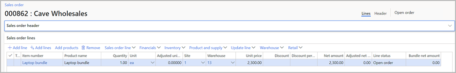
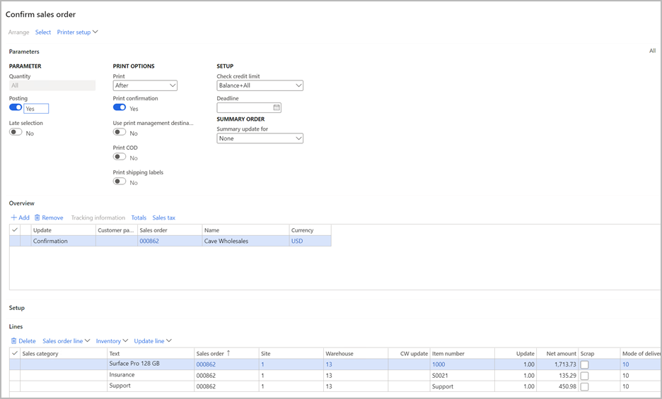
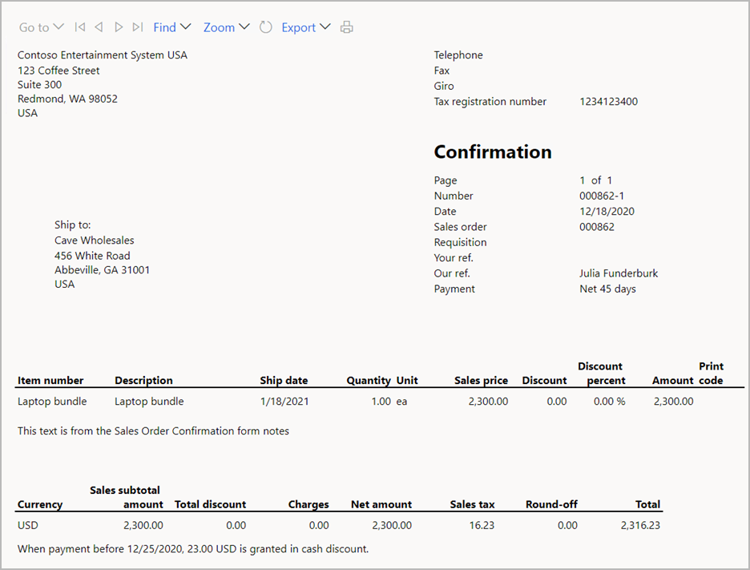

# Sell product bundles

[!include [banner](../includes/banner.md)]

This article describes how to work with product bundles on sales orders and related documents. A product bundle comprises a parent item (product bundle item) and multiple component items. The parent item is entered on a sales order line, so that order entry is more efficient. However, it's then exploded into the component items. Internal documents (such as picking lists and packing slips) list the component items. However, external documents (such as sales order confirmations and sales invoices), show only the parent item.

> [!NOTE]
> The product bundle feature is not is not supported in Microsoft Dynamics 365 Commerce channels, such as online, point of sale (POS), and call centers. This also includes the prospect-to-cash solution for Dynamics 365 Supply Chain Management and Dynamics 365 Sales. Items that are configured as product bundles shouldn't be added to orders or transactions that are created in Commerce channels or in the prospect-to-cash solution.

## How bundle items are set up and treated

Bundles are set up using the bill of materials (BOM) functionality. For information about how to set up a bundle item, see [Enable and set up product bundles](product-bundles-setup.md).

Parent items that are flagged as product bundles are treated differently than other BOM items. Here is a list of the differences:

- You explode product bundles included in a sales order by confirming the order. To do so, open the sales order and, on the Action Pane, open the **Sell** tab and select **Confirm sales order**. You must never explode a product bundle items from the **Sales order lines** FastTab (by selecting **Sales order line \> Explode \> BOM lines** from the toolbar) because then the system will treat the item as a BOM rather than a product bundle.
- A sales order that contains a product bundle item must be confirmed before the picking list, packing slip, or invoice is created.
- When a product bundle is exploded through sales order confirmation, the parent item is canceled, and its unit price and discounts are allocated to the component items of the bundle.
- The sum of the component items must always equal the price on the parent item. Therefore, there are limitations on the fields that can be updated or changed for component items. For example, the unit price can't be changed manually. It also can't be indirectly changed. To prevent scenarios such as searching and applying a new price, inventory dimensions can't be changed on the component items.
- When external-facing documents (such as sales order confirmations or invoices) are printed, only the parent item is shown in the print, not the component items.

## Example of a sales order that includes a product bundle

Suppose you have a product bundle set up as follows:

- **Parent item:** *Laptop bundle*
- **Component item:** 1 pcs. of item *1000* (base sales price $1,900.00)
- **Component item:** 1 pcs. of item *S0021* (base sales price $150.00)
- **Component item:** 1 pcs. of item *Support* (base sales price $500.00)

The base sales price of each component item is an essential part of the component setup. It's set on the **Sell** FastTab of the item. The base sales price is used to calculate the allocation factor when the parent item's unit price is allocated to the component items. Trade agreement sale prices are never used for this purpose.

Suppose also that you have a sales order with a single sales order line for the *Laptop bundle* item. The default unit price for the parent item can be taken from numerous places, such as the trade agreement or the base sales price. In this example, $2,300 was manually entered as the unit price, as shown in the following screenshot.

### Confirm the order to explode the product bundle

Because the sales order contains a product bundle item, it must be confirmed. The confirmation dialog box shows the components of the product bundle, as shown in the following screenshot.

However, the printed confirmation report only shows the parent item of the product bundle because that report is the external-facing document for the customer.

After the sales order is confirmed, the parent item is still shown on the sales order, but its status has been changed to *Canceled*. Additionally, the net amount is tracked in the **Bundle net amount** field. This amount is required to print the invoice because the invoice shows the parent item, not the component items.

### Allocating prices to component items

The sum of the component items must equal the **Bundle net amount** value of the parent item, because that value is the amount that is presented to the customer on the printed invoice. To ensure that the invoice matches the amounts that are posted to the general ledger, edits to the component items are limited. For example, the site and warehouse can't be changed, because those changes might trigger a price change, based on a trade agreement.

Because the sum of the components doesn't match the bundle price entered on the sales order, the unit prices are recalculated and allocated to the components as follows:

- **Product bundle price entered on the sales order:** $2,300
- **Total base sales prices from components:** $1,900 + $500 + $150 = $2,550
- **Allocated price for component 1:** $2,300 × (1,900 ÷ 2,550) = $1,713.73
- **Allocated price for component 2:** $2,300 × (500 ÷ 2,550) = $450.98
- **Allocated price for component 3:** $2,300 × (150 ÷ 2,550) = $135.29

The sum of the components must equal $2,300, and it does ($1,713.73 + $450.98 + $135.29 = $2,300).

If changes are required for all component items, the parent item can be removed. In this case, the component items are also removed. The parent item can then be added again, and the required edits can be completed before the sales order is confirmed.

### Pick, pack, and ship the order

When the sales order is picked and packed, the documents will include only the components of the product bundle. The packing slip and invoice must include a full product bundle. Otherwise, they can't be posted. For example, the dialog box shows three component items. If you try to delete one of them, you receive an error message that states that all products in the product bundle must be shipped before they can be invoiced.

When the sales order is picked and packed, the documents will include only the components of the product bundle. The packing slip and invoice must include a full product bundle. Otherwise, they can't be posted. For example, the dialog box shows three component items. If you try to delete one of them, you receive an error message that states that all products in the product bundle must be shipped before they can be invoiced.

Each product bundle must be shipped and invoiced as a full bundle. For example, if you change the quantity of item *1000* to 4, but you leave the quantity of the other component items at 5, the packing slip and invoice can't be posted.

A partial amount can be shipped and invoiced only if the quantity is reduced for all components of the bundle. For example, a quantity of 5 of the *Laptop bundle* item is entered on a sales order. After the sales order is confirmed, the three component items are shown on the sales order, and the quantity of each is 5. By default, during shipping and invoicing, the quantity will be set to 5 for each component. However, you can adjust the quantity down to 3 for all three component items. In this case, three full product bundles will be shipped and invoiced. The remaining two product bundle items (a quantity of 2 of each of the three component items) can be shipped and invoiced later.

### Invoice the sales order

The final step is to invoice the sales order. As with the sales order, the invoice dialog box will show the component items while the printed invoice will show only the parent item.

The invoice journal that is created after posting occurs doesn't include the parent item from the product bundle because that item has a status of *Canceled*.

It's important that the invoice journal not include the parent item from the product bundle because any processes that are performed after the invoice is posted are based on that invoice journal. For example, if you create a credit note from the **Sell** tab on the Action Pane, the credit note that is created will include the component items but not the parent item.

## Important limitations

The following important limitations apply when using product bundle items

- The product bundle feature is not is not supported in Microsoft Dynamics 365 Commerce  channels, such as online, point of sale (POS), and call centers. This also includes the Prospect to cash solution for Dynamics 365 Supply Chain Management and Dynamics 365 Sales. Items that are configured as product bundle should not be added to orders or transactions that are created in Commerce channels or in the Prospect to cash solution.
- A product bundle item is not supported in intercompany orders. In a 3-legged scenario the product bundle item is not exploded during sales order confirmation on the original sales order, while in a 2-legged scenario the sales order confirmation process is blocked. 
- A product bundle item is not supported in direct delivery
- A product bundle item is not supported in delivery schedule
- Sales order line delivery type will is always "Stock" for bundle components regardless of direct delivery setting on the released product
- Re-print of invoices and sales order confirmations require that the related sales order with the product bundle order lines exist. If the sales order lines have been deleted, then re-print of invoices and sales order confirmations will not include the parent item, but the component items.
- Miscellaneous Charges added to the parent item line are not allocated to the component item lines when exploded.

[!INCLUDE[footer-include](../../includes/footer-banner.md)]
