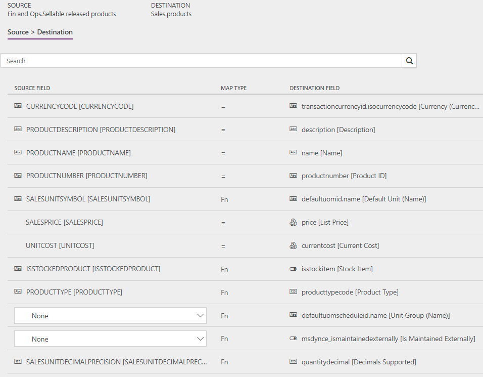

---
# required metadata

title: Synchronize products directly from Finance and Operations to products in Sales
description: This topic discusses the templates and underlying tasks that are used to synchronize products from Microsoft Dynamics 365 for Finance and Operations, Enterprise edition, to Microsoft Dynamics 365 for Sales.
author: ChristianRytt
manager: AnnBe
ms.date: 10/25/2017
ms.topic: article
ms.prod: 
ms.service: dynamics-ax-applications
ms.technology: 

# optional metadata

ms.search.form: 
# ROBOTS: 
audience: Application User, IT Pro
# ms.devlang: 
ms.reviewer: yuyus
ms.search.scope: Core, Operations
# ms.tgt_pltfrm: 
ms.custom: 
ms.assetid: 
ms.search.region: global
ms.search.industry: 
ms.author: crytt
ms.dyn365.ops.intro: July 2017 update 
ms.search.validFrom: 2017-07-8

---

# Synchronize products directly from Finance and Operations to products in Sales

[!include[banner](../includes/banner.md)]

> [!NOTE]
> Before you can use the Prospect to cash solution, you should be familiar with [Dynamics 365 Data integration](/common-data-service/entity-reference/dynamics-365-integration).

This topic discusses the templates and underlying tasks that are used to synchronize products directly from Microsoft Dynamics 365 for Finance and Operations, Enterprise edition, to Microsoft Dynamics 365 for Sales.

## Data flow in Prospect to cash

The Prospect to cash solution uses the Data integration feature to synchronize data across instances of Finance and Operations and Sales. The Prospect to cash templates that are available with the Data integration feature enable the flow of data about accounts, contacts, products, sales quotations, sales orders, and sales invoices between Finance and Operations and Sales. The following illustration shows how the data is synchronized between Finance and Operations and Sales.

## Templates and tasks

To access the available templates, open [PowerApps Admin Center](https://preview.admin.powerapps.com/dataintegration). Select **Projects**, and then, in the upper-right corner, select **New project** to select public templates.

The following template and underlying tasks are used to synchronize products from Finance and Operations to Sales.

- **Name of the template in Data integration:** Products (Fin and Ops to Sales) - Direct
- **Name of the task in the Data integration project:** Products

No synchronization tasks are required before product synchronization can occur.

## Entity set

| Finance and Operations     | Sales    |
|----------------------------|----------|
| Sellable released products | Products |

## Entity flow

Products are managed in Finance and Operations and synchronized to Sales. The **Sellable released products** data entity in Finance and Operations exports only products that are *sellable*. Sellable products are products that have the information that they require in order to be used on a sales order. The same rules apply when a product is validated by using the **Validate** function on the **Released product** page.

The product number is used as a key. Therefore, when product variants are synchronized to Sales, each product variant has an individual product ID.

## Prospect to cash solution for Sales

In Sales, a new **Is Externally Maintained** field has been added on products to indicate that a given product is maintained externally. By default, the value is set to **Yes** during an import to Sales. The following values are available:

- **Yes** – The product originated from Finance and Operations and won't be editable in Sales.
- **No** – The product was entered directly in Sales.
- **(Blank)** – The product existed in Sales before the Prospect to cash solution was enabled.

The **Is Externally Maintained** field helps guarantee that only quotations and sales orders that have externally maintained products will be synchronized to Finance and Operations.

Externally maintained products are automatically added to the first valid price list that has the same currency. Price lists are organized alphabetically by name. The product sales price from Finance and Operations is used as the price on the price list. Therefore, there must be a price list in Sales for every product sales currency in Finance and Operations. The currency on the released sellable products is set to the accounting currency in the legal entity that the product is exported from.

> [!NOTE]
> Product synchronization won't succeed unless there is a price list that has a matching currency.

## Preconditions and mapping setup

- Before you run the synchronization for the first time, you must fill the Distinct product table for existing products in Finance and Operations. Existing products won't be synchronized until this job is completed.

    1. In Finance and Operations, use Search to search for **Populate distinct product table**.
    2. Select **Populate distinct product table** to run the job. This job must be run only one time.

- Make sure that the required value map for the selling unit of measure (UOM) between Finance and Operations and Sales exists in the mapping of **SalesUnitSymbol** to **DefaultUnit (Name)**.
- Update the value map for **Unit group** (**defaultuomscheduleid.name**) so that it matches **Unit groups** in Sales.

    The default template value is **Default unit**.

- Make sure that the selling UOMs for all products from Finance and Operations exist in Sales.
- Make sure that price lists exist in Sales for every product sales currency in Finance and Operations.
- When products are created in Sales, they can have a status of **Draft** or **Active**. The behavior is controlled at **Settings** > **Administration** > **System settings** > **Sales** in Sales.

    Products that have **Draft** status when they are created must be activated before they can be added to quotations or sales orders.

## Template mapping in Data integration

The following illustration shows an example of a template mapping in Data integration. 

> [!NOTE]
> The mapping shows which field information will be synchronized from Sales to Finance and Operations.

## Related topics

[Prospect to cash](prospect-to-cash.md)

[Synchronize accounts directly from Sales to customers in Finance and Operations](accounts-template-mapping-direct.md)

[Synchronize contacts directly from Sales to contacts or customers in Finance and Operations](contacts-template-mapping-direct.md)

[Synchronize sales order headers and lines directly from Finance and Operations to Sales](sales-order-template-mapping-direct.md)

[Synchronize sales invoice headers and lines directly from Finance and Operations to Sales](sales-invoice-template-mapping-direct.md)

