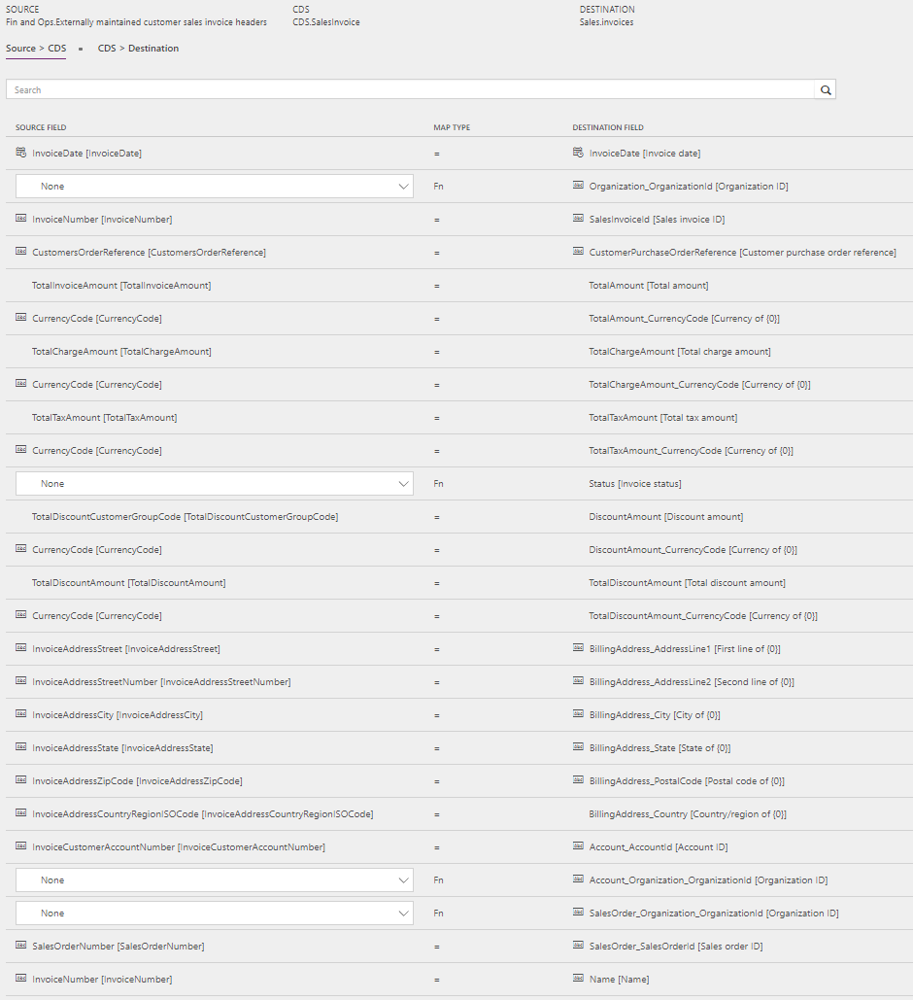
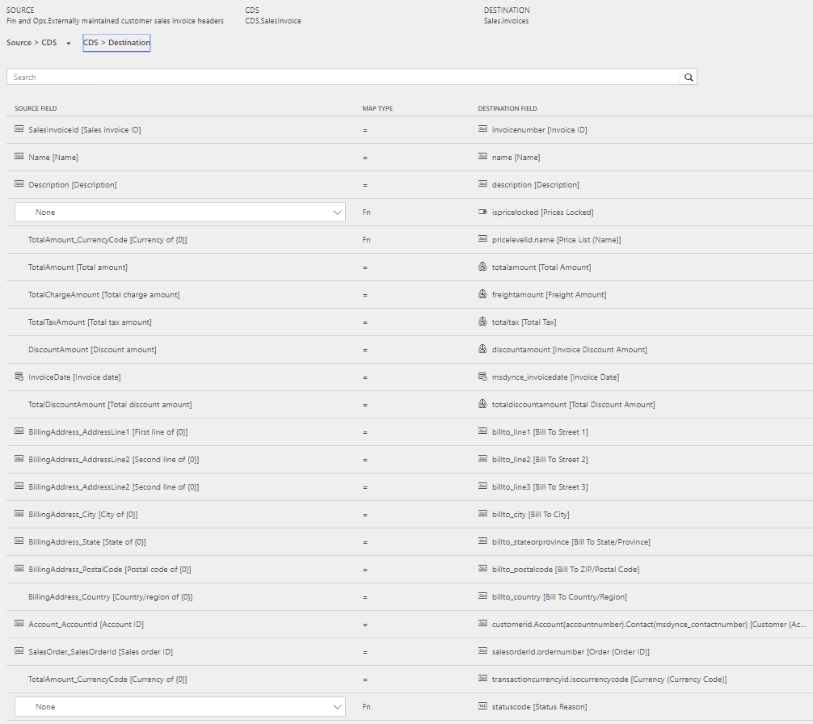
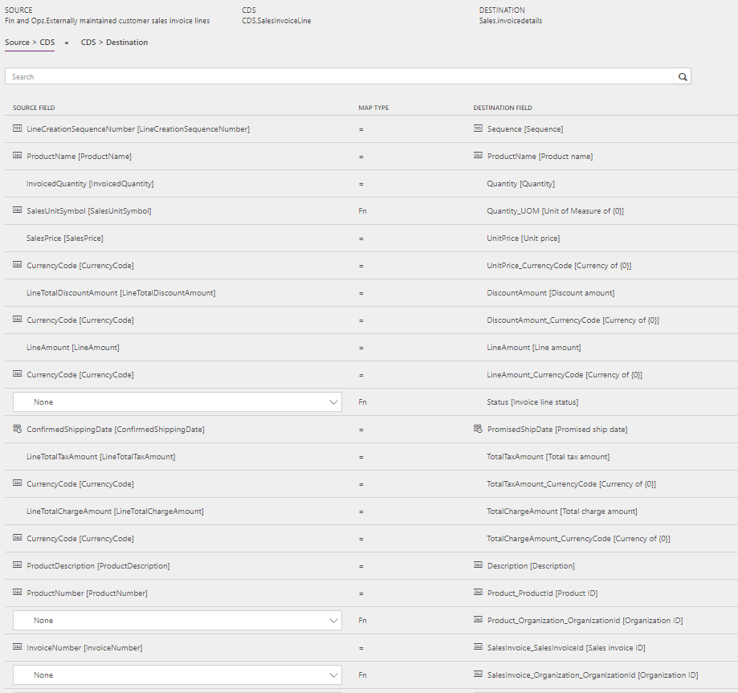
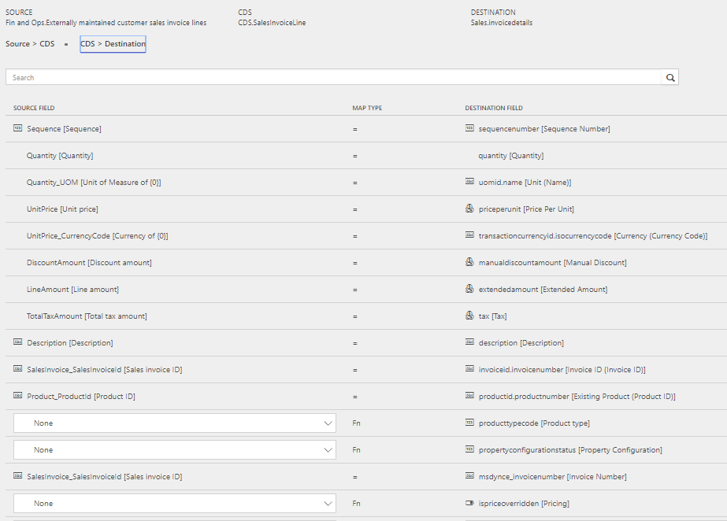

---
# required metadata

title: Synchronize sales invoice headers and lines from Finance and Operations to Sales
description: The topic discusses the templates and underlying tasks that are used to synchronize sales invoice headers and lines from Microsoft Dynamics 365 for Finance and Operations, Enterprise edition to Microsoft Dynamics 365 for Sales. 
author: ChristianRytt
manager: AnnBe
ms.date: 08/28/2017
ms.topic: article
ms.prod: 
ms.service: dynamics-ax-applications
ms.technology: 

# optional metadata

ms.search.form: 
# ROBOTS: 
audience: Application User, IT Pro
# ms.devlang: 
ms.reviewer: yuyus
ms.search.scope: Core, Operations, UnifiedOperations
# ms.tgt_pltfrm: 
ms.custom: 
ms.assetid: 
ms.search.region: global
ms.search.industry: 
ms.author: crytt
ms.dyn365.ops.intro: July 2017 update 
ms.search.validFrom: 2017-07-8

---

# Synchronize sales invoice headers and lines from Finance and Operations to Sales

[!include[banner](../includes/banner.md)]

The topic discusses the templates and underlying tasks that are used to synchronize sales invoice headers and lines from Microsoft Dynamics 365 for Finance and Operations, Enterprise edition to Microsoft Dynamics 365 for Sales. 

## Templates and tasks

The following templates and underlying tasks are used to synchronize sales invoice headers and lines from Finance and Operations to Sales:

- **Name of the template in Data integration** 

     - Sales Invoices (Fin and Ops to Sales)

- **Names of the tasks in the Data integration project**

    - SalesInvoiceHeader
    - SalesInvoiceLine

Sync tasks required prior to Sales invoice header and lines synchronization:
-	Products (Fin and Ops to Sales)
-	Accounts (Sales to Fin and Ops) (if used)
-	Contacts (Sales to Fin and Ops) (if used)
-   Sales order header and lines (Fin and Ops to Sales)

## Entity set

| Finance and Operations                               | Common Data Service (CDS)              | Sales          |
|------------------------------------------------------|------------------|----------------|
| Externally maintained customer sales invoice headers | SalesInvoice     | Invoices       |
| Externally maintained customer sales invoice lines   | SalesInvoiceLine | InvoiceDetails |

## Entity flow

Sales invoices are created in Finance and Operations and synchronized to Sales.

> [!NOTE]
> Tax related to charges on the **Sales invoice header** is currently not included in synchronization from Finance and Operations to Sales. This is because Sales doesn't support tax information at the header level. Tax related to charges at the line level is included.

## Prospect to cash solution for Sales

-  An **Invoice number field** is added to the **Invoice** entity and displayed on the page.
 
-  The **Create invoice** button on the **Sales order** page is hidden because invoices will be created in Finance and Operations and synced to Sales. The **Invoice** page is non-editable because invoices will be synced from Finance and Operations.
 
-  The **Sales order status** changes automatically to **Invoiced** when the related invoice from Finance and Operations has been  synchronized to Sales. Also, the owner of the sales order from which the invoice was created is assigned as the owner of the invoice. This gives the owner of the sales order the ability to view the invoice.
 
## Preconditions and mapping setup

Before synchronizing sales invoices, it is important to update the systems with the following setting:

### Setup in Sales

- Under **Settings** > **Administration** > **System settings** > **Sales**, ensure that **Use system prizing calculation system** is set to **Yes**. 

- Under **Settings** > **Administration** > **System settings** > **Sales**, ensure that **Discount calculation method** is set to **Line item**. 

### Setup in the Data integration project

#### SalesInvoiceHeader task

- Update the mapping for **CDS Organization ID** in **Source** > **CDS**. 

    -  Default template value for **SalesOrder_Organization_OrganizationId** is ORG001.
    -  Default template value for **Account_Organization_OrganizationId** is ORG001.
    -  Default template value for **Organization_OrganizationId** is ORG001.

- Ensure that the needed mapping exists in **Source** > **CDS for InvoiceCountryRegionId** to **BillingAddress_Country**.

    -  Template value is **ValueMap** with a number of countries mapped.

- **Price list** is required to create invoices in Sales. Update the **ValueMap** in **CDS** > **Destination for pricelevelid.name [Price List Name]** to the **Price list** used in Sales per currency. You can either use the default **Price list** for single currency or use **ValueMap** if you have **Price lists** in multiple currencies.

    -  Template value for **pricelevelid.name [Price List Name]** is **ValueMap** based on **Currency**.
    -  usd: CRM Service USA (sample). 

#### SalesInvoiceLine task

- Ensure that the needed mapping exists in **Source** > **CDS for Unit of measure**.

- Ensure that the needed **ValueMap** for **SalesUnitSymbol** in Finance and Operations exists in the **Source** > **CDS mapping**. 
    
    - Template value with **ValueMap** is defined for **SalesUnitSymbol to Quantity_UOM**.
    
-  Update the mapping for **CDS Organization ID in Source** > **CDS**. 

    -  Default template value for **SalesInvoicer_Organization_OrganizationId** is ORG001.
    -  Default template value for **Product_Organization_OrganizationId** is ORG001.
 
## Template mapping in Data integrator

> [!NOTE]
> **Payment terms**, **Freight terms**, **Delivery terms**, **Shipping method**, and **Delivery mode** are not part of the default mappings. Mapping of these fields requires value mapping to be set up, which is specific to the data in the organizations between which the entity is synchronized.

The following illustrations show an example of a template mapping in data integrator.

## Related topics

[Synchronize products from Finance and Operations to products in Sales](products-template-mapping.md)

[Synchronize accounts from Sales to customers in Finance and Operations](accounts-template-mapping.md)

[Synchronize contacts from Sales to contacts or customers in Finance and Operations](contacts-template-mapping.md)

[Synchronize sales quotation headers and lines from Sales to Finance and Operations](sales-quotation-template-mapping.md)

[Synchronize sales order headers and lines from Finance and Operations to Sales](sales-order-template-mapping.md)

