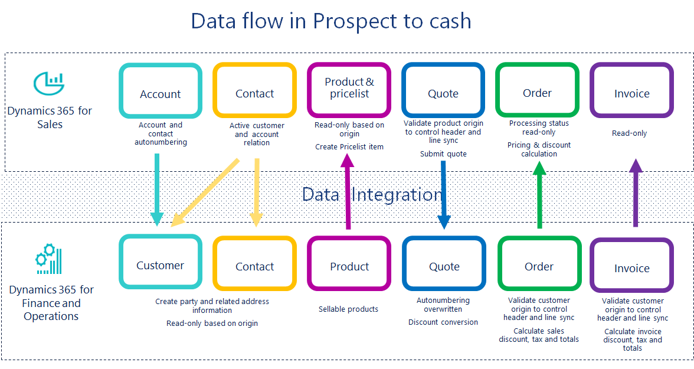
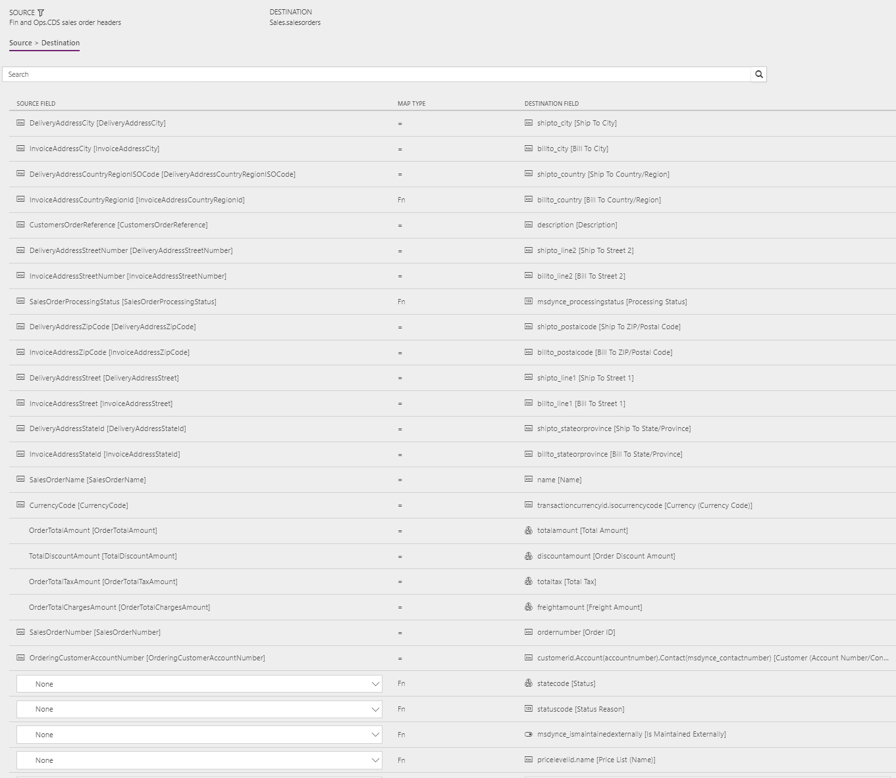
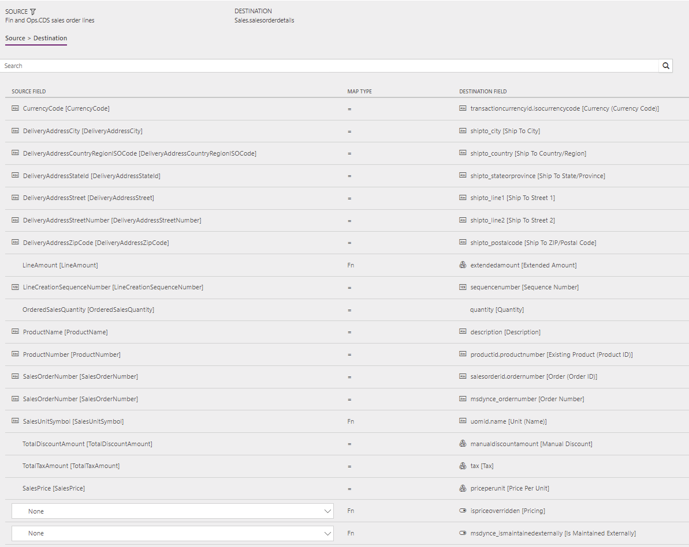
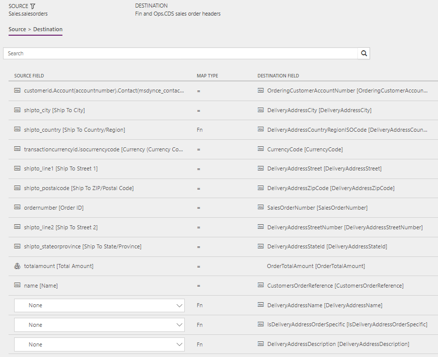
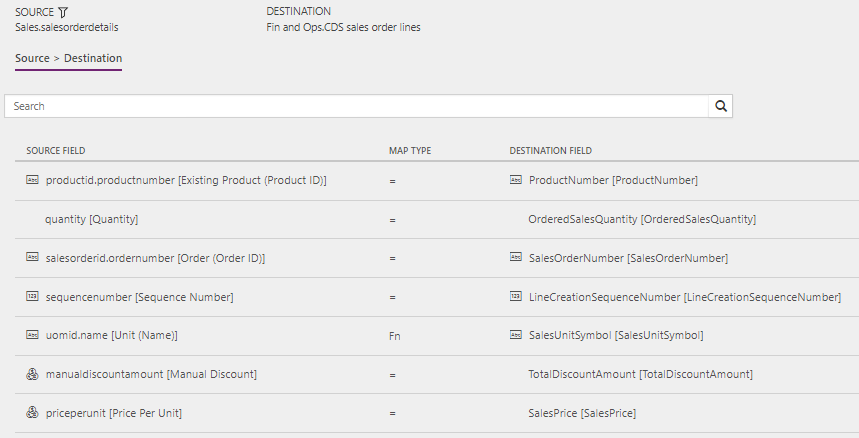

---
# required metadata

title: Synchronization of sales orders directly between Sales and Supply Chain Management
description: The article discusses the templates and underlying tasks that are used to run synchronization of sales orders directly between Dynamics 365 Sales and Dynamics 365 Supply Chain Management.
author: Henrikan
ms.date: 05/09/2019
ms.topic: article
ms.prod: 
ms.technology: 

# optional metadata

ms.search.form: 
# ROBOTS: 
audience: Application User, IT Pro
# ms.devlang: 
ms.reviewer: kamaybac
# ms.tgt_pltfrm: 
ms.custom: 
ms.assetid: 
ms.search.region: global
ms.search.industry: 
ms.author: henrikan
ms.dyn365.ops.version: July 2017 update 
ms.search.validFrom: 2017-07-8

---

# Synchronization of sales orders directly between Sales and Supply Chain Management

[!include [banner](../includes/banner.md)]

The article discusses the templates and underlying tasks that are used to run synchronization of sales orders directly between Dynamics 365 Sales and Dynamics 365 Supply Chain Management.

## Data flow in Prospect to cash

The Prospect to cash solution uses the Data integration feature to synchronize data across instances of Supply Chain Management and Sales. The Prospect to cash templates that are available with the Data integration feature enable the flow of data for accounts, contacts, products, sales quotations, sales orders, and sales invoices between Supply Chain Management and Sales. The following illustration shows how the data is synchronized between Supply Chain Management and Sales.

## Templates and tasks

To access the available templates, open [Power Apps Admin Center](https://preview.admin.powerapps.com/dataintegration). Select **Projects**, and then, in the upper-right corner, select **New project** to select public templates.

The following templates and underlying tasks are used to run synchronization of sales orders directly between Sales and Supply Chain Management.

- **Names of the templates in Data integration:** 

    - Sales Orders (Sales to Supply Chain Management) - Direct
    - Sales Orders (Supply Chain Management to Sales) - Direct

- **Names of the tasks in the Data integration project:**

    - OrderHeader
    - OrderLine

The following synchronization tasks are required before synchronization of sales invoice headers and lines can occur:

- Products (Supply Chain Management to Sales) - Direct
- Accounts (Sales to Supply Chain Management) - Direct (if used)
- Contacts to Customers (Sales to Supply Chain Management) - Direct (if used)

## Entity set

| Supply Chain Management  | Sales             |
|-------------------------|-------------------|
| Dataverse sales order headers | SalesOrders       |
| Dataverse sales order lines   | SalesOrderDetails |

## Entity flow

Sales orders are created in Sales and synchronized to Supply Chain Management when **Run project** is triggered for a project based on the **Sales Orders (Sales to Supply Chain Management) - Direct** template. You can only activate and synchronize orders from Sales if all **Order Products** consist of products that are externally maintained. Therefore, there can be no write-in products. After the order is activated, the sales order becomes read-only in the user interface (UI). At that point, the updates are made from Supply Chain Management. After the sales order has a status of **Confirmed**, the a project based on the **Sales Orders (Supply Chain Management to Sales) - Direct** template can be used to synchronize updates or fulfillment status from Supply Chain Management to Sales.

You don't have to create orders in Sales. You can create new sales orders in Supply Chain Management instead. After a sales order has a status of **Confirmed**, it's synchronized to Sales as described in the previous paragraph.

In Supply Chain Management, filters in the template help guarantee that only the relevant sales orders are included in the synchronization:

- On the sales order, both the ordering customer and the invoicing customer have to originate from Sales to be included in the synchronization. In Supply Chain Management, the **OrderingCustomerIsExternallyMaintained** and **InvoiceCustomerIsExternallyMaintained** columns are used to filter sales orders from the data tables.
- The sales order in Supply Chain Management must be confirmed. Only confirmed sales orders or sales orders that have a higher processing status, such as **Shipped** or **Invoiced**, are synchronized to Sales.
- After a sales order is created or modified, the **Calculate sales totals** batch job in Supply Chain Management must be run. Only sales orders where sales totals are calculated will be synchronized to Sales.

## Freight tax

Sales doesn't support tax at the header level, because tax is stored at the line level. To support tax at the header level from Supply Chain Management, such as tax on freight, the system synchronizes tax to Sales as a write-in product that is named **Freight Tax**, and that has the tax amount from Supply Chain Management. In this way, the standard price calculation in Sales can be used for totals, even when there is tax at the header level from Supply Chain Management.

## Discount calculation and rounding

The discount calculation model in Sales differs from the discount calculation model in Supply Chain Management. In Supply Chain Management, the final discount amount on a sales line can be the result of a combination of discount amounts and discount percentages. If this final discount amount is divided by the quantity on the line, rounding can occur. However, this rounding isn't considered if a rounded per-unit discount amount is synchronized to Sales. To help guarantee that the full discount amount from a sales line in Supply Chain Management is correctly synchronized to Sales, the full amount must be synchronized without being divided by the line quantity. Therefore, you must define the **Discount calculation method** as **Line item** in Sales.

When a sales order line is synchronized from Sales to Supply Chain Management, the full line discount amount is used. Because Supply Chain Management has no field that can store the full discount amount for a line, the amount is divided by the quantity and stored in the **Line discount** field. Any rounding that occurs in this division is stored in the **Sales charges** field on the sales line.

### Example

**Synchronization from Sales to Supply Chain Management**

- **Sales:** Quantity = 3, per-line discount = $10.00
- **Supply Chain Management:** Quantity = 3, line discount amount = $3.33, sales charge = -$0.01 

**Synchronization from Supply Chain Management to Sales**

- **Supply Chain Management:** Quantity = 3, line discount amount = $3.33, sales charge = -$0.01
- **Sales:** Quantity = 3, per-line discount = (3 × $3.33) + $0.01 = $10.00

## Prospect to cash solution for Sales

New columns have been added to the **Order** table and appear on the page:

- **Is Maintained Externally** – Set this option to **Yes** when the order is coming from Supply Chain Management.
- **Processing status** – This column shows the processing status of the order in Supply Chain Management. The following values are available:

    - **Draft** – The initial status when an order is created in Sales. In Sales, only orders with this processing status can be edited.
    - **Active** – The status after the order is activated in Sales by using the **Activate** button.
    - **Confirmed**
    - **Packing Slip**
    - **Invoiced**
    - **Picked**
    - **Partially Picked**
    - **Partially Packed**
    - **Shipped**
    - **Partially Shipped**
    - **Partially Invoiced**
    - **Cancelled**

The **Has Externally Maintained Products Only** setting is used during order activation to consistently track whether a sales order consists entirely of externally maintained products. If a sales order consists entirely of externally maintained products, the products are maintained in Supply Chain Management. This setting helps guarantee that you don't activate and try to synchronize sales order lines that have products that are unknown to Supply Chain Management.

The **Create Invoice**, **Cancel Order**, **Recalculate**, **Get Products**, and **Lookup Address** buttons on the **Sales order** page are hidden for externally maintained orders, because invoices will be created in Supply Chain Management and synchronized to Sales. These orders can't be edited, because sales order information will be synchronized from Supply Chain Management after activation.

The sales order status will remain **Active** to help guarantee that changes from Supply Chain Management can flow to the sales order in Sales. To control this behavior, set the default **Statecode \[Status\]** value to **Active** in the Data integration project.

## Preconditions and mapping setup

Before you synchronize sales orders, it's important that you update the following settings in the systems.

### Setup in Sales

- Make sure that permissions are set up for the team that the user from your Sales connection set is assigned to. If you're using demo data, the user usually has admin access, but the team doesn't have admin access. If the team doesn't have admin access, when you run the project from Data integration, you will receive an error message that states that the Principal team is missing.

    Go to **Settings** &gt; **Security** &gt; **Teams**, select the relevant team, select **Manage Roles**, and select a role that has the desired permissions, such as **System Administrator**.

- To ensure correct calculation of discounts in both Sales and Supply Chain Management **Discount calculation method** must be set to **Line item**.
- Go to **Settings** &gt; **Administration** &gt; **System settings** &gt; **Sales**, and make sure that the following settings are used:

    - The **Use system prizing calculation system** option is set to **Yes**.
    - The **Discount calculation method** column is set to **Line item**.

### Setup in Supply Chain Management

- Go to **Sales and marketing** &gt; **Periodic tasks** &gt; **Calculate sales totals**, and set the job to run as a batch job. Set the **Calculate totals for sales orders** option to **Yes**. This step is important, because only sales orders where sales totals are calculated will be synchronized to Sales. The frequency of the batch job should be aligned with the frequency of sales order synchronization.

If you also use work order integration, you need to set up the sales origin. The sales origin is used to distinguish sales orders in Supply Chain Management that were created from work orders in Field Service. When a sales order has a sales origin of the **Work order integration** type, the **External work order status** field appears on the sales order header. Additionally, the sales origin ensures that sales orders that were created from work orders in Field Service are filtered out during sales order synchronization from Supply Chain Management to Field Service.

1. Go to **Sales and marketing** \> **Setup** \> **Sales orders** \> **Sales origin**.
2. Select **New** to create a new sales origin.
3. In the **Sales origin** column, enter a name for the sales origin, such as **SalesOrder**.
4. In the **Description** column, enter a description, such as **Sales Order from Sales**.
5. Select the **Origin type assignment** check box.
6. Set the **Sales origin type** column to **Sales order integration**.
7. Select **Save**.

### Setup in the Sales Orders (Sales to Supply Chain Management) - Direct Data integration project

- Make sure that the required mapping exists for **Shipto\_country** to **DeliveryAddressCountryRegionISOCode**. You can make blank a default value in the value map to avoid having to type country for national/regional orders. Set the left side to 'Blank', and set the right side to the desired country or region.

    The template value is a value map where several countries or regions are mapped, and where 'Blank' = US.

### Setup in the Sales Orders (Supply Chain Management to Sales) - Direct Data integration project

#### SalesHeader task

- A price list is required in order to create orders in Sales. Update the value map for **pricelevelid.name \[Price List Name\]** to the price list that is used in Sales per currency. You can use the default price list for a single currency. Alternatively, if you have price lists in multiple currencies, you can use a value map.

    The default template value for **pricelevelid.name \[Price List Name\]** is **CRM Service USA (sample)**.

#### SalesLine task

- Make sure that the required value map for **SalesUnitSymbol** in Supply Chain Management exists.
- Make sure that the required units are defined in Sales.

    A template value that has a value map is defined for **SalesUnitSymbol** to **oumid.name**.

## Template mapping in Data integration

> [!NOTE]
> The **Payment terms**, **Freight terms**, **Delivery terms**, **Shipping method**, and **Delivery mode** columns aren't part of the default mappings. To map these columns, you must set up a value mapping that is specific to the data in the organizations that the table is synchronized between.

The following illustrations show an example of a template mapping in Data integration.

> [!NOTE]
> The mapping shows which column information will be synchronized from Sales to Supply Chain Management, or from Supply Chain Management to Sales.

### Sales Orders (Supply Chain Management to Sales) - Direct: OrderHeader

### Sales Orders (Supply Chain Management to Sales) - Direct: OrderLine

### Sales Orders (Sales to Supply Chain Management) - Direct: OrderHeader

### Sales Orders (Sales to Supply Chain Management) - Direct: OrderLine

## Related articles

[Prospect to cash](prospect-to-cash.md)

[!INCLUDE[footer-include](../../includes/footer-banner.md)]