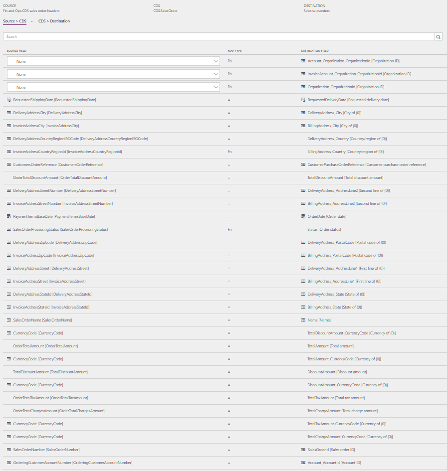
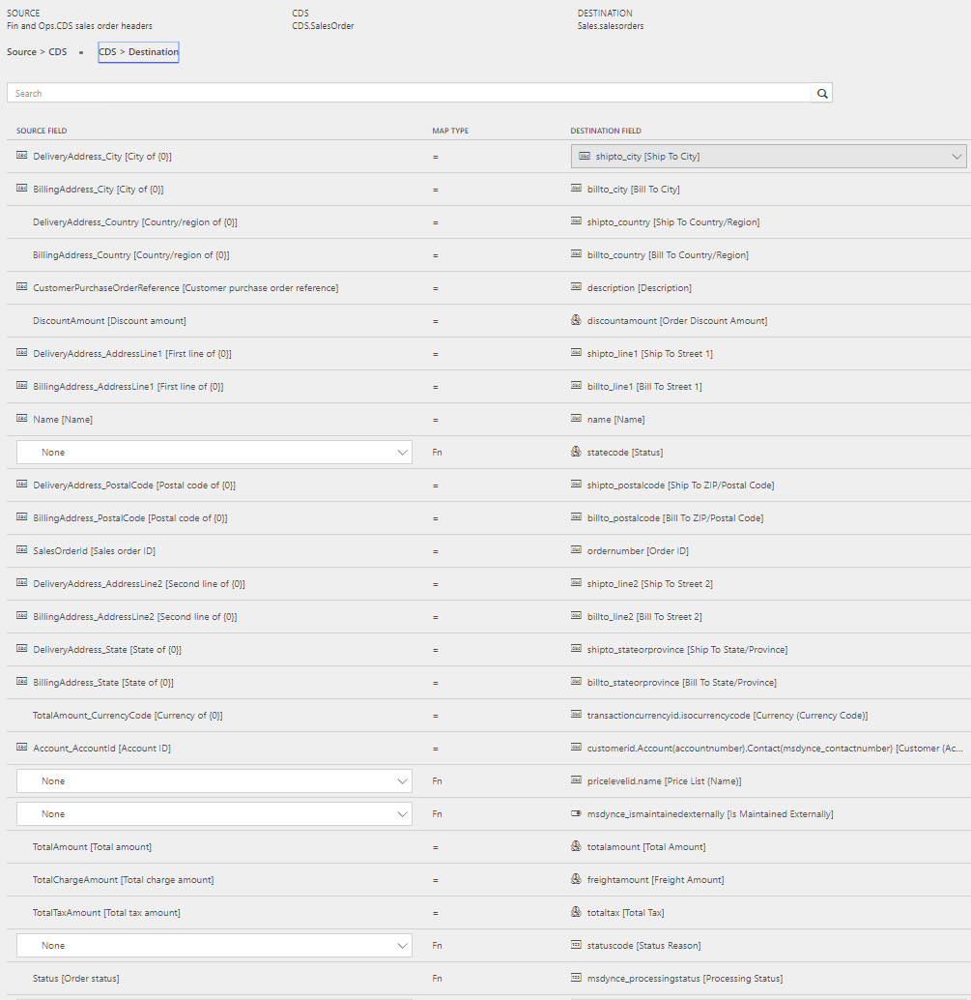
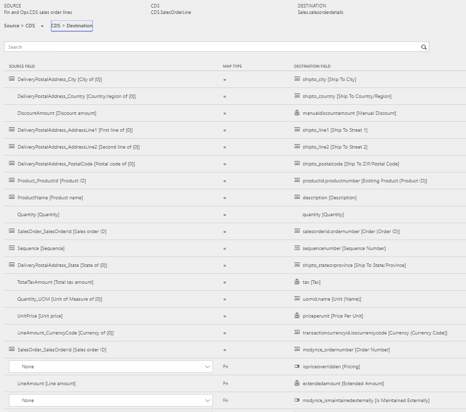

---
# required metadata

title: Synchronize sales order headers and lines from Finance and Operations to Sales
description: The topic discusses the templates and underlying tasks that are used to synchronize sales order headers and lines from Microsoft Dynamics 365 for Finance and Operations, Enterprise edition to Microsoft Dynamics 365 for Sales. 
author: ChristianRytt
manager: AnnBe
ms.date: 08/28/2017
ms.topic: article
ms.prod: 
ms.service: dynamics-ax-applications
ms.technology: 

# optional metadata

ms.search.form: 
# ROBOTS: 
audience: Application User, IT Pro
# ms.devlang: 
ms.reviewer: yuyus
ms.search.scope: Core, Operations, UnifiedOperations
# ms.tgt_pltfrm: 
ms.custom: 
ms.assetid: 
ms.search.region: global
ms.search.industry: 
ms.author: crytt
ms.dyn365.ops.intro: July 2017 update 
ms.search.validFrom: 2017-07-8

---

# Synchronize sales order headers and lines from Finance and Operations to Sales

[!include[banner](../includes/banner.md)]

The topic discusses the templates and underlying tasks that are used to synchronize sales order headers and lines from Microsoft Dynamics 365 for Finance and Operations, Enterprise edition to Microsoft Dynamics 365 for Sales. 

## Template and tasks

The following templates and underlying tasks are used to synchronize sales order headers and lines from Finance and Operations to Sales:

- **Name of template in Data integration** 

    - Sales Orders (Fin and Ops to Sales)
    
- **Names of tasks in Data integration project**

    - OrderHeader
    - OrderLine

Sync tasks required prior to Sales invoice header and lines sync:

- Products (Fin and Ops to Sales)
- Accounts (Sales to Fin and Ops) (if used)
- Contacts to Customers (Sales to Fin and Ops) (if used)

## Entity set

| Finance and Operations |    Common Data Service (CDS)         |     Sales      |
|------------------------|----------------|----------------|
| CDS sales order headers| SalesOrder     | SalesOrders |
| CDS sales order lines  | SalesOrderLine | SalesOrderDetails|

## Entity flow

Sales orders are created in Finance and Operations and synchronized to Sales.

Filters in the template ensure that only relevant sales orders are included in the synchronization:

- Both ordering and invoicing customer on the sales order that originate from Sales will be included in the synchronization. In Finance and Operations, the fields **OrderingCustomerIsExternallyMaintained** and **InvoiceCustomerIsExternallyMaintained** are used to track the synchronization in the data entities.

- The **Sales order** in Finance and Operations must be confirmed. Only the confirmed sales orders or sales orders with higher processing status, for example, Shipped or Invoiced status, are synchronized to Sales.

- After creating or modifying a sales order, the batch job **Calculate sales totals** in Finance and Operations must be executed. Only the sales orders with sales totals calculated will be synced to CDS and Sales.

> [!NOTE]
> Tax related to charges on the **Sales order header** is currently not included in synchronization from Finance and Operations to Sales. This is because Sales doesn't support tax information at the header level. Tax related to charges at the line level is included.

## Prospect to cash solution for Sales

New fields are added to the **Order** entity and displayed on the page:

- **Is Maintained Externally** - Set to **Yes** when the order is coming from Finance and Operations.

- **Processing status** - Used to show the processing status of the order in Finance and Operations. Values are:

    - Active
    - Confirmed
    - Packing Slip
    - Invoiced
    - Picked
    - Partially Picked
    - Partially Packed
    - Shipped
    - Partially Shipped
    - Partially Invoiced
    - Cancelled

The **Has Externally Maintained Products Only** setting is used in other sales order scenarios (from Sales to Finance and Operation sync) to consistently keep track of whether the sales order is made up entirely of **Externally Maintained Products**, in which case products are maintained in Finance and Operations. This ensures that you don't try to sync sales order lines with products that are unknown to Finance and Operations.
 
The **Create Invoice**, **Cancel Order**, **Recalculate**, **Get Products** and **Lookup Address** buttons on the **Sales order** page are hidden for externally maintained orders because invoices will be created in Finance and Operations and synced to Sales. The order page is non-editable because sales order information will be synced from Finance and Operations.
 
The **Sales order status** will remain active to ensure that changes from Finance and Operations can flow to the **Sales order** in Sales. This is controlled by setting the default **Statecode [Status]** to **Active** in the Data integration project.

## Preconditions and mapping setup 

Before synchronizing sales orders, it is important to update the systems with the following setting:

### Setup in Sales

- Ensure permissions for the team that the user (from your Sales **Connection set**) is assigned to. If you are using demo data, usually the user has admin access, but not the team. Without this you will get an error that Principal team is missing when running the project from Data integrator. 

    - Under **Settings** > **Security** > **Teams**, select the relevant team, click **Manage Roles** and select a role with the desired permissions e.g. System Administrator.

- Under **Settings** > **Administration** > **System settings** > **Sales**, ensure that **Use system prizing calculation system** is set to **Yes**. 

- Under **Settings** > **Administration** > **System settings** > **Sales**, ensure that **Discount calculation method** is set to **Line item**. 

### Setup in Finance and Operations

Set **Sales and marketing** > **Periodic tasks** > **Calculate sales totals** to run as a batch job, with **Calculate totals for sales orders** set to **Yes**. This is important because only the sales orders with sales totals calculated will be synced to CDS and Sales. The frequence of the batch job should be alligned with the frequence of the sales order synchronization.

### Setup in the Data integration project

#### SalesHeader task

- Update the mapping for **CDS Organization ID in Source** > **CDS**.

    - Default template value for **Account_Organization_OrganizationId** is ORG001.
    - Default template value for **InvoiceAccount_Organization_OrganizationId** is ORG001.
    - Default template value for **Organization_OrganizationId** is ORG001.

- Ensure that the needed mapping exists in **Source** > **CDS for InvoiceCountryRegionId to BillingAddress_Country** and for **DeliveryCountryRegionId to DeliveryAddress_Country**.

    - Template value is **ValueMap** with a number of countries mapped.

- **Price list** is required to create orders in Sales. Update the **ValueMap** in **CDS** > **Destination** for **pricelevelid.name [Price List Name]** to the **Price list** used in Sales per currency. You can either used the default **Price list** for single currency or use **ValueMap** if you have **Price lists** in multiple currencies.
    
    - Default template value for **pricelevelid.name [Price List Name]** is CRM Service USA (sample). 

#### SalesLine task

- Update the mapping for **CDS Organization ID in Source** > **CDS**. 
    
    - Default template value for **SalesOrder_Organization_OrganizationId** is ORG001.
    - Default template value for **Product_Organization_OrganizationId** is ORG001.

- Ensure that the needed mapping exists in **Source** > **CDS** for **DeliveryCountryRegionId** to **DeliveryAddress_Country**.

    - Template value is **ValueMap** with a number of countries mapped.
    
- Ensure that the needed **ValueMap** for **SalesUnitSymbol** in Finance and Operations exists in the **Source** > **CDS mapping**.

    - Template value with **ValueMap** is defined for **SalesUnitSymbol to Quantity_UOM**.

## Template mapping in data integrator

> [!NOTE]
> The **Payment terms**, **Freight terms**, **Delivery terms**, **Shipping method**, and **Delivery mode** fields aren't part of the default mappings. To map these fields, you must set up a value mapping that is specific to the data in the organizations that the entity is synchronized between.

The following illustrations show an example of a template mapping in data integrator.

### OrderHeader

### OrderLine

## Related topics

[Synchronize products from Finance and Operations to products in Sales](products-template-mapping.md)

[Synchronize accounts from Sales to customers in Finance and Operations](accounts-template-mapping.md)

[Synchronize contacts from Sales to contacts or customers in Finance and Operations](contacts-template-mapping.md)

[Synchronize sales quotation headers and lines from Sales to Finance and Operations](sales-quotation-template-mapping.md)

[Synchronize sales invoice headers and lines from Finance and Operations to Sales](sales-invoice-template-mapping.md)

