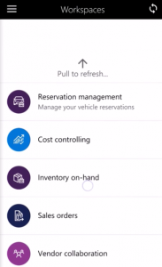

# Sales orders mobile workspace

[!include [banner](../includes/banner.md)]
[!include [mobile app deprecation](../../fin-ops-core/dev-itpro/includes/mobile-app-deprecation-banner.md)]

This article provides information about the **Sales orders** mobile workspace. This workspace helps you stay up to date about your sales orders anywhere and anytime. 

This mobile workspace is intended to be used with the finance and operations (Dynamics 365) mobile app.

## Overview
The **Sales orders** mobile workspace lets you view detailed information about each sales order. This information includes the status of the order, contact information for the customer, and contact information for the order taker. The **Sales orders** mobile workspace provides an instant view of sales orders. You can view all sales orders, view sales orders by customer, or view information about a specific sales order. 

The mobile workspace provides two views to help you analyze sale orders in depth.

### View all sales orders
This view lists all sales orders.

-   Use one of the following filters to select the sales orders to view:

    -   Search by sales order
    -   Search by customer account
    -   Search by customer name
    -   Search by status
    -   Search by release status
    -   Search by created date and time
    
-   After you select sales orders, you can view the details of specific orders. Specifically, you can view the following information:

    -   Customer name and address information
    -   Various dates for the sales order, such as the requested ship date and the confirmed ship date
    -   Contact information for the order taker
    -   Customer contact information
    -   Order lines
    -   Shipments that show how and when a sales order was shipped

### View orders for a customer
This view lists sales orders by customer.

-   Use one of the following filters to view orders for a customer:

    -   Search by name
    -   Search by account

-   After you select a customer, you can view the following information:

    -   Customer name and group
    -   Customer contact information
    -   Customer sales orders and details about those sales orders:
    
        -   Customer name and address information
        -   Various sales order dates
        -   Contact information for the order taker
        -   Customer contact information
        -   Order lines
        -   Shipments that show how and when a sales order was shipped

## Prerequisites
The prerequisites differ, based on the version of Microsoft Dynamics 365 that has been deployed for your organization.

### Prerequisites if you use Supply Chain Management 
If Supply Chain Management has been deployed for your organization, the system administrator must publish the **Sales orders** mobile workspace. For instructions, see [Publish a mobile workspace](../../fin-ops-core/dev-itpro/mobile-apps/publish-mobile-workspace.md).

### Prerequisites if you use Dynamics 365 for Operations version 1611 with platform update 3 or later
If Dynamics 365 for Operations version 1611 with platform update 3 or later has been deployed for your organization, the system administrator must complete the following prerequisites. 

<table>
<thead>
<tr class="header">
<th>Prerequisite</th>
<th>Role</th>
<th>Description</th>
</tr>
</thead>
<tbody>
<tr class="odd">
<td>Implement KB 4013633.</td>
<td>System administrator</td>

<td>KB 4013633 is an X++ update or metadata hotfix that contains the <strong>Sales orders</strong> mobile workspace. To implement KB 4013633, your system administrator must follow these steps.
<ol>
<li><a href="/dynamics365/fin-ops-core/dev-itpro/migration-upgrade/download-hotfix-lcs">Download the metadata hotfix from Microsoft Dynamics Lifecycle Services (LCS)</a>.</li>
<li><a href="/dynamics365/fin-ops-core/dev-itpro/migration-upgrade/install-metadata-hotfix-package">Install the metadata hotfix</a>.</li>
<li><a href="/dynamics365/fin-ops-core/dev-itpro/deployment/create-apply-deployable-package">Create a deployable package</a> that contains the <strong>SCMMobile</strong> model, and then upload the deployable package to LCS.</li>
<li><a href="/dynamics365/fin-ops-core/dev-itpro/deployment/apply-deployable-package-system">Apply the deployable package</a>.</li>

</ol></td>
</tr>
<tr class="even">
<td>Publish the <strong>Sales orders</strong> mobile workspace.</td>
<td>System administrator</td>
<td>See <a href="/dynamics365/fin-ops-core/dev-itpro/mobile-apps/publish-mobile-workspace">Publish a mobile workspace</a>.</td>
</tr>
</tbody>
</table>

## Sign in to the mobile app

1.  Start the app on your mobile device.
2.  Enter your Dynamics 365 URL.
3.  The first time that you sign in, you're prompted for your user name and password. Enter your credentials.
4.  After you sign in, the available workspaces for your company is shown. Note that if your system administrator publishes a new workspace later, you will have to refresh the list of mobile workspaces.

## View information about sales orders for a customer by using the Sales order mobile workspace

1.  On your mobile device, select the **Sales orders** workspace.
2.  Select **View orders for a customer**.
3.  Use account or customer name information to find the customer.
4.  Select the customer.
5.  Select **Contact information** or **Sales orders**. If you select **Sales orders**, a list of sales orders for the customer is shown.
6.  Select **Sales order**. You can now view information about sales order lines, information about shipments, customer contact information, and contact information for the order taker.

[!INCLUDE[footer-include](../../includes/footer-banner.md)]

