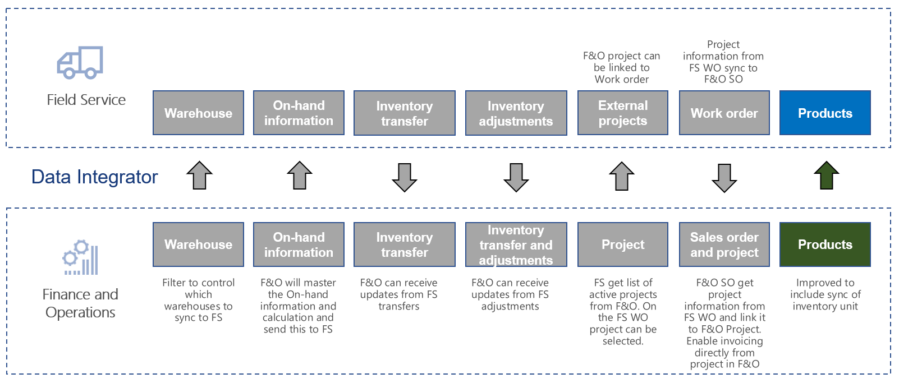
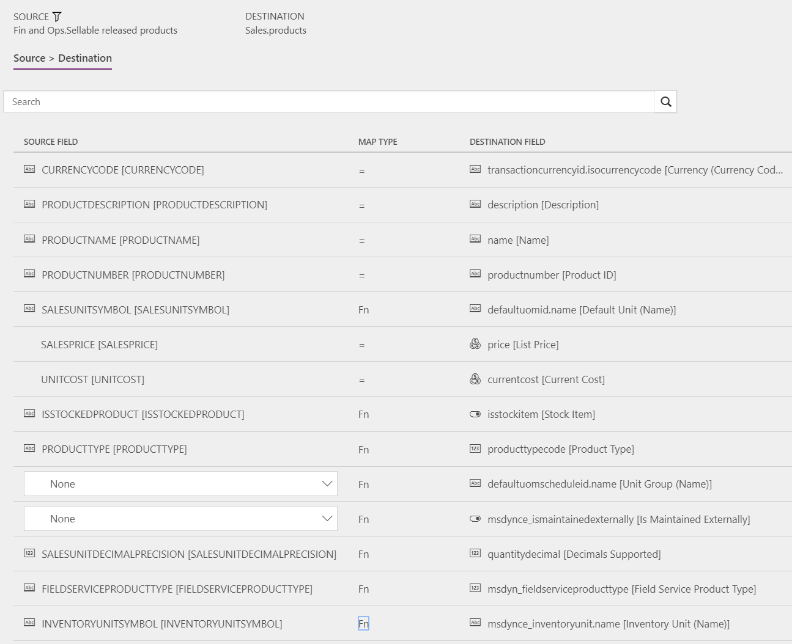

---
# required metadata

title: Synchronize products with inventory unit from Supply Chain Management to Field Service
description: This topic discusses the templates and underlying task that are used to synchronize products with inventory unit from Dynamics 365 Supply Chain Management to Dynamics 365 Field Service.
author: Henrikan
ms.date: 03/13/2019
ms.topic: article
ms.prod: 
ms.technology: 

# optional metadata

ms.search.form: 
# ROBOTS: 
audience: Application User, IT Pro
# ms.devlang: 
ms.reviewer: kamaybac
# ms.tgt_pltfrm: 
ms.custom: 
ms.assetid: 
ms.search.region: global
ms.search.industry: 
ms.author: henrikan
ms.dyn365.ops.version: 8.1.3 
ms.search.validFrom: 2018-12-01

---

# Synchronize products with inventory unit from Supply Chain Management to Field Service

[!include[banner](../includes/banner.md)]

This topic discusses the templates and underlying task that are used to synchronize products with inventory unit from Dynamics 365 Supply Chain Management to Dynamics 365 Field Service.

[](./media/FSProductsOW.png)

The used **Field Service Products with Inventory unit (Supply Chain Management to Field Service)** template is based on the **Field Service Products (Supply Chain Management to Field Service)** template. For more information, see [Synchronize products in Supply Chain Management to products in Field Service](field-service-product.md).

This topic only describes the differences between the two templates: 
- **Field Service Products with Inventory unit (Supply Chain Management to Sales)**
- **Field Service Products (Supply Chain Management to Field Service)** 

## Templates and tasks

**Name of the template in Data integration:**

- Field Service Products with Inventory unit (Supply Chain Management to Sales)

**Name of the task in the Data integration project:**

- Products

The **Field Service Products with Inventory unit (Supply Chain Management to Field Service)** template includes one mapping that isn't included in the **Field Service Products (Supply Chain Management to Field Service)** template. This mapping ensures that the Inventory unit needed for inventory level synchronization is included.

```plaintext
INVENTORYUNITSYMBOL [INVENTORYUNITSYMBOL]         Fn        msdynce_inventoryunit.name [Inventory Unit(Name)] 
```

## Template mapping in Data integration

The following illustrations show the template mapping in Data integration.

### Field Service Products with Inventory unit (Supply Chain Management to Field Service): Products

[](./media/FSProduct1.png)


[!INCLUDE[footer-include](../../includes/footer-banner.md)]