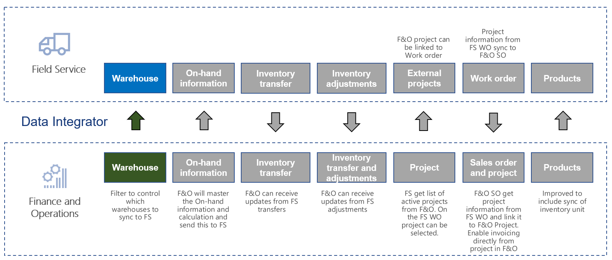
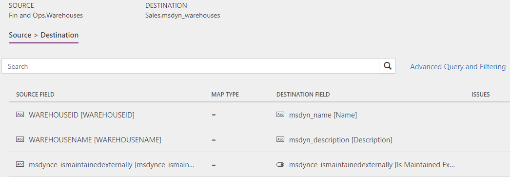

---
# required metadata

title: Synchronize warehouses from Supply Chain Management to Field Service
description: This topic discusses the templates and underlying tasks that are used to synchronize warehouses from Dynamics 365 Supply Chain Management to Dynamics 365 Field Service.
author: Henrikan
ms.date: 03/13/2019
ms.topic: article
ms.prod: 
ms.technology: 

# optional metadata

ms.search.form: 
# ROBOTS: 
audience: Application User, IT Pro
# ms.devlang: 
ms.reviewer: kamaybac
# ms.tgt_pltfrm: 
ms.custom: 
ms.assetid: 
ms.search.region: global
ms.search.industry: 
ms.author: henrikan
ms.dyn365.ops.version: 8.1.3 
ms.search.validFrom: 2018-12-01

---

# Synchronize warehouses from Supply Chain Management to Field Service

[!include[banner](../includes/banner.md)]

This topic discusses the templates and underlying tasks that are used to synchronize warehouses from Dynamics 365 Supply Chain Management to Dynamics 365 Field Service.

## Templates and tasks
The following template and underlying tasks are used to run synchronization of warehouses from Supply Chain Management to Field Service.

**Template in Data integration**
- Warehouses (Supply Chain Management to Field Service)

**Task in the Data integration project**
- Warehouse

## Table set
| Field Service    | Supply Chain Management                 |
|------------------|----------------------------------------|
| msdyn_warehouses | Warehouses                             |

## Table flow
Warehouses that are created and maintained in Supply Chain Management can be synchronized to Field Service via a Microsoft Dataverse Data integration project. The warehouses that you want to synchronize to Field Service can be controlled with the Advanced query and filtering on the project. Warehouses that synchronize from Supply Chain Management are created in Field Service with the **Is maintained externally** column set to **Yes** and the record is read only.

## Field Service CRM solution
To support the integration between Field Service and Supply Chain Management, additional functionality from the Field Service CRM solution is required. In the solution, the **Is Maintained Externally** column has been added to the **Warehouse (msdyn_warehouses)** table. This column helps to identify if the warehouse is handled from Supply Chain Management or if it only exists in Field Service. The settings for this column include:
- **Yes** – The warehouse originated from Supply Chain Management and won't be editable in Sales.
- **No** – The warehouse was entered directly in Field Service and is maintained here.

The **Is Externally Maintained** column helps control the synchronization of inventory levels, adjustments, transfers, and usage on work orders. Only warehouses with **Is Externally Maintained** set to **Yes** can be used to synchronize directly to the same warehouse in the other system. 

> [!NOTE]
> It is possible to create multiple warehouses in Field Service (with **Is Externally Maintained** = No) and then map them to a single warehouse, with the Advanced query and filtering functionality. This is used in situations where you want Field Service to master the detailed inventory level and just send updates to Supply Chain Management. In this case, Field Service will not receive inventory-level updates from Supply Chain Management. For additional information, see [Synchronize inventory adjustments from Field Service to Finance and Operations](/dynamics365/unified-operations/supply-chain/sales-marketing/synchronize-inventory-adjustments) and [Synchronize work orders in Field Service to sales orders linked to project in Finance and Operations](/dynamics365/unified-operations/supply-chain/sales-marketing/field-service-work-order).

## Prerequisites and mapping setup
### Data Integration project
Before synchronizing the warehouses, make sure to update the Advanced query and filtering on the project to only include the warehouses that you want to bring from Supply Chain Management to Field Service. Note that you will need the warehouse in Field Service to apply it on work orders, adjustments, and transfers.  

To ensure that the **Integration key** exists for **msdyn_warehouses**:
1. Go to Data Integration.
2. Select the **Connection Set** tab.
3. Select the connection set used for work order synchronization.
4. Select the **Integration key** tab.
5. Find msdyn_warehouses and confirm that the key **msdyn_name (name)** is added. If it is not shown, add it by clicking **Add key** and then click **Save** at the top of the page.

## Template mapping in Data integration

The following illustration shows the template mapping in Data integration.

### Warehouses (Supply Chain Management to Field Service): Warehouse

[!INCLUDE[footer-include](../../includes/footer-banner.md)]