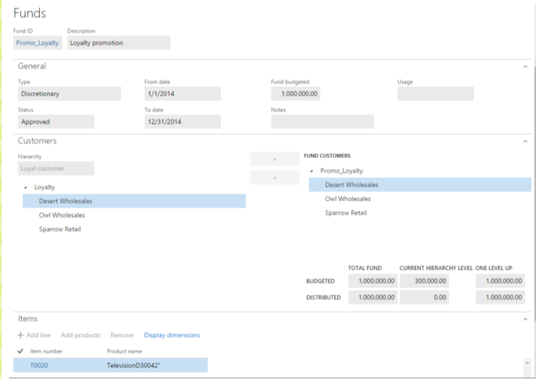
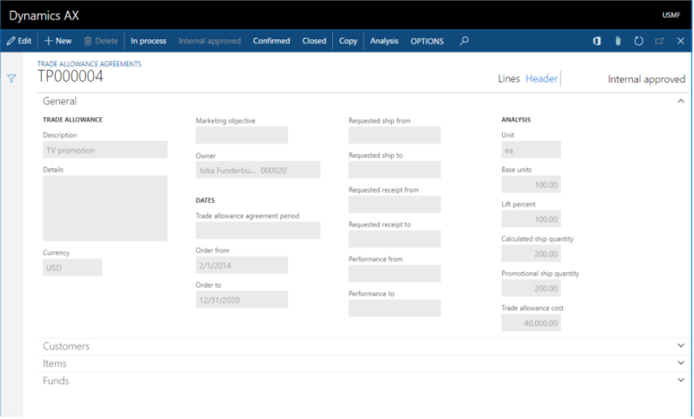
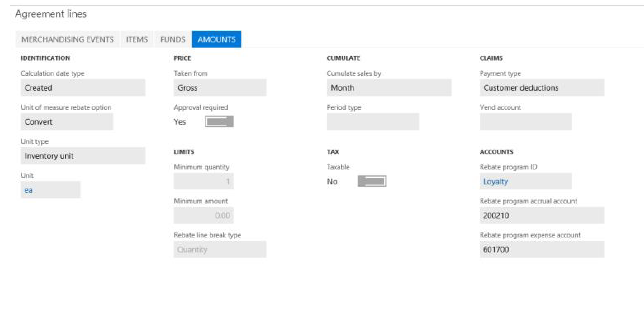

# Trade allowance management

[!include [banner](../includes/banner.md)]

Trade allowance management helps companies manage sales promotion programs that offer "pay-for-performance" monetary rewards to customers that achieve volume and behavioral goals. The feature’s capabilities are designed for companies that focus on comprehensive promote-to-profit processes, from promotion fund budgeting and allocation, to allowance contract setup, to claims creation and processing, to payment processing, to promotion effectiveness analysis.

This article will provide a broad overview of the Trade allowance management feature and will familiarize you with the typical set of tasks that are involved in managing a sales promotion program. Several types of users who have operational and decision making responsibilities are expected to use this functionality to achieve their respective goals:

- Allocating discretionary funds to the selected accounts, and setting up trade allowance agreements for promotions, based on bill-backs and one-off lump sum payments (for an agreed service)
- Running the negotiated promotion contracts through ongoing sales and generating bill-back claims
- Calculating, approving, and processing the generated claims, and passing them on to Accounts receivable (A/R) as deductions for payment settlement
- Reconciling the customer’s short-pay with the deduction that is due
- Tracking use of the promotional fund, and evaluating program profitability and effectiveness

## Audience and purpose

The information in this document is intended for business decision makers in enterprise companies, in positions such as purchase manager, chief financial officer (CFO), and accounting manager, who have the following responsibilities:

- High-level budgets and fund allocation
- Planning and analyzing sales promotions
- Managing staff that processes bill-back claims, runs payments based on merchandizing events, and settles short-pays and deductions

People in these roles are looking for ways to achieve these goals:

- Better use marketing promotional funds.
- Flexibly accommodate different types of promotion programs and allowances.
- Reduce the administrative burden and errors that are associated with monitoring promotion performance and processing claims.
- Improve cash flow forecasts by accruing for future liability.
- Have a quantified basis for ongoing and future negotiations with customers about promotions.

## Promotional fund and Trade allowance agreement

A trade allowance agreement is an incentive program where pay-for-performance monetary rewards are offered to customers that achieve specific volume targets and/or behavioral goals. Promotional funds are budgeted expenditures. In that way, the promotional campaigns can be captured.

### Promotional fund

Funds that are allocated to trade allowance agreements are recorded on the **Funds** page. To open the **Funds** page, select **Sales and marketing** \> **Trade allowances** \> **Funds** \> **Funds**.

On the **Funds** page, you can view the details of promotional funds.

The **General** FastTab shows the period that the fund is valid for and its budgeted amount. In order for the fund to be allocated to the promotion agreement, the **Status** field must have a value of **Approved**.

The **Customers** FastTab shows the customer hierarchy. To select the customers that the fund targets, drag them so that they are under **Fund customers**. This FastTab also shows how the total amount of the fund is distributed.

The **Items** FastTab shows the items that are included in the promotion.

### Trade allowance agreement

After the fund definition is in place, the next step in promotion planning is to register promotion contracts (which are known as trade allowance agreements), allocate funds, and define performance goals for each merchandizing event.

Trade allowance agreements are recorded on the **Trade allowance agreements** page. To open the **Trade allowance agreements** page, select **Sales and marketing** \> **Trade allowances** \> **Trade allowance agreements**.

#### Header

Select **Header** to switch to the Header view.

On the **General** FastTab, the **Order to** and **Order from** fields define the period when the agreement is valid. An approval status of **Internal approved** for the agreement indicates that the agreement isn't yet valid and can't be applied during sales order processing.

The **Analysis** section of the **General** FastTab contains important fields that define the quantities and costs that are used for promotion evaluation:

- The **Base units** field specifies the quantity of products that must be sold to the selected customers before the promotion is applied.
- The **Calculated ship quantity** value is calculated based on the **Lift percent** value, which is a planned target increase for this promotion.
- The **Trade allowance cost** field is calculated based on the quantities of the various events in the trade allowance agreement.

On the **Customers** FastTab, in the list on the left, you can select and view customer groups, which are set up as predefined hierarchies. You can then select the whole hierarchy or specific accounts as targets for the allowance agreement.

On the **Items** FastTab, as on the **Items** FastTab of the **Funds** page, products are added to the agreement to associate its sales with the allowance that was agreed on.

On the **Funds** FastTab, you can view the promotion funds that are associated with this contract. You can also view the contract's event cost allocation. An event cost allocation of 100 percent means that this promotion will be financed exclusively from one fund. Alternatively, a promotion agreement can draw on several funds, and can use equal or differential percentage allocation.

#### Lines

Next, select **Lines** to switch to the Lines view.

The **Merchandizing events** tab shows the types of events covered by an agreement. There are three types: bill back, lump sum and off-invoice.

When you select the merchandizing event and then select the **Amounts** tab, the details for the event are found.

In the **Trade allowance lines** section, you specify the quantity or amount ranges that the customer must achieve for definitions to obtain the rewards.

In the case of a merchandizing event of the **Bill back** type, the upper section the **Amounts** tab defines the rules that the bill back will be applied, generated, and paid under. For example, the rules may specify the following conditions for the bill back claim:

- It’s based on the creation date of the sales order (the **Calculation date type** value is **Created**).
- It’s calculated based on the sales order line’s amount before discounts, not the net amount, which includes discounts (the **Taken from** value is **Gross**).
- It’s based on the volume of the sold products, not the amount (the **Rebate line break type** value is **Quantity**).
- It’s calculated per period of a month (the **Cumulate sales by** value is **Month**). 
- It’s settled as a deduction, not by using A/P (the **Payment type** value is **Customer deductions**).

In the case of a merchandizing event of the **Lump sum** type, the **Amounts** tab shows the quantity that will be paid to the customer in the form of a deduction when the customer achieves specific performance. An approval status of **Open** indicates that the lump sum hasn't yet been paid.

To apply the agreement to sales orders that meet the agreement's conditions, the agreement's status must be **Confirmed**. 

## Perform sales under the planned merchandising event and generate bill-back claims

When you create a sales order that has lines that fulfill the requirements of the agreement, you can view the related information on the **Sales order** page by selecting **Sales order line** \> **View** \> **Price details**.

On the **Price details** page, on the **Rebates** FastTab, the sales clerk can see a bill back from the valid trade allowance agreement (the rebate program ID is shown) and the total amount that is applied to the line. This amount is also shown in the **Rebate amount** field in the **Margin estimation** section of the **Price details** page.

When the sales invoice is posted, a corresponding bill-back claim is generated for each invoice line.

> [!NOTE]
> To see the **Price details** page, on the **Accounts receivable parameters** page, on the **Prices** tab, select the **Enable price details** check box. I

## Process claims and pass them as deductions to A/R

The next steps in the process for handling bill-backs are to review, calculate, and approve claims, and then convert them into deductions.

The Bill back workbench is where the promotion agreement owner periodically reviews and processes the claims that are generated. It's also where the A/R administrator converts the approved claims into deductions or regular payments, depending on the payment method for the claim.

On the **Bill back workbench** page, you can review the claim lines. If the claims are in **To be recalculated** status, they must be recalculated for any cumulative effect.

### Recalculate claims

To recalculate the claims, on the Action Pane, select **Cumulate**. Then, in the **Cumulate rebates** dialog box, select the customer.

As a result of the recalculation, the program generates new claims for the amounts to adjust the original claims to the qualifying amount per unit. One adjustment claim is generated for each unique combination of a customer, an item, a currency, a unit of measure, inventory dimensions, financial dimensions, and a sales tax group. These adjustment claims have the same reference to the sales order and invoice number as the claims that are being adjusted (that is, the claims that were originally created from the sales document). Unlike the original claim, the adjustment claim doesn’t have values in the fields that describe the original sales order line’s amounts and quantity.

After the recalculation is completed, the status of the claims is changed to **Calculated**. To approve the claims, on the Action Pane, select **Approve**.

### Process claims and pass them to A/R

The claims are now ready for A/R processing. To process them, on the Action Pane, select **Process**. 

Upon processing the claims, the status has changed to **Mark** and indicates that a journal posting (the journal that is posted is the Rebate accrual journal, as specified in the A/R parameters) has caused the following events to occur: 

- The claims have been transferred to the temporary customer balance as deductions.
- The rebate accrual account has been credited to represent the future liability for the customer.
- The rebate expense account has been debited to recognize the cost that was incurred in connection with the sales.

To complete the process, the A/R clerk must now handle the accrual deductions by transferring them to the customers balance as a credit note (liability). 

To start the task, on the Action Pane of the **Customer** page, select **Collect** \> **Settle transactions**. Then, on the **Settle transactions** page, select **Functions** \> **Bill back program**. This rebate page shows all the bill-back claims that were previously processed.

If you want to create a credit note, select the **Mark** check box for all lines, and then select **Functions** \> **Create credit note**.

Upon credit note creation, a journal is posted. (The journal that is posted is the AR consumption journal, as specified in the A/R parameters.) As a result, the real liability (credit) amount has been moved to the customer balance. Financially, this situation implies that the following events have occurred:

- The customer's receivable account has been credited.
- The rebate accrual account has been debited.

To approve a merchandising event of the **Lump sum** type, select the event on the **Trade allowance agreements** page, and then, on the **Amount** tab, select **Approve**.

## Settle the deduction that is due and the customer short-pay by using the Deduction workbench

Often, in anticipation of bill-backs, customers choose to short-pay selected invoices. To prevent payment reconciliation issues in the future, the A/R clerk registers those short-pays as deductions when they record the actual customer payments. Then, on the Deduction workbench, those customer deductions can easily be settled against the claim amounts that are due from the company.

To register a customer's short-pay in the Payment journal, select **Accounts receivable** \> **Payments** \> **Payment journal**, and create a new payment journal. Then, on the Action Pane, select **Deductions**. On the **Deduction** page, you can create and track the amount that was short-paid.

The collection manager is now responsible for settling the open credit note transaction and the short-pay transaction against each other in the Deduction workbench.

To manage deductions, select **Sales and marketing** \> **Trade allowances** \> **Deductions** \> **Deduction workbench**. The upper section of the page contains lines that represent the short-pays from the customer. The lower section of the page contains the customers open credit transactions. 

To settle the deduction against the open transaction, mark the deduction line, and then, on the Open transactions tab, mark the line. On the Action Pane, click Maintain > Match.

The status of the originating claims is now set to **Completed**.

## Analyze the effectiveness of the promotion and fund consumption

To get an overview of the program's key statistics and fund use, you can use several reports and analytical views that are available in Trade allowance management.

On the **Trade allowance activity** page, the **Overview** tab shows the main details of the trade allowance agreement. The other tabs show more specific details about the associated documents, payments, and other events that are related to the program.

The **Summary** tab shows the total quantity of products that have been sold under the promotion, the sales amount that has been invoiced, and the bill-backs and lump sums that have been paid.

The **Bill back credits** tab contains the details of individual bill-backs that have been credited to the customer.

To get a more analytical overview of the various performance measures for the promotion, you can use the Analysis view. To go to the Analysis view, click **Sales and marketing** \> **Trade allowances** \> **Trade allowance agreements**. On the Action Pane, click **Analysis**.  

To get a more analytical overview of the various performance measures for the promotion, you can use the Analysis view. To go to the Analysis view, click **Sales and marketing** \> **Trade allowances** \> **Trade allowance agreements**. On the Action Pane, click **Analysis**. 

[!INCLUDE[footer-include](../../includes/footer-banner.md)]