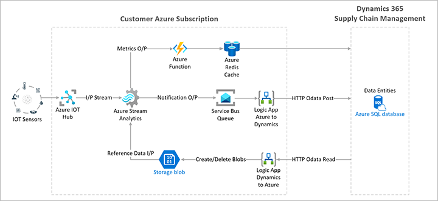

# Deploy an IoT solution on Azure

[!include [banner](../includes/banner.md)]
[!INCLUDE [preview-banner](../includes/preview-banner.md)]
<!-- KFM: Preview until further notice -->

Sensor Data Intelligence uses data from sensors that are connected to Microsoft Azure. To enable Azure to retrieve data from your sensors and share it with Dynamics 365 Supply Chain Management, you must deploy an Internet of Things (IoT) solution on your Azure subscription. The following architectural diagram provides an overview of the solution and its components.

## Prerequisites

To deploy and administer Azure components for Sensor Data Intelligence, your Azure environment and user account must meet the following requirements:

1. You must sign in using an Azure organizational account that is tied to your Supply Chain Management environment. You can't use a personal Azure account (such as one registered to an Outlook or Gmail address).
1. Your Azure account must have one of the following security roles:
    - Owner
    - Co-administrator
    - Service administrator
    - Account administrator
1. The Power Apps component framework must be enabled for your Azure environment. For instructions, see [Enable the Power Apps component framework](/powerapps/developer/component-framework/overview#enable-the-power-apps-component-framework).

## Video instructions

The following video shows how to [turn on the Sensor Data Intelligence feature](sdi-enable-feature.md) and deploy the required Azure resources. The other section in this article provides the same instructions in a text-based format.

> [!VIDEO https://www.microsoft.com/videoplayer/embed/RE58g3I]

## Procedure

> [!IMPORTANT]
> Before you start this procedure, make sure your Azure environment and user account fulfil the [prerequisites](#prerequisites) listed earlier in this article.

Follow these steps to deploy the required resources on Azure.

1. Sign in to Supply Chain Management as an admin.
1. Go to **System administration \> Setup \> Sensor Data Intelligence \> Deploy and connect Azure resources** to open the deployment wizard.
1. On the **Welcome** page, read the information, and then select **Next**.
1. On the **Deploy the sample IoT solution to Azure** page, read the information, and then, in the **Instructions** section, select **Deploy**.
1. A new browser tab is opened, and you're taken to the Azure portal so that you can deploy the Azure resources. If you're prompted, sign in by using your credentials for your Azure subscription.
1. On the **Custom deployment** page, in the **Subscription** field, select your subscription.
1. Under the **Resource group** field, select **Create new** to create a resource group for the Azure components that you will deploy.
1. In the drop-down dialog box that appears, in the **Name** field, enter a name for the new resource group (for example, *IoT-demo*). Then select **OK**.
1. Set the following fields:

    - **Resource group** – Select the resource group that you just created.
    - **Region** – Select a region, ideally the region where your Supply Chain Management environment is deployed. Keep in mind that Azure regions have different pricing. You can view estimated costs for your region by using the [Sensor Data Intelligence price calculator](https://azure.com/e/c36c4947ebff4215b2e62590c2a24c68).
    - **Supply Chain Management environment URL** – Enter the URL for your Supply Chain Management environment.
    - **Reuse existing Azure IoT Hub** – Leave this checkbox cleared.

1. Select **Next: Review + Create**.
1. On the **Custom deployment** page, verify that the validation has passed, and then select **Create**.
1. The **Deployment is in progress** page tracks the progress of your deployment. The deployment process can take up to 30 minutes. When the **Deployment is in progress** page indicates that the deployment is completed, select the link for the resource group name to open a page that shows the list of resources that are deployed in the group.
1. In the resource list, find the record where the **Type** field is set to *Managed Identity*. In the **Name** column, select the name to open the details page for the resource.
1. Copy the value in the **Client ID** field (for example, by selecting the **Copy to clipboard** button).
1. Go back to the browser tab where Supply Chain Management is running, *but don't close the tab for the Azure portal*. The **Deploy the sample IoT solution to Azure** wizard page should still be open. 
1. Select **Next**.
1. On the **Connect Azure resources** page, in the **Azure AD Application client ID** field, paste the **Client ID** value that you copied.
1. Go back to the browser tab where the Azure portal is open, *but don't close the tab for Supply Chain Management*. The details page for the resource should still be open.
1. Select the browser's **Back** button to return to the list of resources in the new resource group.
1. In the resource list, find the record where the **Type** field is set to *Azure Cache for Redis*. In the **Name** column, select the name to open the details page for the resource.
1. In the left navigation pane, select **Access keys**.
1. On the **Access keys** page, copy the value that is shown for **Primary connection string (StackExchange.Redis)** (for example, by selecting the **Copy to clipboard** button).
1. Go back to the browser tab where Supply Chain Management is running. The **Connect Azure resources** page should still be open.
1. In the **Redis metric store connection string** field, paste the **Primary connection string (StackExchange.Redis)** value that you copied.
1. Select **Finish**.

Azure resources for Sensor Data Intelligence are now deployed on your Azure subscription.

> [!NOTE]
> At any time, you can view or edit the connection information that is saved in Supply Chain Management by opening the **Sensor Data Intelligence parameters** page. For more information, see [Sensor Data Intelligence parameters](sdi-parameters.md).
