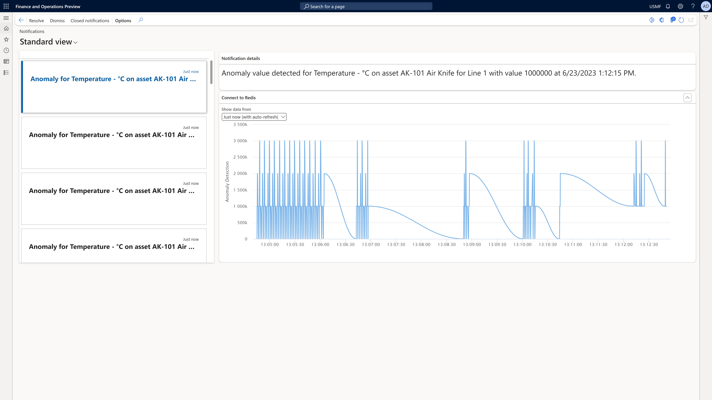

# The anomaly detection scenario

[!include [banner](../includes/banner.md)]
[!INCLUDE [preview-banner](../includes/preview-banner.md)]

<!-- KFM: Preview until further notice -->

The anomaly detection scenario involves monitoring the behavior of a machine and generating an alert if any abnormal patterns or deviations from the usual behavior are detected. This scenario requires installing a sensor that continuously collects data and sends it to the Azure IoT Hub for analysis. The anomaly detection system analyzes the data in real time and triggers an alert if it identifies any anomalies or deviations from normal operating conditions. This proactive approach helps to identify potential issues before they escalate into significant problems, enabling timely maintenance or intervention to minimize downtime and optimize machine performance.

> [!IMPORTANT]
> The anomaly detection scenario requires Supply Chain Management 10.0.36 or later.

## Prerequisites

To use this feature, your system must meet the following requirements:

- You must be running Microsoft Dynamics 365 Supply Chain Management 10.0.36 or later.
- You must turn on the feature as described in [Turn on Sensor Data Intelligence for your system](sdi-enable-feature.md).
- You must deploy an IoT solution on Azure and be sure to enable the **Deploy resources for Anomaly Detection scenario for Asset Management** option as described in [Deploy an IoT solution on Azure](sdi-deploy-iot-solution-on-azure.md).

## Prepare demo data for the anomaly detection scenario

If you want to use a demo system to test the *anomaly detection* scenario, use a system where the [demo data](../../fin-ops-core/fin-ops/get-started/demo-data.md) is installed, select the *USMF* legal entity (company), and prepare the additional demo data as described in this section. If you're using your own sensors and data, you can skip this section.

If you want to try this scenario without using a physical sensor, you can set up a simulator to generate the required signals. For more information, see [Set up a simulated sensor for testing](sdi-set-up-simulated-sensor.md).

## Set up the asset anomaly detection scenario

Follow these steps to set up the *asset anomaly detection* scenario in Supply Chain Management.

1. Go to **Asset Management \> Setup \> Sensor Data Intelligence \> Scenarios** to open the **Scenarios** page.
1. In the **Asset anomaly detection** scenario box, select **Configure** to open the setup wizard for this scenario.
1. On the **Sensors** page, select **New** to add a sensor to the grid. Then set the following fields for it:

    - **Sensor ID** – Enter the ID of the sensor that you're using. (If you're using the Raspberry PI Azure IoT Online Simulator and have set it up as described in [Set up a simulated sensor for testing](sdi-set-up-simulated-sensor.md), then enter *AnomalyDetector*.)
    - **Sensor description** – Enter a description of the sensor.

1. Repeat the previous step for each additional sensor that you want to add now. You can come back and add more sensors at any time.
1. Select **Next**.
1. On the **Business record mapping** page, in the **Sensors** section, select the record for one of the sensors that you just added.
1. In the **Business record mapping** section, select **New** to add a row to the grid.
1. On the new row, the **Business record type** field should automatically be set to *Assets(EntAssetObjectTable)*. Set the **Business record** field to the resource that you're using the selected sensor to monitor. (If you're using the demo data that you prepared earlier in this article, set it to *AK-101, Air Knife for Line 1*.) <!--KFM: Confirm record type value -->
1. Immediately after you select a business record type for the row that you added in the previous step, a second row is automatically added to the grid. On this row, the **Business record type** field should be set to *Counters(EntAssetCounterType)*. Set the **Business record** field to the batch attribute that you're using the selected sensor to monitor. (If you're using the demo data that you prepared earlier in this article, set it to *Celsius, Temperature - °C*.) <!--KFM: Confirm record type value -->
1. Select **Next**.
1. On the **Anomaly detection parameters** page, define parameters that impact the number of notifications that you wish to receive:

    - **Sensitivity**: Enter a value between 0 and 99 to set the sensitivity of the anomaly detection. The higher the value, the more sensitive the system will be, which will result in more notifications.
    - **Max anomaly ratio:** Enter the maximum number anomaly alerts the sensor will generate per time period, as a factor between 0.01 and 0.5. The higher the value, the more notifications you'll receive.

1. Select **Next**.
1. On the **Activate sensors** page, in the grid, select the sensor that you set up, and then select **Activate**. For each activated sensor in the grid, a check mark appears in the **Active** column.
1. Select **Finish**.

## View machine status on the Notifications page

On the **Notifications** page, supervisors can view the notifications that are generated when an anomaly is detected. To open the **Notification** page, go to **Asset management \> Inquiries \> Sensor Data Intelligence \> Notifications**.

The following illustration shows an example of an anomaly notification.

## Define the amount of time used for anomaly detection

The system applies a sliding window when detecting anomalies, which means that it considers the most-recent readings received over a fixed time period to identify whether the current sensor reading is an anomaly.

To adjust the size of the window, go to the Azure Stream Analytics resource called *msdyn-iiot-sdi-asset-univariate-anomaly-detection-* and navigate to the query. On line 48, adjust the parameters of the `SlidingWindow` as needed. Increasing this number will typically help the Anomaly Detection service to learn the pattern and detect anomalies more accurately. The sliding window used for anomaly detection should be between 12 and 8640 seconds. The default value is 1000.

For more information, see [Sliding Window (Azure Stream Analytics)](/stream-analytics-query/sliding-window-azure-stream-analytics)

## The Anomaly Detection service

This feature makes used of the Anomaly Detection service, which is a part of the Azure Cognitive Services suite. For more information about the service and how it works, see [Anomaly Detector overview](/azure/cognitive-services/anomaly-detector/overview) and [Cognitive Services APIs Reference](https://westus2.dev.cognitive.microsoft.com/docs/services/AnomalyDetector/operations/post-timeseries-entire-detect).
