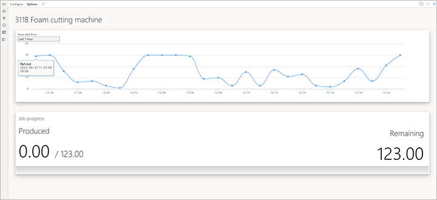
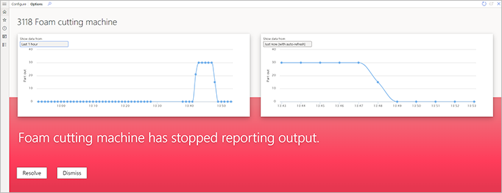
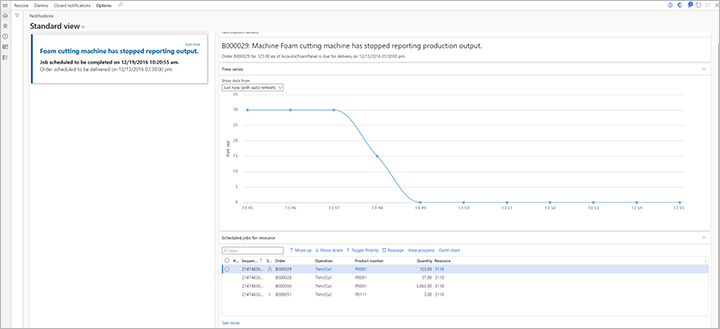

# Machine status scenario

[!include [banner](../includes/banner.md)]
[!INCLUDE [preview-banner](../includes/preview-banner.md)]
<!-- KFM: Preview until further notice -->

The *machine status* scenario lets you use sensor data to monitor the availability of your equipment. If you set up a sensor that sends a signal when a production job on a machine resource produces output, but no sensor signal is received within a specified interval, a notification is shown on the supervisor's dashboard.

## Scenario dependencies

The *machine status* scenario has the following dependencies:

- A notification can be triggered only if a production job is in progress on a mapped machine.
- A signal that represents a *part-out* signal must be sent to the IoT hub.

## Prepare demo data for the machine status scenario

If you want to use a demo system to test the *machine status* scenario, use a system where the [demo data](../../fin-ops-core/fin-ops/get-started/demo-data.md) is installed, select the *USMF* legal entity (company), and prepare the additional demo data as described in this section. If you're using your own sensors and data, you can skip this section.

### Set up a sensor simulator

If you want to try this scenario without using a physical sensor, you can set up a simulator to generate the required signals. For more information, see [Set up a simulated sensor for testing](sdi-set-up-simulated-sensor.md).

### Verify that resource 3118 is used for product P0111

A production order will be scheduled and released. Therefore, a production job is released to resource *3118* (*Foam cutting machine*). Follow these steps to verify that resource *3118* is used for product *P0111* in your demo data.

1. Go to **Product information management \> Products \> Released products**.
1. Find and select the product where the **Item number** field is set to *P0111*.
1. On the Action Pane, on the **Engineer** tab, in the **View** group, select **Route**.
1. On the **Route** page, on the **Overview** tab at the bottom of the page, select the line where the **Oper. No.** field is set to *30*.
1. On the **Resource requirements** tab at the bottom of the page, make sure that resource *3118* (*Foam cutting machine*) is associated with the operation.

### Create and release a production order for product P0111

Follow these steps to create and release a production order for product *P0111*.

1. Go to **Production control \> Production orders \> All production orders**.
1. On the **All production orders** page, on the Action Pane, select **New batch order**.
1. In the **Create batch** dialog box, set the following values:

    - **Item number:** *P0111*
    - **Quantity:** *10*

1. Select **Create** to create the order and return to the **All production orders** page.
1. Use the **Filter** field to search for production orders where the **Item number** field is set to *P0111*. Then find and select the production order that you just created.
1. On the Action Pane, on the **Production order** tab, in the **Process** group, select **Estimate**.
1. In the **Estimate** dialog box, select **OK** to run the estimate.
1. On the Action Pane, on the **Production order** tab, in the **Process** group, select **Release**.
1. In the **Release** dialog box, make a note of the number of the batch order that you just created.
1. Select **OK** to release the order.

### Configure the production floor execution interface

You will use the production floor execution interface to start the job that was scheduled and released for item number *P0111* in the previous section. Follow these steps to configure the production floor execution interface.

1. Go to **Production control \> Manufacturing execution \> Production floor execution**.
1. If you haven't previously set up the interface, a sign-in page appears. Enter your credentials.
1. On the welcome page, select **Configure** to open the **Configure device** wizard.
1. On the **Configure device - Step 1 - Select configuration** page, select the *Default* configuration.
1. Select **Next**.
1. On the **Configure device - Step 2 - Define the production floor area** page, set the **Resource** field to *3118*.
1. Select **OK**.

### Enable the search option in the production floor execution interface

To make it easier to find the production job for the production order that was released earlier, follow these steps to enable the search option in the production floor execution interface.

1. Go to **Production control \> Setup \> Manufacturing execution \> Configure production floor execution**.
1. Select the *Default* configuration.
1. On the Action Pane, select **Edit**.
1. On the **General** FastTab, set the **Enable search** option to *Yes*.
1. Close the page.

### Start the first job in the batch order

Follow these steps to start the job scheduled on resource *3118*.

1. Go to **Production control \> Manufacturing execution \> Production floor execution**.
1. In the **Badge ID** field, enter *123*. Then select **Sign in**.
1. If you're prompted for an absence reason, select one of the cards for absence, and then select **OK**.
1. In the **Search** field, enter the batch order number that you previously made a note of. Then select the **Return** key.
1. Select the order, and then select **Start job**.
1. In the **Start job** dialog box, select **Start**.

## Set up the machine status scenario

Follow these steps to set up the *machine status* scenario in Supply Chain Management.

1. Go to **Production control \> Setup \> Sensor Data Intelligence \> Scenarios**.
1. In the **Machine status** scenario box, select **Configure** to open the setup wizard for this scenario.
1. On the **Sensors** page, select **New** to add a sensor to the grid. Then set the following fields for it:

    - **Sensor ID** – Enter the ID of the sensor that you're using. (If you're using the Raspberry PI Azure IoT Online Simulator and have set it up as described in [Set up a simulated sensor for testing](sdi-set-up-simulated-sensor.md), enter *MachineStatus*.)
    - **Sensor description** – Enter a description of the sensor.

1. Repeat the previous step for each additional sensor that you want to add now. You can come back and add more sensors at any time.
1. Select **Next**.
1. On the **Business record mapping** page, in the **Sensors** section, select the record for one of the sensors that you just added.
1. In the **Business record mapping** section, select **New** to add a row to the grid.
1. On the new row, set the **Business record** field to the resource that you're using the selected sensor to monitor. (If you're using the demo data that you created earlier in this article, set the field to *3118, Foam cutting machine*.)
1. Select **Next**.
1. On the **Machine status threshold** page, define how long after the last *part-out* signal the system should send a machine status notification. There are two ways to define the threshold:

    - **Default threshold (minutes)** – Set this field to define the default threshold. The value will then apply to all resources where the **Threshold to determine machine not responding (minutes)** field is set to two minutes or less. The minimum value is *2* (minutes).
    - **Threshold to determine machine not responding (minutes)** – For each resource in the grid that you don't want to use the default threshold for, enter an override value in this field. Resources that are set to use a threshold of two minutes or less will use the **Default threshold (minutes)** setting instead.

    > [!NOTE]
    > Typically, you will use a *part-out* signal to monitor machine status. Therefore, you should verify that the threshold for each machine resource is longer than the machine requires to produce each part.

1. Select **Next**.
1. On the **Activate sensors** page, in the grid, select the sensor that you added, and then select **Activate**. For each activated sensor in the grid, a check mark appears in the **Active** column.
1. Select **Finish**.

## Work with the machine status scenario

After you install your sensors and configure the scenario, you can view machine status events in Supply Chain Management. This section describes where and how to view this information.

### View machine status data on the Resource status page

On the **Resource status** page, supervisors can monitor a timeline of the *part-out* signal that is received from the sensors that are mapped to each machine resource. Follow these steps to configure the timeline.

1. Go to **Production control \> Manufacturing execution \> Resource status**.
1. In the **Configure** dialog box, set the following fields:

    - **Resource** – Select the resources that you want to monitor. (If you're working with the demo data, select *3118*.)
    - **Time series 1** – Select the record (metric key) that has the following format for its name: *MachineReportingStatus:&lt;Sensor&gt;*
    - **Display name** – Enter *Parts out signal*.

The following illustration shows an example of machine status data on the **Resource status** page during standard operation.

The following illustration shows an example of machine status data when downtime is detected.

### View machine status on the Notifications page

On the **Notifications** page, supervisors can view the notifications that are generated when too much time has passed since the sensor last delivered a *part-out* signal. Each notification provides an overview of the production job that is affected by the outage and gives the option to reassign the affected job to another resource.

To open the **Notification** page, go to **Production control \> Inquiries and reports \> Sensor Data Intelligence \> Notifications**.

The following illustration shows an example of a machine status notification.

