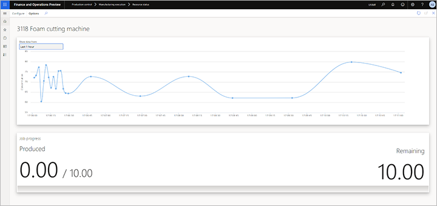
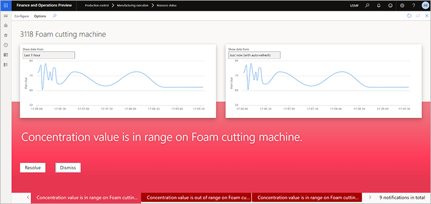
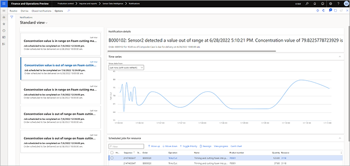

# Product quality scenario

[!include [banner](../includes/banner.md)]
[!INCLUDE [preview-banner](../includes/preview-banner.md)]
<!-- KFM: Preview until further notice -->

In the *product quality* scenario, a sensor is set up to measure the quality of a product batch on the shop floor. If a measurement falls outside a defined threshold for the product, a notification is shown on the supervisor's dashboard. For example, a sensor is measuring the moisture of a food product that comes out of the production line. If the measurement is outside the allowed minimum or maximum value for moisture for the product, a notification is generated.

## Scenario dependencies

The *product quality* scenario has the following dependencies:

- An alert can be triggered only if a production order is running on a mapped machine, and if that machine is producing a product that has a mapped batch attribute.
- A signal that represents the batch attribute must be sent to the IoT hub, and a unique property name must be included.

## Prepare demo data for the product quality scenario

If you want to use a demo system to test the *product quality* scenario, use a system where the [demo data](../../fin-ops-core/fin-ops/get-started/demo-data.md) is installed, select the *USMF* legal entity (company), and prepare the additional demo data as described in this section. If you're using your own sensors and data, you can skip this section.

In this section, you will set up the demo data so that you can use released product *P0111* (*Composite Case*) with the *product quality* scenario. In this scenario, the system tracks whether a batch attribute value that is measured by a sensor is outside the defined threshold for a batch attribute that is associated with the product.

### Set up a sensor simulator

If you want to try this scenario without using a physical sensor, you can set up a simulator to generate the required signals. For more information, see [Set up a simulated sensor for testing](sdi-set-up-simulated-sensor.md).

### Associate a batch attribute and resource with product P0111

Follow these steps to associate a batch attribute with product *P0111* (*Composite Case*) and verify that resource *3118* (*Foam cutting machine*) is used for it.

1. Go to **Product information management \> Products \> Released products**.
1. Find and select the product where the **Item number** field is set to *P0111*.
1. On the Action Pane, on the **Manage inventory** tab, in the **Batch attributes** group, select **Product specific**.
1. On the **Product specific** page, select **New** to create a product-specific batch attribute.
1. On the header, set the following fields:

    - **Attribute code** – Select the scope of attributes that you will monitor (*Table*, *Group*, or *All*). For this scenario, select *Table*, because you will always monitor a single attribute.
    - **Attribute relation** – Select the attribute that you will use the *product quality* scenario to monitor the value of. For this example, select *Concentration*, which is an attribute that is included in the standard demo data.

1. On the **Values** FastTab, in the **Minimum** and **Maximum** fields, define the range of acceptable values that the attribute must report to pass the quality check. If the sensor reports a value outside this range, the system will identify it as a quality violation. The other fields on this FastTab aren't relevant to the *product quality* scenario. The default values that you currently see come from the demo data. Therefore, leave them as they are, and close the **Product specific** page to return to the **Released product details** page for item *P0111*.
1. On the Action Pane, on the **Engineer** tab, in the **View** group, select **Route**.
1. On the **Route** page, on the **Overview** tab at the bottom of the page, select the line where the **Oper. No.** field is set to *30*.
1. On the **Resource requirements** tab at the bottom of the page, make sure that resource *3118* (*Foam cutting machine*) is associated with the operation.

### Create and release a production order for product P0111

Follow these steps to create and release a production order for product *P0111*.

1. Go to **Production control \> Production orders \> All production orders**.
1. On the **All production orders** page, on the Action Pane, select **New batch order**.
1. In the **Create batch** dialog box, set the following values:

    - **Item number:** *P0111*
    - **Quantity:** *10*

1. Select **Create** to create the order and return to the **All production orders** page.
1. Use the **Filter** field to search for production orders where the **Item number** field is set to *P0111*. Then find and select the production order that you just created.
1. On the Action Pane, on the **Production order** tab, in the **Process** group, select **Estimate**.
1. In the **Estimate** dialog box, select **OK** to run the estimate.
1. On the Action Pane, on the **Production order** tab, in the **Process** group, select **Release**.
1. In the **Release** dialog box, make a note of the number of the batch order that you just created.
1. Select **OK** to release the order.

### Configure the production floor execution interface

If you haven't already done so, configure the production floor execution interface to show jobs that are assigned to resource *3118* (*Foam cutting machine*). For instructions, see the following sections:

- [Configure the production floor execution interface](sdi-scenario-equipment-downtime.md#config-pfe)
- [Enable search option on the production floor execution interface](sdi-scenario-equipment-downtime.md#enable-pfe-search)

### Start the first job in the batch order

Follow these steps to start the first job in the batch order.

1. Go to **Production control \> Manufacturing execution \> Production floor execution**.
1. In the **Badge ID** field, enter *123*. Then select **Sign in**.
1. If you're prompted for an absence reason, select one of the cards for absence, and then select **OK**.
1. In the **Search** field, enter the batch order number that you previously made a note of. Then select the **Return** key.
1. Select the order, and then select **Start job**.
1. In the **Start job** dialog box, select **Start**.

## Set up the product quality scenario

Follow these steps to set up the *product quality* scenario in Supply Chain Management.

1. Go to **Production control \> Setup \> Sensor Data Intelligence \> Scenarios**.
1. In the **Product quality** scenario box, select **Configure** to open the setup wizard for this scenario.
1. On the **Sensors** page, select **New** to add a sensor to the grid. Then set the following fields for it:

    - **Sensor ID** – Enter the ID of the sensor that you're using. (If you're using the Raspberry PI Azure IoT Online Simulator and have set it up as described in [Set up a simulated sensor for testing](sdi-set-up-simulated-sensor.md), enter *Quality*.)
    - **Sensor description** – Enter a description of the sensor.

1. Repeat the previous step for each additional sensor that you want to add now. You can come back and add more sensors at any time.
1. Select **Next**.
1. On the **Business record mapping** page, in the **Sensors** section, select the record for one of the sensors that you just added.
1. In the **Business record mapping** section, select **New** to add a row to the grid.
1. On the new row, the **Business record type** field should automatically be set to *Resources(WrkCtrTable)*. Set the **Business record** field to the resource that you're using the selected sensor to monitor. (If you're using the demo data that you created earlier in this article, set it to *3118, Foam cutting machine*.)
1. Immediately after you select a business record type for the row that you added in the previous step, a second row is automatically added to the grid. On this row, the **Business record type** field should be set to *Batch attributes(PdsBatchAttrib)*. Set the **Business record** field to the batch attribute that you're using the selected sensor to monitor. (If you're using the demo data that you created earlier in this article, set it to *Concentration, Concentration Percentage*.)
1. Select **Next**.
1. On the **Activate sensors** page, in the grid, select the sensor that you added, and then select **Activate**. For each activated sensor in the grid, a check mark appears in the **Active** column.
1. Select **Finish**.

## Work with the product quality scenario

### View product quality data on the Resource status page

On the **Resource status** page, supervisors can monitor a timeline of the product quality signal that is received from the sensors that are mapped to each machine resource. Follow these steps to configure the timeline.

1. Go to **Production control \> Manufacturing execution \> Resource status**.
1. In the **Configure** dialog box, set the following fields:

    - **Resource** – Select the resources that you want to monitor. (If you're working with the demo data, select *3118*.)
    - **Time series 1** – Select the record (metric key) that has the following format for its name: *ProductQuality:&lt;JobId&gt;:&lt;AttributeName&gt;*
    - **Display name** – Enter *Batch attribute values*.

The following illustration shows an example of product quality data on the **Resource status** page when the value is in the range of acceptable values.

The following illustration shows an example of product quality data when an out-of-range value is detected.

### View product quality data on the Notifications page

On the **Notifications** page, supervisors can view the notification that are generated when the sensor measures a batch attribute value that falls outside the defined threshold for the batch attribute. Each notification provides an overview of the production job that is affected by the outage and gives the option to reassign the affected job to another resource.

To open the **Notification** page, go to **Production control \> Inquiries and reports \> Sensor Data Intelligence \> Notifications**.

The following illustration shows an example of a product quality notification.

