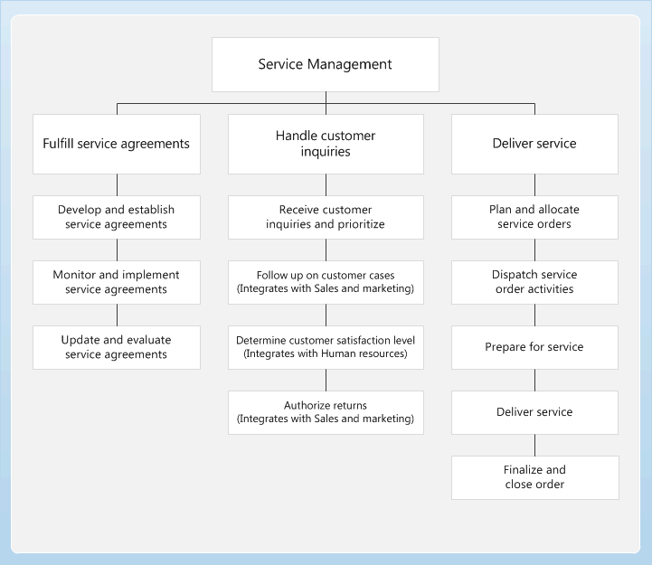

# Service management overview

[!include [banner](../includes/banner.md)]

Use the Service management module to establish service agreements and service subscriptions, handle service orders and customer inquiries, and to manage and analyze the delivery of services to customers. You can use service agreements to define the resources that are used in a typical service visit. You can also use service agreements to view how those resources are invoiced to the customer. A service agreement can also include a service level agreement that specifies standard response times, and offers tools to record the actual time.

You can create service orders to manage information about scheduled and unscheduled visits by a service technician to a customer site. Service orders include information such as:

- The number hours required to complete the task
- The type of service or repair
- The item to repair, including details about the symptoms and diagnosis
- Any expenses and fees related to the service or repair

You can receive, process, and dispatch service requests. After you create a service order, you can use service stages to monitor progress and specify rules that control what actions are enabled in each stage. When a service order is complete, you can sign off on the order to confirm that it's complete, and then post the order to start the invoice process.

Use the reporting tools to monitor service order margins and subscription transactions, and print work descriptions and work receipts.

## Business processes

The following diagram illustrates the high level business processes for the Service management module, and shows where service processes integrate with other modules.

## Service management at a glance

| Important tasks | Primary pages | Popular reports |
|--|--|--|
| Fulfill service agreements | Service agreements | Service order margin |
| Handle customer inquiries | Service orders | Work description |
|  | Dispatch board | Transaction – subscription |
|  |  | Subscription fee transactions |

## Integration of Service management

Service management can be integrated with the following modules:

- [Sales and marketing overview](../sales-marketing/overview-sales-marketing.md)
- [Human resources](/dynamics365/unified-operations/talent/index)

[!INCLUDE[footer-include](../../includes/footer-banner.md)]