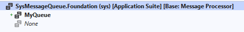
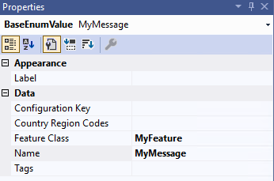
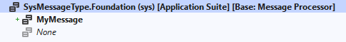
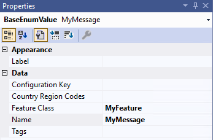

# Create and process custom message queues and message types

[!include [banner](../includes/banner.md)]

The message processor is a framework for processing messages that represent events. It has the following properties:

- It processes messages in the correct order. (Dependent messages are processed in sequence.)
- It's scalable. (Independent messages can be processed in parallel.)
- It uses the required system resources.
- It avoids exhaustion of system resources if a spike in messages occurs.
- It's reliable.
- It's traceable.

You might use this framework, for example, to develop and manage custom integration with external systems, and to process other custom functionality. Microsoft Dynamics 365 Supply Chain Management includes two features that use predefined message types and message queues: [third-party manufacturing execution system (MES) integration](../production-control/mes-integration.md) and [deferred posting](../production-control/deferred-posting.md).

This article describes how to design your own custom message queues and message types by using Visual Studio, and how to monitor and control the processing of all message types (including the predefined message types) by using the **Message processor messages** page.

## <a name="message-processor-page"></a>Message processor messages page

Use the **Message processor messages** page to view the list of incoming messages, view the message log, manually process messages, and troubleshoot issues.

### Open the Message processor messages page

To view the list of messages that have been processed by the message processor, go to **System administration \> Message processor \> Message processor messages**.

### Grid columns and filters on the Message processor messages page

You can use the fields at the top of the **Message processor messages** page to find specific messages that you're looking for. Most of these filters match the column headings in the message grid. The following filters and column headings are available:

- **Message type** – The type of message.
- **Message queue** – The name of the queue that the message will be processed in. The following queues are provided:

    - *Manufacturing Execution 3rd Party* – This queue holds messages that are created as part of the *Manufacturing execution system integration* feature. These messages are also listed on the **Manufacturing execution systems integration** page, which is like the **Message processor messages** page but is focused exclusively on that feature. For more information, see [Integrate with third-party manufacturing execution systems](../production-control/mes-integration.md).
    - *Production* – This queue holds messages that are created as part of the *Make finished goods physically available before posting to journals* feature. These messages are also listed on the **Deferred production order posting** page, which is like the **Message processor messages** page but is focused exclusively on that feature. For more information, see [Make finished goods physically available before posting to journals](../production-control/deferred-posting.md).
    - *Warehouse*  – This queue holds messages that are created for warehouse management, such as to post a sales packing slip when the last shipment container is closed as part of a [manual packing process](../warehousing/packing-containers.md). (This message has a message type of *Run packing slip for container*.)
    - *Dynamics 365 Sales Integration* – This queue holds messages that integrate with Dynamics 365 Sales. For more information about this feature and the messages that it might add to this queue, see [Work with added efficiency in quote-to-cash with Dynamics 365 Sales](../../fin-ops-core/dev-itpro/data-entities/dual-write/add-efficiency-in-quote-to-cash-use.md).
    - *\<Custom queues\>* – If your system has been customized to support additional types of queues, they'll also be listed here. For more information about how to add custom queues, see [Implement a new queue](#custom-queue).

- **Message state** – The state of the message. The following states exist:

    - *Queued* – The message is ready to be processed by the message processor.
    - *Processed* – The message was successfully processed by the message processor.
    - *Canceled* – The message was canceled by a user.
    - *Failed* – The message failed to be processed.

- **Message content** – This filter does a full-text search of message content. (Message content isn't shown in the grid.) The filter treats most special symbols (such as hyphens) as spaces, and it treats all space characters as Boolean OR operators. For example, if you search for a specific `journalid` value that equals *USMF-123456*, the system will find all messages that contain either "USMF" or "123456," and the list is likely to be long. Therefore, it's better to enter just *123456* in this case, because more specific results will be returned.

### View the message log, message content, and details

To view detailed information about a message, select it in the grid, and then select the **Log** or **Message content** tab under the message grid, where each processing event is shown.

The text on the **Message content** tab depends on the **Message type** value. Therefore, the text length will vary. A typical message content text will start with an opening brace (**{**) and end with a closing brace (**}**). In between will be field names (for example, `journalId`), each of which is followed by a colon and a value (for example, *USMF-123456*).

The toolbar on the **Log** tab includes the following buttons:

- **Log** – Select this button to show the processing results. This function is especially helpful when messages have a **Processing result** value of *Failed*, and you want to understand the reasons for the processing failure.
- **Bundle** – Multiple message processing operations can run as part of the same batch process. Select this button to view the detailed data. For example, you can see whether dependencies exist that require the system to process some messages in a specific sequence.

### Manually process, cancel, or requeue a message

Depending on the current state of a message, you can manually process or cancel it as you require. Select the message in the grid, and then select **Process** or **Cancel** on the Action Pane.

If you want to requeue a message that was previously canceled, select it in the grid, and then select **queue** on the Action Pane. The system will process the message as usual.

## <a name="processor-batch-job"></a>Schedule message processing by using the message processor batch job

To process a message queue, you must set up a batch job to run it. Usually you'll set up a fixed, regular schedule for processing each queue. However, you can also run any queue on demand. To create and schedule the required batch jobs, follow these steps.

1. Go to **System administration \> Message processor \> Message processor**.
1. In the **Message processor** dialog box, in the **Message queue** field, select the message queue that's associated with the messages that you want to process. The queue that you select will depend on the feature or system that generated the messages.
1. On the **Run in the background** FastTab, set up batch and scheduling options as you require, just as you would do for [other types of jobs](../../fin-ops-core/dev-itpro/sysadmin/batch-processing-overview.md) in Supply Chain Management.
1. Select **OK** to run or schedule the job based on your settings.

## Message processor queue setup

You can configure the number of processor tasks that should be dedicated to each message processor queue. Unconfigured queues will use a default value that you can override as you require. Follow these steps to customize one or more queues.

1. Go to **System administration \> Message processor \> Message queue setup**.
1. Follow one of these steps:

    - To edit an existing queue, select **Edit** on the Action Pane, and then select the target queue in the grid.
    - To add a new configuration, select **Add** on the Action Pane to add a new row to the grid. Then, in the **Message queue** field for the new row, select the name of the queue that you want to configure.

1. For the new or selected row, set the **Number of processor tasks** field to the number of processor tasks that should be dedicated to the specified queue. The maximum value is *8*. The minimum value depends on the minimum number of batch threads that are configured for your system (typically *2*).
1. On the Action Pane, select **Save**.

## <a name="business-events"></a>Set up business events to deliver alerts for failed processing results

You can inquire about failed messages by filtering on the *Failed* (or possibly *Canceled*) value for the **Message state** field, as described earlier in this article. In addition, you can set up [business events](../../fin-ops-core/dev-itpro/business-events/home-page.md) to alert you about failed processing results. To complete this setup, activate the *Message processor message processed* business event on the **Business events catalog** page (**System administration \> Setup \> Business events \> Business events catalog**). As part of the activation process, you'll be directed to specify whether the event is specific to one legal entity or all legal entities. You'll also be directed to provide an endpoint name, which must be defined in advance.

> [!NOTE]
> If **When a Business Event occurs** is set to *Microsoft Power Automate* (instead of *HTTPS*, for example), the endpoint name will automatically be created in Supply Chain Management, based on the *Microsoft Power Automate* setup.

## Power Automate example

In this example, **When a Business Event occurs** is set to *Microsoft Power Automate* to send email notifications that containing Action center (formerly Infolog) messages and hyperlinks that open the **Message processor messages** page for a specific failed message. As you require, you can add extra logic to send the notifications in parallel via different channels and control the recipients based on the event data.

1. In [Power Automate](https://preview.flow.microsoft.com), create an automated cloud flow for the **When a Business Event occurs - Fin & Ops App (Dynamics 365)** flow trigger, followed by the **Parse JSON** and **Send an email** steps.

    :::image type="content" source="media/message-processor-power-automate-example1.png" alt-text="Power Automate automated cloud flow.":::

1. In the **When a Business Event occurs** step, you can look up or enter values in the **Instance** and **Category** fields, and then set the **Business event** field to *Message processor message processed*.

    :::image type="content" source="media/message-processor-power-automate-example2.png" alt-text="Power Automate When a Business Event occurs step.":::

1. In the **Parse JSON** step, in the **Schema** field, enter a schema that defines the extended fields. You can use the **Download schema** option on the **Business events catalog** page in Supply Chain Management, or you can start by pasting in the following example schema text.

    ```json
    {
        "properties": {
            "BusinessEventId": {
                "type": "string"
            },
            "ControlNumber": {
                "type": "integer"
            },
            "EventId": {
                "type": "string"
            },
            "EventTime": {
                "type": "string"
            },
            "MajorVersion": {
                "type": "integer"
            },
            "MessageContent": {
                "type": "string"
            },
            "MessageDestinationCompanyId": {
                "type": "string"
            },
            "MessageDestinationOperationalSiteId": {
                "type": "string"
            },
            "MessageDestinationWarehouseId": {
                "type": "string"
            },
            "MessageDestinationWorkloadName": {
                "type": "string"
            },
            "MessageInfolog": {
                "type": "string"
            },
            "MessageProcessingResult": {
                "type": "string"
            },
            "MessageProcessingResultLabel": {
                "type": "string"
            },
            "MessageProcessorMessagePageUrl": {
                "type": "string"
            },
            "MessageQueue": {
                "type": "string"
            },
            "MessageQueueLabel": {
                "type": "string"
            },
            "MessageSourceCompanyId": {
                "type": "string"
            },
            "MessageSourceOperationalSiteId": {
                "type": "string"
            },
            "MessageSourceWarehouseId": {
                "type": "string"
            },
            "MessageSourceWorkloadName": {
                "type": "string"
            },
            "MessageState": {
                "type": "string"
            },
            "MessageStateLabel": {
                "type": "string"
            },
            "MessageType": {
                "type": "string"
            },
            "MessageTypeLabel": {
                "type": "string"
            },
            "MinorVersion": {
                "type": "integer"
            }
        },
        "type": "object"
    }
    ```

    :::image type="content" source="media/message-processor-power-automate-example3.png" alt-text="Power Automate Parse JSON step.":::

1. In the **Send an email** step, you can select the individual fields, or you can start by pasting the following example email body into the **Body** field.

    ```plaintext
    Message queue: @{body('Parse_JSON')?['MessageQueue']}
    Message queue label: @{body('Parse_JSON')?['MessageQueueLabel']}
    Message type: @{body('Parse_JSON')?['MessageQueueType']}
    Message type label: @{body('Parse_JSON')?['MessageQueueTypeLabel']}
    Message content: @{body('Parse_JSON')?['MessageContent']}
    Message state: @{body('Parse_JSON')?['MessageState']}
    Message state label: @{body('Parse_JSON')?['MessageStateLabel']}
    Message processing result: @{body('Parse_JSON')?['MessageProcessingResult']}
    Message processing result label: @{body('Parse_JSON')?['MessageProcessingResultLabel']}
    Message infolog: @{body('Parse_JSON')?['MessageInfolog']}
    Message source company ID: @{body('Parse_JSON')?['MessageSourceCompanyId']}
    Message source workload name: @{body('Parse_JSON')?['MessageSourceWorkloadName']}
    Message source site ID: @{body('Parse_JSON')?['MessageSourceOperationalSiteId']}
    Message source warehouse ID: @{body('Parse_JSON')?['MessageSourceWarehouseId']}
    Message destination company ID: @{body('Parse_JSON')?['MessageDestinationCompanyId']}
    Message destination workload name: @{body('Parse_JSON')?['MessageDestinationWorkloadName']}
    Message destination site ID: @{body('Parse_JSON')?['MessageDestinationOperationalSiteId']}
    Message destination warehouse ID: @{body('Parse_JSON')?['MessageDestinationWarehouseId']}
    Message processor message page URL: @{body('Parse_JSON')?['MessageProcessorMessagePageUrl']}
    ```

    :::image type="content" source="media/message-processor-power-automate-example4.png" alt-text="Power Automate send an email step.":::

When you save the business event, it's automatically activated and is ready to be used as part of Supply Chain Management.

## Scheduler

The message processor has one scheduler. The `SysMessageKeyDateTimeSequenceProcessorScheduler` class schedules messages that have dependencies that are based on a key, date, and time, so that the messages are processed in the correct order. Messages that must be processed are stored in the `SysMessageProcessorTaskBundle` and `SysMessageProcessorTaskBundleMessage` tables. Dependent messages must be in the same bundle.

The `SysMessageKeyDateTimeSequenceProcessorScheduler` class is used by the [third-party MES integration](../production-control/mes-integration.md) feature to secure messages that are related to a production order, and that are processed in the order that they're received or created in. The dependencies are defined by a key (production order number) and the time.

For example, the system receives or creates the following messages:

- Production order 1 – Start message
- Production order 2 – Start message
- Production order 2 – Report as finished message
- Production order 1 – Report as finished message

In this case, the `SysMessageKeyDateTimeSequenceProcessorScheduler` class will schedule the processing of messages in the following order:

1. Production order 1 – Start message
1. Production order 1 – Report as finished message
1. Production order 2 – Start message
1. Production order 2 – Report as finished message

Each report-as-finished message depends on the successful processing of the related start message.

Because a bottleneck can occur when records are picked up for processing for multiple tasks, and because there might be dependencies between the messages, the system bundles the messages. For example, if the bundle size is 2, the system will create the following bundles:

- Bundle 1 - Production order 1 – Start message
- Bundle 1 - Production order 1 – Report as finished message
- Bundle 2 - Production order 2 – Start message
- Bundle 2 - Production order 2 – Report as finished message

For scalability, when you develop a new queue, you can configure the number of tasks that should process the bundles. (For more information, see [Implement a new queue](#custom-queue).) If the configuration uses two message processor tasks, the two bundles can be processed in parallel.

## Implementation examples

This section provides examples that show how to develop new message queues and message types that can be used with the message processor.

### <a name="custom-queue"></a>Implement a new queue

This example shows how to add a new queue. After the queue is created, you'll be able to submit messages to it. Those messages will then be processed by the message processor according to the settings that were described earlier.

1. In Visual Studio, create an extension for the `SysMessageQueue` enum.
1. Add a new enum value for the new queue.

    

1. Set a feature class on the enum value.

    

1. Create a class that extends `SysMessageQueueMetadata`, as shown in the following example.

    ```xpp
    [SysMessageQueueFactory(SysMessageQueue::MyQueue)]
    public final class MyQueue extends SysMessageQueueMetadata
    {
    
        /// <summary>
        /// Gets the default number of message processor tasks.
        /// </summary>
        /// <returns>The default number of message processor tasks.</returns>
        public SysMessageProcessorsTasks getDefaultMessageProcessorsTasks()
        {
            return 1;
        }
    
        /// <summary>
        /// Get the maximum number of messages in a bundle.
        /// </summary>
        /// <returns>The maximum number of messages in a bundle.</returns>
        public SysMessageProcessorMaxBundleSize getMaxBundleSize()
        {
            return 10;
        }
    
        /// <summary>
        /// Determines if messages should be queued when sending or processing messages.
        /// </summary>
        /// <returns>true if messages should be queued when sending a message; otherwise false.</returns>
        public boolean queueMessageOnSend()
        {
            return true;
        }
    
        /// <summary>
        /// Determines if dependent messages should be committed per created transaction ID.
        /// </summary>
        /// <returns>true if dependent messages should be committed per created transaction ID.; otherwise false.</returns>
        public boolean commitPerCreatedTransactionID()
        {
            return false;
        }
    
    }
    ```

1. Create an extension for the `SysMessageProcessorToggle` class to enable the message processor in the user interface (UI).

    ```xpp
    [ExtensionOf(classStr(SysMessageProcessorToggle))]
    final class MySysMessageProcessorToggle_Extension
    {
        /// <summary>
        /// Determines if the toggle is enabled.
        /// </summary>
        /// <returns>
        /// true if the toggle is enabled; otherwise, false.
        /// </returns>
        internal boolean isEnabled()
        {
            return next isEnabled() || MyFeature::instance().isEnabled();
        }
    
    }
    ```

### Implement a new message type

This example shows how to create a message type for each type of process that you want to make available to the message processor. The message type establishes which processes can be run by messages of that type. The name of the message type will be shown on the **Message processor messages** page to identify the purpose of each message in the queue.

Follow these steps to create a new message type.

1. In Visual Studio, create an extension for the `SysMessageType` enum.
1. Add a new enum value for the new message type.

    

1. Set a feature class on the enum value.

    

1. Create a class that extends `SysMessageTypeMetadata`, as shown in the following example.

    ```xpp
    [SysMessageTypeFactory(SysMessageType::MyMessage)]
    public final class MyMessage extends SysMessageTypeMetadata
    {
        /// <summary>
        /// Validates if it is allowed to send a message on a given queue.
        /// </summary>
        /// <param name = "_messageQueue">A queue to send message to.</param>
        /// <param name = "_messageTarget">A message target.</param>
        /// <param name = "_sourceMessageTarget">A message source.</param>
        /// <returns>true if it is allowed to send a message; false, otherwise.</returns>
        public boolean canSendMessage(SysMessageQueue _messageQueue, SysMessageTargetRecId _messageTarget, SysMessageTargetRecId _sourceMessageTarget)
        {
            if (_messageQueue == SysMessageQueue::MyQueue)
            {
                return true;
            }
    
            return false;
        }
    
        /// <summary>
        /// Returns a list of allowed message state transitions.
        /// </summary>
        /// <returns>A list of allowed message state transitions.</returns>
        public Enumerator getAllowedMessageStateTransitions()
        {
            // Allow the following state transitions:
    
            // SysMessageState::None -> SysMessageState::Queued
            // SysMessageState::None -> SysMessageState::Processed
    
            // SysMessageState::Queued -> SysMessageState::Processed
    
            // SysMessageState::Failed -> SysMessageState::Queued
            // SysMessageState::Failed -> SysMessageState::Cancelled
            // SysMessageState::Failed -> SysMessageState::Processed
    
            return SysMessageStateTransition::getProcessedCancelledStateTransitions();
        }
    
        /// <summary>
        /// Returns dependencies related to a message.
        /// </summary>
        /// <param name = "_message">The message to add dependencies to.</param>
        /// <returns>A list of dependencies related to a message.</returns>
        public List getDependencies(SysMessage _message)
        {
            List dependencies = new List(Types::Record);
    
            // Add a dependency to the message if you need to process messages in order. 
            // For example, process a start message before an end message. 
            // The message will not be processed before the dependent message is processed or cancelled.
    
            // The default scheduler, SysMessageKeyDateTimeSequenceProcessorScheduler only supports one dependency per message.
            // Messages with different keys may be processed in parallel.
    
            SysMessageDependencyKey dependencyKey = strFmt('Mykey:%1', this.getContract(_message).parmMyKey());
            dependencies.addEnd(SysMessageKeyDateTimeSequenceDependency::create(dependencyKey));
    
            return dependencies;
        }
    
        /// <summary>
        /// Execute the logic associated with the given message state transition.
        /// </summary>
        /// <param name = "_message">The message.</param>
        /// <param name = "_messageStateTransition">The state transition to execute.</param>
        public void processMessageStateTransition(SysMessage _message, SysMessageStateTransition _messageStateTransition)
        {
            if (_messageStateTransition.isEqual(SysMessageStateTransition::newFromStates(SysMessageState::Queued, SysMessageState::Processed)))
            {
                this.processMessage(_message);
            }
            else if (_messageStateTransition.isEqual(SysMessageStateTransition::newFromStates(SysMessageState::Failed, SysMessageState::Processed)))
            {
                this.cancelMessage(_message);
            }
        }
    
        private void processMessage(SysMessage _message)
        {
            // Add logic to process the message.
        }
    
        private void cancelMessage(SysMessage _message)
        {
            // Add logic to cancel the message if needed.
        }
    
        private ClassId contractClass()
        {
            return classNum(MyContract);
        }
    
        protected MyContract getContract(SysMessage _message, ClassId _objectTypeId = this.contractClass())
        {
            var contract = FormJsonSerializer::deserializeObject(_objectTypeId, _message.Content) as MyContract;
    
            return contract;
        }
    
    }
    ```
