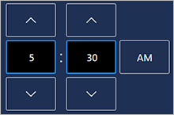
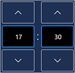

# Customize the production floor execution interface

[!include [banner](../../finance/includes/banner.md)]

Developers can extend current forms or create their own forms and buttons for the production floor execution interface. After you've added the code for these new elements, admins or shop floor managers can easily add them to the interface by using the standard configuration controls.

For example, here are some of the possible solutions if new columns are needed in a main form:

- Extend the `JmgProductionFloorExecutionMainGrid` form, and add the desired fields.
- Create a new form, and add it as a new main view (tab).

## Add a new button (action)

To add a new button (action), follow these steps to create a class that implements your custom action.

1. Create a new class that is named `<ExtensionPrefix>_JmgProductionFloorExecution<ActionName>Action`, where:

    - `<ExtensionPrefix>` uniquely identifies your solution, typically by using your company name.
    - `<ActionName>` is a unique name for the class. It typically identifies the kind of action.

1. The new class must extend the `JmgProductionFloorExecutionAction` class.
1. Override all necessary methods.

For examples, look at the code for the following classes:

- `JmgProductionFloorExecutionBreakAction` – A class for a simple action that doesn't need any records.
- `JmgProductionFloorExecutionReportFeedbackAction` – A class that provides more complex functionality.

When you've finished, the new button (action) will automatically be listed on the **Design tabs** page in Microsoft Dynamics 365 Supply Chain Management. There, you (or an admin or floor manager) can easily add it to the primary or secondary toolbar, just as you can add the standard buttons. For instructions, see [Design the production floor execution interface](../production-control/production-floor-execution-tabs.md).

## Add a new main view

1. Create a new form that has the desired elements and functionality. Note that this form is a new form, not an extension. Name the form `<ExtensionPrefix>_JmgProductionFloorExecution<FormName>`, where:

    - `<ExtensionPrefix>` uniquely identifies your solution, typically by using your company name.
    - `<FormName>` is a unique name for the form.

1. Create a menu item that is named `<ExtensionPrefix>_JmgProductionFloorExecution<FormName>`.
1. Create an extension that is named `<ExtensionPrefix>_JmgProductionFloorExecution<FormName>_Extension`, where the `getMainMenuItemsList` method is extended by adding the new menu item to the list. The following code shows an example.

    ```xpp
    [ExtensionOf(classStr(JmgProductionFloorExecutionMenuItemProvider))]
    public final class <ExtensionPrefix>_JmgProductionFloorExecutionForm<FormName>_Extension{
        static public List getMainMenuItemsList()
        {
            List menuItemList = next getMainMenuItemsList();
            menuItemList.addEnd(menuItemDisplayStr(<ExtensionPrefix>_JmgProductionFloorExecutionForm<FormName>));
            return menuItemList;
        }
    ```

When you've finished, the new main view will automatically be listed in the **Main view** combo box on the **Design tabs** page in Supply Chain Management. There, you (or an admin or floor manager) can easily add it to new or existing tabs, just as you can add the standard main views. For instructions, see [Design the production floor execution interface](../production-control/production-floor-execution-tabs.md).

## Add a details view

1. Create a new form that has the desired elements and functionality. Note that this form is new, not an extension. Name the form `<ExtensionPrefix>_JmgProductionFloorExecution<FormName>Detail`, where: 

    - `<ExtensionPrefix>` uniquely identifies your solution, typically by using your company name.
    - `<FormName>` is a unique name for the form.

1. Create a menu item that is named `<ExtensionPrefix>_JmgProductionFloorExecution<FormName>Detail`.
1. Create an extension that is named `<ExtensionPrefix>_JmgProductionFloorExecution<FormName>_Extension`, where the `getDetailsMenuItemList` method is extended by adding the new menu item to the list.

When you've finished, the new details view will automatically be listed in the **Details view** combo box on the **Design tabs** page in Supply Chain Management. There, you (or an admin or floor manager) can easily add it to new or existing tabs, just as you can add the standard details views. For instructions, see [Design the production floor execution interface](../production-control/production-floor-execution-tabs.md).

## Add a numeric keypad to a form or dialog

The following example shows how to add numeric keypads to a form.

1. The number of numeric keypad controllers that each form contains must equal the number of numeric keypads in that form.

    ```xpp
    private JmgProductionFloorExecutionNumpadController   numpadController1;
    private JmgProductionFloorExecutionNumpadController   numpadController2;
    private JmgProductionFloorExecutionNumpadController   numpadController3;
    ```

1. Set up the behavior of each numeric keypad controller, and connect each numeric keypad controller to a numeric keypad form part.

    ```xpp
    /// <summary>
    /// Initializes all numpad controllers, defines their behavior and connects them with numpad form parts.
    /// </summary>
    public void initializeNumpadController()
    {
        numpadController1 = new JmgProductionFloorExecutionNumpadController();
        numpadController1.getValueFromNumpadDelegate += eventhandler(this.setQuanityValueFromNumpad_1);
        QuantityNumpad1.getPartFormRun().setNumpadController(numpadController1);
    
        numpadController2 = new JmgProductionFloorExecutionNumpadController();
        numpadController2.parmNumpadEnabled(false);
        numpadController2.parmNumpadValue(333.56);
        numpadController2.getValueFromNumpadDelegate += eventhandler(this.setQuanityValueFromNumpad_2);
        QuantityNumpad2.getPartFormRun().setNumpadController(numpadController2);
    }
    ```

## Use a numeric keypad as a pop-up dialog

The following example shows one way to set up a numeric keypad controller for a pop-up dialog.

```xpp
private void setupNumpadController()
{
    numpadController = new JmgProductionFloorExecutionNumpadController();
    numpadController.parmShouldNumpadShowOkCancelButtons(true);
    numpadController.setNumpadValueToParentFormDelegate += eventhandler(this.setQtyValueFromNumpad);
}
```

The following example shows one way to call the numeric keypad pop-up dialog.

```xpp
Args args = new Args();
args.name(formstr(JmgProductionFloorExecutionNumpad));
args.menuItemName(menuItemDisplayStr(JmgProductionFloorExecutionNumpad));
args.caller(element);
Object formRun = classfactory.formRunClass(args);
formRun.init();
formRun.setNumpadController(numpadController);
numpadController.setValueToNumpad(333.56);
formRun.run();
```

## Add a date and time controls to a form or dialog

This section shows how to add date and time controls to a form or dialog. The touch-friendly date and time controls enable workers to specify dates and times. The following screenshots show how the controls typically appear on the page. The time control provides both 12-hour and 24-hour versions; the version shown will follow the preference set for the user account under which the interface is running.






The following procedure shows an example of how to add date and time controls to a form.

1. Add a controller to the form for each date and time control that the form should contain. (The number of controllers must equal the number of date and time controls in the form.)

    ```xpp
    private JmgProductionFloorExecutionDateTimeController  dateFromController; 
    private JmgProductionFloorExecutionDateTimeController  dateToController; 
    private JmgProductionFloorExecutionDateTimeController  timeFromController; 
    private JmgProductionFloorExecutionDateTimeController  timeToController;
    ```

1. Declare the required variables (of type `utcdatetime`).

    ```xpp
    private utcdatetime fromDateTime;
    private utcdatetime toDateTime;
    ```

1. Create methods where the datetime will be updated by the datetime controllers. The following example shows one such method.

    ```xpp
    private void setFromDateTime(utcdatetime _value)
        {
            fromDateTime = _value;
        }
    ```

1. Set up the behavior of each datetime controller and connect each controller to a form part. The following example shows how to set up data for date-from and time-from controls. You could add similar code for date-to and time-to controls (not shown).

    ```xpp
    /// <summary>
    /// Initializes all date and time controllers, defines their behavior, and connects them with the form parts.
    /// </summary>
    private void initializeDateControlControllers()
    {
        dateFromController = new JmgProductionFloorExecutionDateTimeController();
        dateFromController.setDateControlValueToCallerFormDelegate += eventhandler(this.setFromDateTime);
        dateFromController.parmDateTimeValue(fromDateTime);
    
        timeFromController = new JmgProductionFloorExecutionDateTimeController();
        timeFromController.setDateControlValueToCallerFormDelegate += eventhandler(this.setFromDateTime);
        timeFromController.parmDateTimeValue(fromDateTime);
        
        DateFromFormPart.getPartFormRun().setDateControlController(dateFromController, timeFromController);
        TimeFromFormPart.getPartFormRun().setTimeControlController(timeFromController, dateFromController);
        
        ...

    }
    ```

    If all you need is a date control, you can skip the time control setup and instead just set up the date control as shown in the following example:

    ```xpp
    {
        dateFromController = new JmgProductionFloorExecutionDateTimeController();
        dateFromController.setDateControlValueToCallerFormDelegate += eventhandler(this.setFromDateTime);
        dateFromController.parmDateTimeValue(fromDateTime);
    
        DateFromFormPart.getPartFormRun().setDateControlController(dateFromController, null);
    }
    ```

## Related information

- [Style the production floor execution interface](../production-control/production-floor-execution-styles.md)
- [Design the production floor execution interface](../production-control/production-floor-execution-tabs.md)
