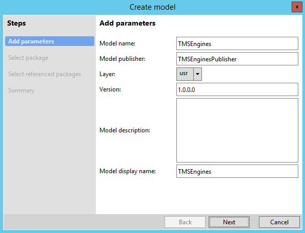
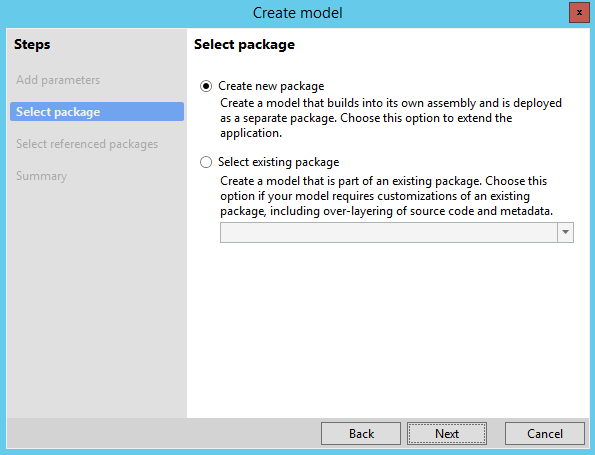
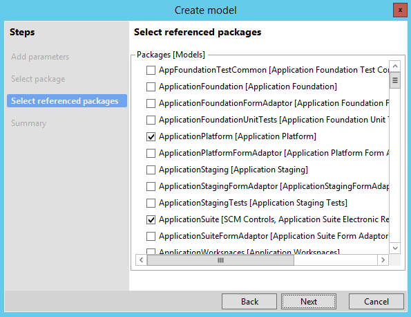
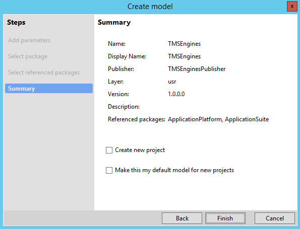
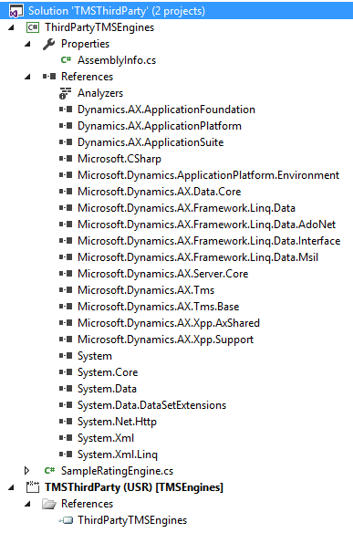
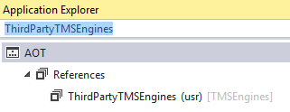
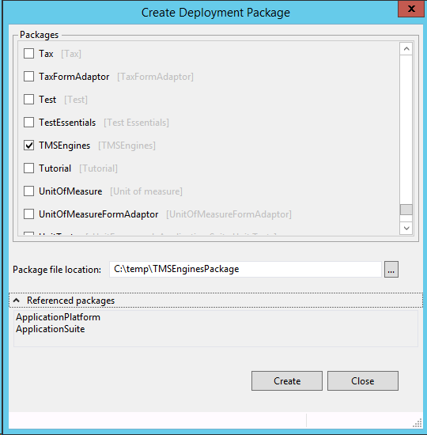
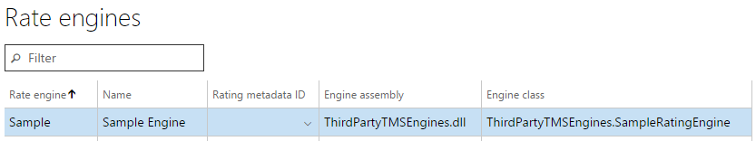
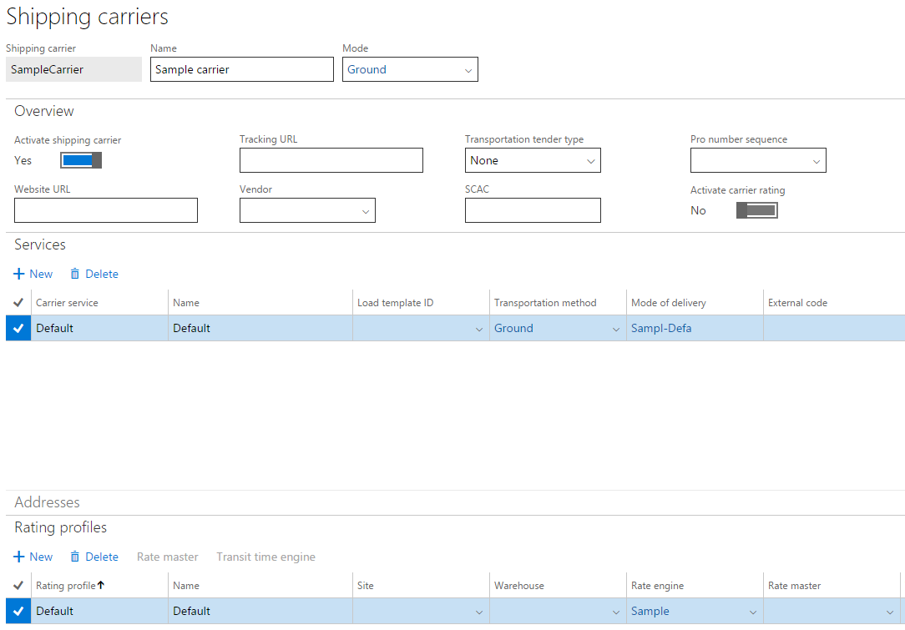
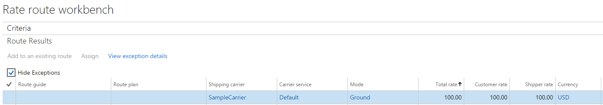

---
# required metadata

title: Create a new transportation management engine
description: This article describes how to create a new transportation management engine in Dynamics 365 Supply Chain Management. 
author: Weijiesa
ms.date: 06/20/2017
ms.topic: article
ms.prod: 
ms.technology: 

# optional metadata

ms.search.form: TMSGenericEngine, TMSRateEngine, TMSMileageEngine, TMSEngineParameters
# ROBOTS: 
audience: Application User, Developer, IT Pro
# ms.devlang: 
ms.reviewer: kamaybac
# ms.tgt_pltfrm: 
ms.assetid: 0473acef-755e-4b42-acf5-5e5aa902dc0e
ms.search.region: Global
# ms.search.industry: 
ms.author: weijiesa
ms.search.validFrom: 2016-02-28
ms.dyn365.ops.version: AX 7.0.0

---

# Create a new transportation management engine

[!include [banner](../includes/banner.md)]

This article describes how to create a new transportation management engine in Dynamics 365 Supply Chain Management. 

Transportation management (TMS) engines define the logic that is used to generate and process transportation rates in Transportation management. Supply Chain Management provides several different engine types that calculate different parameters, such as rates, transit times, and the number of zones that will be crossed during transit. This article explains how to use the Microsoft Visual Studio development environment together with Supply Chain Management development tools to create and deploy a new TMS engine, and then how to set up the engine in Operations. For more information about the engines, see [Transportation management engines](transportation-management-engines.md).

## Create a new TMS engine

This section explains how to create a class library that has a TMS engine implementation, and how to reference it from a Supply Chain Management model.

1. To deploy your new engines, you must have a model that will contain the engines. On the **Dynamics 365** &gt; **Model Management** menu, click **Create model** to create a new model. On the first page of the **Create model** wizard, name the model **TMSEngines**. 

   [](./media/012.png)

2. On the next page, select **Create new package**. 

   [](./media/021.png)

3. On the next page, select the **ApplicationSuite** model to reference. (The **ApplicationPlatform** model is preselected.) 

   [](./media/032.png)

4. On the next page, click **Finish** to confirm the creation of a new model. 

   [](./media/042.png)

5. In a new solution, create a new Supply Chain Management project, and name it **TMSThirdParty**. In the project properties, set the project's model to **TMSEngines**.
6. Add a new C\# class library to your solution, and name it **ThirdPartyTMSEngines**.
7. In the ThirdPartyTMSEngines project, add references to Supply Chain Management–specific assemblies:
   -   Application assemblies that enable X++ types to be referenced. These assemblies can be found in the following locations. \[Packages root\] is the path of the location where all the deployed assemblies are placed, such as C:\\Packages.

        ```xpp
        [Packages root]\ApplicationPlatform\bin\Dynamics.AX.ApplicationPlatform.dll
        [Packages root]\ApplicationFoundation\bin\Dynamics.AX.ApplicationFoundation.dll
        [Packages root]\ApplicationSuite\bin\Dynamics.AX.ApplicationSuite.dll
        ```
        
   -   Framework assemblies that enable access to data, LINQ, and auxiliary functions. All these assembles can be found in \[Packages root\]\\bin.

        ```xpp 
        Microsoft.Dynamics.ApplicationPlatform.Environment.dll
        Microsoft.Dynamics.AX.Data.Core.dll
        Microsoft.Dynamics.AX.Framework.Linq.Data.AdoNet.dll
        Microsoft.Dynamics.AX.Framework.Linq.Data.dll
        Microsoft.Dynamics.AX.Framework.Linq.Data.Interface.dll
        Microsoft.Dynamics.AX.Framework.Linq.Data.Msil.dll
        Microsoft.Dynamics.AX.Server.Core.dll
        Microsoft.Dynamics.AX.Xpp.AxShared.dll
        Microsoft.Dynamics.AX.Xpp.Support.dll
        ```

   -   The core TMS assembly (which contains engines) and the TMS base assembly (which contains helpers, constants, data transfer class definitions, and so on). These assemblies can be found in the following locations.

        ```xpp
        [Packages root]\ApplicationSuite\bin\Microsoft.Dynamics.AX.Tms.dll
        [Packages root]\ApplicationSuite\bin\Microsoft.Dynamics.AX.Tms.Base.dll
        ```
8. Rename the C\# class that is automatically generated in the ThirdPartyTMSEngines project to **SampleRatingEngine**.
9. Implement the engine. Because we are creating a rate engine in this example, we inherit from the base class for rate engines. The base class implements most of the rate engine interface (**TMSFwkIRateEngine**). We just have to implement the rate method. To keep this example simple, we will make this method register a hard-coded rate of 100. You can create engines that implement any of the engine interfaces, such as **TMSFwkIAccessorialEngine**. All the engine interfaces are defined in X++.

    ```xpp
    namespace ThirdPartyTMSEngines
    {
        using Dynamics.AX.Application;
        using Microsoft.Dynamics.Ax.Tms.Base.Data;
        using Microsoft.Dynamics.Ax.Tms.Base.Utility;
        using Microsoft.Dynamics.Ax.Tms.Bll;
        using System.Xml.Linq;
        public class SampleRatingEngine : BaseRateEngine
        {
            public override RatingDto rate(TmsTransactionFacade transactionFacade, XElement shipment, TMSRateMasterCode rateMasterCode)
            {
               XElement re = shipment.RetrieveOrCreateRatingEntity(this.RatingDto);
               re.AddRate(TmsRateType.Rate, 100);
               return this.RatingDto;
            }
        }
    }
    ```

10. Build the solution.
11. Add a new reference to the TMSThirdParty project. The reference should point to the ThirdPartyTMSEngines project. When you've finished, your solution should look like this. 

    [](./media/052.png)

12. Build the solution. Verify that the new library appears in the **References** node in Application Explorer. 

    [](./media/061.png)

## Deploy the TMS engine as a package

One way to deploy third-party TMS engines is through a deployment package. This approach is recommended in a production environment. In a development environment, you can manually copy the assemblies, as described in the next section, "Set up a TMS engine in Supply Chain Management." To deploy the engine as a package, follow these steps.

1. On the **Dynamics 365** &gt; **Deploy** menu, click <strong>Create Deployment Package</strong>.
2. In the **Create Deployment Package** dialog box, select the TMSEngines model, and enter the path where you want to store your package files. 

   [](./media/071.png)

3. You can now deploy the package to the target environment. For a tutorial, see [Install a deployable package](../../fin-ops-core/dev-itpro/deployment/install-deployable-package.md).

## Set up the TMS engine in Supply Chain Management

This section explains how to set up Supply Chain Management to use a TMS engine, and shows how the new engine that we have created is used in rate shopping. The example in this section uses the USMF demo data company.

1. Create a new engine as described in the "Create a new TMS engine" section.
2. Build your solution.
3. Copy the resulting assembly into the binary location of the Supply Chain Management server, \[AOSWebRoot\]bin. **Note:** This step is relevant only in a development environment. In a production environment, you should deploy through a deployment package. For instructions, see the previous section, "Deploy the TMS engine as a package."
4. In Supply Chain Management, on the **Rate engines** page, create a new rating engine. The engine should point to the engine assembly that is produced by building the engine class library and the engine class that you implemented. 

   [](./media/081.png)

5. Create a shipping carrier that uses the Sample rate engine. Because our engine doesn't use any data, you don’t have to assign a rate master. 

   [](./media/092.png)

6. On the **Rate route workbench** page, click **Rate shop**. You should see a rate of 100.00 from SampleCarrier, as shown in the following screen shot. In this example, we are rate shopping for a route from warehouse 24 to customer US-004. However, but because the rate is hard-coded, you will always see a rate of 100.00.

   [](./media/101.png)

## Tips and tricks

- If you’re using development tools for Supply Chain Management, it's useful to add a new project to your solution. If you set this project as your startup project and start a debugging session, you can debug both X++ and C\# code in the same debugging session.
- Every time that you change and recompile your ThirdPartyTMSEngines project, you must manually copy the resulting assembly to the binary location or deploy through a deployment package. Otherwise, you might run by using a stale assembly.
- After you execute TMS-specific operations inSupply Chain Management, the Internet Information Services (IIS) worker process might lock the ThirdPartyTMSEngines assembly so that the assembly can’t be updated. In this case, restart the w3svc process.

### Whitepaper

For more information, download the following white paper (written to support AX2012, but still applies for Dynamics 365 Supply Chain Management)

- [Implementing and deploying Transportation management engines](https://download.microsoft.com/download/b/5/f/b5ff8fef-3918-4c1d-92d5-b67eb0971684/ImplementingAndDeployingTransportationManagementEnginesInAX.pdf)


[!INCLUDE[footer-include](../../includes/footer-banner.md)]