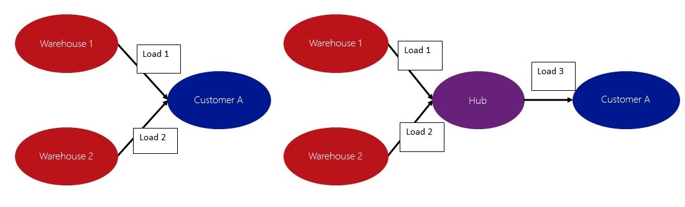

---
# required metadata

title: Plan loads using hub consolidation overview
description: This article describes the feature for consolidating shipments in a hub when you deliver goods from different warehouses to the same customer, or when you receive goods from multiple vendors in the same warehouse.
author: Weijiesa
ms.date: 07/25/2019
ms.topic: overview
ms.prod: 
ms.technology: 

# optional metadata

ms.search.form: WHSLoadPlanningWorkbench, WHSHistory, WHSLoadTable, WHSLoadPlanningListPage, TMSParameters
# ROBOTS: 
audience: Application User
# ms.devlang: 
ms.reviewer: kamaybac
# ms.tgt_pltfrm: 
ms.collection: get-started
ms.assetid: d27b0926-a534-4caf-a2a3-acbc7c440bca
ms.search.region: Global
ms.search.industry: Distribution
ms.author: weijiesa
ms.search.validFrom: 2016-02-28
ms.dyn365.ops.version: AX 7.0.0

---

# Plan loads using hub consolidation overview

[!include [banner](../includes/banner.md)]

This article describes the feature for consolidating shipments in a hub when you deliver goods from different warehouses to the same customer, or when you receive goods from multiple vendors in the same warehouse.

It can be useful to consolidate shipments in a hub when you deliver goods from different warehouses to the same customer, or when goods are delivered from multiple vendors to the same warehouse.

## Building loads
Before you can use hub consolidation, you must enable the **In transit planning** option on the **Transportation management parameters** page. You must also create the hubs where consolidation will occur. The following diagram shows an example of hub consolidation. In this case, sales orders from different warehouses are going to the same customer. The basic loads are created based on sales orders in the usual way, by using the **Load planning workbench** page. To consolidate the two loads in a hub before they are delivered to the customer, on the **Load planning workbench** page, in the **Transportation** field, select **Hub consolidation**. When you select the correct hub for each load, the loads will have the hub as the “drop off” destination. You will also have two “transportation request lines” in the **Supply and Demand** section on the **Load planning workbench** page. You can then add these two lines to a new load. This new load will have both sales order lines, and will also have the hub as the “pick up” address and customer A as the “drop off” destination. The three loads are then ready to be rated and routed like any other load. You can select whatever shipping carrier the system suggests for each load.  You can also use the same method to consolidate loads for multiple transfer orders. In this case, customer A in the preceding diagram is a warehouse. Alternatively, you can consolidate loads for multiple purchase orders, where the loads are delivered from different vendors to the same warehouse. You can have more than one consolidation hub, and can consolidate in multiple hubs for more loads that come from different warehouses. After you build your basic loads and use the hub consolidation option, you build the new loads by using the consolidated transportation request lines. You then rate and route your loads.

[!INCLUDE[footer-include](../../includes/footer-banner.md)]