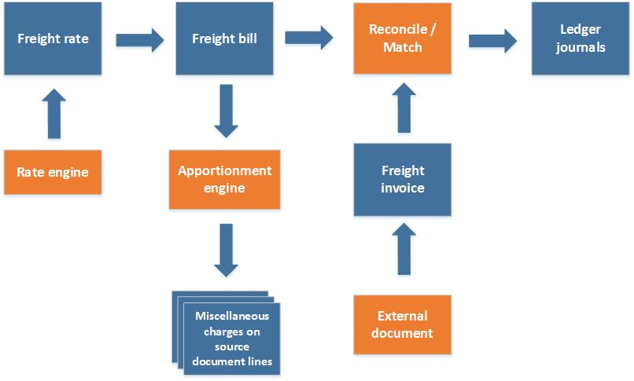
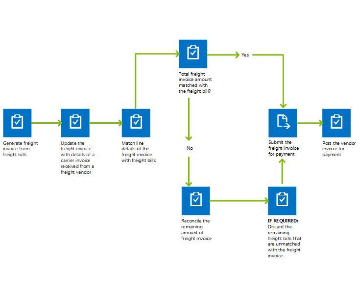

---
# required metadata

title: Reconcile freight in transportation management
description: This article describes the freight reconciliation process.
author: Weijiesa
ms.date: 06/20/2017
ms.topic: article
ms.prod: 
ms.technology: 

# optional metadata
ms.search.form: TMSAuditMaster, TMSFreightBillInvoiceReconcile, TMSFreightBillSummary, TMSFreightBillType, TMSFreightMatchReason, TMSFBDetailReconcile, TMSInvoiceTable,TMSInvoiceLineReconcile,TMSReconcileInvoice, TMSFreightBillDetail, TMSFreightBillTypeAssignment, TMSRejectInvoiceLine, TMSMiscellaneousCharge
# ROBOTS: 
audience: Application User
# ms.devlang: 
ms.reviewer: kamaybac
# ms.tgt_pltfrm: 
ms.assetid: bc34a9b1-0c11-4797-b463-25409cf98ca8
ms.search.region: Global
ms.search.industry: Distribution
ms.author: weijiesa
ms.search.validFrom: 2016-02-28
ms.dyn365.ops.version: AX 7.0.0

---

# Reconcile freight in transportation management

[!include [banner](../includes/banner.md)]

This article describes the freight reconciliation process.

Freight reconciliation can be done manually, or it can be set up to occur automatically. To use automatic freight reconciliation, you must set up an audit master where you can define criteria that determine which freight bills are matched automatically.

## The freight reconciliation process

Freight rates are calculated by the rate engine that is associated with the relevant shipping carrier. When a load is confirmed, a freight bill is generated, and the freight rates are transferred to it. The freight rates are apportioned as miscellaneous charges to the relevant source document (purchase order, sales order, and/or transfer order), depending on the setup that is used for the regular billing process. The freight reconciliation process (which is also known as the matching process) can start as soon as the freight invoice arrives from the shipping carrier. The invoice can be received electronically or on paper. If the invoice is received on paper, you can generate an electronic invoice by using the freight bill as a template.

## Manual reconciliation

If you're reconciling freight manually, you must match each invoice line with the freight bill line or lines for the load that is being invoiced. You do this matching on the **Freight bill and invoice matching** page. If the amount on the invoice line doesn’t match the freight bill amount, you must select a reconciliation reason for the difference. If there are multiple reasons for reconciliation, you can split the unmatched amount across them. The reconciliation reason determines how the difference amounts are posted in the general ledger. When the reconciliation of the whole invoice amount is accounted for, it's submitted for approval, and then the journal is posted. The following illustration shows how to generate a freight invoice and do freight reconciliation.

## Automatic reconciliation

To use automatic reconciliation, you must specify the schedule for reconciliation, and the invoices and shipping carriers to use. The matching of the invoice lines and freight bills is done according to the setup of the audit master and freight bill type. After you run the automatic reconciliation, you must handle any invoices that the system can't match. You must then process these invoices manually before you can post all the invoices for payment.

## Match freight bills with freight invoices using automatic or manual reconciliation

*Matching* is the process of finding the freight bills that correspond to each freight invoice. This can be done by matching the invoice lines one-by-one (manual matching), or by matching all available invoices at once (auto matching).

### Auto matching

When matching multiple freight invoices to the same freight bill, the process for auto matching works as follows:

1. All freight invoices not matched are sorted by amount, with largest amount first.
1. The freight invoices are matched one-by-one, until the freight bill has no positive amount remaining.
1. Depending on the setup of the audit master and the remaining amount on the freight invoices, the remaining amount is set.

### Manual matching

All freight bills with positive amounts will be available for matching. Similar to auto matching, the user will only be able to match freight invoices with negative amounts to freight bills not fully matched.

### Example

Suppose that you have a freight bill (FB) for an amount of 1500 and you have created three freight invoices for the freight bill with one invoice line for each invoice with following settings:

- Original freight bill (FB): Amount 1500
- Invoice 1 (Inv1): Amount 1000
- Invoice 2 (Inv2): Amount 600
- Invoice 3 (Inv3): Amount -100

#### Automatic matching result

Auto matching will execute in following order:

1. Sort all freight invoices descending by amount: Inv1 -> Inv2 -> Inv3.
1. Match Inv1 with FB. Inv1 has 1000 matched and FB has 500 amount remaining, so the status is set to *Partially matched*.
1. Match Inv2 with FB. Inv2 has 500 matched and FB has 0 remaining, so the status is set to *Fully matched*.
1. Because FB is now fully matched, Inv3 won't be processed.

#### Manual matching result

For manual matching, the results vary depending on the order of the matching, as illustrated in the following example cases.

##### Manual matching case 1

One way to do manual matching for this example is to proceed as follows:

1. Match FB with Inv1. FB has 500 amount remaining, so the status set to *Partially matched*.
1. Match Inv2 with FB. Inv2 has 500 matched and FB has 0 remaining, so the status is set to *Fully matched*.
1. When manually matching Inv3, you won't find any unmatched freight bills.

This case is essentially the same as auto matching

##### Manual matching case 2

Another way to do manual matching for this example is to proceed as follows:

1. Match Inv3 with FB. Now FB has amount remaining 1600, which is the same as subtracting negative 100 on top of 1500. Both FB and Inv3 have a matched quantity of -100.
1. Match Inv1 and Inv 2 with FB one after another. FB is fully matched.

As this example shows, matching freight invoices with negative amounts should only be done manually. This will ensure that it is always possible to match the freight invoices with negative amounts to a freight bill not fully matched because that enables you to control the matching sequence.

[!INCLUDE[footer-include](../../includes/footer-banner.md)]