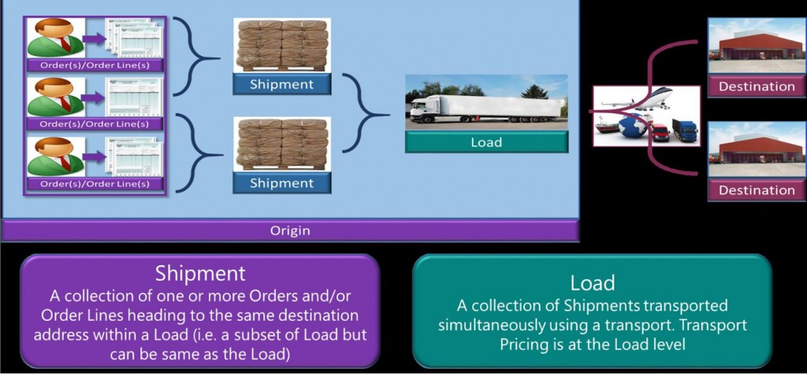

# Transportation management overview

[!include [banner](../includes/banner.md)]

This article gives an overview of the transportation management functionality in Supply Chain Management.

Transportation management lets you use your company’s transportation, and also lets you identify vendor and routing solutions for inbound and outbound orders. For example, you can identify the fastest route or the least expensive rate for a shipment. The following table describes the main scenarios for using Transportation management.

<table>
<colgroup>
<col width="50%" />
<col width="50%" />
</colgroup>
<thead>
<tr class="header">
<th>Scenario</th>
<th>How Transportation management can help</th>
</tr>
</thead>
<tbody>
<tr class="odd">
<td>Use external logistics providers for transportation activities.</td>
<td>Use Transportation management for inbound and/or outbound transportation.</td>
</tr>
<tr class="even">
<td>The company's own fleet is available for delivery/pickup, and delivery charges are passed on to customers.</td>
<td>For the outbound processes, you can use Transportation management to determine the transportation charges and pass them on to customers. However, the carrier invoice reconciliation process isn't required.</td>
</tr>
<tr class="odd">
<td>The company's own fleet is available for delivery/pickup, but delivery charges aren't passed on to customers, because product prices include transportation.</td>
<td>Many of the settings and features of Transportation management aren't required. However, you can use Transportation management to determine the transportation rates and adjust the sales price accordingly.</td>
</tr>
<tr class="even">
<td>Logistics service is provided by another legal entity in the same company.</td>
<td><ul>
<li>You can use Transportation management by treating the other legal entity like any other shipping carrier. You can't automate the economic transactions between legal entities. Therefore, you must handle these transactions manually (for example, by creating a purchase order).</li>
<li>In the legal entity that provides the logistics services, Transportation management can be used to determine transportation rates.</li>
</ul></td>
</tr>
</tbody>
</table>

## Planning transportation in Supply Chain Management

In Transportation management, transportation planning can be based either on orders or on the shipments that are created based on those orders. The shipments always exist at some point in time but aren't required for transportation planning. Transfer orders are part of the outbound scenario and can be planned together with sales orders.

## Inbound transportation

When you order items from a vendor, and the items must be delivered to your warehouse, you might want to arrange the transport of the items yourself. You can use Supply Chain Management to plan the transportation and receipt of the inbound load. The following illustration shows the business process flow for planning transportation for an inbound load.

## Outbound transportation

You can plan and process an outbound load to ship specific items from a company’s warehouse to a customer. You can use Supply Chain Management to plan the transportation and shipping of an outbound load. The following illustration shows the business process flow for planning and processing outbound loads for shipping. 

## Load building

Supply Chain Management provides a load building strategy that is named the Volume-based load building strategy. This strategy lets you use the maximum values that are specified for height and weight in the load template, or you can override the settings by entering new values. To use this strategy, select it in the **Load building strategy** field on the **Setup** FastTab on the **Load building workbench** page. In addition, you can add your own load-building strategies by creating a new class in the Application Object Tree (AOT).

[!INCLUDE[footer-include](../../includes/footer-banner.md)]
