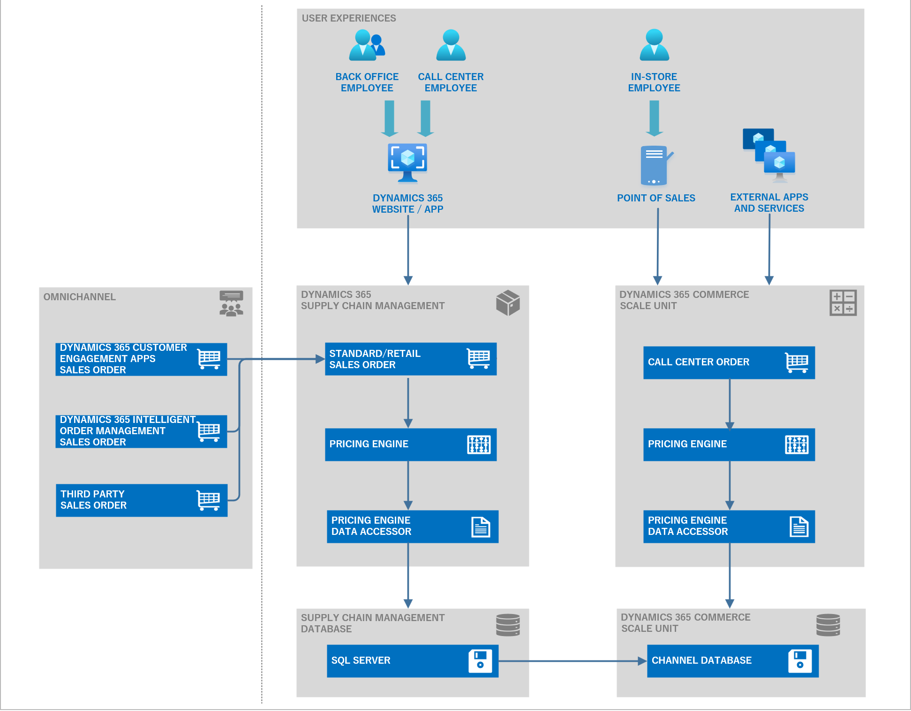

# Unified pricing management module overview (preview)

[!include [banner](../includes/banner.md)]
[!INCLUDE [preview-banner](~/../shared-content/shared/preview-includes/preview-banner.md)]
<!-- KFM: Preview until further notice -->

This article provides an overview of the Unified pricing management module for Microsoft Dynamics 365 Supply Chain Management.

For a video overview of the Unified pricing management module, see [Pricing Management Overview in Dynamics 365 Supply Chain Management - TechTalk](https://www.youtube.com/watch?v=Pc9nBoHN5m0).

Increasingly, traditional business-to-business (B2B) companies are considering converting to omnichannel sales and selling directly to customers, so that they can gain more control over pricing and margins. The omnichannel transformation causes massive changes to pricing models and rules. Unified pricing management helps B2B companies that are converting to omnichannel pricing by enabling attribute-based pricing rules that use attributes and data from customers, products, and order segments.

Here are some of the main challenges:

- **Pricing silos** – There's a lack of transparency across channels, and centralized pricing management is lacking.
- **Pricing relevancy** – All pricing factors must be considered when B2B and business-to-consumer (B2C) pricing rules are defined.
- **Pricing complexity** – There can be difficulties converting to B2B and B2C pricing logic without validation.
- **Real-time execution** – Omnichannel customer experience requires a real-time pricing calculation response.

Supply Chain Management uses the [Commerce Scale Unit (CSU) Core](../../commerce/dev-itpro/CSU-core.md) to help traditional B2B companies embrace omnichannel pricing. The CSU Core function provides the following capabilities:

- Offer, manage, and calculate pricing, and provide transparent pricing across channels. This capability is essential for aligning pricing strategies across multiple channels.
- Quickly determine prices while you also consider a range of commercial aspects, such as general base prices, sales trade agreements, long-term discount agreements, short-term promotion discounts, and retrospective rebate calculations for each sales order.
- Create pricing data models that are based on price attributes. Price attributes can be based on categorized product pricing differentiators, customer groups, and order types.
- Manage complex price structures by using price component breakdowns, and define margin component price adjustments on top of item base prices. When you create an order, the pricing details can provide a list of price component breakdowns for future in-depth analysis.
- Easily manage sophisticated pricing rules when you convert from B2B pricing to B2B and B2C pricing that considers discount concurrency, bundle sales, mandatory sales items, and bonus free item pricing rules.
- Simulate prices, and show detailed price calculations.
- Use enhanced discount budget controls to help avoid margin leakage from fund consumption.
- Use the [CSU-based pricing API](../../commerce/pricing-apis.md) for Dynamics 365 Commerce to enable pricing calculations to be retrieved by a native Commerce point of sale (POS) system and/or consumed by external applications to support different pricing scenarios.

[!INCLUDE [preview-note](~/../shared-content/shared/preview-includes/preview-note-d365.md)]

## Pricing components

Unified pricing management applies the following key elements to determine pricing:

- **Price attributes** – Price attributes give you a flexible way to define your pricing factors. They use information about customers, products, sales order headers, and sales order lines. Because price attributes work with the customer and product attribute framework, they're highly configurable. Extension points are available so that you can extend them.
- **Price component codes** – Price component codes group together price attributes. They represent the building blocks of your price structure. When you create a price and discount rule record, you'll also assign that record to a price component code.
- **Price structures** – Price structures help you understand the sequence of your price component codes. You can use one price structure for each company, or you can use a different price structure for each order attribute in a company. Price determination logic that's embedded in the price structure ensures that the base price can be determined. The base price is the price before any price adjustments are made (*Base price* + *Price adjustment* = *Selling price*).
- **Concurrency modes** – Concurrency modes control how the final price is calculated in situations where multiple pricing rules are associated with the same price component code.

The following illustration shows many of the elements that affect Unified pricing management price calculations.

## Architecture overview

The following illustration shows the architecture of the Unified pricing management module.

> [!NOTE]
> You can create and maintain the pricing rules in Supply Chain Management.
>
> Omnichannel orders can come from a range of front-end ordering systems.
>
> For orders that are created in Supply Chain Management, through integration, or through [dual-write](../../fin-ops-core/dev-itpro/data-entities/dual-write/dual-write-overview.md) (such as orders from Dynamics 365 customer engagement apps or Dynamics 365 Intelligent Order Management), the pricing engine can provide calculated pricing and pricing details for each sales order.
>
> For orders that are created in a native Dynamics 365 Commerce POS or a third-party system, calculated prices can be retrieved via the [CSU-based pricing API](../../commerce/pricing-apis.md).

## Next steps

- [Price attributes overview](upm-price-attributes-overview.md)
- [Price structure overview](upm-price-structure-overview.md)
- [Vendor list price and price adjustments overview](upm-vendor-list-price.md)
- [Sales trade agreement prices](upm-sales-trade-agreement-prices.md)
- [Pricing rules for discounts and margin price adjustments](upm-margin-discount-pricing-rules.md)
