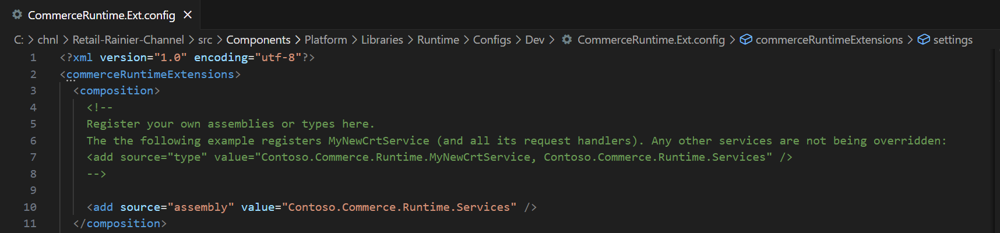
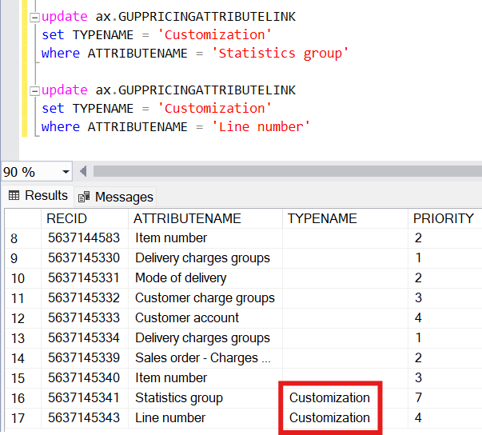
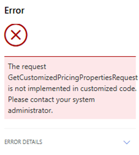
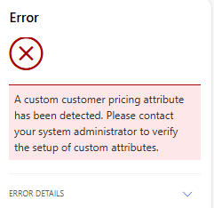
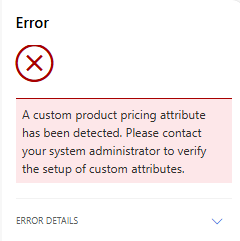
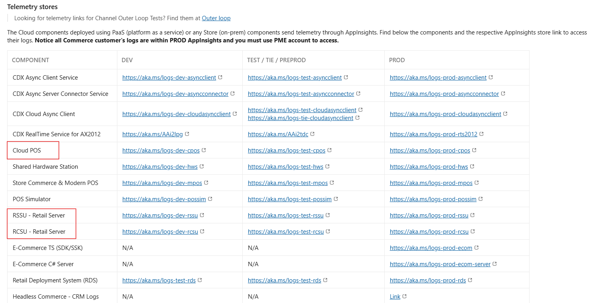

# Support custom pricing attributes in POS

From version 10.0.45, customers are empowered to configure pricing rules based on custom Product, Customer, SalesLine, and SalesTable pricing attributes.

We introduced GetCustomizedPricingPropertiesRequest and GetCustomizedPricingPropertiesResponse, and allow the customer to implement their own custom request handler to develop their logic.

Custom attributes are marked in GUPPRICINGATTRIBUTELINK using a specific identifier, indicating that they require special logic in Commerce Scale Unit (CSU) to be supported in POS.
To mark a pricing attribute as custom, its GUPPRICINGATTRIBUTELINK.TypeName column must be set to 'Customization' always.

In CSU logic, if a custom pricing attribute is validated as GUPPRICINGATTRIBUTELINK.TypeName = 'Customization', then the custom request handler is called.


## First steps

1. Implement custom request handler to process custom pricing attributes. 

    Sample custom request handler: [GetCustomizedPricingPropertiesRequestHandler-Sample.md](media/GetCustomizedPricingPropertiesRequestHandler-Sample.md)

2. Register the output library in the CommerceRuntime.Ext.config file.

    Sample custom request handler registration (if output library were 'Contoso.Commerce.Runtime.Services'):

    [](media/commerce-runtime.png#lightbox)

4. Enable the CSU flight UPSupportCustomPricingAttributesFlight.


## How to support custom Product, Customer, SalesTable, and SalesLine pricing attributes

1. In AppSuite repo, create new custom pricing attributes according to: [How to add a new pricing attribute](https://eng.ms/docs/cloud-ai-platform/business-and-industry-copilot/bic-bis-ai-erp-smb/aierp-finance/d365-finance-application-core-services/dynamics-365-ai-erp/domainknowledge/scm/pricingmanagement/howto/howtoaddanewpricingattribute).
    
    - A new class needs to be added for each new custom pricing attribute. 

    - Example for header-level custom pricing attribute (Customer):

    ```
    /// <summary>
    /// PricingAttribute of table <c>CustTable</c> field StatisticsGroup.
    /// </summary>
    [GUPPricingMetadataDiscovery][GUPPricingAttributeSourceDiscovery(GUPPricingAttributeSource::Customer, GUPPricingAttributeSourceLevel::Header)]
    [GUPPricingAttributeFieldsDiscovery(fieldStr(CustTable, StatisticsGroup))]
    internal class GUPPricingAttributeCustTableStatisticsGroup extends GUPPricingAttributeCustTable implements GUPIPricingAttribute
    {
        private Name typeName = 'Customization';
        
        public anytype getValueOfAttribute(Common _pricingObject)
        {
            return this.getTableRecord(_pricingObject).StatisticsGroup;
        }
    
        public str getName()
        {
            return this.getNameFromField();
        }
    
        public AttributeDataType getDataType()
        {
            return AttributeDataType::Text;
        }
    
        public Name getAttributeType()
        {
            return this.typeName;
        }
    
    }
    ```
    
    - Example for line-level custom pricing attribute (SalesLine):

    ```
    /// <summary>
    /// PricingAttribute of table <c>SalesLine</c> field LineNum.
    /// </summary>
    [GUPPricingMetadataDiscovery][GUPPricingAttributeSourceDiscovery(GUPPricingAttributeSource::SalesLine, GUPPricingAttributeSourceLevel::Line)]
    [GUPPricingAttributeFieldsDiscovery(fieldStr(SalesLine, LineNum))]
    internal final class GUPPricingAttributeSalesLineLineNum extends GUPPricingAttributeSalesLine implements GUPIPricingAttribute
    {
        private Name typeName = 'Customization';
    
        public anytype getValueOfAttribute(Common _pricingObject)
        {
            return this.getTableRecord(_pricingObject).LineNum;
        }
    
        public str getName()
        {
            return this.getNameFromField();
        }
    
        public AttributeDataType getDataType()
        {
            return AttributeDataType::Integer;
        }
    
        public FieldId getField()
        {
            return fieldNum(SalesLine, LineNum);
        }
    
        public Name getAttributeType()
        {
            return this.typeName;
        }
    
    }
    ```

2. For **new** custom pricing attributes, the customer should  programmatically set the TypeName column on the GUPPRICINGATTRIBUTELINK table to 'Customization'.
    - In AppSuite repo,  create an extension to [GUPPricingAttributeRepository.xml](https://msdyneng.visualstudio.com/FinOps/_git/ApplicationSuite?path=/Source/Metadata/GlobalUnifiedPricing/GlobalUnifiedPricing/AxClass/GUPPricingAttributeRepository.xml&version=GBmaster&line=271&lineEnd=271&lineStartColumn=45&lineEndColumn=65&lineStyle=plain&_a=contents) and add a statement to the toPriceAttributeLink() method that programmatically sets the TypeName column for each new custom pricing attribute.

    - Example of creating such an extension:

    ```
    [ExtensionOf(classStr(GUPPricingAttributeRepository))]
    public static final class GUPPricingAttributeRepository_Extension
    {
        public static GUPPricingAttributeLink toPriceAttributeLink(GUPIPricingAttribute _pricingAttr)
        {
            GUPPricingAttributeLink link = next toPriceAttributeLink(_pricingAttr);
    
            if (link.AttributeName == "StatisticsGroup")
            {
                link.TypeName = (_pricingAttr as GUPPricingAttributeCustTableStatisticsGroup).getAttributeType();
            }
    
            return link;
        }
    
    }
    ```

3. Build the relevant models (GUP or extension), restart Internet Information Services (IIS) and clear the cache. 

    - Example link to clear cache: 
        - https://usnconeboxax1aos.cloud.onebox.dynamics.com/?cmp=usrt&mi=SysClassRunner&cls=SysFlushAOD 


4. In FnO UI, navigate to Price attribute groups form and add custom pricing attributes to the corresponding Price attribute group.

5. Run the 1210 (Pricing management) job and sync changes to Channel database.

6. For **existing** custom pricing attributes, manually set the TypeName column on the GUPPRICINGATTRIBUTELINK table to 'Customization' in SSMS.
    
    Example of setting 'Customization' identifier:

    ```
    update dbo.GUPPRICINGATTRIBUTELINK
    set TYPENAME = 'Customization'
    where ATTRIBUTENAME = 'Custom attribute name'
    ```

   [](media/ssms-customization.png#lightbox)

8. For Customer or Product, create a trade agreement journal that tests the new custom pricing attribute. For SalesTable or SalesLine, create an auto charge that tests the new custom pricing attribute. In both cases, make sure to set a specific value. 

9. Run the 9999 (full sync) and sync to Channel database.

10. In POS, we should see the value configured in trade agreement journal  or auto charge get correctly applied.


---

## Troubleshooting


### If user receives a POS notification that a custom request handler is not implemented

[](media/request-handler-custom.png#lightbox)


1. Verify that a custom request handler is implemented and included in the build.

2. Ensure that the custom request handler is correctly registered in the CommerceRuntime.Ext.config file. Keep in mind that this registration can be overwritten during the build process, so it is important for the customer to confirm the registration after build completion.


### If user receives a POS notification that custom pricing attributes are detected among out-of-box attributes

[](media/custom-customer-attribute.png#lightbox) [](media/custom-product-attribute.png#lightbox)


1. Verify that the CSU flight UPSupportCustomPricingAttributesFlight is enabled.

2. Confirm that the new custom pricing attributes are identified as custom. The GUPPRICINGATTRIBUTELINK.TypeName column should be set to 'Customization' for all custom pricing attributes.


## Further troubleshooting

1. It is possible to find more details on errors or exceptions in our AzureDataExplorer dashboards.

    - Useful dashboards (Must access with PME account):
        - CSU logs: https://dataexplorer.azure.com/dashboards/db50f9f4-9a19-4a4c-9993-17e0861444d1
        - POS logs: https://dataexplorer.azure.com/dashboards/8ad7df1a-a343-459b-beeb-5f4cafabe91c
        - Drill MPOS - CPOS - CSU - RSSU sessions logs: https://dataexplorer.azure.com/dashboards/32491967-1eff-4b22-b161-f4bb8db6e550

2. Given the app session id, user session id, or activity id, it is possible to trace AppInsights. (AppInsights PROD stores all Commerce customer logs.)

    Troubleshooting through telemetry wiki: https://msazure.visualstudio.com/D365/_wiki/wikis/D365.wiki/9342/Troubleshooting-Through-Telemetry


   [](media/telemetry-troubleshooting.png#lightbox)
    

    - Starting query template for CSU logs:

    ```
    traces
    | where customDimensions.UserSessionId == "UserSessionId"
    ```

    ```
    traces
    | where customDimensions.AppSessionId == "AppSessionId"
    ```

    ```
    traces
    | where customDimensions.ActivityId == "ActivityId"
    ```

    - Example of locating full database error in CSU logs:
    
        [](media/retail-server-logs.png#lightbox)
