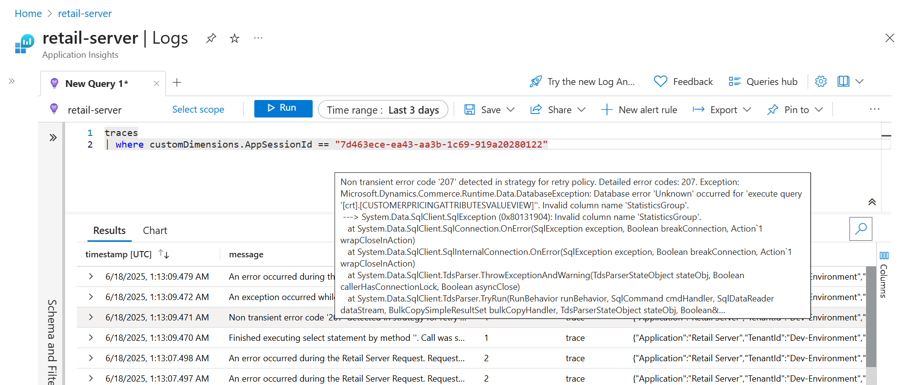

# Add custom pricing attributes for Commerce Point of Sale (POS)

Unified pricing management lets you configure pricing rules that can also consider values of custom pricing attributes for products, customers, sales-lines, and sales-tables. It provides the following two components <!-- KFM: is it correct to call these "methods"? --> that you can use to implement your own custom request handler and develop your logic: `GetCustomizedPricingPropertiesRequest` and `GetCustomizedPricingPropertiesResponse`.

Custom attributes are marked in the `GUPPRICINGATTRIBUTELINK` table <!-- KFM: What kind of a thing is `GUPPRICINGATTRIBUTELINK`. A table? Where do we find this? -->using a specific identifier, which indicates that they require special logic in Commerce Scale Unit (CSU) to be supported in POS. To mark a pricing attribute as custom, the `GUPPRICINGATTRIBUTELINK.TypeName` column must be set to `Customization`.

In CSU logic, if a custom pricing attribute is validated as `GUPPRICINGATTRIBUTELINK.TypeName = 'Customization'`, then the system calls the custom request handler.

## Prerequisites

To use the features described in this article, you must be running version 10.0.45 or later of your Microsoft finance and operations apps.

## First steps

<!-- KFM: Introduction is needed here. Explain what we are we about to do and why. -->

1. Implement a custom request handler to process custom pricing attributes. For an example, see [Example custom request handler code](upm-custom-request-handler-example.md)

1. Register the output library in the `CommerceRuntime.Ext.config` file. Here's an example of a custom request handler registration (if the output library were `Contoso.Commerce.Runtime.Services`).

    :::image type="content" source="media/commerce-runtime.png" alt-text="Custom request handler registration." lightbox="media/commerce-runtime.png"::: <!-- KFM: We should provide this as text instead of an image. -->

1. Build the solution and deploy it to your Commerce Scale Unit (CSU).

## How to add your custom pricing attributes

<!-- KFM: Introduction is needed here. Explain what we are we about to do and why. -->

1. In AppSuite repo <!-- KFM: What is this? Where do I find it? -->, create new custom pricing attributes according to: [How to add a new pricing attribute](https://eng.ms/docs/cloud-ai-platform/business-and-industry-copilot/bic-bis-ai-erp-smb/aierp-finance/d365-finance-application-core-services/dynamics-365-ai-erp/domainknowledge/scm/pricingmanagement/howto/howtoaddanewpricingattribute). <!-- KFM: This link requires a VPN; I think it's internal (not public). Our customers won't be able to open it. Do we have public link for this info? --> You must add a new class for each custom pricing attribute you want to add.

    - Here's an example of code that creates a header-level custom pricing attribute (for `Customer`): <!-- KFM: What is the text in parentheses? A table name? Should we say "for" or maybe "in"? Also,what language is this example? -->

        ```text
        /// <summary>
        /// PricingAttribute of table <c>CustTable</c> field StatisticsGroup.
        /// </summary>
        [GUPPricingMetadataDiscovery][GUPPricingAttributeSourceDiscovery(GUPPricingAttributeSource::Customer, GUPPricingAttributeSourceLevel::Header)]
        [GUPPricingAttributeFieldsDiscovery(fieldStr(CustTable, StatisticsGroup))]
        internal class GUPPricingAttributeCustTableStatisticsGroup extends GUPPricingAttributeCustTable implements GUPIPricingAttribute
        {
            private Name typeName = 'Customization';
            
            public anytype getValueOfAttribute(Common _pricingObject)
            {
                return this.getTableRecord(_pricingObject).StatisticsGroup;
            }
        
            public str getName()
            {
                return this.getNameFromField();
            }
        
            public AttributeDataType getDataType()
            {
                return AttributeDataType::Text;
            }
        
            public Name getAttributeType()
            {
                return this.typeName;
            }
        
        }
        ```

    - Here's an example of code that creates a line-level custom pricing attribute (for `SalesLine`): <!-- KFM: What is the text in parentheses? A table name? Should we say "for" or maybe "in"? Also,what language is this example? -->

        ```text
        /// <summary>
        /// PricingAttribute of table <c>SalesLine</c> field LineNum.
        /// </summary>
        [GUPPricingMetadataDiscovery][GUPPricingAttributeSourceDiscovery(GUPPricingAttributeSource::SalesLine, GUPPricingAttributeSourceLevel::Line)]
        [GUPPricingAttributeFieldsDiscovery(fieldStr(SalesLine, LineNum))]
        internal final class GUPPricingAttributeSalesLineLineNum extends GUPPricingAttributeSalesLine implements GUPIPricingAttribute
        {
            private Name typeName = 'Customization';
        
            public anytype getValueOfAttribute(Common _pricingObject)
            {
                return this.getTableRecord(_pricingObject).LineNum;
            }
        
            public str getName()
            {
                return this.getNameFromField();
            }
        
            public AttributeDataType getDataType()
            {
                return AttributeDataType::Integer;
            }
        
            public FieldId getField()
            {
                return fieldNum(SalesLine, LineNum);
            }
        
            public Name getAttributeType()
            {
                return this.typeName;
            }
        
        }
        ```

1. For **new** <!-- KFM: How much of this procedure applies just for **new** groups? Just this step, or everything up to the step where we mention **existing** groups? --> custom pricing attributes, you must programmatically set the `TypeName` column of the `GUPPRICINGATTRIBUTELINK` table to `Customization`. In AppSuite repo,  create an extension to [GUPPricingAttributeRepository.xml](https://msdyneng.visualstudio.com/FinOps/_git/ApplicationSuite?path=/Source/Metadata/GlobalUnifiedPricing/GlobalUnifiedPricing/AxClass/GUPPricingAttributeRepository.xml&version=GBmaster&line=271&lineEnd=271&lineStartColumn=45&lineEndColumn=65&lineStyle=plain&_a=contents) <!-- KFM: Will customers be able to open this link? --> and add a statement to the `toPriceAttributeLink()` method that programmatically sets the `TypeName` column for each new custom pricing attribute. Here's an example of how to do this: <!-- what language is this example? -->

    ```text
    [ExtensionOf(classStr(GUPPricingAttributeRepository))]
    public static final class GUPPricingAttributeRepository_Extension
    {
        public static GUPPricingAttributeLink toPriceAttributeLink(GUPIPricingAttribute _pricingAttr)
        {
            GUPPricingAttributeLink link = next toPriceAttributeLink(_pricingAttr);
    
            if (link.AttributeName == "StatisticsGroup")
            {
                link.TypeName = (_pricingAttr as GUPPricingAttributeCustTableStatisticsGroup).getAttributeType();
            }
    
            return link;
        }
    
    }
    ```

1. Build the relevant models, Global Unified Pricing (GUP) or extension, and restart Internet Information Services (IIS). Then, clear the cache using a URL such as `<https://usnconeboxax1aos.cloud.onebox.dynamics.com/?cmp=usrt&mi=SysClassRunner&cls=SysFlushAOD>`. <!-- KFM: Can we give a more generic URL for this? We maybe shouldn't expose our internal server names. -->

1. Sign in to your Microsoft finance and operations app and go to **Pricing management** \> **Setup** \> **Price attribute groups** \> **Price attribute groups**. Select the price attribute group that you want to customize and then use the **Attributes** FastTab to add your custom pricing attributes to it. Update each group as needed.

1. Run the 1210 (Pricing management) job and sync changes to Channel database. <!-- KFM: I'm not familiar with any of this. More detail and instructions are probably needed. How/where do we do this? What is the "Channel database"? -->

1. For **existing** custom pricing attributes, manually set the `TypeName` column of the `GUPPRICINGATTRIBUTELINK` table to `Customization` in SQL Server Management Studio (SSMS). Here's an example of how to set the `Customization` identifier: <!-- KFM: What coding language is this?. -->

    ```text
    update dbo.GUPPRICINGATTRIBUTELINK
    set TYPENAME = 'Customization'
    where ATTRIBUTENAME = 'Custom attribute name'
    ```

    <!-- KFM: We should add some text here that introduces this image. What are we showing here? I think maybe we don't need this image anyway. -->

    :::image type="content" source="media/ssms-customization.png" alt-text="SSMS customization." lightbox="media/ssms-customization.png":::

1. For `Customer` or `Product`, create a trade agreement journal that tests the new custom pricing attribute. For `SalesTable` or `SalesLine`, create an auto charge that tests the new custom pricing attribute. In both cases, make sure to set a specific value.

1. Run the 9999 (full sync) job and sync to Channel database. <!-- KFM: I'm not familiar with any of this. More detail and instructions are probably needed. How/where do we do this? What is the "Channel database"? -->

1. In POS, you should see the value configured in the trade agreement journal or that an auto charge was correctly applied.

## Troubleshooting

### You receive a POS notification that a custom request handler isn't implemented

<!-- KFM: It would be better to provide this error message as text instead of a screenshot. Many users copy/paste error messages into Google, so a text version of the error enabled Google to find this page. Also, introduce the error message by describing where the user is and what they are trying to do when it appears. -->

:::image type="content" source="media/request-handler-custom.png" alt-text="Custom request handler." lightbox="media/request-handler-custom.png":::

1. Verify that a custom request handler is implemented and included in the build.

1. Ensure that the custom request handler is correctly registered in the `CommerceRuntime.Ext.config` file. Keep in mind that this registration can be overwritten during the build process, so it's important for you to confirm the registration after the build completes.

### You receive a POS notification that custom pricing attributes are detected among out-of-box attributes

<!-- KFM: Same comments as above; replace images with text and add an intro that describes where the user is and what they are trying to do when this message appears. -->

:::image type="content" source="media/custom-customer-attribute.png" alt-text="Custom customer attribute." lightbox="media/custom-customer-attribute.png":::

:::image type="content" source="media/custom-product-attribute.png" alt-text="Custom product attribute." lightbox="media/custom-product-attribute.png":::

1. Verify that the CSU flight `UPSupportCustomPricingAttributesFlight` is enabled.

1. Confirm that the new custom pricing attributes are identified as custom. The `GUPPRICINGATTRIBUTELINK.TypeName` column should be set to `Customization` for all custom pricing attributes.

### Further troubleshooting

1. It's possible to find more details on errors or exceptions in our AzureDataExplorer dashboards.

    - Useful dashboards (Must access with PME account): <!-- KFM: Can customers access these links? -->
        - CSU logs: <https://dataexplorer.azure.com/dashboards/db50f9f4-9a19-4a4c-9993-17e0861444d1>
        - POS logs: <https://dataexplorer.azure.com/dashboards/8ad7df1a-a343-459b-beeb-5f4cafabe91c>
        - Drill MPOS - CPOS - CSU - RSSU sessions logs: <https://dataexplorer.azure.com/dashboards/32491967-1eff-4b22-b161-f4bb8db6e550>

1. Given the app session ID, user session ID, or activity ID, it's possible to trace AppInsights. (AppInsights PROD stores all Commerce customer logs.)

    Troubleshooting through telemetry wiki: <https://msazure.visualstudio.com/D365/_wiki/wikis/D365.wiki/9342/Troubleshooting-Through-Telemetry> <!-- KFM: Can customers access this link? -->

    <!-- KFM: Introduce the following image. Explain what it is showing and what the highlights mean.  -->

    :::image type="content" source="media/telemetry-troubleshooting.png" alt-text="Telemetry troubleshooting." lightbox="media/telemetry-troubleshooting.png":::

    - Starting query template for CSU logs: <!-- KFM: What coding language do we see here? -->

        ```text
        traces
        | where customDimensions.UserSessionId == "UserSessionId"
        ```

        ```text
        traces
        | where customDimensions.AppSessionId == "AppSessionId"
        ```

        ```text
        traces
        | where customDimensions.ActivityId == "ActivityId"
        ```

    - Example of locating full database error in CSU logs: <!-- KFM: Explain a little more about what we are looking at here and what we should notice about it. Maybe we don't really need this example? -->

        [](media/retail-server-logs.png#lightbox)
