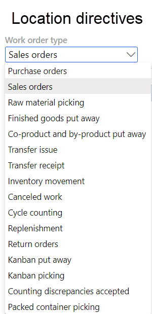

---
# required metadata

title: Work with location directives
description: This article describes how to work with location directives. Location directives are user-defined rules that help identify pick and put locations for inventory movement.
author: Mirzaab
ms.date: 09/28/2022
ms.topic: article
ms.prod: 
ms.technology: 

# optional metadata

ms.search.form: WHSLocDirTable, WHSLocDirHint, WHSLocDirTableUOM, WHSLocDirFailure
audience: Application User
# ms.devlang: 
ms.reviewer: kamaybac
# ms.tgt_pltfrm: 
# ms.custom: [used by loc for articles migrated from the wiki]
ms.search.region: Global
# ms.search.industry: [leave blank for most, retail, public sector]
ms.author: mirzaab
ms.search.validFrom: 2020-11-13
ms.dyn365.ops.version: 10.0.15
---
# Work with location directives

[!include [banner](../includes/banner.md)]

Location directives are rules that help identify pick and put locations for inventory movement. For example, in a sales order transaction, a location directive determines where the items will be picked, and where the picked items will be put. Location directives consist of a header and associated lines. They are created for specific *work order types*.

> [!NOTE]
> This article applies to features in the **Warehouse management** module. It doesn't apply to features in the [Inventory management](../inventory/inventory-home-page.md) module.

You can use location directives to perform the following tasks:

- Put away incoming items.
- Pick and stage items for outbound transactions.
- Pick and put raw materials for production.
- Replenish locations.

## Prerequisites

Before you can create a location directive, you must follow these steps to make sure that the prerequisites are in place.

1. Make sure that the required license key is turned on. Go to **System administration \> Setup \> License configuration**, expand the **Trade** license key, and then select the **Warehouse and Transportation management** configuration key. Note that admin access is required for this step.
1. Go to **Warehouse management \> Setup \> Warehouse \> Warehouses**.
1. Create a warehouse.
1. On the **Warehouse** FastTab, set the **Use warehouse management processes** option to *Yes*.
1. Create locations, location types, location profiles, and location formats. For more information, see [Configure locations in a WMS-enabled warehouse](./tasks/configure-locations-wms-enabled-warehouse.md).
1. Create sites, zones, and zone groups. For more information, see [Warehouse set up](../../commerce/channels-setup-warehouse.md) and [Configure locations in a WMS-enabled warehouse](./tasks/configure-locations-wms-enabled-warehouse.md).

## Turn the Location directive scopes feature on or off

The *Location directive scopes* feature gives you more freedom when you design location directives and helps reduce redundant configurations. It adds a **Scopes** option, which replaces the previous **Multiple SKU** option. Whereas the **Multiple SKU** option can be set only to *Yes* or *No*, the **Scopes** option provides not only those two settings (through the *Single item* and *Multiple items* values) but also two more (through the *Single item or order* and *All* values). For more information about these settings, see [Location directives FastTab](#location-directives-tab).

When it's enabled, the **Scope** option supersedes the **Multiple SKU** option and is 100-percent compatible with existing configurations.

To use this feature, it must be turned on for your system. As of Supply Chain Management version 10.0.36, the feature is mandatory and can't be turned off. If you're running a version older than 10.0.36, then admins can turn this functionality on or off by searching for the *Location directive scopes* feature in the [Feature management](../../fin-ops-core/fin-ops/get-started/feature-management/feature-management-overview.md) workspace.

## Work order types for location directives

Many of the fields that can be set for location directives are common to all work order types. However, other fields are specific to particular work order types.

> [!NOTE]
> Two work order types, *Canceled work* and *Cycle counting*, are used only by the system. Location directives can't be created for these work order types.

The tables in the following subsections list the common and worker order type–specific fields that are available when you set up a location directive.

### Fields that are common to all work order types

The following table lists the fields that are common to all work order types.

| FastTab | Field |
|---|---|
| Location directives | Work type |
| Location directives | Site |
| Location directives | Warehouse |
| Location directives | Directive code |
| Location directives | Scope *or* Multiple SKU |
| Lines | Sequence number |
| Lines | From quantity |
| Lines | To quantity |
| Lines | Unit |
| Lines | Locate quantity |
| Lines | Restrict by unit |
| Lines | Round up to unit |
| Lines | Locate packing quantity |
| Lines | Allow split |
| Location Directive Actions | Sequence number |
| Location Directive Actions | Name |
| Location Directive Actions | Fixed location usage |
| Location Directive Actions | Allow negative inventory |
| Location Directive Actions | Batch enabled |
| Location Directive Actions | Strategy |

### Fields that are specific to work order types

The following table lists the fields that are specific to particular work order types.

| FastTab | Field | Work order type |
|---|---|---|
| Location directives | Locate by | Purchase orders |
| Location directives | Applicable disposition code | Purchase orders |
| Location directives | Disposition code | Purchase orders |
| Location directives | Applicable disposition code | Finished goods put away |
| Location directives | Disposition code | Finished goods put away |
| Location directives | Applicable disposition code | Return orders |
| Location directives | Disposition code | Return orders |
| Location directives | Applicable disposition code | Kanban put away |
| Location directives | Applicable disposition code | Kanban picking |
| Lines | Immediate replenishment template | Sales orders |
| Lines | Immediate replenishment template | Raw material picking |
| Lines | Immediate replenishment template | Transfer issue |
| Lines | Immediate replenishment template | Kanban picking |

## Open the Location directives page

To open the **Location directives** page, go to **Warehouse management \> Setup \> Location directives**.

From there, you can view, create, and edit your location directives by using the commands on the Action Pane. See the remaining sections of this article for information about how to use all the fields that are available on the page.

## Action Pane

The Action Pane on the **Location directives** page contains buttons that you can use to create, edit, and delete directives (**Edit**, **New**, and **Delete**). It also contains the following buttons that let you adjust the sequence that the location directive is processed in and configure a query that defines the criteria for applying the location directive:

- **Move up** – Move the selected location directive up in the sequence. For example, you can move it from sequence number 4 to sequence number 3.
- **Move down** – Move the selected location directive down in the sequence. For example, you can move it from sequence number 4 to sequence number 5.
- **Copy** – Open a dialog box where you can create an exact copy of the current location directive.
- **Edit query** – Open a dialog box where you can define the conditions that the selected location directive should be processed under. For example, you might want it to apply only to a specific warehouse.
- **Acceptance tests** – Open a page where you can set up automated tests to determine how your location directives will behave under different starting conditions. In this way, you can quickly validate your directives as you create and maintain them. For more information, see [Test location directives with acceptance tests](location-directive-acceptance-tests.md).

## Location directives header

The location directive header includes the following fields for the sequence number and descriptive name of the location directive:

- **Sequence number** – This field indicates the sequence that the system tries to apply each location directive in for the selected work order type. Low numbers are applied first. You can change the sequence by using the **Move Up** and **Move Down** buttons on the Action Pane.
- **Name** – Enter a descriptive name for the location directive. This name should help identify the general purpose of the directive. For example, enter *Sales order picking in warehouse 24*.

## Location directives FastTab

The fields on the **Location directives** FastTab are specific to the work order type that is selected in the **Work order type** field in the list pane.

- **Work type** – Select the type of work that must be performed. The available values depend on the type of inventory transaction that you selected in the **Work order type** field. Select one of the following values:

    - **Put** – The location directive will try to find the most ideal location to put or locate inventory that comes into the system from receiving, production, or inventory adjustments. It can also be used to define the put to the stage location or the final bay door shipping location.
    - **Pick** – The location directive will try to find the most ideal locations to physically reserve inventory from (that is, create work). The pick can be completed (that is, the pick work line can be closed) even if the work isn't completed. The user can complete physical picking. In the system, that action is a pick step. The user can then cancel from the mobile device and complete the work later. However, the work header is first closed when the final put is completed.

    > [!IMPORTANT]
    > The other values in the **Work type** field aren't relevant for location directives. They appear only because the field isn't filtered to match the selected work order type.

- **Directive code** – Select the directive code to associate with a work template or replenishment template. On the **Directive code** page, you can create new codes that can be used to connect work templates or replenishment templates to location directives. Directive codes can also be used to establish a link between any work template line and a location directive (such as the bay door or stage location).

    > [!TIP]
    > If a directive code is set, the system won't search location directives by sequence number when work must be generated. Instead, it will search by directive code. In this way, you can be more specific about the location directive that is used for a particular step in a work template, such as the step for staging the materials.

- **Scope** – Use this option to specify the scenarios that the location directive will be applied to. This option replaces the **Multiple SKU** option and is available only if the *Location directive scopes* feature is turned on in your system. (For more information, see [Turn the Location directive scopes feature on or off](#scopes-feature).)

    | Scope setting | Single order with one item | Multiple orders with the same item | Single order with multiple items | Multiple orders with multiple items |
    |---|---|---|---|---|
    | Single item | Yes | Yes | No | No |
    | Multiple items | No | No | Yes | Yes |
    | Single item or order | Yes | Yes | Yes | No |
    | All | Yes | Yes | Yes | Yes |

    The following table describes when the scopes are available, and whether they allow for the **Edit query** function.

    | Scope | Supported work type | Supported work order types | Allow for Edit query |
    |---|---|---|---|
    | Single item | All | All | Yes |
    | Multiple items | All | All | No |
    | Single item or order | Puts | Co-product and by-product put away, finished goods put away, kanban put away, purchase orders, quality orders, replenishment, return orders, sales orders, transfer issue, and transfer receipt | Yes |
    | All | Puts | All | No |

    > [!NOTE]
    >
    > - To do puts for both multiple items and single items, you must ensure that location directives exist that cover both scenarios. For example, you might set up one or more *Single item or order* location directives to cover scenarios that require fine-tuning (such as through edits to the query), and then one or more *All* location directives to cover the remaining scenarios.
    > - Although *Single item* and *Multiple items* scopes can be used for puts, this approach typically leads to redundant configurations. Consider using *Single item or order* and *All* scopes instead, because this approach will produce a cleaner setup.
    > - When using the *Single item or order* scope, receiving flows (like purchase orders) will add the order number to the location directive query during work creation. To prevent unexpected behavior, don't add query ranges for the lines in such cases.

- **Multiple SKU** – Use this option to specify the scenario that the location directive will be applied to. This setting is replaced by the **Scope** setting if the *Location directive scopes* feature is turned on in your system. (For more information, see [Turn the Location directive scopes feature on or off](#scopes-feature).) Set this option to *Yes* to enable multiple stockkeeping units (SKUs) to be used on a location. For example, multiple SKUs must be enabled for the bay door location. If you enable multiple SKUs, your put location will be specified in work, as expected. However, the put location will be able to handle only a multi-item put (if work includes different SKUs that must be picked and put). It won't be able to handle a single-SKU put. If you set this option to *No*, your put location will be specified only if your put has just one kind of SKU.

    > [!IMPORTANT]
    > To be able to do both multi-item puts and single-SKU puts, you must specify two lines that have same structure and setup, but you must set the **Multiple SKU** option to *Yes* for one line and *No* for the other. Therefore, for put operations, you must have two identical location directives, even if you don't have to distinguish single SKUs and multiple SKUs on a work ID. Often, if you don't set up both these location directives, unexpected business process locations will come from the applied Location directive. You must use a similar setup for location directives that have a **Work type** of *pick* if you need to process orders that include multiple SKUs.

    Use the **Multiple SKU** option for work lines that handle more than one item number. (The item number will be blank in the work details, and it will be shown as **Multiple** on the processing pages in the Warehouse Management mobile app.)

    In a typical example scenario, a work template is set up so that it has more than one pick/put pair. In this case, you might want to search for a specific staging location to use for lines with a **Work type** of *Put*.

    > [!NOTE]
    > If the **Multiple SKU** option is set to *Yes*, you can't select **Edit query** on the Action Pane, because the query can't evaluate at the item level when there are multiple items. To ensure that the desired location directive is selected, use the **Directive code** field to guide the selection of the location directive that is related to the put lines where that directive code is assigned in the work template.

    Unless you always work with either single-item or mixed-item operations, it's important that you define two location directives for the *Put* work type: one where the **Multiple SKU** option is set to *Yes* and one where it's set to *No*.

- **Applicable disposition code** – Specify whether the disposition code of the location directive must match the disposition code that is applied when the item is received, or whether the location directive can be selected based on any disposition code. If you select *Exact match*, and the **Disposition code** field is blank, only blank disposition codes will be considered for this location directive.

    > [!NOTE]
    > This field is available only for selected work order types where replenishment is permitted. For a complete list, see the [Fields that are specific to work order types](#fields-specific-types) section earlier in this article.

- **Locate by** – Specify whether the putaway quantity should be the whole quantity on the license plate, or whether it should be item by item. Use this field to help ensure that all the contents on a license plate is put into one location, and that the system doesn't suggest that you split the contents into several locations for **ASN** (license plate receiving), **Mixed license plate** receiving, and **Cluster** receiving processes. (The **Cluster** receiving process requires that the [Cluster putaway feature](putaway-clusters.md) feature be turned on.) The behavior of the location directive query, the lines, and the location directive actions will vary, depending on the value that you select. The **Lines** FastTab is only used when the **Locate by** is set to *Item*.

    > [!NOTE]
    > This field is available only for selected work order types where replenishment is permitted. For a complete list, see the [Fields that are specific to work order types](#fields-specific-types) section.

- **Disposition code** – This field is used for location directives that have a work order type of *Purchase orders*, *Finished goods putaway*, or *Return orders*, and a work type of *Put*. Use it to guide the flow to use a specific location directive, depending on the disposition code that a worker selected in the Warehouse Management mobile app. For example, you can direct returned goods to an inspection location before they are returned to stock. A disposition code can be linked to an inventory status. In this way, it can be used to change the inventory status as part of a receiving process. For example, you have a disposition code, *QA*, that sets the inventory status to *QA*. You can then have a separate location directive to move that inventory to a quarantine location.

    > [!NOTE]
    > This field is available only for selected work order types where replenishment is permitted. For a complete list, see the [Fields that are specific to work order types](#fields-specific-types) section.

## Warehouse selection FastTab

Use the **Warehouse selection** FastTab to specify the warehouse and site where the location directive will apply.

- **Warehouse selection**  – Select one of the following values:

    - *All* – Use the location directive for all warehouses where a more specific location directive hasn't been assigned.
    - *Warehouse group* – Use the location directive for all warehouses in the warehouse group that's selected in the **Warehouse group** field.
    - *Warehouse* – Use the location directive only for the specific warehouse that's selected in the **Warehouse** field.

- **Site** and **Warehouse** – If the **Warehouse selection** field is set to *Warehouse*, select the site and warehouse where the location directive applies. If you select the warehouse first, the site will be filled in automatically. If you select the site first, the warehouse list will be filtered so that it shows only warehouses at that site.
- **Warehouse group** – If the **Warehouse selection** field is set to *Warehouse group*, select the warehouse group where the location directive applies. For more information about how to set up warehouse groups, see [Warehouse groups](warehouse-groups.md).

## Lines FastTab

Use the **Lines** FastTab to establish conditions for applying the related actions that are specified on the **Location directive actions** FastTab. For each line, you can specify the minimum quantity and maximum quantity that the actions should apply to. You can also specify that the actions should apply to a specific inventory unit.

- **Sequence number** – Enter the sequence that each location directive line should be processed in for the selected work type. You can change the sequence as you require by using the **Move up** and **Move down** buttons on the toolbar.
- **From quantity** – Specify the start of the range of quantities that the line applies to. Specify the quantity in the unit of measure that is selected in the **Unit** field.
- **To quantity** – Specify the end of the range of quantities that the line applies to. Specify the quantity in the unit of measure that is selected in the **Unit** field.
- **Unit** – Select the unit of measure for the items. You can specify a minimum quantity and a maximum quantity that the directive should apply to, and you can specify that the directive should be for a specific inventory unit. The **Unit** field is used *only* for quantity evaluation. To determine whether the location directive line is applicable at all, the system uses the quantity in the unit that is specified on that line. Every time that it reaches a location directive line, the system tries to convert the demand unit to the unit that is specified on the line. If the unit of measure conversion doesn't exist, the system moves on to the next line.
- **Locate quantity** – This field is used only during attempts to put or locate items in the warehouse. (Therefore, it applies only when the **Work type** field is set to *Put*). Select one of the following values to specify the quantity that is used to evaluate whether a quantity is within the **From quantity** to **To quantity** range:

    - **License plate quantity** – Use the quantity on the license plate that is being received.
    - **Unitized quantity** – Use the quantity that is used during the transaction. For example, you receive a quantity of 1,000 in a warehouse and break it into 10 license plates, each of which has a quantity of 100. In this case, you can use a quantity of 1,000 items instead of the license plate quantity of 100.
    - **Remaining quantity** – Use the quantity that must still be received on the purchase order line that is being processed.
    - **Expected quantity** – Use the total quantity of the purchase order line, regardless of what has already been received.

- **Restrict by unit** – This check box lets you make the location directive line specific to a unit of measure or multiple units of measure. Select it to restrict the units of measure that are considered valid selection criteria for the location directive lines. This functionality works only for location directives where the **Work type** field is set to *Pick*.

    For example, when you reserve quantities, you want to reserve pallets only from a specific set of locations. In this case, the lines will restrict that sequence to pallets in such a way that any quantity that is less than a pallet won't be selected for the location directive.

    Note that the **Restrict by unit** check box doesn't control the unit or units that are applied on work lines. The unit restriction applies only to the units that are made available via the unit sequence group. For example, an item is associated with a unit sequence group that includes both the *pallets* unit and the *pcs* units. A unit of measure has been defined, where 1 pallet = 100 pcs, and the location directive uses the **Restrict by unit** functionality only for pallets. Furthermore, a work template has been defined that limits the work header creation to 50 pcs. In this case, work lines of 50 pcs will be created. To specify the unit of measure for restriction, follow these steps:

    1. On the **Lines** FastTab, select **Restrict by unit** on the toolbar. (This button becomes available only after you select the **Restrict by unit** check box on the line and then select **Save**.)
    1. On the **Restrict by units** page, in the **Unit** field, select the unit of measure that you want to restrict by for the pick and put processes.

- **Round up to unit** – This field works together with the **Restrict by unit** check box. For example, if  **Restrict by unit** and **Round up to unit** are selected on the location directive line, the work that is generated from the directive for raw material picking should be rounded up to a multiple of one of the handling unit that is specified on the **Restrict by unit** page.

    > [!NOTE]
    > This **Round up to unit** setup works only for the *Raw material picking* work order type, and only for location directives where the **Work type** field is set to *Pick*.

- **Locate Packing Qty** – If you specify a packing quantity on a sales order, transfer order, or production order, this check box lets you restrict the system so that it can select only locations that have at least that packing quantity.

    > [!NOTE]
    > This functionality works only with location directives of the *Pick* type.

- **Allow Split** – Specify whether the location directive can split the quantity that is being received or reserved across multiple warehouse locations, or whether the whole quantity must be located in a single location or reserved from a single location to create work.
- **Immediate replenishment template** – Use this field to create a connection to a replenishment template, so that replenishment is started immediately if items aren't allocated. If you leave this field blank, item replenishment won't be started until all lines of the location directive have been processed.

    > [!NOTE]
    > This field is available only for selected work order types where replenishment is permitted. For a complete list, see the [Fields that are specific to work order types](#fields-specific-types) section.

## Location directive actions FastTab

You can define multiple location directive actions for each line. Once again, a sequence number is used to determine the order that the actions are assessed in. At this level, you can set up a query to define how the best location in the warehouse is found. You can also use predefined **Strategy** values to find an optimal location.

- **Sequence number** – This field shows the sequence that the actions are processed in for the selected work type. You can change the sequence by using the **Move Up** and **Move Down** buttons on the toolbar.
- **Name** – Enter the name of the location directive action. Be specific, so that the action that is performed is clear from the name.
- **Fixed location usage** – Specify which locations the location directive should consider. Select one of the following values:

    - **Fixed and non-fixed locations** – The location directive will consider all locations.
    - **Only fixed locations for the product** – The location directive will consider only fixed locations for products.
    - **Only fixed locations for the product variant** – The location directive will consider only fixed locations for product variants.

- **Allow negative inventory** – Select this check box to allow negative inventory at the specified warehouse location in location directives.
- **Batch Enabled** – Select this check box to use batch strategies for items that are batch-enabled. It's important that you select this check box for processes that use location directives to find locations to pick batch number–tracked items from. In this way, the search for locations that hold batch number–tracked items is included. If this check box is selected, and the **Strategy** field is set to *None*, the system will move on to the next action line.
- **Strategy** – To more easily and quickly define the actions that are associated with each location directive line, you can select one of the following predefined strategies:

    - **None** – No strategy will be used.
    - **Match packing quantity** – This strategy verifies whether a pick location has the specified packing quantity. This strategy is valid only when the **Work type** field is set to *Pick*.
    - **Consolidate** – This strategy consolidates items in a specific location when similar items are already available. This strategy is valid only when the **Work type** field is set to *Put*. A typical setup for put tries to consolidate on the first action line and then, on the second line, tries to put without consolidation. Consolidation of goods makes later picking more efficient.
    - **FEFO batch reservation** – This strategy uses first expiry, first out (FEFO) batch reservations. Use it when inventory is located by using a batch expiration date and allocated for batch reservation. You can use this strategy only for batch-enabled items. It's valid only when the **Work type** field is set to *Pick*.
    - **Round up to the full LP and FEFO batch** – This strategy combines the elements of the *FEFO batch reservation* and *Round up to a full LP* strategies. It's valid only for batch-enabled items and location directives that have a work type of *Pick*. The line must be batch-enabled to use the *FEFO batch reservation* strategy, and the *Round up to a full LP* strategy can be used only for replenishment. If this strategy is configured together with a location stocking limit, it can cause the selected put work location to be overloaded and stocking limits to be ignored.
    - **Round up to a full LP** – This strategy is used to round up the inventory quantity so that it matches the license plate quantity that is assigned to the items that must be picked. You can use this strategy only for replenishment location directives of the *Pick* type. If this strategy is configured together with a location stocking limit, it can cause the selected put work location to be overloaded and stocking limits to be ignored.
    - **License plate guided** – Use this strategy when you release the order to the warehouse to create the pick-and-put work. You can use this approach for multiple license plates. This strategy will try to reserve and create picking work against the locations that hold the requested license plates that have been associated with the transfer order lines. However, if these actions can't be completed, but you still want to create picking work, you should fall back to another strategy for location directive actions. Depending on your business process requirements, you might also want to search for inventory in another area of the warehouse.
    - **Empty location with no incoming work** – Use this strategy to locate empty locations. A location is considered empty if it has no physical inventory and no expected incoming work. You can use this strategy only for location directives that have a work type of *Put*.
    - **Location aging FIFO** – Use the first in, first out (FIFO) strategy to ship both batch-tracked items and non-batch-tracked items, based on the date when the inventory entered the warehouse. This capability can be especially useful for non-batch-tracked inventory, where no expiration date is available to use for sorting. The FIFO strategy finds the location that contains the oldest aging date, and then allocates picking based on that aging date.
    - **Location aging LIFO** – Use the last in, last out (LIFO) strategy to ship both batch-tracked items and non-batch-tracked items, based on the date when the inventory entered the warehouse. This capability can be especially useful for non-batch-tracked inventory, where no expiration date is available to use for sorting. The LIFO strategy finds the location that contains the newest aging date, and then allocates picking based on that aging date.

## Example: Using location directives

For this example, consider a purchase order process where the location directive must find free capacity within a warehouse for inventory items that have just been registered at the receiving dock. First, you need to find free capacity within the warehouse by consolidating with existing on-hand inventory. If consolidation isn't possible, then you need to find an empty location.

For this scenario, you must define two location directive actions. The first action in the sequence must use the *Consolidate* strategy, and the second should use the *Empty location with no incoming work* strategy. Unless you define a third action to handle an overflow scenario, two outcomes are possible when there is no more capacity in the warehouse: work can be created even though no locations are defined, or the work creation process can fail. The outcome is determined by the setup on the **Location directive failures** page, where you can choose whether to select the **Stop work on location directive failure** option for each work order type.

## Next step

After you create location directives, you can associate each directive code with a work template code for work creation. For more information, see [Control warehouse work by using work templates and location directives](./control-warehouse-location-directives.md).

## Additional resources

- Video: [Warehouse management configuration deep dive](https://community.dynamics.com/365/b/techtalks/posts/warehouse-management-configuration-deep-dive-october-14-2020)
- Help article: [Control warehouse work by using work templates and location directives](control-warehouse-location-directives.md)

[!INCLUDE[footer-include](../../includes/footer-banner.md)]
