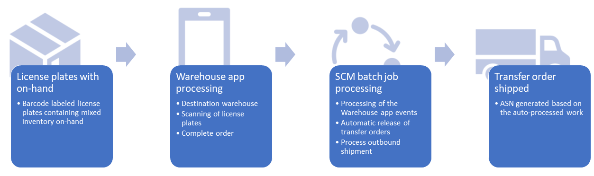

---
# required metadata

title: Create transfer orders from the warehouse app
description: This article describes how to create and process transfer orders from the Warehouse Management mobile app 
author: perlynne
ms.date: 08/09/2022
ms.topic: article
ms.prod: 
ms.technology: 

# optional metadata

ms.search.form: WHSMobileDeviceQueueEvent 
# ROBOTS: 
audience: Application User
# ms.devlang: 
ms.reviewer: kamaybac
# ms.tgt_pltfrm: 
# ms.custom: 
# ms.assetid: 
ms.search.region: Global
# ms.search.industry: 
ms.author: perlynne
ms.search.validFrom: 2020-10-09
ms.dyn365.ops.version: 10.0.15

---

# Create transfer orders from the warehouse app

[!include [banner](../includes/banner.md)]

This feature lets warehouse workers create and process transfer orders directly from the Warehouse Management mobile app. The worker starts by selecting the destination warehouse and then they can scan one or more license plates using the app to add license plates to the transfer order. When the warehouse worker selects **Complete order**, a batch job will create the required transfer order and order lines based on the on-hand inventory registered for those license plates.

## Turn on this feature and its prerequisites

Before you can use this feature, both it and its prerequisites must be enabled on your system. Administrators can use the [feature management](../../fin-ops-core/fin-ops/get-started/feature-management/feature-management-overview.md) page to check the feature status and enable it if needed.

1. Enable the following two features (in order) in the [Feature management](../../fin-ops-core/fin-ops/get-started/feature-management/feature-management-overview.md) workspace. As of Supply Chain Management version 10.0.25, both of these features are turned on by default.
    1. *Process warehouse app events* (As of Supply Chain Management version 10.0.29, the feature is mandatory and can't be turned off.)
    1. *Create and process transfer orders from the warehouse app* (As of Supply Chain Management version 10.0.29, the feature is mandatory and can't be turned off.)
1. To automate the processing of outbound shipments, you must also enable the [*Confirm outbound shipments from batch jobs*](confirm-outbound-shipments-from-batch-jobs.md) feature. (As of Supply Chain Management version 10.0.21, this feature is turned on by default. As of Supply Chain Management 10.0.25, this feature is mandatory and can't be turned off.)

## Set up a mobile device menu item to create transfer orders

Here are general guidelines for setting up a mobile device menu item for creating a transfer order. Depending on your business requirements for the level of automation to be set when users create transfer orders from the floor, different configurations will be enabled. The scenario in this document will describe one such configuration.

1. Go to **Warehouse management \> Setup \> Mobile device \> Mobile device menu items**.
1. Select **New** to add a new menu item. Then make the following settings to get started:

    - **Menu item name** - Assign a name as it should appear in Supply Chain Management.
    - **Title** - Assign a menu name as it should be presented to workers in the Warehouse Management mobile app.
    - **Mode** - Set to *Indirect* (this menu item will not create work).
    - **Activity code** - Set to *Create transfer order from license plates* to enable the warehouse workers to create a transfer order based on one or more scanned license plates.

1. Use the **Transfer order line creation policy** setting to control how transfer order lines will be created by this menu item. The lines will be created/updated based on the on-hand inventory registered for the scanned license plates. Choose one of the following values:

    - **No reservation** - The transfer order lines will not be reserved.
    - **License plate guided with line reservation** – The transfer order lines will be reserved and use the License plate guided strategy option, which stores the relevant license plate IDs associated with the order lines. Located license plate ID values can therefore be used as part of the work creation process for the transfer order lines.

1. Use the **Outbound shipment policy** setting to add more automation to the outbound transfer order shipment process, as needed. When a worker selects the **Complete order** button, the app creates the *Complete order* warehouse app event, which will save the value you choose here in the **Outbound shipment policy** field for each line in the current transfer order. Later, when the event queue is processed by a batch job to create the transfer order, the value stored in this field can be read by the batch job, and may therefore control how that job processes each line. Choose one of the following:

    - **None** - No automated processing is done.
    - **Release to warehouse** - Automates the release to warehouse process.
    - **Ship confirm** - Automates the ship confirmation process.
    - **Release and ship confirm** - Automates both the release to warehouse and ship confirmation processes.

## Add the mobile device menu item to a menu

1. Go to **Warehouse management \> Setup \> Mobile device \> Mobile device menu**
1. Select **Edit**.
1. Select an existing menu following selection of the new menu item under **Available menus and menu items**. Add the menu item by selecting the right-arrow button.

## Create a transfer order based on license plates

The Warehouse Management mobile app has a simple process for creating transfer orders based on license plates. To do this, the worker does the following using the Warehouse Management mobile app:

1. Create the transfer order and identify the destination warehouse.
1. Identify each license plate to be shipped.
1. Select **Complete order**.

>[!NOTE]
> It is possible for multiple workers to assign license plates intended for the same transfer order by using the **Select transfer order** button to select an existing, unprocessed, transfer order number from the warehouse app event queue. For information about how to find the transfer order number values, see [Inquire into the warehouse app events](#inquire-the-warehouse-app-events).

## Example scenario

This scenario provides an overview of the process for getting transfer orders created and automatically processed based on the on-hand inventory registered on the selected license plates.

To work through this scenario using the values suggested, you must work on a system with demo data installed and select the *USMF* legal entity before you begin.

This scenario assumes that you have already enabled both the [Create and process transfer orders from the warehouse app feature](#enable-create-transfer-order-from-warehouse-app), and the [warehouse app event processing](warehouse-app-events.md) capability.

In addition to setting up the create transfer order in the mobile device menu items, additional templates, location directives, and batch jobs must also be set up and enabled.

### Example Scenario blueprint

You are a retailer and have multiple license plates, each containing a mix of items placed at a specific location within one of your warehouses (*Warehouse 51*). You would like to enable the process that allows workers to create a transfer order to another warehouse (*Warehouse 61*) for a collection of scanned license plates. You will automatically ship-update the transfer order as soon as the last license plate for the order has been identified.

### Create a mobile device menu item for creating transfer orders

This section explains how to create a new mobile device menu item for creating transfer orders. Set the **Mode** to *Indirect* and the **Activity code** to *Create transfer order from license plates*.

1. Go to **Warehouse management \> Setup \> Mobile device \> Mobile device menu items**.
1. Select **New**.
1. In the **Menu item name** field, enter the name *Create TO*.
1. In the **Title** field, enter the description *Create TO*.
1. In the **Mode** field, select *Indirect*.
1. In the **Activity code**, select *Create transfer order from license plates*
1. In the **Order line creation policy**, select *License plate guided with line reservation*.
1. In the **Outbound shipment policy**, select *Release and ship confirm*.
1. Go to **Warehouse management \> Setup \> Mobile device \> Mobile device menu**.
1. Select **Edit**.
1. Select the existing **Inventory** menu and then select the new menu item under **Available menus and menu items**. Add the menu item into the **Inventory** menu by selecting the right-arrow button.

### Set up work templates to auto process and break work by located license plate

This section explains how to enable a work template to automatically process the work created by the template when a wave is released.

1. Go to **Warehouse management \> Setup \> Work \> Work templates**.
1. In the **Work order type** field, select *Transfer issue*.
1. Select **New** to create a new work template.
1. In the **Work template** field, enter *51 Auto process LP*.
1. In the **Work template description** field, enter *51 Auto process LP*.
1. Select the **Automatically process** check box. This must be selected in order for any automation steps to be processed.
1. In the demo data, there already exists a work template *51 Transfer*, edit the **Sequence number** field so that the new work template has a lower sequence number than the existing work template *51 Transfer*.
1. Select **Save** in the toolbar to enable the **Work Template Details** FastTab.
1. In the **Work Template Details** FastTab, select **New** in the toolbar. You will add two lines.
1. In the **Work type** field, select *Pick*.
1. In the **Work class ID** field, select *TransfOut*.
1. Select **New** in the **Work Template Details** toolbar.
1. In the **Work type** field, select *Put*.
1. In the **Work class ID** field, select *TransfOut*.
1. Select **Save** to enable the **Directive code** field.
1. On the **Work type** *Put* line, select **Directive code** *Baydoor*. Make sure this new work template gets the lowest **Sequence number**.
1. In the toolbar, select **Edit query** to open the query editor.
1. In the **Range** tab, select **Add**.
1. On the line added, in **Field** select *Warehouse*.
1. In the **Criteria** field, select *51*.
1. Select the **Sorting** tab.
1. Select **Add** and set **Field** to *Located license plate ID*. Selecting this field will enable the toolbar button **Work header breaks**.
1. Select **OK** followed by **Yes** to reset the grouping and return to the **Work templates** page.
1. Select **Work header breaks** and enable the **Group by this field** for the **Located license plate ID** and close.

> [!NOTE]
> Not all setup can be auto processed, for example, catch weight items and the use of mixed tracking dimensions.

### Set up location directives for the license plate guided strategy

This section explains how to set up a location directive pick process to use the **License plate guided** strategy.

1. Go to **Warehouse management \> Setup \> Location directives**.
1. Select **Edit**.
1. In the navigation list header, select the **Work order type** *Transfer issue*.
1. In the navigation list, select the existing location directive **51 TO Pick**.
1. In the **Lines** FastTab, select the **Allow split** checkbox.
1. In the **Location Directive Actions** FastTab select **New** to add a new action line.
1. In the **Name** field, enter *LP Guided*.
1. In the **Strategy** field, select *License plate guided*. This action needs the lowest sequence number.
1. Select **Save** in the toolbar.
1. Select  the **Refresh** page icon from the toolbar.
1. In the **Location Directive Actions** FastTab, select the line *TOPick*.
1. In the **Location Directive Actions** toolbar, select **Move down** to change the sequence number to be greater than the sequence number for the *LP Guided* action just created.

> [!NOTE]
> The License plate guided strategy will try to reserve and create picking work against the locations holding the requested license plates that have been associated with the transfer order lines. But if this isn't possible and you still would like to create picking work, you should fall back to another location directive action strategy, and perhaps also search for inventory in another area of the warehouse, depending on your business process needs.

### Set up a batch job to process warehouse app events

This section explains how to set up a scheduled batch job to process warehouse app events.

1. Go to **Warehouse management \> Periodic tasks \> Process warehouse app events**.
2. In the dialog box, enable **Batch processing** under the **Run in background** section.
3. Select **Recurrence** and set up the batch job to process based on the interval needed for your business.
4. Select **OK** to return to the main dialog.
5. Select **OK** in the main dialog to add the job to the batch queue.

### Set up a batch job to release transfer orders automatically

This section explains how to set up a scheduled batch job to release the transfer orders that have been marked as "ready to release".

1. Go to **Warehouse management \> Release to warehouse \> Automatic release of transfer orders**.
1. In the dialog box, expand the **Records to include** section.
1. Select **Filter** under the **Records to include** section.
1. In the **WHSTransferAutoRTWQuery** query page, **Range** tab, select **Add** to add a new line to the query.
1. In the new line **Table** field, select the drop-down menu and select the table **Transfer line release to warehouse**.
1. In the **Field** drop-down menu, select **Outbound shipment policy**.
1. In the **Criteria** field, select **Release and ship confirm**.
1. In the line where **Field** is set to *From warehouse*, in the **Criteria** field, select *51*.
1. Select **OK** to return to the main dialog box.
1. Expand the **Run in the background** section to set up batch processing.
1. Enable **Batch processing** under the **Run in background** section.
1. Select **Recurrence** and set up the batch job to process based on interval needed for your business.
1. Select **OK** to return to the main dialog.
1. Select **OK** in the main dialog to have the batch job added to the batch queue.

### Set up the "Process outbound shipment" batch job

This section explains how to set up a scheduled batch job to run the outbound shipment confirmation for loads ready to ship related to transfer order lines that are "ready to ship".

1. Go to **Warehouse management \> Periodic tasks \> Process outbound shipments**.
1. Expand the **Records to include** section.
1. Select **Filter**.
1. In the **WHSLoadShipConfirm** query, select the **Joins** tab.
1. Expand the table hierarchy so that **Loads** and **Load details** have been expanded.
1. Select the **Load details** table.
1. Select the **Add table join** button.
1. In the list of table relations, filter or search on the **Relation** column for *Transfer order lines (Reference)*.
1. Focus on the table relation in the list then press the **Select** button.
1. Select the **Transfer order lines** table.
1. Select the **Add table join** button.
1. In the list of table relations, filter or search on the **Relation** column for *Invent Transfer Additional Fields (Record-ID)*.
1. Focus on the table relation in the list then press the **Select** button.
1. Select the **Range** tab.
1. In the **Range** query tables, you will set up three query criteria ranges. Select the **Add** button to add a line.
1. Add a range for the table **Loads**. Set **Field** to *Load status* and set **Criteria** to *Loaded*.
1. Add another range for the table **Invent Transfer Additional Fields**. Set **Field** to *Outbound shipment policy* and set **Criteria** to *Release and ship confirm*.
1. Add another range for the table **Load details**. Set **Field** to *Reference* and set **Criteria** to *Transfer order shipment*.
1. Select **OK** to return to the main dialog box.
1. Expand the **Run in the background** section.
1. Enable **Batch processing**.
1. Select **Recurrence** and set up the batch job to process based on interval needed for your business.
1. Select **OK** to return to the main dialog.
1. Select **OK** in the main dialog to have the batch job added to the batch queue.

> [!NOTE]
> For more information, see [Confirm outbound shipments from batch jobs](confirm-outbound-shipments-from-batch-jobs.md).

## Processing the example for "Create transfer order from the warehouse app"

### Add on-hand on a license plate

As a starting point for this scenario, you will need to have a license plate containing physical available inventory on hand.

| Item | Warehouse | Inventory status | Location | License plate | Quantity |
| --- | --- | --- | --- | --- | --- |
| A0001 | 51 | Available | LP-010 | LP10 | 1 |
| A0002 | 51 | Available | LP-010 | LP10 | 2 |

Add physical inventory on hand quantities by using the following values:

> [!NOTE]
> You will need to create the license plate and use locations that allow you to carry mixed items, like LP-010.

### Create and process transfer orders from the warehouse app

1. Open the app and sign in as user *51*. The current user warehouse will be 51.
1. Select the menu item **Create TO** from the menu location you added it to during setup.
1. Start the creation of a transfer order by entering the destination warehouse (To warehouse) in the **Warehouse** field, enter *61*. The new transfer order will be going from current warehouse 51 (From warehouse) to the destination warehouse *61*.
1. Select **OK**.
1. Scan a license plate ID in the **License plate** field. Enter the license plate of the inventory added in an earlier step, *LP10*.
1. Select **OK**.
1. Select the menu button and then select **Complete order** to finalize the warehouse app transfer order creation.

For the mentioned example, two **Warehouse app events** (*Create transfer order* and *Complete transfer order*) are used.

### Inquire into the warehouse app events

You can view the event queue and events messages generated by the Warehouse Management mobile app by going to **Warehouse management \> Enquiries and reports \> Mobile device logs \> Warehouse app events**.

The *Create transfer order* event messages will receive the status *Waiting*, which means that the **Process warehouse app events** batch job will not pick up and process the event messages. As soon as the event message updates to status *Queued*, the batch job will process the events. This will happen at the same time as the creation of the *Complete transfer order* event (when a worker selects the **Complete order** button on the Warehouse Management mobile app). When the *Create transfer order* event messages has been processed, the status is updated to *Completed* or *Failed*. When the *Complete transfer order* status is updated to *Completed*, all the related events are deleted from the queue.

Because the **Warehouse app events** for the creation of transfer order data will not be processed by the batch job before the messages are updated to status *Queued*, you will need to look up the requested transfer order numbers as part of the **Identifier** field. The **Identifier** field is in the header of the **Warehouse app events** page.

As part of the warehouse event processing, the creation of the transfer order line might fail. In this case, the state of the event message is updated to *Failed* and you can use the **Batch log** information to learn why and take action to correct any problems.

Typical issues could be related to missing setup for the process, like a missing transit warehouse for the *Create transfer order* event. In an example like this, you would add a transit warehouse to the shipping warehouse and use the **Reset** option to change the status for all the warehouse app event messages from *Failed* to *Queued*, which means that the batch job will process the event messages again after the correction of the setup data.

Within production environments, the exceptions would be more process related, such as having a requested license plate, which at the batch job processing time is empty and thereby no transfer order lines are created. This failed event message can either be removed by using the **Delete** option or you can add the needed physical on-hand on the license plate and use the **Reset** option for all the related event messages.

For more information, see [Warehouse app event processing](warehouse-app-events.md).

### Follow up on the example scenario processing

During this scenario, the following occurred:

1. Using the Warehouse Management mobile app, you selected a menu item that uses the activity code **Create transfer order from license plates**.
1. The app prompted you to select the destination warehouse for the transfer order. The source warehouse is always the one you currently are signed into as a Worker.
1. On the selection of the destination warehouse, the system reserved an ID number for the upcoming transfer order (based on the transfer-order number sequence defined on your system) but didn't create the transfer order yet.
1. When you scanned the license plate *LP10* containing on-hand inventory that should be moved to the new warehouse, a **Warehouse app event** was added to the events queue to be processed later. The warehouse event contained message details about the scan, including the intended transfer-order number.
1. On the Warehouse Management mobile app when the **Complete order** button is selected, a new warehouse app event, **Complete transfer order**, is created and the related existing event, **Create transfer order**, changed status to **Queued**.
1. On the back end, the **Process warehouse app events batch job** picked up the **Queued** event and collected the on-hand related to the scanned license plate. Based on the on-hand the actual transfer order record and associated lines got created. The job also populated the **Outbound shipment policy** field for the transfer order with the value based on the configured *Release and ship confirm* and linked the license plate against the lines for the **License plate guided** strategy.
1. Based on the transfer order line **Outbound shipment policy** field value the **Automatic release of transfer orders batch job** query now resulted in releasing the transfer order to the shipping warehouse. And due to the setup for the used **Wave template**, **Work template**, and **Location directives** the work got auto processes, resulting in the **Load status** being updated to *Loaded*.
1. The **Process outbound shipment batch job** is executed for the load, resulting in the transfer order being shipped and the Advance Shipment Notice (ASN) is generated.
1. The timing of all these events is dependent on the **Recurrence** settings for the batch jobs created.

## Frequently asked questions

### Mobile device menu item setup

#### Why can’t I see "Create transfer order from license plate" in the menu item work activity drop-down list?

The feature *Create and process transfer orders from the warehouse app* must be enabled. For more information, see [Enable the create transfer orders from Warehouse app](#enable-create-transfer-order-from-warehouse-app).

### Warehouse Management mobile app processes

#### Why can’t I see the menu button "Complete order"?

You must have at least one license plate assigned to the transfer order.

#### Can several Warehouse Management mobile app users add license plates to the same transfer order at the same time?

Yes, several warehouse workers can scan license plates into the same transfer order.

#### Can the same license plate be added to different transfer orders?

No, a license plate can only be added to one transfer order at the time.

#### After having selected the "Complete order" button, can I then add more license plates for that transfer order?

No, you can't add more license plates to a transfer order that has a **Complete transfer order** warehouse app event.

#### How can I find existing transfer orders to be used via the "Select transfer order" button in the Warehouse Management mobile app, if the order has not yet been created in the backend system?

You can make it possible for workers to look up transfer order numbers in the Warehouse Management mobile app by using its [data inquiry](warehouse-app-data-inquiry.md) capability. For example, you could create a [detour](warehouse-app-detours.md) mobile device menu item that queries for the data displayed on the web client's **Warehouse app events** page (`WHSMobileDeviceQueueMessageCollection`) as part of the *Select order - MobileDeviceQueueMessageCollectionIdentifierId* step. The transfer order number matches the value shown in the **Identifier** field. See also [Inquire into the warehouse app events](#inquire-the-warehouse-app-events).

#### Can I manually select the transfer order number to be used from the Warehouse Management mobile app?

Only autogenerated transfer order numbers via number sequences are supported. See also the answer to the previous question regarding how to set up the **Select transfer order** button. For more information about how to find transfer order numbers, see [Inquire into the warehouse app events](#inquire-the-warehouse-app-events).

### Background processing

#### How should I clean up records in my warehouse app events queue message tables?

You can view and maintain this on the **Warehouse app events** page. For more information, see [Inquire into the warehouse app events](#inquire-the-warehouse-app-events).

#### Why is the transfer order "Receipt date" not updated according to my "Delivery date control" setup?

The transfer orders are created without using the **Delivery date control** capabilities.

#### Can I use a license plate having physical negative inventory on hand?

The feature only supports positive physical on-hand quantities on the license plate level, but you can have physical negative on-hand quantities at the higher warehouse and inventory-status levels when assigning license plates to transfer orders.

[!INCLUDE[footer-include](../../includes/footer-banner.md)]
