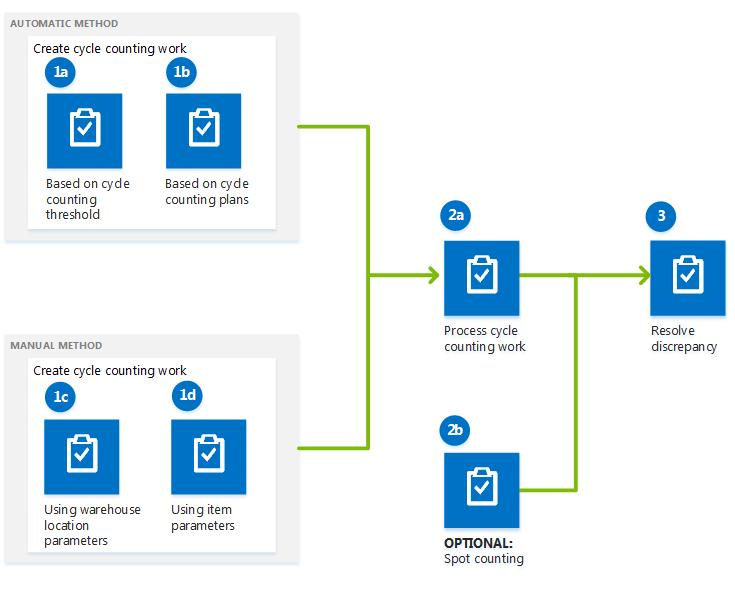

---
# required metadata

title: Cycle counting
description: This article describes how you can use cycle counting with the warehousing solution that is available in Warehouse management. This article doesn't apply to the warehousing solution that's available in Inventory management.
author: Mirzaab
ms.date: 06/20/2017
ms.topic: article
ms.prod: 
ms.technology: 

# optional metadata

ms.search.form: WHSCycleCountPlan, WHSCycleCountPlanListPage, WHSCycleCountThreshold, WHSWorkTableListPage, SalesShipmentDeviation, WHSRFMenuItemCycleCount, WHSWorkLineCycleCount
# ROBOTS: 
audience: Application User
# ms.devlang: 
ms.reviewer: kamaybac
# ms.tgt_pltfrm: 
ms.assetid: 49f5c431-b043-4170-aa24-b7d5d1ee063e
ms.search.region: Global
# ms.search.industry: 
ms.author: mirzaab
ms.search.validFrom: 2016-02-28
ms.dyn365.ops.version: AX 7.0.0

---

# Cycle counting

[!include [banner](../includes/banner.md)]

This article describes how you can use cycle counting with the warehousing solution that is available in Warehouse management. This article doesn't apply to the warehousing solution that's available in Inventory management.

Cycle counting is a warehouse process that you can use to audit on-hand inventory items. The cycle counting process can be described in three steps:

1.  **Create cycle counting work** – Cycle counting work can be created automatically, based on threshold parameters for items or by using a cycle counting plan. Alternatively, you can manually create cycle counting work by using the item or warehouse parameters on the **Cycle count work by item** page or the **Cycle count work by location** page.
2.  **Process the cycle count** – After cycle counting work is created, you do the cycle counting work by counting items in a warehouse location and then using a mobile device to enter the result in Dynamics 365 Supply Chain Management. Alternatively, you can count items in a warehouse location without creating cycle counting work. This process is referred to as *spot cycle counting*.
3.  **Resolve differences in the counted value** – After a cycle count, any items that have differences in the counted value will have a work status of **Pending review** on the **All work** page. You can resolve these differences on the **Cycle count work pending review** page.

The following illustration shows the cycle counting process. 

## Cycle counting prerequisites
The following table shows the prerequisites that must be in place before you can use cycle counting.
<table>
<colgroup>
<col width="50%" />
<col width="50%" />
</colgroup>
<thead>
<tr class="header">
<th>Prerequisite</th>
<th>Description</th>
</tr>
</thead>
<tbody>
<tr class="odd">
<td>Item</td>
<td>The item must be enabled for warehouse management processes (WMS).</td>
</tr>
<tr class="even">
<td>Warehouse</td>
<td>The warehouse must be enabled for warehouse management processes (WMS). To enable the warehouse for WMS, on the <strong>Warehouses</strong> page, select the warehouse, and then select the <strong>Use warehouse management processes</strong> option. To enable workers to move pallets during a cycle count, on the <strong>Warehouse management</strong> FastTab, select the <strong>Allow pallet moves during cycle counting</strong> option.</td>
</tr>
<tr class="odd">
<td>Work pools</td>
<td>Optional: Create a work pool to segregate the warehouse work, based on the type of work (in this case, cycle counting work).</td>
</tr>
<tr class="even">
<td>Locations</td>
<td>Enable cycle counting for locations. To enable cycle counting for a warehouse location, on the <strong>Location profiles</strong> page, select the <strong>Allow cycle counting</strong> option.</td>
</tr>
<tr class="odd">
<td>Warehouse management parameters</td>
<td>Set up parameters for cycle counting. On the <strong>Warehouse management parameters</strong> page, specify the default adjustment type code, work class ID, and work priority for cycle counting.</td>
</tr>
<tr class="even">
<td>Mobile device</td>
<td><ul>
<li>Create a menu item for one of the following methods on the <strong>Mobile device menu items</strong> page:
<ul>
<li>User directed cycle counting</li>
<li>System directed cycle counting</li>
<li>Cycle count grouping</li>
<li>Spot cycle counting</li>
</ul>
</li>
<li>Set up a menu for the mobile device.</li>
<li>Create a work user account, and assign a mobile device menu to the work user ID.</li>
</ul></td>
</tr>
<tr class="odd">
<td>Related setup task</td>
<td>Set up a cycle counting plan for a warehouse location.</td>
</tr>
</tbody>
</table>

## Automatically create cycle counting work
There are two ways to schedule recurring creation of cycle counting work: set up cycle counting thresholds or set up cycle counting plans.

-   A cycle counting threshold indicates the quantity or percentage limit of inventory items. Cycle counting work is automatically created when the threshold limit is reached.
-   A cycle counting plan creates cycle counting work either immediately or periodically through a batch job. When cycle counting work is created, the counting work line includes information about the location to count. The on-hand inventory that is associated with this location isn't blocked, and is therefore available for reservation and outbound processing, even though open counting work exists.

### Create cycle counting work, based on threshold parameters for items

Cycle counting work can be created when the number of items falls below a specific threshold value in a location. For example, there are 60 items in a location that has a cycle counting threshold of 40. During a sales order transaction, 25 items are picked from the location and put in a staging location. Because the new item count, 35, is less than the threshold quantity, cycle counting work is automatically created for the location.

### Schedule cycle counting work

You can schedule cycle counting plans to create cycle counting work immediately or periodically. By setting up cycle counting plans, you can control the work pool that cycle counting work is created for, the maximum number of cycle counts that are created for items in different locations, and the number of days before a warehouse location is counted again. For example, an item is available in three locations in the warehouse, and the maximum number of cycle counts is set to **2**. In this case, when you run the cycle counting plan, two cycle counts are created for the two locations where the item is present. As another example, you set the number of days between cycle counts to **5**. In this case, cycle counting work is created every five days. However, if cycle counting work is processed on day 3, the next cycle counting work will be created five days after the last cycle counting was processed, on day 8.

## Create cycle counting work manually
To create cycle counting work manually, you can use the **Cycle count work by item** or **Cycle count work by location** page. You can specify the maximum number of cycle counts to create. For example, if the warehouse manager specifies a value of **5**, cycle counting work is created for five locations, even if the item is present in 10 locations. You can also select a work pool ID to assign the cycle counting work IDs that are created to. When a work pool ID is processed for cycle counting, the cycle counting work IDs that are assigned to the work pool are processed as a group.

## Perform a cycle count by using a mobile device
There are several methods for processing cycle counting work by using Supply Chain Management on a mobile device:

-   **User directed** – The worker can specify a cycle counting work ID that has a status of **Open**.
-   **System directed** – Supply Chain Management assigns a cycle counting work ID to the worker.
-   **Cycle count grouping** – The worker can group cycle counting work IDs that are specific to a particular location, zone, or work pool.
-   **Spot cycle counting** – The worker can count items in a warehouse location at any time, without creating cycle counting work. To perform spot cycle counting in a location, the worker enters the location ID.

The following example shows how you can perform spot cycle counting by using a mobile device. The instructions that the worker sees on the device vary, depending on the setup of the menu item for spot cycle counting.

1.  On the mobile device, select the menu item to process spot cycle counting work.
2.  Register the location to perform spot cycle counting for.
3.  Register and confirm the item number and the counted item quantity. **Note:** The status of the cycle counting work is updated to either **Pending review** or **Closed** on the **All work** page, depending on the parameters that are set on the **Worker** page.
4.  Optional: Repeat step 3 for the remaining items in the location, and confirm that no additional items are available for counting.

## Resolve cycle counting differences
A cycle counting difference occurs in the following scenarios if the **Is a cycle count supervisor** option is set to **No** for a work user ID:

-   The counted value isn't within the deviation limits that are specified in the **Maximum percentage limit** or **Maximum quantity limit** fields on the **Work users** page. For example, the on-hand inventory quantity in a location is 50, and the deviation limit for the work user is 10. If the work user enters a value that isn't between 40 and 60, a difference occurs.
-   The counted value differs from the on-hand inventory quantity, and no deviation limits are set.

You can adjust differences in the counted value and then accept the counted value on the **Cycle count pending review** page. You can verify the modified count of the item quantity on the **On hand by location** page. The counted value is rejected if the difference can't be approved.

## Additional resources
[Set up mobile devices for warehouse work](configure-mobile-devices-warehouse.md)

[!INCLUDE[footer-include](../../includes/footer-banner.md)]