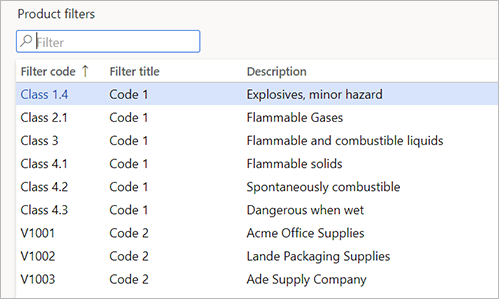
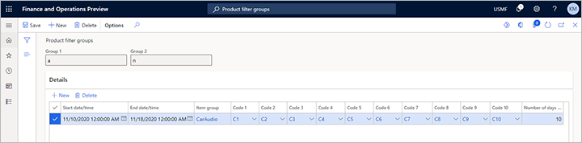

---
# required metadata

title: Configure item filters and filter codes for warehouse transactions
description: This topic describes how to configure item filters and filter codes to categorize inventory items in a warehouse. You can also use filters to specify which customers can order a particular item and specify the items that can be purchased from a particular vendor.
author: Mirzaab
manager: tfehr
ms.date: 11/16/2020
ms.topic: article
ms.prod: 
ms.service: dynamics-ax-applications
ms.technology: 

# optional metadata

ms.search.form: WHSFilters,WHSFilterGroupTable,EcoResProductDetailsExtended,WHSFilterGenerallyAvail
audience: Application User
# ms.devlang: 
ms.reviewer: kamaybac
ms.search.scope:  Core, Operations
# ms.tgt_pltfrm: 
# ms.custom: [used by loc for topics migrated from the wiki]
ms.search.region: Global
# ms.search.industry: [leave blank for most, retail, public sector]
ms.author: mirzaab
ms.search.validFrom: 2020-11-16
ms.dyn365.ops.version: Release 10.0.16
---

# Configure product filters  for warehouse transactions

[!include [banner](../includes/banner.md)]

This topic describes how to configure item filters and filter codes to categorize inventory items in a warehouse. You can also use filters to specify which customers can order a particular item and specify the items that can be purchased from a particular vendor.

Additionally, you can set up and use filter codes to automatically organize inventory items in a warehouse and combine filtered items into filter groups. Filters can be used to place items into categories for handling, purchasing and selling processes. You may want to group items together or separate them from each other when handling based on weight or handling restrictions.  You can also specify which customers or vendors an item can be purchase from or sold to.

## Prerequisites

The following table shows the prerequisites that must be in place before you start.

| Category | Prerequisite |
| -- | -- |
| Before you start configuring products in the **Released product details** form, you must enable the Warehouse processing for the product’s *storage dimension group*. | Go to **Product information management \> Setup \> Dimension and variant groups \> Storage dimension groups** and select or create a storage dimension group where the **Use warehouse management processes** check box is set to *Yes*. |
| If you will be using customer or vendor filters, you must first enable their use in **Warehouse management parameters**. | Select **Warehouse management \> Setup \> Warehouse management parameters**. Go to the **Product filters** tab, then enable the customer and or vendor filters by setting the toggle to *Yes*. |

## Set up product filters

Product filters have been expanded to 10 **Filter title** characteristics (enum values) available to select when creating a product filter. The enum values *Code 1*, *Code 2* through *Code 10* are system defined to represent a given characteristic or attribute of an item.

For example, Code 1 could represent items that have hazardous material classification. Code 2 could represent items that can only be purchased by Vendors.  Product filters define the specific **Filter code** associated with the **Filter title**.

1. Go to **Warehouse management \> Setup \> Product filters \> Product filters**.
1. Select **New** in the **Action Pane** to create a new product filter.
1. Select an enum value from **Filter title**.
1. Enter a value in the **Filter code** field.
1. Enter a name for the code in the **Description** field.
    1. For example, *Code 2* represents vendors. You could create a product filter for a specific vendor, or a group of vendors. See "Setup vendor filter codes" below.

## Set up product filter groups

You can use filter groups to filter codes. This is useful when the group is used in a query in a location directive and you want to search for the group instead of for a series of codes. A filter group is associated with an item group.

To set up filter groups, follow these steps:

1. Go to **Warehouse management \> Setup \> Product filters \> Product filter groups**.
1. Select **New** in the Action Pane.
1. In the **Group 1** and **Group 2** fields, enter the names that will be used to categorize items.
1. Select **New** in the **Details** FastTab to add a new line.
1. Enter the **Start date/time** and **End date/time** for the filter group.
1. Select the **Item group** to which the product filter will apply.
1. In the **Code 1**, **Code 2** through **Code 10** fields, select the filter codes to include in the group.

> [!NOTE]
> If you receive an error message when you close the form, a code setup may be missing. In the **Item groups** form, you can make the codes mandatory for an item group by selecting **Assign filter code 1 for item group**, **Assign filter code 2 for item group**, and so on.

## Set up filter codes on item groups

By setting up filter codes on an item group, you can make the codes required for products attached to the item group.

To set up filter codes on item groups, follow these steps:

1. Select **Inventory management** \> **Setup** \> **Inventory** \> **Item groups**.
1. Select **New** in the Action Pane to create a new item group. Enter a value in **Item group** and the description in **Name**.
1. On the **Warehouse** FastTab, in the **Filter required** group, select the appropriate check boxes to define one or more filter codes that must be specified for products that are associated with the item group.

    1. To update a released product, in the **Released product details** form, on the **Action Pane** select **Edit**. The filters associated with codes become available on the **Warehouse** FastTab.

1. In the grouping for **Item group filter**, select the appropriate check boxes to define which filters must match for the filter group to be the default for an item.
    1. For example, if *Use filter code 1* and *Use filter code 2* are selected, then both *filter code 1* and *filter code 2* of the item must match the setup of the filter group for the item group before the filter group can be selected. When you create a new item, the selected filter group will be the default in the **Released product details** form, on the **Warehouse** FastTab, in the **Group 1** and **Group 2** fields.

> [!IMPORTANT]
> Product filter codes are only enabled for items using advanced warehouse management.

## Specify filter codes for released products

Follow these steps to specify filter codes for released products. For example, you can use filter codes to group products that are hazardous and purchased by specific vendors.

To specify filter codes for specific products, follow these steps:

1. Select **Product information management** \> **Products** \> **Released products**.
1. On the **Action Pane** select **New** to create a new product.
1. On the **New released product** Flyout, enter the data needed to create the base of a new product, then select **OK**.

    1. See Microsoft Docs [Create a new product](https://docs.microsoft.com/dynamics365/supply-chain/pim/tasks/create-new-product) for more information.

1. Expand the **Warehouse** FastTab.
1. In the **Product Filter Codes** group *Code 1*, *Code 2* through *Code 10* fields, select the filter codes that you want to specify for the product.

## Set up generally available items

You can make specific inventory items available only for customers or vendors, or for both customers and vendors.

> [!NOTE]
> For any item that you set up as generally available, customer filters and vendor filters do not apply.

To set up generally available items, follow these steps:

1. Select **Warehouse management** \> **Setup** \> **Product filters** \> **Generally available products**.

1. In the Action Pane select **New** to create a new record.
1. In the **Customer or vendor** field, select **Customer**, **Vendor**, or **All** to make the items available for customers, vendors, or both.
1. In the **Start date/time** field, enter the start date and the start time for the item’s availability.
1. In the **Item group** field, select an item group.
1. In the **Code 1**, **Code 2** through **Code 10** fields, select the filter codes to limit the items that are generally available.

    1. When you select an item group, you set this group of items to be generally available.
    1. By selecting filter codes in these fields, you limit the items that are available.

## Set up customer product filters

This optional procedure shows how to specify items that should be available for a customer in addition to the items that are made available via the filter setup in the **Generally available items** form. You can set up multiple filters for a single customer.

To set up customer filter codes, follow these steps:

1. Select **Sales and marketing** \> **Customers** \> **All customers**.
1. Select a customer.
1. On the **Customer** tab, in the **Set up** group, select **Product filters**.
1. On the **Product filter codes** page, select **New** in the Action Pane.
1. In the **Start date/time** and **End date/time** fields, enter the information for the selected customer.
1. In the **Item group** field, select an item group.
1. In the **Code 1**, **Code 2** through **Code 10** fields, select codes to use as criteria for limiting the items that are available for customers in the selected item group. You must make a selection for each *Code #* that has been setup on the **Item group**.

## Set up vendor product filters

This optional procedure shows how to specify items that should be available for a vendor in addition to the items that are made available via the filter setup in the **Generally available items** form. You can set up multiple filters for a single vendor.

To set up vendor filter codes, follow these steps:

1. Select **Procurement and sourcing \> Vendors \> All vendors**.
1. Select a vendor.
1. In the Action Pane on the **Vendor** tab, in the **Set up** group, select **Product filters**.
1. In the **Filter codes** form, Select **New**.
1. In the **Start date/time** and **End date/time** fields, enter a start and end date for the selected **Item group**.
1. In the **Item group** field, select a value.
1. In the **Code 1**, **Code 2** through **Code 10** fields, select codes to use as criteria for limiting the items that are available for vendors in the selected item group. You must make a selection for each *Code #* that has been setup on the **Item group**.

> [!NOTE]
> The enabling of vendor filters applies to released products where the associated storage dimension group has warehouse management processes enabled. The filter codes are used to determine if it is approved to purchase an item from a vendor during the creation of purchase order lines. Operations has two different methods to handle vendor approval. One or more released products exists, where approved vendor method is warning or not allowed. You are potentially enabling two vendor approval method for this released item. This may cause issues when creating purchase order lines.

## See also

[Set up filters and filter groups](filters-and-filter-groups.md)

[For more information see the blog post WMS-Warehouse Filter Codes](http://blog.dynamics-for-operations.com/2017/09/26/wms-warehouse-filter-codes/)
