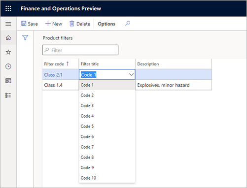

---
# required metadata

title: Configure product filters for warehouse transactions
description: This article describes how to configure product filters and filter codes to categorize inventory items in a warehouse. You can also use filters to specify which customers can order a particular item and which items can be purchase from a particular vendor.
author: Mirzaab
ms.date: 01/04/2021
ms.topic: article
ms.prod: 
ms.technology: 

# optional metadata

ms.search.form: WHSFilters,WHSFilterGroupTable,EcoResProductDetailsExtended,WHSFilterGenerallyAvail
audience: Application User
# ms.devlang: 
ms.reviewer: kamaybac
# ms.tgt_pltfrm: 
# ms.custom: [used by loc for articles migrated from the wiki]
ms.search.region: Global
# ms.search.industry: [leave blank for most, retail, public sector]
ms.author: mirzaab
ms.search.validFrom: 2021-01-04
ms.dyn365.ops.version: 10.0.16
---

# Configure product filters for warehouse transactions

[!include [banner](../includes/banner.md)]

This article describes how to configure product filters and filter codes to categorize inventory items in a warehouse. You can also use filters to specify which customers can order a particular item and which items can be purchased from a particular vendor.

Additionally, you can set up and use product filters to automatically organize inventory items in a warehouse and combine filtered items into filter groups. Filters can be used to put items into categories for handling, purchasing, and selling processes. You might want to group items together or separate them from each other when the way that they are handled is based on weight or handling restrictions. You can also specify which customers or vendors an item can be purchased from or sold to.

## Prerequisites

The following table shows the prerequisites that must be in place before you start.

| Prerequisite | Instructions |
|---|---|
| Before you start to configure products on the **Released product details** page, you must turn on warehouse processing for the product's storage dimension group. | Go to **Product information management \> Setup \> Dimension and variant groups \> Storage dimension groups**, and select or create a storage dimension group where the **Use warehouse management processes** option is set to *Yes*. |
| If you will use customer filters and/or vendor filters, you must enable their use in Warehouse management parameters. | Go to **Warehouse management \> Setup \> Warehouse management parameters**. On the **Product filters** tab, set the **Enable customer filters** and/or **Enable vendor filters** option  to *Yes*. |

## Set up product filters

Product filters provide up to 10 **Filter title** characteristics, which are enumeration (enum) values. These enum values are available for selection when you create a product filter. The enum values *Code 1* through *Code 10* are system-defined and represent a specific characteristic or attribute of an item. For example, *Code 1* might represent items that have a hazardous material classification. *Code 2* might represent items that only vendors can purchase. Product filters then define the specific **Filter code** value that is associated with a **Filter title** value.

1. Go to **Warehouse management \> Setup \> Product filters \> Product filters**.
1. On the Action Pane, select **New** to add a product filter to the grid.
1. In the **Filter title** field, select a value.
1. In the **Filter code** field, enter a value.

    

1. In the **Description** field, enter a name for the code. For example, *Code 2* might represent vendors. You can then create a product filter for a specific vendor or group of vendors. For more information, see the [Setup vendor filter codes](#vendor-product-filters) section later in this article.

    

## Set up product filter groups

You can use filter groups to group filter codes. This capability is helpful when a group is used in a query in a location directive, and you want to search for the group instead of a series of codes. Each filter group is associated with an item group.

> [!IMPORTANT]
> Not all product filter groups are available for filter codes that are higher than *Code 4* (that is, *Code 5* through *Code 10*). For example, for released products, although all the product filter codes will be added, the grouping of filter codes won't be updated. This behavior might be updated in later releases.

To set up filter groups, follow these steps.

1. Go to **Warehouse management \> Setup \> Product filters \> Product filter groups**.
1. On the Action Pane, select **New**.
1. In the **Group 1** and **Group 2** fields, enter the names that will be used to categorize items.
1. On the **Details** FastTab, select **New** to add a line.
1. In the **Start date/time** and **End date/time** fields, enter start and end dates for the filter group.
1. In the **Item group** field, select the item group that the product filter should apply to.
1. In the **Code 1** through **Code 10** fields, select the filter codes to include in the group, as required.

    

> [!NOTE]
> If you receive an error message when you close the page, a code setup might be missing. On the **Item groups** page, you can make the codes mandatory for an item group by selecting the **Assign filter code 1 for item group**, **Assign filter code 2 for item group**, and so on, check boxes.

## Set up filter codes on item groups

By setting up filter codes on an item group, you can make the codes that are required for products that are attached to that item group.

To set up filter codes on item groups, follow these steps.

1. Go to **Inventory management \> Setup \> Inventory \> Item groups**.
1. On the Action Pane, select **New** to create an item group.
1. In the **Item group** field, enter a name.
1. In the **Name** field, enter a description.
1. On the **Warehouse** FastTab, in the **Filter required** section, select the check boxes for the filter codes that must be specified for products that are associated with the item group.

    To update a released product, open its **Released product details** page, and then, on the Action Pane, select **Edit**. The filters that are associated with codes then become available on the **Warehouse** FastTab.

    

1. In the **Item group filter** section, select the check boxes for the filters that must match for the filter group to be the default filter group for an item.

    For example, if the **Use filter code 1** and **Use filter code 2** check boxes are selected, both filter code 1 and filter code 2 of the item must match the setup of the filter group for the item group before the filter group can be selected. When you create a new item, the selected filter group will be the default filter group in the **Group 1** and **Group 2** fields on the **Warehouse** FastTab of the **Released product details** page.

> [!IMPORTANT]
> Product filter codes are enabled only for items that use warehouse management processes (WMS).

## Specify filter codes for released products

Follow these steps to specify filter codes for released products. For example, you can use filter codes to group hazardous products that specific vendors purchase.

1. Go to **Product information management \> Products \> Released products**.
1. On the Action Pane, select **New** to create a product.
1. In the **New released product** dialog box, enter the data that is required to create the base of a new product, and then select **OK**.

    Product filter codes aren't enabled unless the item group that is attached to the product has been configured for filter codes.

1. On the **Warehouse** FastTab, in the **Product filter codes** section, select filter codes for the **Code 1** through **Code 10** fields, as required, to specify filter codes for the product.

## Set up generally available items

You can make specific inventory items available only for customers, only for vendors, or for both customers and vendors.

> [!NOTE]
> Customer and vendor filters don't apply to any item that is set up as generally available.

To set up generally available items, follow these steps.

1. Go to **Warehouse management \> Setup \> Product filters \> Generally available products**.
1. On the Action Pane, select **New** to create a record.
1. In the **Customer or vendor** field, select *Customer*, *Vendor*, or *All* to make the items available for customers, vendors, or both.
1. In the **Start date/time** field, enter the date and time when the item will become available.
1. In the **Item group** field, select an item group.
1. In the **Code 1** through **Code 10** fields, select the filter codes to limit the items that are generally available.

    When you select an item group, you set that group of items as generally available. By selecting filter codes in these fields, you limit the items that are available.

## Set up customer product filters

You can use this optional procedure to specify items that should be available for a customer in addition to the items that are made available via the filter setup on the **Generally available items** page. You can set up multiple filters for a single customer.

To set up customer filter codes, follow these steps.

1. Go to **Sales and marketing \> Customers \> All customers**.
1. Select a customer.
1. On the Action Pane, on the **Customer** tab, in the **Set up** group, select **Product filters**.
1. On the **Product filter codes** page, on the Action Pane, select **New**.
1. In the **Start date/time** and **End date/time** fields, enter start and end dates for the selected item group.
1. In the **Item group** field, select an item group.
1. In the **Code 1** through **Code 10** fields, select the filter codes to use as criteria to limit the items that are available for customers in the selected item group. You must make a selection for every filter code that is set up for the item group.

## Set up vendor product filters

You can use this optional procedure to specify items that should be available for a vendor in addition to the items that are made available via the filter setup on the **Generally available items** page. You can set up multiple filters for a single vendor.

To set up vendor filter codes, follow these steps.

1. Go to **Procurement and sourcing \> Vendors \> All vendors**.
1. Select a vendor.
1. On the Action Pane, on the **Vendor** tab, in the **Set up** group, select **Product filters**.
1. On the **Filter codes** page, on the Action Pane, select **New**.
1. In the **Start date/time** and **End date/time** fields, enter start and end dates for the selected item group.
1. In the **Item group** field, select an item group.
1. In the **Code 1** through **Code 10** fields, select the filter codes to use as criteria to limit the items that are available for vendors in the selected item group. You must make a selection for every filter code that is set up for the item group.

> [!NOTE]
> The setup of vendor product filters applies to released products where warehouse management processes (WMS) are enabled for the associated storage dimension group. The filter codes are used to determine whether the system will allow users to purchase a given item from a given vendor when they create purchase order lines. Microsoft Dynamics 365 Supply Chain Management has two methods for handling vendor approval. If one or more released products exist where the **Approved vendor check method** field is set to *Warning only* or *Not allowed*, both vendor approval methods could be enabled for those items. This situation might cause issues when users create purchase order lines.

## See also

[For more information see the blog post WMS-Warehouse Filter Codes](http://blog.dynamics-for-operations.com/2017/09/26/wms-warehouse-filter-codes/)

[!INCLUDE[footer-include](../../includes/footer-banner.md)]