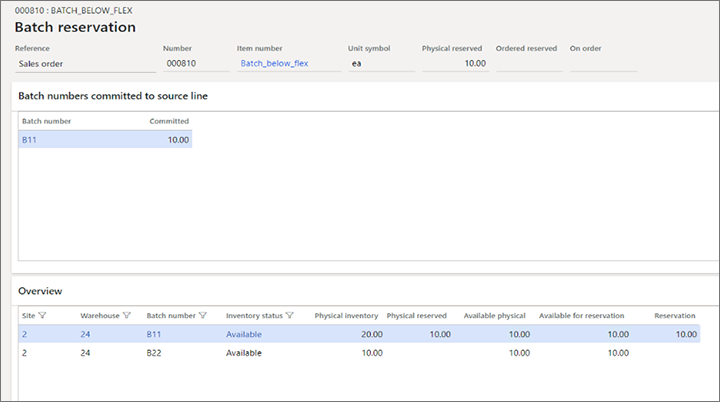
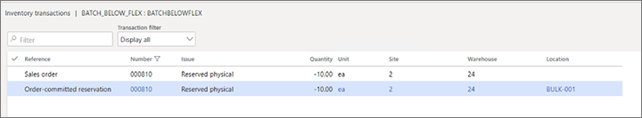
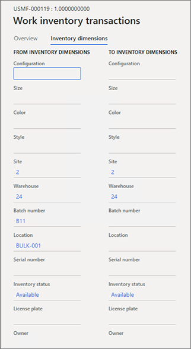
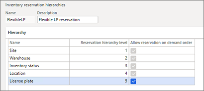
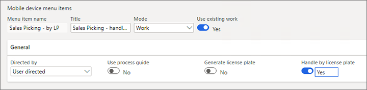

---
# required metadata

title: Flexible warehouse-level dimension reservation policy
description: This article describes the inventory reservation policy that lets businesses that sell batch-tracked products and run their logistics as WMS-enabled operations reserve specific batches for customer sales orders, even though the reservation hierarchy that is associated with the products disallows reservation of specific batches.
author: perlynne
ms.date: 08/09/2022
ms.topic: article
ms.prod: 
ms.technology: 

# optional metadata

ms.search.form: WHSReservationHierarchy, WHSWorkTrans, WHSWorkInventTrans, WHSInventTableReservationHierarchy, WHSReservationHierarchyCreate, WHSInventTableReservationHierarchy 
# ROBOTS: 
audience: Application User
# ms.devlang: 
ms.reviewer: kamaybac
# ms.tgt_pltfrm: 
# ms.custom: 
# ms.assetid: 
ms.search.region: Global
# ms.search.industry: 
ms.author: perlynne
ms.search.validFrom: 2020-01-15
ms.dyn365.ops.version: 10.0.13

---

# Flexible warehouse-level dimension reservation policy

[!include [banner](../includes/banner.md)]

When an inventory reservation hierarchy of the *Batch-below\[location\]* type is associated with products, businesses that sell batch-tracked products and run their logistics as operations that are enabled for the warehouse management processes (WMS) can't reserve specific batches of those products for customer sales orders.

In a similar way, specific license plates can't be reserved for products on sales orders when those products are associated with the default reservation hierarchy.

This article describes the inventory reservation policy that lets these businesses reserve specific batches or license plates, even when the products are associated with a *Batch-below\[location\]* reservation hierarchy.

## Inventory reservation hierarchy

This section summarizes the existing inventory reservation hierarchy.

The inventory reservation hierarchy dictates that, as far as storage dimensions are concerned, the demand order carries the mandatory dimensions of site, warehouse, and inventory status. In other words, the mandatory dimensions are all the dimensions above the location dimension in the reservation hierarchy, while the warehouse logic is responsible for assigning a location to the requested quantities and reserving the location. In the interactions between the demand order and the warehouse operations, the demand order is expected to indicate where the order must be shipped from (that is, what site and warehouse). The warehouse then relies on its logic to find the required quantity in the warehouse premises.

However, to reflect the operational model of the business, tracking dimensions (batch and serial numbers) are subject to more flexibility. An inventory reservation hierarchy can accommodate scenarios where the following conditions apply:

- The business relies on its warehouse operations to manage picking of quantities that have batch or serial numbers *after* the quantities have been found in the warehousing storage space. This model is often referred to as *Batch-below\[location\]* or *Serial-below\[location\]*. It's typically used when a product's batch or serial number identification isn't important to the customers who place the demand with the selling company.
- The business relies on its warehouse operations to manage picking of quantities that have batch or serial numbers *before* the quantities have been found in the warehousing storage space. If batch or serial numbers are necessary as part of a customer's order specification, they are recorded on the demand order, and the warehouse operations that find the quantities in the warehouse aren't allowed to change them. This model is referred to as *Batch-above\[location\]* or *Serial-above\[location\]*. Because the dimensions above location are the specific requirements for the demands that must be fulfilled, the warehouse logic won't allocate them. These dimensions **must** always be specified on the demand order or in the related reservations.

In these scenarios, the challenge is that only one inventory reservation hierarchy can be assigned to each released product. Therefore, for the WMS to handle tracked items, after the hierarchy assignment determines when the batch or serial number should be reserved (either when the demand order is taken or during the warehouse picking work), this timing can't be changed on an ad-hoc basis.

## Flexible reservation for batch-tracked items

### Business scenario

In this scenario, a company uses an inventory strategy where finished goods are tracked by batch numbers. This company also uses the WMS workload. Because this workload has well-equipped logic for planning and running warehouse picking and shipping operations for batch-enabled items, most of the finished items are associated with a *Batch-below\[location\]* inventory reservation hierarchy. The advantage of this type of operational setup is that decisions (which are effectively reservation decisions) about which batches to pick and where to put them in the warehouse are postponed until the warehouse picking operations start. They aren't made when the customer's order is placed.

Although the *Batch-below\[location\]* reservation hierarchy serves the company's business goals well, many of the company's established customers require the same batch that they previously purchased when they reorder products. Therefore, the company is looking for flexibility in the way that the batch reservation rules are handled, so that, depending on the customers' demand for the same item, the following behaviors occur:

- A batch number can be recorded and reserved when the order is taken by the sales processor, and it can't be changed during warehouse operations and/or taken by other demands. This behavior helps guarantee that the batch number that was ordered is shipped to the customer.
- If the batch number isn't important to the customer, the warehouse operations can determine a batch number during picking work, after sales order registration and reservation have been done.

### Allowing reservation of a specific batch on the sales order

To accommodate the desired flexibility in the batch reservation behavior for items that are associated with a *Batch-below\[location\]* inventory reservation hierarchy, inventory managers must select the **Allow reservation on demand order** check box for the **Batch number** level on the **Inventory reservation hierarchies** page.

When the **Batch number** level in the hierarchy is selected, all dimensions above that level and up through the **Location** level will be automatically selected. (By default, all dimensions above the **Location** level are preselected.) This behavior reflects the logic where all dimensions in the range between the batch number and location are also automatically reserved after you reserve a specific batch number on the order line.

> [!NOTE]
> The **Allow reservation on demand order** check box applies only to reservation hierarchy levels that are below the warehouse location dimension.
>
> **Batch number** and **License plate** are the only levels in the hierarchy that are open for the flexible reservation policy. In other words, you can't select the **Allow reservation on demand order** check box for the **Location** or **Serial number** level.
>
> If your reservation hierarchy includes the serial number dimension (which must always be below the **Batch number** level), and if you've turned on batch-specific reservation for the batch number, the system will continue to handle serial number reservation and picking operations, based on the rules that apply to the *Serial-below\[location\]* reservation policy.

At any point, you can allow batch-specific reservation for an existing *Batch-below\[location\]* reservation hierarchy in your deployment. This change won't affect any reservations and open warehouse work that were created before the change occurred. However, the **Allow reservation on demand order** check box can't be cleared if inventory transactions of the **Reserved ordered**, **Reserved physical**, or **Ordered** issue type exist for one or more items that are associated with that reservation hierarchy.

> [!NOTE]
> If an item's existing reservation hierarchy doesn't allow batch specification on the order, you can reassign it to a reservation hierarchy that does allow batch specification, provided that the hierarchy level structure is the same in both hierarchies. Use the **Change reservation hierarchy for items** function to do the reassignment. This change might be relevant when you want to prevent flexible batch reservation for a subset of batch-tracked items but allow it for the rest of the product portfolio.

Regardless of whether you've selected the **Allow reservation on demand order** check box, if you don't want to reserve a specific batch number for the item on an order line, default warehouse operations logic that is valid for a *Batch-below\[location\]* reservation hierarchy will still apply.

### Reserve a specific batch number for a customer order

After a batch-tracked item's *Batch-below\[location\]* inventory reservation hierarchy is set up to allow reservation of specific batch numbers on sales orders, sales order processors can take customer orders for the same item in one of the following ways, depending on the customer's request:

- **Enter order details without specifying a batch number** – This approach should be used when the product's batch specification isn't important to the customer. All existing processes that are associated with handling an order of this type in the system remain unchanged. No additional considerations are required on the part of users.
- **Enter order details and reserve a specific batch number** – This approach should be used when the customer requests a specific batch. Typically, customers will request a specific batch when they are reordering a product that they previously purchased. This type of batch-specific reservation is referred to as *order-committed reservation*.

The following set of rules is valid when quantities are processed, and a batch number is committed to a specific order:

- To allow reservation of a specific batch number for an item under the *Batch-below\[location\]* reservation policy, the system must reserve all dimensions up through location. This range typically includes the license plate dimension.
- Location directives aren't used when picking work is created for a sales line that uses order-committed batch reservation.
- During warehouse processing of work for order-committed batches, neither the user nor the system is allowed to change the batch number. (This processing includes exception handling.)

The following example shows the end-to-end flow.

## Example scenario: Batch number allocation

For this example, demo data must be installed, and you must use the **USMF** demo data company.

### Set up an inventory reservation hierarchy to allow batch-specific reservation

1. Go to **Warehouse management** \> **Setup** \> **Inventory \> Reservation hierarchy**.
2. Select **New**.
3. In the **Name** field, enter a name (for example, **BatchFlex**).
4. In the **Description** field, enter a description (for example, **Batch below flexible**).
5. In the **Selected** field, select **Serial number** and **Owner**, and then select the left arrow button to move them to the **Available** field.
6. Select **OK**.
7. In the row for the **Batch number** dimension level, select the **Allow reservation on demand order** check box. The **License plate** and **Location** levels are automatically selected, and you can't clear the check boxes for them.
8. Select **Save**.

### Create a new released product

1. Set the product's three master data parameters by using these values:

    - In the **Storage dimension group** field, select **Ware**.
    - In the **Tracking dimension group** field, select **Batch-Phy**.
    - In the **Reservation hierarchy** field, select **BatchFlex**.

2. Create two batch numbers, such as **B11** and **B22**.
3. Add item quantities to on-hand stock by using the following values.

    | Warehouse | Batch number | Location | License plate | Quantity |
    |-----------|--------------|----------|---------------|----------|
    | 24        | B11          | BULK-001 | None          | 10       |
    | 24        | B11          | FL-001   | LP11          | 10       |
    | 24        | B22          | FL-002   | LP22          | 10       |

### Enter sales order details

1. Go to **Sales and marketing** \> **Sales orders** \> **All sales orders**.
2. Select **New**.
3. On the sales order header, in the **Customer account** field, enter **US-003**.
4. Add a line for the new item, and enter **10** as the quantity. Make sure that the **Warehouse** field is set to **24**.
5. On the **Sales order lines** FastTab, select **Inventory**, and then, in the **Maintain** group, select **Batch reservation**. The **Batch reservation** page shows a list of batches that are available for reservation for the order line. For this example, it shows a quantity of **20** for batch number **B11** and a quantity of **10** for batch number **B22**. Note that the **Batch reservation** page cannot be accessed from a line if the item on that line is associated with *Batch-below\[location\]* reservation hierarchy unless it is set up to allow batch-specific reservation.

    > [!NOTE]
    > To reserve a specific batch for a sales order, you must use the **Batch reservation** page.
    >
    > If you enter the batch number directly on the sales order line, the system will behave as though you entered a specific batch value for an item that is subject to the *Batch-below\[location\]* reservation policy. When you save the line, you will receive a warning message. If you confirm that the batch number should be specified directly on the order line, the line won't be handled by the regular warehouse management logic.
    >
    > If you reserve the quantity from the **Reservation** page, no specific batch will be reserved, and the execution of warehouse operations for the line will follow the rules that are applicable under the *Batch-below\[location\]* reservation policy.

    In general, this page works and is interacted with in the same way for items that have an associated reservation hierarchy of the *Batch-above\[location\]* type. However, the following exceptions apply:

    - The **Batch numbers committed to source line** FastTab shows the batch numbers that are reserved for the order line. The batch values in the grid will be shown throughout the fulfillment cycle of the order line, including the warehouse processing stages. By contrast, on the **Overview** FastTab, regular order line reservation (that is, reservation that is done for the dimensions above the **Location** level) is shown in the grid up to the point when warehouse work is created. The work entity then takes over the line reservation, and the line reservation no longer appears on the page. The **Batch numbers committed to source line** FastTab helps guarantee that the sales order processor can view the batch numbers that were committed to the customer's order at any point during its lifecycle, up through invoicing.
    - In addition to reserving a specific batch, a user can manually select the batch's specific location and license plate instead of letting the system automatically select them. This capability is related to the design of the order-committed batch reservation mechanism. As was mentioned earlier, when a batch number is reserved for an item under the *Batch-below\[location\]* reservation policy, the system must reserve all dimensions up through location. Therefore, warehouse work will carry the same storage dimensions that were reserved by the users who worked with the orders, and it might not always represent the item storage placement that is convenient, or even possible, for picking operations. If order processors are aware of the warehouse constraints, they might want to manually select the specific locations and license plates when they reserve a batch. In this case, the user must use the **Display dimensions** functionality on the page header, and must add the location and license plate in the grid on the **Overview** FastTab.

6. On the **Batch reservation** page, select the line for batch **B11**, and then select **Reserve line**. There is no designated logic for assigning locations and license plates during automatic reservation. You can manually enter the quantity in the **Reservation** field. Notice that, on the **Batch numbers committed to source line** FastTab, batch **B11** is shown as **Committed**.

    

    > [!NOTE]
    > Reservation of the quantity on a sales order line can be done across multiple batches. Likewise, reservation of the same batch can be done against multiple locations and license plates (if license plates are enabled for the locations).
    >
    > Reservation of a specific batch for the quantity on a sales order line can also be partial. For example, the total quantity of 100 units can be reserved so that a specific batch is committed to 20 units, whereas 80 units are reserved at the site and warehouse levels for any available batch. In this case, the WMS will handle picking operations by using two separate work lines.

7. Go to **Product information management** \> **Products** \> **Released products**. Select your item, and then select **Manage inventory** \> **View** \> **Transactions**.

    

8. Review the item's inventory transactions that are related to the sales order line reservation.

    - A transaction where the **Reference** field is set to **Sales order** and the **Issue** field is set to **Reserved physical** represents the order line reservation for the inventory dimensions above the **Location** level. According to the item's inventory reservation hierarchy, those dimensions are site, warehouse, and inventory status.
    - A transaction where the **Reference** field is set to **Order-committed reservation** and the **Issue** field is set to **Reserved physical** represents the order line reservation for the specific batch and all inventory dimensions above it. According to the item's inventory reservation hierarchy, those dimensions are batch number and location. In this example, the location is **Bulk-001**.

9. On the sales order header, select **Warehouse** \> **Actions** \> **Release to warehouse**. The order line is now waved, and a load and work are created.

### Review and process warehouse work that has order-committed batch numbers

1. On the **Sales order lines** FastTab, select **Warehouse** \> **Work details**.

    The work that handles the picking operation for batch quantities that are committed to the sales order line has the following characteristics:

    - To create work, the system uses work templates but not location directives. All the standard settings that are defined for work templates, such as a maximum number of pick lines or a specific unit of measure, will be applied to determine when new work should be created. However, the rules that are associated with location directives for identifying pick locations aren't considered, because the order-committed reservation already specifies all the inventory dimensions. Those inventory dimensions include the dimensions at the warehouse storage level. Therefore, the work inherits those dimensions without having to consult location directives.
    - The batch number isn't shown on the pick line (as is the case for the work line that is created for an item that has an associated *Batch-above\[location\]* reservation hierarchy.) Instead, the "from" batch number and all other storage dimensions are shown on the work line's work inventory transaction that is referenced from the associated inventory transactions.

        

    - After work is created, the item's inventory transaction where the **Reference** field is set to **Order-committed reservation** is removed. The inventory transaction where the **Reference** field is set to **Work** now holds the physical reservation on all the quantity's inventory dimensions.

        Warehouse operations can proceed to handle execution of the work in the usual manner. However, the instructions on the mobile device will instruct the worker to pick a specific batch number. In warehouse environments where locations are license plate–controlled, after a worker reaches a location that stores the same batch on multiple license plates, they can pick from any license plate that isn't already reserved (for example, by another order-committed reservation or work that originates from a reservation of that type.)

        If it turns out to be impractical to pick from the location that is specified on the work line, the warehouse operators can use one of the following actions to redirect picking of the specific batch from a more convenient location:

        - The standard **Override location** action on a mobile device (provided that the warehouse worker's **Allow pick location override** setting is enabled)
        - The **Change location** action on the **Work list details** page. 

2. On the mobile device, finish picking and putting the work.

    The quantity of **10** for batch number **B11** is now picked for the sales order line and put in the **Baydoor** location. At this point, it's ready to be loaded onto the truck and dispatched to the customer's address.

## Flexible license plate reservation

### Business scenario

In this scenario, a company uses warehouse management and work processing, and handles load planning at the level of individual pallets/containers outside Supply Chain Management before work is created. These containers are represented by license plates in the inventory dimensions. Therefore, for this approach, specific license plates must be pre-assigned to sales order lines before picking work is done. The company is looking for flexibility in the way that the license plate reservation rules are handled, so that the following behaviors occur:

- A license plate can be recorded and reserved when the order is taken by the sales processor, and it can't be taken by other demands. This behavior helps guarantee that the license plate that was planned is shipped to the customer.
- If the license plate isn't already assigned to a sales order line, warehouse personnel can select a license plate during picking work, after sales order registration and reservation are completed.

### Turn flexible license plate reservation on or off

Before you can use flexible license plate reservation, two features must be turned on for your system. Admins can use the [feature management](../../fin-ops-core/fin-ops/get-started/feature-management/feature-management-overview.md) settings to check the status of the features and turn them on if they are required. You must turn on the features in the following order:

1. *Flexible warehouse-level dimension reservation* (As of Supply Chain Management version 10.0.29, this feature is mandatory and can't be turned off.)
1. *Flexible order-committed license plate reservation* (As of Supply Chain Management version 10.0.29, this feature is mandatory and can't be turned off.)

### Reserve a specific license plate on the sales order

To enable license plate reservation on an order, you must select the **Allow reservation on demand order** check box for the **License plate** level on the **Inventory reservation hierarchies** page for the hierarchy that is associated with the relevant item.

You can enable license plate reservation on the order at any point in your deployment. This change won't affect any reservations or open warehouse work that were created before the change occurred. However, you can't clear the **Allow reservation on demand order** check box if open outbound inventory transactions that have an issue status of *On order*, *Reserved ordered*, or *Reserved physical* exist for one or more items that are associated with that reservation hierarchy.

Even if the **Allow reservation on demand order** check box is selected for the **License plate** level, it's still possible *not* to reserve a specific license plate on the order. In this case, the default warehouse operations logic that is valid for the reservation hierarchy applies.

To reserve a specific license plate, you must use an [Open Data Protocol (OData)](../../fin-ops-core/dev-itpro/data-entities/odata.md) process. In the application, you can do this reservation directly from a sales order by using the **Order-committed reservations per license plate** option of the **Open in Excel** command. In the entity data that is opened in the Excel add-in, you must enter the following reservation-related data and then select **Publish** to send the data back to Supply Chain Management:

- Reference (Only the *Sales order* value is supported.)
- Order number (The value can be derived from the lot.)
- Lot ID
- License plate
- Quantity

If you must reserve a specific license plate for a batch-tracked item, use the **Batch reservation** page, as described in the [Enter sales order details](#sales-order-details) section.

When the sales order line that uses an order-committed license plate reservation is processed by warehouse operations, location directives aren't used.

If a warehouse work item consists of lines that equal a complete pallet and have license plate–committed quantities, you can optimize the picking process by using a mobile device menu item where the **Handle by license plate** option is set to *Yes*. A warehouse worker can then scan a license plate to complete a pick instead of having to scan the items from the work one by one.

Because the **Handle by license plate** functionality doesn't support work that covers multiple pallets, it's better to have a separate work item for different license plates. To use this approach, add the **Order-committed license plate ID** field as a work header break on the **Work template** page.

> [!NOTE]
> For the order-committed work creation process, an "order-committed inventory dimension" value will be assigned to the picking work lines, and it won't be possible to view the license plate value directly. Only the *User directed* process is supported when setting up a mobile device menu item.

## Example scenario: Set up and process an order-committed license plate reservation

This scenario shows how to set up and process an order-committed license plate reservation.

### Make demo data available

This scenario refers to values and records that are included in the standard demo data that is provided for Supply Chain Management. If you want to work through the scenario by using the values that are provided here, be sure to work on an environment where the demo data is installed. Additionally, set the legal entity to **USMF** before you begin.

### Create an inventory reservation hierarchy that allows for license plate reservation

1. Go to **Warehouse management \> Setup \> Inventory \> Reservation hierarchy**.
1. Select **New**.
1. In the **Name** field, enter a value (for example, *FlexibleLP*).
1. In the **Description** field, enter a value (for example, *Flexible LP reservation*).
1. In the **Selected** list, select **Batch number**, **Serial number**, and **Owner**.
1. Select the **Remove** button  to move the selected records to the **Available** list.
1. Select **OK**.
1. In the row for the **License plate** dimension level, select the **Allow reservation on demand order** check box. The **Location** level is automatically selected, and you can't clear the check box for it.
1. Select **Save**.

### Create two released products

1. Go to **Product information management \> Products \> Released products**.
1. On the Action Pane, select **New**.
1. In the **New released product** dialog box, set the following values:

    - **Product number:** *Item1*
    - **Item number:** *Item1*
    - **Item model group:** *FIFO*
    - **Item group:** *Audio*
    - **Storage dimension group:** *Ware*
    - **Tracking dimension group:** *None*
    - **Reservation hierarchy:** *FlexibleLP*

1. Select **OK** to create the product and close the dialog box.
1. The new product is opened. On the **Warehouse** FastTab, set the **Unit sequence group ID** field to *ea*.
1. Repeat the previous steps to create a second product that has the same settings, but set the **Product number** and **Item number** fields to *Item2*.
1. On the Action Pane, on the **Manage inventory** tab, in the **View** group, select **On-hand inventory**. Then select **Quantity adjustment**.
1. Adjust the on-hand inventory of the new items as specified in the following table.

    | Item  | Warehouse | Location | License plate | Quantity |
    |-------|-----------|----------|---------------|----------|
    | Item1 | 24        | FL-010   | LP01          | 10       |
    | Item1 | 24        | FL-011   | LP02          | 10       |
    | Item2 | 24        | FL-010   | LP01          | 5        |
    | Item2 | 24        | FL-011   | LP02          | 5        |

    > [!NOTE]
    > You must create the two license plates and use locations that allow for mixed items, such as *FL-010* and *FL-011*.

### Create a sales order and reserve a specific license plate

1. Go to **Sales and marketing \> Sales orders \> All sales orders**.
1. Select **New**.
1. In the **Create sales order** dialog box, set the following values:

    - **Customer account:** *US-001*
    - **Warehouse:** *24*

1. Select **OK** to close the **Create sales order** dialog box and open the new sales order.
1. On the **Sales order lines** FastTab, add a line that has the following settings:

    - **Item number:** *Item1*
    - **Quantity:** *10*

1. Add a second sales order line that has the following settings:

    - **Item number:** *Item2*
    - **Quantity:** *5*

1. Select **Save**.
1. On the **Line details** FastTab, on the **Setup** tab, make a note of the **Lot ID** value for each line. These values will be required during reservation of specific license plates.

    > [!NOTE]
    > To reserve a specific license plate, you must use the **Order-committed reservations per license plate** data entity. To reserve a batch-tracked item on a specific license plate, you can also use the **Batch reservation** page, as described in the [Enter sales order details](#sales-order-details) section.
    >
    > If you enter the license plate directly on the sales order line and confirm it to the system, warehouse management processing won't be used for the line.

1. Select **Open in Microsoft Office**, select **Order-committed reservations per license plate**, and download the file.
1. Open the downloaded file in Excel, and select **Enable editing** to enable the Excel add-in to run.
1. If you're running the Excel add-in for the first time, select **Trust this Add-in**.
1. If you're prompted to sign in, select **Sign in**, and then sign in by using the same credentials that you used to sign in to Supply Chain Management.
1. To reserve an item on a specific license plate, in the Excel add-in, select **New** to add a reservation line, and then set the following values:

    - **Lot ID:** Enter the **Lot ID** value that you found for the sales order line for *Item1*.
    - **License plate:** *LP02*
    - **ReservedInventoryQuantity:** *10*

1. Select **New** to add another reservation line, and set the following values:

    - **Lot ID:** Enter the **Lot ID** value you found for the sales order line for *Item2*.
    - **License plate:** *LP02*
    - **ReservedInventoryQuantity:** *5*

1. In the Excel add-in, select **Publish** to send the data back to Supply Chain Management.

    > [!NOTE]
    > The reservation line will appear in the system only if publishing is completed without errors.

1. Go back to Supply Chain Management. 
1. To review the item's reservation, on the **Sales order lines** FastTab, on the **Inventory** menu, select **Maintain \> Reservation**. Notice that, for the sales order line for *Item1*, inventory of *10* is reserved, and for the sales order line for *Item2*, inventory of *5* is reserved.
1. To review inventory transactions that are related to the sales order line reservation, on the **Sales order lines** FastTab, on the **Inventory** menu, select **View \> Transactions**. Notice that there are two transactions that are related to the reservation: one where the **Reference** field is set to *Sales order* and one where the **Reference** field is set to *Order-committed reservation*.

    > [!NOTE]
    > A transaction where the **Reference** field is set to *Sales order* represents the order line reservation for inventory dimensions that are above the **Location** level (site, warehouse, and inventory status). A transaction where the **Reference** field is set to *Order-committed reservation* represents the order line reservation for the specific license plate and location.

1. To release the sales order, on the Action Pane, on the **Warehouse** tab, in the **Actions** group, select **Release to warehouse**.

### Review and process warehouse work with order-committed license plates assigned

1. On the **Sales order lines** FastTab, on the **Warehouse** menu, select **Work details**.

    As when reservation is done for a specific batch, the system doesn't use location directives when it creates the work for the sales order that uses license plate reservation. Because the order-committed reservation specifies all the inventory dimensions, including the location, location directives don't have to be used, because those inventory dimensions are just entered in the work. They are shown in the **From inventory dimensions** section on the **Work inventory transactions** page.

    > [!NOTE]
    > After the work is created, the item's inventory transaction where the **Reference** field is set to *Order-committed reservation* is removed. The inventory transaction where the **Reference** field is set to *Work* now holds the physical reservation for all the quantity's inventory dimensions.

1. On the mobile device, finish picking and putting the work by using a menu item where the **Handle by license plate** check box is selected.

    > [!NOTE]
    > The **Handle by license plate** functionality helps you process the whole license plate. If you must process part of the license plate, you can't use this functionality.
    >
    > We recommend that you have separate work generated for each license plate. To achieve this result, use the **Work header breaks** feature on the **Work template** page.

    License plate *LP02* is now picked for sales order lines and put to the *Baydoor* location. At this point, it's ready to be loaded and dispatched to the customer.

## Exception handling of warehouse work that has order-committed batch numbers

Warehouse work for picking order-committed batch numbers is subject to the same standard warehouse exception handling and actions as regular work. In general, the open work or work line can be canceled, it can be interrupted because a user location is full, it can be short-picked, and it can be updated because of a movement. Likewise, the picked quantity of work that has already been completed can be reduced, or the work can be reversed.

The following key rule is applied to all these exception handling actions: the batch number that was reserved for the customer can never be replaced with a different batch number, but its storage dimensions (location and license plate) can be changed through either a manual update by the user or an automatic update by the system. The automatic update is based on the same random assignment of storage dimensions that applied when a specific batch was automatically reserved but no storage dimensions were specified.

### Example scenario

An example of this scenario is a situation where previously completed work is being unpicked by using the **Reduce picked quantity** function. This example assumes that you've already completed the steps that are described in [Example scenario: Batch number allocation](#Example-batch-allocation). It continues from that example.

1. Go to **Warehouse management** \> **Loads** \> **Active loads**.
2. Select the load that was created in connection with the shipment of your sales order.
3. From the **Load order lines** FastTab, select **Reduce picked quantity**.
4. On the **Reduce picked quantity** page, in the **Move to location** field, select **FL-001**.
5. In the **Move to license plate** field, select **LP33**.
6. In the grid, in the **Inventory quantity to unpick** field, enter **10**.
7. Select **OK**.

Here are the results of the unpicking action:

- The status of the previously closed work is set to **Canceled**.
- New work of the **Inventory movement** type is created for the unpicked quantity of **10** for batch number **B11**. This work represents the movement from the **Baydoor** location to license plate **LP33** in location **FL-001**. The status is set to **Closed**.
- The system re-reserves the batch number that was originally ordered, and assigns the location and license plate IDs. (This process is equivalent to running the **Reserve line** function for the order line for a given batch number). As a result, batch **B11** is shown as committed on the **Batch numbers committed to source line** FastTab of the **Batch reservation** page, and the **Reservation** field contains a quantity of **10** for batch number **B11**. Additionally, the **Location** field is set to **FL-001**, and the **License plate** field is set to **LP11**. (You can add these fields to the grid if they aren't visible.)

The following tables provide an overview that shows how the system handles order-committed batch reservation for specific warehouse actions. To interpret the content in the tables, assume that each warehouse action is run in the context of existing warehouse work that originates from an order-committed batch reservation, or that execution of each warehouse action affects work of that type.

> [!NOTE]
> In these tables, the "Batch quantity is available" column indicates whether a batch quantity is available in addition to the quantity that is either already reserved for the current order-committed reservations or already reserved by the warehouse work that originates from reservations of that type.

#### Override the pick location on the open work

<table>
<thead>
<tr>
<th>Key setup parameter</th>
<th>Batch quantity is available</th>
<th>Key user steps</th>
<th>Warehouse work</th>
<th>Order-committed batch reservation</th>
</tr>
</thead>
<tbody>
<tr>
<td rowspan='2'>The <strong>Allow pick location override</strong> option is enabled on the worker.</td>
<td>Yes</td>
<td>
<ol>
<li>Select the <strong>Override location</strong> menu item on the Warehouse Management mobile app when you start picking work.</li>
<li>Select <strong>Suggest</strong>.</li>
<li>Confirm the new location that is suggested based on batch quantity availability.</li>
</ol>
</td>
<td>On the current work, the following actions occur:
<ul>
<li>The location on the pick line is updated to the new location. (If the location is license plate–controlled, a random license plate is assigned to the work inventory transaction, and the worker can pick from any license plate that has available quantity.)</li>
<li>If the quantity is found on more than one license plate in the new location, the original pick line is split into multiple lines to match each license plate.</li>
</ul>
</td>
<td>Not applicable</td>
</tr>
<tr>
<td>No</td>
<td>
<ol>
<li>Select the <strong>Override location</strong> menu item on the Warehouse Management mobile app when you start picking work.</li>
<li>Manually enter a location.</li>
</ol>
</td>
<td>The <strong>Override location</strong> action isn't possible. It fails, and an error is thrown.</td>
<td>Not applicable</td>
</tr>
</tbody>
</table>

#### Full button – Split a work line because of overflow on the user location

<table>
<thead>
<tr>
<th>Key setup parameter</th>
<th>Batch quantity is available</th>
<th>Key user steps</th>
<th>Warehouse work</th>
<th>Order-committed batch reservation</th>
</tr>
</thead>
<tbody>
<tr>
<td>The <strong>Allow splitting of work</strong> option is enabled on the mobile device menu item.</td>
<td>Not applicable</td>
<td>
<ol>
<li>Select the <strong>Full</strong> menu item on the Warehouse Management mobile app when you process picking work.</li>
<li>In the <strong>Pick Qty</strong> field, enter a partial quantity of the required pick to indicate the full capacity.</li>
</ol>
</td>
<td>
<ul>
<li>On the current work, the quantity is updated to the remaining quantity that must be picked.</li>
<li>New work for the picked quantity is created and closed.</li>
</ul></td>
<td>Not applicable</td>
</tr>
</tbody>
</table>

#### Reduce the picked quantity of completed work (from a load)

<table>
<thead>
<tr>
<th>Key setup parameter</th>
<th>Batch quantity is available</th>
<th>Key user steps</th>
<th>Warehouse work</th>
<th>Order-committed batch reservation</th>
</tr>
</thead>
<tbody>
<tr>
<td rowspan='2'>Not applicable</td>
<td>Yes</td>
<td>
<ol>
<li>Open the <strong>Reduce picked quantity</strong> page from the load line.</li>
<li>Enter the full quantity to unpick.</li>
<li>Select a "move to" location/license plate.</li>
</ol>
</td>
<td>
<ul> 
<li>Work that is associated with the load line is canceled.</li>
<li>New work for the inventory movement is created and closed.</li>
</ul>
</td>
<td>The quantity is re-reserved for the same batch. The system randomly assigns a location and license plate (if the location is license plate–controlled) where the quantity is available.</td>
</tr>
<tr>
<td>No</td>
<td>See the previous row.</td>
<td>See the previous row.</td>
<td>The quantity is re-reserved for the same batch, and for the same location and license plate (if the location is license plate–controlled) that were entered during unpicking.</td>
</tr>
</tbody>
</table>

#### Move an item within a warehouse

> [!NOTE]
> This warehouse action is applicable only to movement of the **Work creation process** type, not to movement by template.

<table>
<thead>
<tr>
<th>Key setup parameter</th>
<th>Batch quantity is available</th>
<th>Key user steps</th>
<th>Warehouse work</th>
<th>Order-committed batch reservation</th>
</tr>
</thead>
<tbody>
<tr>
<td rowspan='2'>The <strong>Allow movement of inventory with associated work</strong> option is enabled on the worker.</td>
<td>Yes</td>
<td>
<ol>
<li>Start a movement on the Warehouse Management mobile app.</li>
<li>Enter "from" and "to" locations.</li>
</ol></td>
<td>
<ul>
<li>On all existing work that is affected by the move, the pick location is updated to the new "to" location.</li>
<li>New work for the inventory movement is created and closed.</li>
</ul>
</td>
<td>All existing reservations that are affected by the quantity movement from the given location are re-reserved for the same batch. The system randomly assigns a location and license plate (if the location is license plate–controlled) where the quantity is available.</td>
</tr>
<tr>
<td>No</td>
<td>See the previous row.</td>
<td>See the previous row.</td>
<td>All existing reservations that are affected by the quantity movement from the given location are re-reserved for the same batch, and for the new "to" location and license plate (if the location is license plate–controlled).</td>
</tr>
</tbody>
</table>

#### Reverse the picked quantity of completed work (from a load or a wave)

<table>
<thead>
<tr>
<th>Key setup parameter</th>
<th>Batch quantity is available</th>
<th>Key user steps</th>
<th>Warehouse work</th>
<th>Order-committed batch reservation</th>
</tr>
</thead>
<tbody>
<tr>
<td rowspan='6'>Not applicable</td>
<td>Yes</td>
<td>
<ol>
<li>Open the <strong>Reverse work</strong> page.</li>
<li>On the request page, select the <strong>Leave items at current location</strong> option.</li>
</ol>
</td>
<td>All work that is associated with the load is canceled.</td>
<td>The quantity is re-reserved for the same batch. The system randomly assigns a location and license plate (if the location is license plate–controlled) where the quantity is available.</td>
</tr>
<tr>
<td>No</td>
<td>See the previous row.</td>
<td>See the previous row.</td>
<td>The quantity is re-reserved for the same batch, and for the location and license plate where the quantity was left upon reversal.</td>
</tr>
<tr>
<td>Yes</td>
<td>
<ol>
<li>Open the <strong>Reverse work</strong> page.</li>
<li>On the request page, select the <strong>Assign items to this location</strong> option.</li>
</ol>
</td>
<td>
<ul>
<li>The current work is canceled.</li>
<li>New work for the inventory movement is created and closed.</li>
</ul>
</td>
<td>The quantity is re-reserved for the same batch. The system randomly assigns a location and license plate (if the location is license plate–controlled) where the quantity is available.</td>
</tr>
<tr>
<td>No</td>
<td>See the previous row.</td>
<td>See the previous row.</td>
<td>The quantity is re-reserved for the same batch, and for the location and license plate that the quantity was assigned to upon reversal.</td>
</tr>
<tr>
<td>Yes/No</td>
<td>
<ol>
<li>Open the <strong>Reverse work</strong> page.</li>
<li>On the request page, select the <strong>Move items to this location</strong> option.</li>
</ol>
</td>
<td>Reversal isn't supported.</td>
<td>Not applicable</td>
</tr>
<tr>
<td>Yes/No</td>
<td>
<ol>
<li>Open the <strong>Reverse work</strong> page.</li>
<li>On the request page, select the <strong>Move items based on location directives</strong> option.</li>
</ol>
</td>
<td>Reversal isn't supported. </td>
<td>Not applicable</td>
</tr>
</tbody>
</table>

#### Short-pick a quantity – Register the quantity as physically not found at the location/license plate while you perform picking work

<table>
<thead>
<tr>
<th>Key setup parameter</th>
<th>Batch quantity is available</th>
<th>Key user steps</th>
<th>Warehouse work</th>
<th>Order-committed batch reservation</th>
</tr>
</thead>
<tbody>
<tr>
<td rowspan='2'>A work exception of the <strong>Short pick</strong> type is set up, where <strong>Item reallocation</strong> = <strong>None</strong>, <strong>Adjust inventory</strong> = <strong>Yes</strong>, and <strong>Remove reservations</strong> = <strong>No</strong>.</td>
<td>Yes</td>
<td>
<ol>
<li>Select the <strong>Shortpick</strong> menu item on the Warehouse Management mobile app when you run picking work.</li>
<li>In the <strong>Pick Quantity</strong> field, enter <strong>0</strong> (zero).</li>
<li>In the <strong>Reason</strong> field, enter <strong>No reallocation</strong>.</li>
</ol>
</td>
<td>
<ul>
<li>The current work is closed, and the picked quantity is 0 (zero).</li>
<li>An inventory transaction of the <strong>Counting</strong> type and the <strong>Sold</strong> issue type is created to represent the adjustment.</li>
</ul>
</td>
<td>The quantity is re-reserved for the same batch. The system randomly assigns a location and license plate (if the location is license plate–controlled) where the quantity is available.</td>
</tr>
<tr>
<td>No</td>
<td>See the previous row.</td>
<td>
<ul>
<li>The short-picking action fails, and an error is thrown.</li>
<li>The current work remains open.</li>
</ul>
</td>
<td>Not applicable</td>
</tr>
<tr>
<td rowspan='2'>A work exception of the <strong>Short pick</strong> type is set up, where <strong>Item reallocation</strong> = <strong>None</strong>, <strong>Adjust inventory</strong> = <strong>Yes</strong>, and <strong>Remove reservations</strong> = <strong>Yes</strong>.</td>
<td>Yes</td>
<td>
<ol>
<li>Select the <strong>Shortpick</strong> menu item on the Warehouse Management mobile app when you run picking work.</li>
<li>In the <strong>Pick Quantity</strong> field, enter <strong>0</strong> (zero).</li>
<li>In the <strong>Reason</strong> field, enter <strong>No reallocation</strong>.</li>
</ol>
</td>
<td>
<ul>
<li>The current work is closed, and the picked quantity is 0 (zero).</li>
<li>An inventory transaction of the <strong>Counting</strong> type and the <strong>Sold</strong> issue type is created to represent the adjustment.</li>
</ul>
</td>
<td>All existing reservations that are affected by the quantity adjustment in the short-picked location are re-reserved for the same batch. The system randomly assigns a location and license plate (if the location is license plate–controlled) where the quantity is available.</td>
</tr>
<tr>
<td>No</td>
<td>See the previous row.</td>
<td>See the previous row.</td>
<td>All existing reservations that are affected by the quantity adjustment in the short-picked location are removed.</td>
</tr>
<tr>
<td>A work exception of the <strong>Short pick</strong> type is set up, where <strong>Item reallocation</strong> = <strong>Manual</strong>, <strong>Adjust inventory</strong> = <strong>Yes</strong>, and <strong>Remove reservations</strong> = <strong>No/Yes</strong>. Additionally, the <strong>Allow manual item reallocation</strong> option is enabled on the worker.</td>
<td>Yes</td>
<td>
<ol>
<li>Select the <strong>Shortpick</strong> menu item on the Warehouse Management mobile app when you run picking work.</li>
<li>In the <strong>Shortpick Quantity</strong> field, enter <strong>0</strong> (zero).</li>
<li>In the <strong>Reason</strong> field, select <strong>Short Picking with manual reallocation</strong>.</li>
<li>Select the location/license plate in the list.</li>
</ol>
</td>
<td>
<ul>
<li>On the current work, the following actions occur:
<ul>
<li>The pick line is closed, and the picked quantity is 0 (zero).</li>
<li>The put line is canceled.</li>
<li>A new pick line is created. It uses the location/license plate that the user selected.</li>
<li>A new put line is created.</li>
</ul>
</li>
<li>An inventory transaction of the <strong>Counting</strong> type and the <strong>Sold</strong> issue type is created to represent the adjustment.</li>
</ul>
</td>
<td>Not applicable</td>
</tr>
<tr>
<td>A work exception of the <strong>Short pick</strong> type is set up, where <strong>Item reallocation</strong> = <strong>Manual</strong>, <strong>Adjust inventory</strong> = <strong>Yes</strong>, and <strong>Remove reservations</strong> = <strong>No</strong>. Additionally, the <strong>Allow manual item reallocation</strong> option is enabled on the worker.</td>
<td>No</td>
<td>
<ol>
<li>Select the <strong>Shortpick</strong> menu item on the Warehouse Management mobile app when you run picking work.</li>
<li>In the <strong>Shortpick Quantity</strong> field, enter <strong>0</strong> (zero).</li>
<li>In the <strong>Reason</strong> field, select <strong>Short Picking with manual reallocation</strong>.</li>
</ol>
</td>
<td>The short-picking action fails, and an error is thrown.</td>
<td>Not applicable</td>
</tr>
<tr>
<td>A work exception of the <strong>Short pick</strong> type is set up, where <strong>Item reallocation</strong> = <strong>Manual</strong>, <strong>Adjust inventory</strong> = <strong>Yes</strong>, and <strong>Remove reservations</strong> = <strong>Yes</strong>. Additionally, the <strong>Allow manual item reallocation</strong> option is enabled on the worker.</td>
<td>No</td>
<td>
<ol>
<li>Select the <strong>Shortpick</strong> menu item on the Warehouse Management mobile app when you run picking work.</li>
<li>In the <strong>Shortpick Quantity</strong> field, enter <strong>0</strong> (zero).</li>
<li>In the <strong>Reason</strong> field, select <strong>Short Picking with manual reallocation</strong>.</li>
<li>Select the location/license plate in the list.</li>
</ol>
</td>
<td>
<ul>
<li>On the current work, the following actions occur:
<ul>
<li>The pick line is closed, and the picked quantity is 0 (zero).</li>
<li>The put line is canceled.</li>
</ul>
</li>
<li>An inventory transaction of the <strong>Counting</strong> type and the <strong>Sold</strong> issue type is created to represent the adjustment.</li>
</ul>
</td>
<td>All existing reservations that are affected by the quantity adjustment in the short-picked location/license plate are removed.</td>
</tr>
<tr>
<td>A work exception of the <strong>Short pick</strong> type is set up, where <strong>Item reallocation</strong> = <strong>Automatic</strong>, <strong>Adjust inventory</strong> = <strong>Yes/No</strong>, and <strong>Remove reservations</strong> = <strong>Yes/No</strong>.</td>
<td>Not applicable</td>
<td>
<ol>
<li>Select the <strong>Shortpick</strong> menu item on the Warehouse Management mobile app when you run picking work.</li>
<li>In the <strong>Shortpick Quantity</strong> field, enter <strong>0</strong> (zero).</li>
<li>In the <strong>Reason</strong> field, select <strong>Short Picking with automatic reallocation</strong>.</li>
</ol>
</td>
<td>Short-picking that involves automatic reallocation isn't supported.</td>
<td>Short-picking that involves automatic reallocation isn't supported.</td>
</tr>
</tbody>
</table>

#### Change the inventory status

> [!NOTE]
> This warehouse action can be performed from multiple entry points. The example that is shown here uses **Inventory status change** action on the **On-hand by location** page.

<table>
<thead>
<tr>
<th>Key setup parameter</th>
<th>Batch quantity is available</th>
<th>Key user steps</th>
<th>Warehouse work</th>
<th>Order-committed batch reservation</th>
</tr>
</thead>
<tbody>
<tr>
<td rowspan='2'>On the <strong>Warehouse</strong> tab, in the <strong>Warehouse</strong> record, the <strong>Remove reservations and markings</strong> field is set to <strong>Reservations</strong> or <strong>Markings and reservations</strong>.</td>
<td>Yes</td>
<td>
<ol>
<li>Select a specific location.</li>
<li>Select a line that has a specific item, location, and license plate (if the location is license plate–controlled).</li>
<li>Select <strong>Inventory status change</strong>.</li>
<li>Set the <strong>Inventory status</strong> field to <strong>Blocking</strong>.</li>
</ol>
</td>
<td>Inventory status changes aren't allowed for quantities that are reserved for work.</td>
<td>
<ul>
<li>The quantity is re-reserved for the same batch. The system randomly assigns a location and license plate (if the location is license plate–controlled) where the quantity is available.</li>
<li>Two inventory transactions of the <strong>Inventory status change</strong> type are created to represent the change in the inventory status dimension.</li>
<li>An inventory transaction of the <strong>Inventory blocking</strong> type and the <strong>Reserved physical</strong> issue type is created to represent the reservation of the blocked quantity.</li>
</ul>
</td>
</tr>
<tr>
<td>No</td>
<td>See the previous row.</td>
<td>Inventory status changes aren't allowed for quantities that are reserved for work.</td>
<td>
<ul>
<li>The reservation is removed.</li>
<li>Two inventory transactions of the <strong>Inventory status change</strong> type are created to represent the change in the inventory status dimension.</li>
<li>An inventory transaction of the <strong>Inventory blocking</strong> type and the <strong>Reserved physical</strong> issue type is created to represent the reservation of the blocked quantity.</li>
</ul>
</td>
</tr>
<tr>
<td rowspan='2'>On the <strong>Warehouse</strong> tab, in the <strong>Warehouse</strong> record, the <strong>Remove reservations and markings</strong> field is set to <strong>None</strong>.</td>
<td>Yes</td>
<td>
<ol>
<li>Select a specific location.</li>
<li>Select a line that has a specific item, location, and license plate (if the location is license plate–controlled).</li>
<li>Select <strong>Inventory status change</strong>.</li>
<li>Set the <strong>Inventory status</strong> field to <strong>Blocking</strong>.</li>
</ol>
</td>
<td>Inventory status changes aren't allowed for quantities that are reserved for work.</td>
<td>The quantity is re-reserved for the same batch. The system randomly assigns a location and license plate (if the location is license plate–controlled) where the quantity is available.</td>
</tr>
<tr>
<td>No</td>
<td>See the previous row.</td>
<td>Inventory status changes aren't allowed for quantities that are reserved for work.</td>
<td>Inventory status changes aren't allowed.</td>
</tr>
</tbody>
</table>

## Limitations

- The flexible warehouse-level dimension reservation functionality doesn't support the following features:

    - Catch weight management
    - Physical negative inventory
    - Reservation against ordered supply
    - Transfer orders and raw material picking

- The container consolidation rule for packing by directive unit has limitations. For order-committed reservations, we recommend that you not use container build templates where the **Pack by directive unit** field is enabled. In the current design, location directives aren't used when warehouse work is created. Therefore, only the lowest unit in the unit sequence group (the inventory unit) is applied during the containerization wave step.

## See also

- [Batch numbers in Warehouse management](/dynamicsax-2012/appuser-itpro/batch-numbers-in-warehouse-management)
- [Reserve the same batch for a sales order](../sales-marketing/reserve-same-batch-sales-order.md)
- [Pick oldest batch on a mobile device](pick-oldest-batch.md)
- [Batch, serial, and license plate confirmation](batch-and-license-plate-confirmation.md)

[!INCLUDE[footer-include](../../includes/footer-banner.md)]