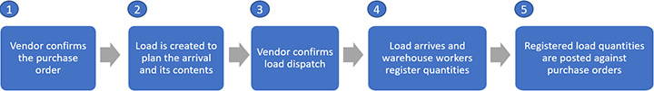
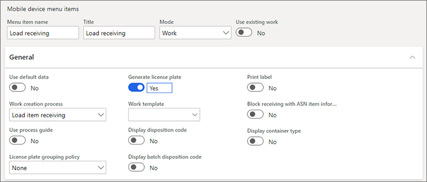
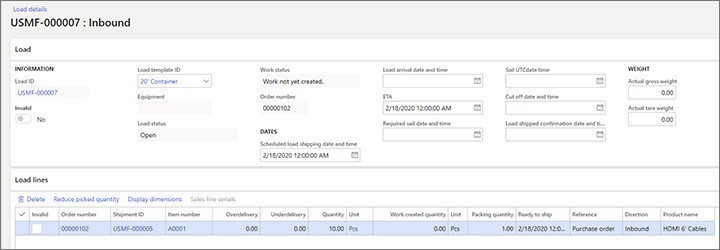

---
# required metadata

title: Warehouse handling of inbound loads for purchase orders
description: This article describes the warehouse handling process for inbound loads for purchase and inbound shipment orders.
author: Mirzaab
ms.date: 03/21/2020
ms.topic: article
ms.prod: 
ms.technology: 

# optional metadata

ms.search.form: WHSLoadTable, WHSLoadPlanningListPage, WHSLoadPlanningWorkbench, WHSInboundLoadPlanningWorkbench, WHSRFMenu, WHSRFMenuItem, WHSInboundShipmentOrder
audience: Application User
# ms.devlang: 
ms.reviewer: kamaybac
# ms.tgt_pltfrm: 
# ms.custom: [used by loc for articles migrated from the wiki]
ms.search.region: Global
# ms.search.industry: [leave blank for most, retail, public sector]
ms.author: mirzaab
ms.search.validFrom: 2020-03-21
ms.dyn365.ops.version: 10.0.10
---

# Warehouse handling of inbound loads for purchase and inbound shipment orders

[!include [banner](../includes/banner.md)]

This article describes the warehouse handling process for inbound loads.

Each inbound load can get associated to one or more order line quantities and your system might also contain transportation plans. For more information about how to create and manage inbound transportation, see [Transportation management overview](../transportation/transportation-management-overview.md).

## Overview: How inbound loads are created, registered, and received

The following high-level illustration shows an example flow for handling inbound loads for a purchase order. Note that in case the purchase order originates for another ERP system than Microsoft Dynamics 365 Supply Chain Management the purchase order will get represented by a _Inbound shipment order_ in the warehouse management module.

1. **The vendor confirms the purchase order.**

    The process begins when a purchase order is entered into the system and then delivered to a vendor, who confirms the order. The purchase order/Inbound shipment order must exist before you can create an inbound load record. However, you can create the inbound load even if the order hasn't been confirmed. For more information, see [Approve and confirm purchase orders](../procurement/purchase-order-approval-confirmation.md).

1. **An inbound load record is created to plan the arrival and its contents.**

    The inbound load record represents a vendor shipment of one or more orders. The load is expected to arrive at the warehouse as one physical transportation unit (such as a truckload). The inbound load record is used for planning purposes and lets the logistics coordinator track the load's progress from the vendor. It's also used to register order line quantities and manage progress through warehouse operations, such as arrival and put-away work. Loads can be created either automatically or manually, and depending on setup the automatic creation can be done directly based on the order data or advanced shipment notice (ASN) from the vendor. For more information, see [Create or modify an inbound load](create-or-modify-an-inbound-load).

1. **The vendor confirms load dispatch.**

    When the vendor dispatches the load, the logistics coordinator at the receiving warehouse confirms the load shipment. If the receiving company is using the **Transportation management** module, inbound shipment confirmation will trigger other load management processes that are associated with the inbound loads. For more information, see [Confirm a load for shipping](/dynamicsax-2012/appuser-itpro/confirm-a-load-for-shipping).

1. **The load arrives at the warehouse, and workers register quantities.**

    When a truckload arrives at the warehouse receiving dock, warehouse workers register the load quantities. When the **Warehouse management** module is used, workers do the registration by using mobile devices. For more information, see [Product receipt against purchase orders - registration](../procurement/product-receipt-against-purchase-orders.md#registration) and the [Register item quantities that arrive on an inbound load](#register-item-quantities-arriving) section.

1. **Registered load quantities are posted against purchase orders.**

    After the load quantities have been registered as arrived, those quantities must be product receipt–posted to the company's inventory ledger to record the physical stock increase. For more information, see [Product receipt against purchase orders - product receipt](../procurement/product-receipt-against-purchase-orders.md#product-receipt) and [Post registered product quantities against purchase orders](#post-registered-quantities).

## Register item quantities that arrive on an inbound load

Microsoft Dynamics 365 Supply Chain Management supports several operational approaches to recording the arrival of ordered products via loads. Therefore, you can configure the system to match your specific business requirements. This section describes how to register incoming item quantities by using the Warehouse management mobile app when an inbound load arrives at the warehouse.
First, warehouse workers must register the item quantities that are included in the load shipment. This workflow is available only if the following items are present in the system:

- **An inbound load record that describes the item quantities that are expected in the shipment**

    Typically, the vendor confirms the inbound load record before the shipment arrives at the warehouse. Therefore, the load has a status of _Shipped_. However, warehouse workers can also register items quantities for loads that have a status of _Open_ or _Received_ depending on setup option.

- **A Warehouse management mobile app that is configured to support load receiving and all related [warehouse setup enabled](get-started-with-setting-up-module)**

    The [Warehouse Management mobile app](../warehousing/install-configure-warehouse-management-app.md) for mobile devices supports the following receiving work creation processes:

  - License plate receiving (and put away)
  - Load item receiving (and put away)
  - Mixed license plate receiving (and put away), where the **Source document line identification method** field for the mobile device menu item is set to _Load item receiving_. For more information, see [Mixed license plate receiving](mixed-license-plate-receiving.md).

  > [!NOTE]
  > In a typical receiving flow the system will generate inbound warehouse work to take quantities that are registered in the receiving location and put them away in the regular storage locations. When using mobile device menu item processes with _put away_, the worker who registered the load quantity will also be instructed by the device to do the put away work as part of the receiving task. By contrast, for the other flows considered as a "two-step" process - typically the movement of the inbound inventory will get processed by another warehouse worker. But many different configuration option exists to control the flow. In some cases it might not make sense to create warehouse work, here the [**work policies**](warehouse-work-policies.md) can get configured not to create inbound warehouse work, in other scenarios it might make sense to include a [inspection/quality process](../inventory/quality-management-for-warehouses-processes.md).

### Handle discrepancies during registration of inbound load quantities

Warehouse workers can do a partial load quantity receipt registration. Each partial load quantity receipt then creates a separate inventory transaction that has a receipt status of _Registered_ for the registered quantity, and the lot ID refers to the originating purchase order line or inbound shipment order line.

#### Load under-receiving

When a load arrives, if the item quantities are less than the quantities that are stated on the load record, warehouse receiving personnel can work directly in the client to acknowledge this discrepancy by reducing the quantity on the load line so that it matches the actual quantity that arrived and was registered.

#### Load over-receiving

Over-receiving occurs when a load arrives, and the item quantities exceed the expected load line quantity. You can control whether and to what degree over-receiving is allowed during load registration.

Use the **Load over receipt** field for the relevant mobile device menu items to control what occurs when a warehouse worker tries to register an overdelivery. This field is available for mobile device menu items that use the following types of work creation processes:

- Load item receiving (and put away)
- Mixed license plate receiving (and put away) for **Source document line identification method** field set to _Load item receiving_

The following table explains the options that are available for the **Load over receipt** field.

| Value | Description |
|---|---|
| Allow | Workers can register the receipt of quantities that exceed the remaining unregistered quantity for a selected load, but only if the total registered quantity doesn't exceed the quantity of the order line that is associated with the load (after adjustment for the overdelivery percentage). |
| Block | 
Workers can't register the receipt of quantities that exceed the remaining unregistered quantity for a selected load (after adjustment for the overdelivery percentage). A worker who tries to do register the receipts will receive an error and won't be able to continue until they register a quantity that is equal to or less than the remaining unregistered load quantity.

By default, the value of the overdelivery percentage on a load line is copied from the associated purchase order line. When the <b>Load over receipt</b> field is set to <i>Block</i>, the system uses the overdelivery percentage value to calculate the total quantity that can be registered for a load line. However, that value can be overwritten for individual loads as required. This behavior becomes relevant during receiving flows where some or all of the excess quantity that represents the order line overdelivery percentage is distributed disproportionally across multiple loads. Here is an example scenario:
<ul><li>There are multiple loads for one purchase order line.</li><li>The purchase order line has an overdelivery percentage that is more than 0 (zero).</li><li>Quantities have already been registered against one or more loads without taking the overdelivery percentage into account.</li><li>The overdelivery quantity arrives on the last load.</li></ul>
In this scenario, a mobile device can be used to register the excess quantity for the last load only if the warehouse supervisor increases the overdelivery percentage for the relevant load line from the default value to a value that is large enough so that the full overdelivery can be registered with the final load.
 |
| Block for closed loads only | Workers can over-receive load line quantities for open loads, but not for loads that have a status of _Received_. |

> [!NOTE]
> The default value of the **Load over receipt** field is _Allow_. When this value is used, the behavior matches the standard behavior that was available before the _Over receipt of load quantities_ feature was introduced in version 10.0.11.

### Put away the registered quantities

When registration is completed on the mobile device, the _Quantity receipt registration_ action updates the inventory and warehouse records to indicate that the quantities are now in the receiving dock location and available for reservation. However, a company's warehouse operations typically require that the quantities be moved from the receiving dock to the regular warehouse storage, so that the subsequent picking processes can occur. Instructions for the put-away are captured in the put-away work that is automatically generated when the inbound load is registered as received.

When the warehouse worker has completed the put-away work, the system records and tracks the result by updating updates several entities, as summarized in the following table.

| Entity | Updates | Note |
|---|---|---|
| Load | 
The following fields are updated:
<ul><li>The <b>Load status</b> value is changed to <i>In process</i>.</li><li>The <b>Work status</b> value is changed to <i>100.00% of work completed</i>.</li></ul> | The **Load status** value is changed to _In process_ when the worker starts the put-away task for at least one line of put-away work. |
| Inventory transactions of work that associated quantities have been put away for | The **Receipt** and **Location** fields, and other relevant fields, are updated to reflect the movement from the receiving location to the storage location. | The **Receipt state** value of the purchase order inventory transaction remains _Registered_. |
| Warehouse put-away | The **Work status** value is changed to _Closed_. | |

## Post registered product quantities against purchase orders

After inbound product quantities are registered in the system, they become available for reservation in connection with sales and other outbound and internal operations. However, the system doesn't yet update the inventory (interim) accounts. This update can occur only when the operations team posts the registered product receipts.

To open a page where they can post a product receipt, members of the operations team can follow any _one_ of these steps:

- Open the relevant load record, and then select the **Product receipt** action.
- Go to **Warehouse management \> Periodic tasks \> Update product receipts**, and then, in the **Load ID** field, specify the load to post.
- Open the relevant purchase order, and then select the **Product receipt** action.
- Go to **Procurement and sourcing \> Purchase orders \> Receiving products \> Posting product receipt job**.

The **Product receipt** action that is available on the **Load** page (and on the equivalent page for the update job, the **Update product receipts** page) can update product receipt quantities only on purchase order quantities that have a status of _Registered_. However, the **Product receipt** action that is available on the **Purchase order** page can include quantities in both processing statuses (_Ordered_ and _Registered_). It can also control the scope of product receipt posting through additional parameters, such as _Receive now quantity_ and _Registered quantity and services_.

Only orders that have a status of _Confirmed_ can be product receipt–posted. For non-confirmed purchase orders, the **Product receipt** action will appear as unavailable.

### Post registered quantities from the Load page

To product receipt–post registered quantities from the **Load** page, the following prerequisites must be in place:

- The load must have at least one quantity unit that has a status of _Registered_.
- The load status must be _Shipped_.
- The purchase order that is associated with the load must have a status of _Confirmed_.

> [!NOTE]
> If the load status hasn't been set to _Shipped_, the system will automatically confirm the load before it runs the product receipt update. (The load status is set to _Shipped_ when a user registers the load's inbound shipment.)

To product receipt–post the arrival registrations that are associated with a selected load, the worker selects the **Product receipt** action on the **Load** page. The page that is opened has the following key details:

- The **Quantity** field in the **Parameters** section on the **Settings** tab shows the _registered quantity_. No other options are available here.
- The grid on the **Overview** FastTab lists all the purchase orders that are included in the selected load.
- The grid on the **Lines** FastTab lists all the order lines that have a registered quantity.

> [!NOTE]
> Quantities for order lines that appear on the **Line** tab are calculated differently, depending on whether the _Allow multiple product receipt per load_ feature is available and turned on in your version of Supply Chain Management.
>
> | Version | Calculation |
> |---|---|
> | Versions before version 10.0.10, and newer versions where the _Allow multiple product receipt per load_ feature isn't turned on | The line quantity is the total of all registered quantities _for that purchase order line_, regardless of whether registration was done over multiple loads, independently of the load, from a mobile device, or from the client. |
> | Version 10.0.10 and later, where the _Allow multiple product receipt per load_ feature is turned on | The line quantity is the total of all registered quantities _for the load record_ that the **Product receipt posting** action was initiated from. |

When the user selects **OK** to confirm product receipt posting, the system does the following key updates on appropriate entities.

| Entity | Updates |
|---|---|
| Inventory transaction of the purchase order for which line quantities have been included in the posting scope | 
The following fields are updated (but note that there are also multiple other updates):
<ul><li>The <b>Receipt</b> field is set to <i>Received</i>.</li><li>The <b>Physical date</b> field is updated with the date of the posting.</li></ul> |
| Load that the user posted the product receipt from | Updates to the loads will depend on the version that is used and the setting of the **Allow multiple product receipt per load** field. The rules are described in the table that appears later in this section. |

The **Allow multiple product receipt per load** field lets companies choose an inbound load receiving policy. Depending on their operational flows, companies might choose to allow or disallow multiple product receipt postings for the same load. We recommend that the logistics manager set the **Allow multiple product receipt per load** field to one of the following values:

- **No** – Select this value if warehouse receiving clerks always register all order quantities that arrive with each load within a designated time frame. If any load quantities aren't registered, the system assumes that they didn't arrive or were not on the load, and therefore should not be considered part of the load. The product receipt posting that is run from a load uses the same assumption. In addition to product receipt–updating all the registered quantities (its main function), it declares the load complete and closed for additional processing. In this case, all load line quantities are automatically updated to the registered quantities, load lines that have no registered quantities are deleted, and the load status is changed to _Received_.
- **Yes** – Select this value if warehouse receiving clerks require more time to register all the quantities on the load that arrived, but, in the meantime, you must product receipt–post the quantities that have already been registered. In this case, the logistics manager will want to keep a load open even after the product receipt posting job is run, so that remaining load quantities can be registered and product receipt–updated to the ledger on an ongoing basis.
- **Prompt** – Select this value if your load receiving practices are mixed, and a decision is required each time that product receipt posting is run.

The following table summarizes the effects of the **Allow multiple product receipt per load** setting.

| Allow multiple product receipt per load | Load quantity | Load status | Note |
|---|---|---|---|
| When this field isn't available (versions before 10.0.10) | 
The load quantity is set so that it equals the registered quantity.

If the load quantity is updated to 0 (zero), which means that no registration has been done, the load line is deleted.

If there are no load lines on the load, the load is deleted.
 | _Received_ | If multiple loads exist for the order line's registered quantity, only the status of the load that the receipt was posted from is updated to _Received_. |
| No | 
The load quantity is set so that it equals the registered quantity that is associated with the load ID.

If no load ID is recorded for the inventory transaction, the behavior matches the behavior in versions before 10.0.10.
 | _Received_ | |
| Yes | No updates | _Received_, if the total registered load quantity is equal to or more than the load quantity | |
| Yes | No updates | _Shipped_ or _In process_, if the total registered load quantity is less than the load quantity | |

After the **Load status** field is set to _Received_, no more product receipt postings can be done for that load. However, the worker can register the remaining order quantity against the received load under the following conditions. (For more information, see the [Load over-receiving](#load-over-receiving) section earlier in this article.)

- The version of Supply Chain Management is older than version 10.0.11.
- The _Over receipt of load quantities_ feature is turned on, and the **Load line quantity over receipt** field on the mobile device menu item for the load item receiving action is set to _Allow_. (As of Supply Chain Management version 10.0.32, the _Over receipt of load quantities_ feature is on by default.)

To product receipt–post additional registered load quantities against a load that has a status of _Received_, the user must run the posting action from the associated purchase order.

### Post registered quantities from the Purchase order page

To product receipt–post registered quantities from the **Purchase order** page, the user completes the following tasks before they select the **Product receipt** action:

- Set the **Quantity** field in the **Parameters** section on the **Settings** tab to _Registered quantity_.
- In the **Product receipt** field, enter the numbers of the purchase orders that are included in the posting.

> [!NOTE]
> The line quantity that will be included in the posting scope is the total of all registered quantities for the order line, regardless of whether quantity registration has been done over multiple loads, independently of the load, from a mobile device, or from the client. The same rule applies when product receipt posting is run from a load, if it's done where the **Allow multiple product receipt per load** field either isn't available or isn't enabled.

When the user selects **OK** to confirm product receipt posting, the system does the following key updates on appropriate entities.

| Entity | Updates |
|---|---|
| Inventory transaction of the purchase order for which line quantities have been included in the posting scope | 
The following fields are updated (but note that there are also multiple other updates):
<ul><li>The <b>Receipt</b> field is set to <i>Received</i>.</li><li>The <b>Physical date</b> field is updated with the date of the product receipt posting action.</li></ul> |
| Load | Updates to the loads depend on whether the **Allow multiple product receipt per load** field is available and enabled. The rules are described in the next table. |

The following table summarizes the effects of the **Allow multiple product receipt per load** setting.

| Allow multiple product receipts per load | Load quantity | Load status | Note |
|---|---|---|---|
| When this field is either disabled or unavailable (in versions before 10.0.10) | No updates | No updates are done. (The status remains _Open_, _Shipped_, or _In process_.) | Because the product receipt posting is initiated from a purchase order, the updating logic doesn't have information about the association between the registered quantities within its scope and the loads that the registration was recorded against. Therefore, it can't select the load for the status update. |
| Enabled | No updates | 
One of the following actions occurs:
<ul><li>The status is changed to <i>Received</i> if the total received and purchased quantities of the purchase order inventory transactions are more than or equal to the quantity of the load that they are associated with.</li><li>The status remains <i>Open</i>, <i>Shipped</i>, or <i>In process</i> if the previous condition isn't met for all the lines in the load.</li></ul> | |

### Select the appropriate product receipt posting option for your logistics operations

As was previously described, the system offers two product receipt posting options. The options can be accessed in the following places:

- On the **Load** page, or from the **Warehouse management \> Periodic tasks** menu as an update job
- On the **Purchase order** page, or from the **Procurement and sourcing \> Purchase orders \> Receiving products** menu as an update job

Companies that use loads to plan and manage transportation and warehouse handling of their inbound orders are advised to use the following functions, which are designed to work with loads:

- **Load item receiving** actions on their warehouse mobile devices, to register the product quantity arrival against the load
- **Product receipt posting** actions that are initiated from a load, to update the inventory ledger

> [!NOTE]
> Other quantity registration and product receipt posting functions can be used to support the corresponding inbound operational processes. However, if you use them interchangeably with or instead of the dedicated load-focused functions, you might compromise the data accuracy of the load records and therefore the seamlessness of the load management flows.

## Example scenarios

### Prepare your system to run the sample scenarios

To work through the sample scenarios that are described in this section, you must first make sure that all the required features are turned on for your system. The required demo data must also be available in the system.

#### Turn on the required features

These scenarios require the _Multiple product receipt postings per load_ feature and its prerequisite feature. Admins can turn on those features by following these steps.

1. Open the **Feature management** workspace. (For complete details about how to find and use this workspace, see [Feature management overview](../../fin-ops-core/fin-ops/get-started/feature-management/feature-management-overview.md).)

1. Make sure the _Associate purchase order inventory transactions with load_ feature is turned on. As of Supply Chain Management version 10.0.21, this feature is mandatory, so it is turned on by default and can't be turned off again. However, the feature is still listed in [Feature management](../../fin-ops-core/fin-ops/get-started/feature-management/feature-management-overview.md) in the following way:

    - **Module:** _Warehouse management_
    - **Feature name:** _Associate purchase order inventory transactions with load_

1. Turn on the _Multiple product receipt postings per load_ feature, which is listed in the following way:

    - **Module:** _Warehouse management_
    - **Feature name:** _Multiple product receipt postings per load_

#### Enable sample data

To work through these scenarios by using the specified sample records and values, you must be using a system where the standard [demo data](../../fin-ops-core/fin-ops/get-started/demo-data.md) is installed. You must also select the **USMF** legal entity before you begin.

#### Add a menu item for receiving load items when a mobile device is used

Before warehouse receiving clerks can use a mobile device to register inbound inventory that is linked to a load, you must create a mobile device menu item for that purpose.

In this section, you will create a mobile device menu item and add it to an existing menu. A warehouse worker can then select the menu item in the Warehouse Management mobile app.

1. Go to **Warehouse management \> Setup \> Mobile device \> Mobile device menu items**, and make sure that your mobile device menu includes a menu item that has the following settings:

    - **Mode:** _Work_
    - **Work creation process:** _Load item receiving_
    - **Generate license plate:** _Yes_

    You can leave all other settings at their default values.

    

    For more information about how to set up mobile device menu items, see [Set up mobile devices for warehouse work](configure-mobile-devices-warehouse.md).

2. After you've finished setting up the menu item, go to **Warehouse management \> Setup \> Mobile device \> Mobile device menu**, and add it to the menu structure for your mobile devices.

### Example scenario 1: Register a load where some items are missing

This scenario shows how to register quantities for an inbound load where not all the expected quantities are present. It then shows how to post the product receipt for the purchase order.

#### Create a load to plan receipt of a purchase order

In this procedure, you will manually create a purchase order and an associated load. You will then update the load to simulate that it has been shipped from the vendor (which updates the load status). Warehouse planners can then filter loads by **Load status** to find expected incoming loads.

1. Go to **Procurement and sourcing \> Purchase orders \> All purchase orders**.
1. Select **New**.
1. In **Create purchase order** dialog box, set the **Vendor account** field to _1001_.
1. Select **OK** to close the dialog box and create the purchase order.
1. The new purchase order already includes a line under **Purchase order lines**. Set the following values for this line:

    - **Item number:** _A0001_
    - **Warehouse:** _24_
    - **Quantity:** _10_

1. On the Action Pane, on the **Purchase** tab, select **Actions \> Confirm**. The order status is now _Confirmed_.
1. On the Action Pane, on the **Warehouse** tab, select **Actions \> Load planning workbench**.
1. On the **Load planning workbench** page, on the Action Pane, on the **Supply and demand** tab, select **Add \> To new load**.
1. In the **Load template assignment** dialog box, set the **Load template ID** field to _20' Container_.
1. Select **OK** to close the dialog box and return to the workbench.
1. In the **Loads** section, select **Load ID** to open the newly created load.
1. Review the load header and line details, and notice the following points:

    - On the **Load** FastTab, the **Load status** field is set to _Open_.
    - In the **Load lines** section, there is a single line where the **Quantity** field is set to _10_ and the **Work created quantity** field is set to _0_ (zero).

    

1. On the Action Pane, on the **Ship and receive** tab, select **Confirm \> Inbound shipment**. Notice that the **Load status** has changed to _Shipped_.
1. Make a note of the **Load ID** value, so that you can use it in the next procedure.

#### Register receipt of the quantities that arrived on the load

When the load arrives at the warehouse receiving dock, a receiving clerk registers the load quantities on a mobile device.

1. Use your mobile device to sign in to warehouse 24. (In the standard demo data, sign in by using _24_ as the user ID and _1_ as the password.)
1. Select the _Load item receiving_ menu item that you created for this scenario.
1. Follow the data entry instructions on the screen to enter the following values. (The order might vary, depending on the mobile device or emulator that you're using.)

    - **Load** – Enter the load ID that you created in the previous procedure.
    - **Item** – Enter _A0001_, which is the item that is expected for this load.
    - **Qty** – Enter _9_ as the actual quantity that is present on the load. Note that this quantity is less than the expected quantity.

1. Continue to go through the workflow, leaving all other fields blank or set to their default values, until your device informs you that the work is completed.

The load receiving task is now completed, and the receiving clerk can move on to their next task. However, warehouse receiving personnel will eventually review the load record and will be able to see that the received quantity was less than the expected quantity. They will then complete the following procedure by using the web client.

1. Go to **Warehouse management \> Loads \> All loads**.
1. In the list, find the load that you just received. (You might have to select the **Show closed** check box to include the inbound loads that have a load status of _Shipped_.) Then select the link in the **Load ID** column to open the load.
1. In the load record, notice that the **Load status** value remains _Shipped_, but the **Work created quantity** value on the load line has changed to _9_.
1. Go to **Procurement and sourcing \> Purchase orders \> All purchase orders**.
1. In the list, find the purchase that you just received, and then select the link in the **Purchase order** column to open the order.
\
1. On the **Purchase order lines** FastTab, select **Inventory \> View \> Transactions**.
1. Review the details of the two purchase order transactions. (You might have to personalize the **Inventory transactions** page to see the **Load ID** field to the grid.) You should see two transactions:

    - The transaction that has a receipt in _Registered_ status represents the registration quantity of _9_ that was run against a specific load by using the mobile device. The **Load ID** is associated with the transaction in question.
    - The transaction that has a receipt in _Ordered_ status represents the remaining unregistered order line quantity of _1_.

#### Product receipt–post the registered load quantities against purchase orders

In this procedure, you will product receipt–post the inventory that you registered for a load. As a result, the received inventory and its related costs will be added to the company's general ledger.

1. Go to **Warehouse management \> Loads \> All loads**.
1. In the list, find the load that you received. (You might have to select the **Show closed** check box to include the inbound loads that have a load status of _Shipped_.) Then select the link in the **Load ID** column to open the load.
1. On the Action Pane, on the **Ship and receive** tab, select **Receive \> Product receipt**. If you're prompted to confirm the action, select **Yes**.
1. In the **Posting product receipt** dialog box, on the **Lines** FastTab, inspect the grid. You should see the purchase order line for which the quantity has been registered against the selected load.

    > [!NOTE]
    > In versions where the _Multiple product receipt postings per load_ feature isn't available or isn't enabled, the default quantity that is shown in the **Load lines** grid will be the total quantity that has been registered across all loads that are associated with the purchase order line.

1. On the **Overview** FastTab, inspect the **Product receipt** field in the grid. Notice that it's to set to a number that includes the ID of the selected load.
1. Select **OK** to post the product receipt and close the **Posting product receipt** dialog box.
1. You're returned to the load details. Notice the following points:

    - The **Load status** field is now set to _Received_.
    - On the load line, the **Quantity** value for the load has changed from _10_ to _9_ pcs to match the registered quantity, but the **Work created quantity** value remains _9_.

If the purchasing team doesn't expect the vendor to deliver the remaining order quantity of 1, it can close the order by updating the line's delivery remainder to _0_. However, if it's soon found that the missing piece arrived on the original load, warehouse personnel can perform one of the following actions:

- Register the quantity against the same load. In this case, the **Load status** field will be reset to _Shipped_, and the **Work created quantity** value will be updated to _10_. This choice is available only in the following situations:

    - The _Over receipt of load quantities_ feature isn't available or isn't enabled. (As of Supply Chain Management version 10.0.32, the _Over receipt of load quantities_ feature is on by default.)
    - The _Over receipt of load quantities_ feature is available and enabled, and the **Load line quantity over receipt** field is set to _Allow_. (As of Supply Chain Management version 10.0.32, the _Over receipt of load quantities_ feature is on by default.)

- Add the quantity to a new or existing load, and process it in the usual way.
- Register and/or receive the quantity in a way that doesn't involve load handling.

### Example scenario 2: Register quantities that arrive on multiple inbound loads where some items are missing

In this scenario, an inbound shipment that is related to a single purchase order line will be split into two loads. For example, a purchase order line might be split into multiple loads because of physical load constraints on weight and/or volume.

This scenario also shows how to process multiple product receipt postings for the same load. You will register quantities that arrive on multiple inbound loads, but the quantities won't match the expected quantities. The cost updates that occur via the product receipt posting will be done multiple times for the same load.

#### Set up load receiving policies

In this procedure, you will enable multiple product receipt postings from the same load.

1. Go to **Warehouse management \> Setup \> Warehouse management parameters**.
1. On the **Loads** tab, set the **Allow multiple product receipt per load** field to _Yes_.

#### Create two loads to plan receipt of a purchase order

In this procedure, you will create a purchase order and two loads. You will then manually update each load to simulate that it has been shipped by the vendor (which updates the load status). Warehouse planners can then filter loads by **Load status** to find expected incoming loads.

You will also learn how to set the purchase order line so that you can receive a quantity that is 20 percent more than the quantity that is specified for the line.

1. Go to **Procurement and sourcing \> Purchase orders \> All purchase orders**.
1. Select **New**.
1. On the **Vendor** FastTab, set the **Vendor account** field to _1001_, and then select **OK**.
1. Your new purchase order is opened and includes a blank line in the **Purchase order lines** grid. Set the following values for this order line:

    - **Item number:** _A0001_
    - **Warehouse:** _24_
    - **Quantity:** _10_

1. On the **Line details** FastTab, on the **Delivery** tab, set the **Overdelivery** field to _20_.
1. On the Action Pane, on the **Purchase** tab, select **Actions \> Confirm**. The order status is now _Confirmed_.
1. On the Action Pane, on the **Warehouse** tab, select **Actions \> Load planning workbench**.
1. On the **Load planning workbench** page, on the Action Pane, on the **Supply and demand** tab, select **Add \> To new load**.
1. In the **Load template assignment** dialog box, set the **Load template ID** field to _20' Container_. On the **Details** tab, change the **Quantity** value from _10_ to _5_ to partially add the purchase order line quantity.
1. Select **OK** to apply your settings and close the dialog box.
1. Repeat steps 8 through 10 to create a second load. This time, the **Quantity** field should already be set to _5_.
1. On the **Load planning workbench** page, in the **Loads** grid, select the **Load ID** value for the first load that you created. The **Load details** page appears and shows the selected load. Follow these steps:

    1. On the Action Pane, on the **Ship and receive** tab, select **Confirm \> Inbound shipment**.
    1. Notice that the **Load status** value has changed to _Shipped_.
    1. Select the close button to return to the **Load planning workbench** page.

1. Repeat the previous step for the second load that you created.
1. Make a note of the two **Load ID** values that appear in the **Loads** grid.

#### Register partial receipt of the quantities that arrived on the first load and post the registered load quantities

When loads arrive at the warehouse receiving dock, a receiving clerk registers the load quantities on a mobile device. The registered inventory that is linked to a load is then cost-updated in the company's general ledger by posting the purchase order product receipt, based on the load.

This procedure shows how a receiving clerk will register load quantities on a mobile device.

1. Use your mobile device to sign in to warehouse 24. (In the standard demo data, sign in by using _24_ as the user ID and _1_ as the password.)
1. Select the _Load item receiving_ menu item that you created for this scenario.
1. Follow the data entry instructions on the screen to enter the following values. (The order might vary, depending on the mobile device or emulator that you're using.)

    - **Load** – Enter the first load ID that you created in the previous procedure.
    - **Item** – Enter _A0001_, which is the item that is expected for this load.
    - **Qty** – Enter _3_. Note that this quantity is less than the expected quantity. For this scenario, imagine that you, as the receiving clerk, don't have time to register all quantities for this load. Later in this procedure, you will register the remaining pieces by repeating this step and setting the **Qty** field to _2_.

1. Continue to go through the workflow, leaving all other fields blank or set to their default values, until your device informs you that the work is completed.
1. In the web client, go to **Warehouse management \> Loads \> All loads**.
1. In the list, find the load that you just received, and select the **Load ID** value to open the load. Notice that the **Load status** value remains _Shipped_, but the **Work created quantity** value on the load line has changed to _3_.
1. On the Action Pane, on the **Ship and receive** tab, select **Receive \> Product receipt**. If you're prompted to confirm the action, select **Yes**.
1. In the **Posting product receipt** dialog box, review but don't change the values that are shown, and then select **OK**.
1. You're returned to the **Load details** page for your selected load. Notice the following points:

    - The **Load status** field remains set to _Shipped_.
    - On the load line, the **Quantity** value for the load remains _5_ pcs, which is the original load quantity, and the **Work created quantity** value remains _3_.

1. Complete the registration of the remaining quantity on this load by repeating this procedure. However, in step 3, set the **Qty** field to _2_.

The receiving task for the first load is now completed. Two product receipt journals have been created, one for each of the two product receipt updates that you ran.

#### Register receipt of the quantities that arrived on the second load and account for the overdelivered quantity

For this scenario, the receiving clerk will inbound-register a quantity that exceeds the quantity that exists on the load. Over-receiving will be permitted because the system is set up to allow overdelivery.

1. Use your mobile device to sign in to warehouse 24. (In the standard demo data, sign in by using _24_ as the user ID and _1_ as the password.)
1. Select the _Load item receiving_ menu item that you created for this scenario.
1. Follow the data entry instructions on the screen to enter the following values. (The order might vary, depending on the mobile device or emulator that you're using.)

    - **Load** – Enter the second load ID that you created earlier.
    - **Item** – Enter _A0001_, which is the item that is expected for this load.
    - **Qty** – Enter _7_, which is the remaining quantity that the vendor is authorized to deliver as part of total purchase order quantity of 12 (where 10 is the original order quantity, and 2 is the allowed overdelivery quantity of 20 percent). Remember that 5 pcs have already been registered against the first load.

The second load has now been updated with the quantity of 7 and can be product receipt–updated based on this quantity.

[!INCLUDE[footer-include](../../includes/footer-banner.md)]
