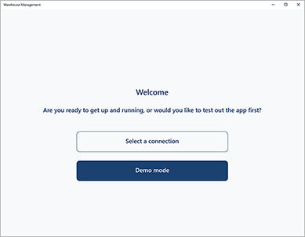
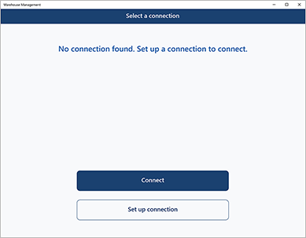
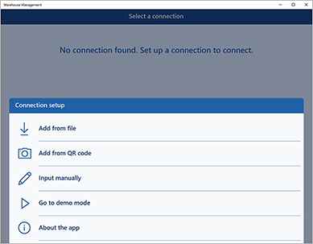
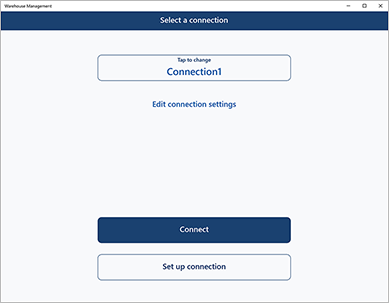
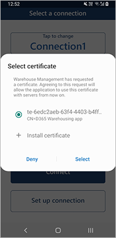
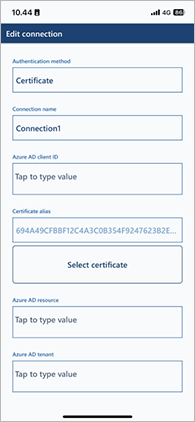
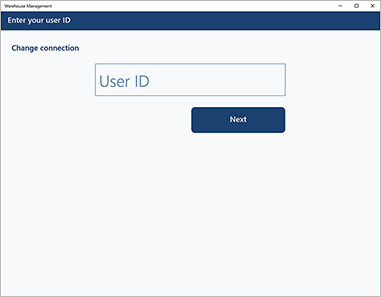
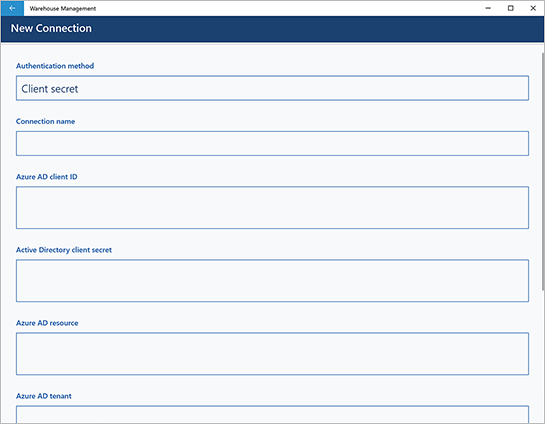

# Install and connect the Warehouse Management mobile app

[!include [banner](../includes/banner.md)]

This article explains how to download and install the Warehouse Management mobile app on each of your mobile devices, and how to configure the app to connect to your Supply Chain Management environment. You can configure each device manually, or you can import connection settings through a file or by scanning a QR code.

The Warehouse Management mobile app is only for your internal business use. You may not republish or distribute the Warehouse Management mobile app externally in any app store or similar distribution service.

## Prerequisites

### Operating system requirements

The Warehouse Management mobile app is available for both Windows and Google Android operating systems. To use the app, one of the following operating systems must be installed on your mobile devices:

- Windows 10 (Universal Windows Platform \[UWP\]) October 2018 update 1809 (build 10.0.17763) or later
- Android 4.4 or later
- iOS 13.0 or later

### External URLs required by the app

For the Warehouse Management mobile app to function correctly, your internal network must allow it to access the following external URLs:

- *.microsoft.com
- *.microsoftonline.com
- login.windows.net
- *.appcenter.ms
- *.ces.microsoftcloud.com
- *.onyx.azure.net
- play.google.com
- itunes.apple.com

### Turn Warehouse Management mobile app features on or off in Supply Chain Management

To use the Warehouse Management mobile app, the *User settings, icons, and step titles for the new warehouse app* feature must be turned on for your system. As of Supply Chain Management 10.0.25, this feature is mandatory and can't be turned off. If you're running a version older than 10.0.25, then admins can turn this functionality on or off by searching for the *User settings, icons, and step titles for the new warehouse app* feature in the [Feature management](../../fin-ops-core/fin-ops/get-started/feature-management/feature-management-overview.md) workspace.

## Get the Warehouse Management mobile app

For smaller deployments, you might typically install the app on each device from the relevant store and then manually configure the connection to the environments that you're using.

For larger deployments, you can automate app deployment and/or configuration, which can be more convenient if you manage many devices. For example, you might use a mobile device management and mobile application management solution such as [Microsoft Intune](/mem/intune/fundamentals/what-is-intune). For information about how to use Intune to manage your deployments of the Warehouse Management mobile app, see [Mass deploy the Warehouse Management mobile app](warehouse-app-intune.md).

### Install the app from an app store

The easiest way to install the app on a single device is to install it from an app store, which always provides the latest generally available version. Microsoft Intune can also fetch apps from the app stores. Use one of the following links to install the app from an app store:

- **Windows (UWP):** [Warehouse Management on Microsoft Store](https://www.microsoft.com/store/apps/9pd35cdqcmg3)
- **Android:** [Warehouse Management on Google Play Store](https://play.google.com/store/apps/details?id=com.Microsoft.WarehouseManagement)
- **iOS:** [Warehouse Management on Apple App Store](https://apps.apple.com/app/microsoft-warehouse-management/id6444014310)

### Download the app from Microsoft App Center

As an alternative to installing from an app store, you can instead download the app from the Microsoft App Center. The App Center provides installable packages that you can sideload. In addition to the current version, the App Center also lets you download previous versions and may provide preview versions with upcoming features that you can try out. To download current, previous, or preview versions of the Warehouse Management mobile app from Microsoft App Center, use one of the following links:

- **Windows (UWP):** [Warehouse Management (Windows)](https://aka.ms/wma-windows-official-release)  
    For instructions about how to install a downloaded package on a Windows device and then set up the required certificates, see [Install a Build from App Center](/appcenter/distribution/installation).
- **Android:** [Warehouse Management (Android)](https://aka.ms/wma-android-official-release)  
    A few extra steps might be required to install it. For details, see [Testing Android Apps](/appcenter/distribution/testers/testing-android).
- **iOS:** The iOS version of the app is only available through App Store.

For information about how to install a build downloaded from the App Center, see [Install a build](/appcenter/distribution/installation).

The Warehouse Management mobile app isn't available in app stores in China. However, downloading it from Microsoft App Center and using it along with Dynamics 365 Supply Chain Management operated by 21Vianet in China is officially supported.

## <a name="create-service"></a>Create a web service application in Azure Active Directory

To enable the Warehouse Management mobile app to interact with a specific Supply Chain Management server, you must register a web service application for the Supply Chain Management tenant in Azure Active Directory (Azure AD). The following procedure shows one way to complete this task. For detailed information and alternatives, see the links after the procedure.

1. In a web browser, go to [https://portal.azure.com](https://portal.azure.com/).
1. Enter the name and password of the user who has access to the Azure subscription.
1. In the Azure portal, in the left navigation pane, select **Azure Active Directory**.

    

1. Make sure that you're working with the instance of Azure AD that is used by Supply Chain Management.
1. In the **Manage** list, select **App registrations**.

    

1. On the toolbar, select **New registration** to open the **Register an application** wizard.
1. Enter a name for the application, select the **Accounts in this organizational directory only** option, and then select **Register**.

    

1. Your new app registration is opened. Make a note of the **Application (client) ID** value, because you'll need it later. This ID will be referred to later in this article as the *client ID*.

     ID")

1. In the **Manage** list, select **Certificate & secrets**. Then select one of the following buttons, depending on how you want to configure the app for authentication. (For more information, see the [Authenticate by using a certificate or client secret](#authenticate) section later in this article.)

    - **Upload certificate** – Upload a certificate to use as a secret. We recommend this approach, because it's more secure and can also be automated more completely. If you're running the Warehouse Management mobile app on Windows devices, make a note of the **Thumbprint** value that is shown after you upload the certificate. You'll need this value when you configure the certificate on Windows devices.
    - **New client secret** – Create a key by entering a key description and a duration in the **Passwords** section, and then select **Add**. Make a copy of the key, and store it securely.

    

1. To use the [device code flow](#authenticate-devicecode) for user authentication, configure two additional settings in your app registration.
By completing the following steps, you'll configure your app registration to use the device code flow for user authentication and grant the required API permissions.

    - In the left navigation pane, select **Authentication**. Then, set **Enable the following mobile and desktop flows** to **Yes**. This enables the device code flow for your application.

    - To grant the necessary API permissions, navigate to **API permissions**. Click the **Add a permission** button and select the **Microsoft APIs** tab. Click the **Dynamics ERP** button and then the **Delegated permissions** button. Under **CustomService**, tick the **CustomService.FullAccess (Access Dynamics AX Custom Service)** checkbox. Finally, click the **Add permissions** button to save your changes.

For more information about how to set up web service applications in Azure AD, see the following resources:

- For instructions that show how to use Windows PowerShell to set up web service applications in Azure AD, see [How to: Use Azure PowerShell to create a service principal with a certificate](/azure/active-directory/develop/howto-authenticate-service-principal-powershell).
- For complete details about how to manually create a web service application in Azure AD, see the following articles:

    - [Quickstart: Register an application with the Microsoft identity platform](/azure/active-directory/develop/quickstart-register-app)
    - [How to: Use the portal to create an Azure AD application and service principal that can access resources](/azure/active-directory/develop/howto-create-service-principal-portal)

## <a name="user-azure-ad"></a>Create and configure a user account in Supply Chain Management

To enable Supply Chain Management to use your Azure AD application, follow these steps.

1. Create a user that corresponds to the user credentials for the Warehouse Management mobile app:

    1. In Supply Chain Management, go to **System administration \> Users \> Users**.
    1. Create a user.
    1. Assign the *Warehousing mobile device user* role to the user.

    

1. Associate your Azure AD application with the Warehouse Management mobile app user:

    1. Go to **System administration \> Setup \> Azure Active Directory applications**.
    1. Select **New** on the Action Pane to create a line.
    1. In the **Client ID** field, enter the client ID that you made a note of in the previous section.
    1. In the **Name** field, enter a name.
    1. In the **User ID** field, select the user ID that you just created.

    

> [!TIP]
> One way to use these settings is to create a client ID in Azure for each of your physical devices and then add each client ID to the **Azure Active Directory applications** page. Then, if a device is lost, you can easily remove its access to Supply Chain Management by removing its client ID from that page. (This approach works because the connection credentials that are saved on each device also specify a client ID, as described later in this article.)
>
> Additionally, the default language, number format, and time zone settings for each client ID are established by the preferences that are set for the **User ID** value that is mapped here. Therefore, you might use those preferences to establish default settings for each device or collection of devices, based on the client ID. However, these default settings will be overridden if they are also defined for the *warehouse app user account* that a worker uses to sign in on the device. (For more information, see [Mobile device user accounts](mobile-device-work-users.md).)

## <a name="authenticate"></a>Authenticate by using a certificate or client secret

Authentication with Azure AD provides a secure way of connecting a mobile device to Supply Chain Management. You can authenticate by using either a client secret or a certificate. If you'll import connection settings, we recommend that you use a certificate instead of a client secret. Because the client secret must always be stored securely, you can't import it from a connection settings file or a QR code, as described later in this article.

Certificates can be used as secrets to prove the application's identity when a token is requested. The public part of the certificate is uploaded to the app registration in the Azure portal, whereas the full certificate must be deployed on each device where the Warehouse Management mobile app is installed. Your organization is responsible for managing the certificate in terms of rotation and so on. You can use self-signed certificates, but you should always use non-exportable certificates.

You must make the certificate available locally on each device where you run the Warehouse Management mobile app. For information about how to manage certificates for Intune-controlled devices if you're using Intune, see [Mass deploy the Warehouse Management mobile app](warehouse-app-intune.md).

## <a name="authenticate-devicecode"></a>User authentication by the device code.

In contrast to the certificate and client secret approaches, the device code authentication method focuses on user-based authentication. This method allows users to authenticate themselves using a unique device code generated by the Warehouse Management mobile app. The device code is entered on a separate device, such as a computer or smartphone, to complete the authentication process. This approach provides an additional layer of security by ensuring that only authorized users can access the app, even if they are using a shared device. It also simplifies the authentication process for users, as they no longer need to manage certificates or client secrets.

Still, it has several caveats:
1. It requires a unique Azure AD user for each worker.
1. If users remain idle for 90 days, they will be automatically logged out.
1. Lack of proper MDM support

## Configure the Warehouse Management mobile app for cloud and edge scale units

A few extra steps are required if you plan to run the Warehouse Management mobile app against a cloud or edge scale unit. For instructions, see [Configure the Warehouse Management mobile app for cloud and edge scale units](../cloud-edge/cloud-edge-workload-setup-warehouse-app.md).

## Configure the application by importing connection settings

To make it easier to maintain and deploy the application on many mobile devices, you can import the connection settings instead of manually entering them on each device. This section explains how to create and import the settings.

### Create a connection settings file or QR code

You can import connection settings from either a file or a QR code. For both approaches, you must first create a settings file that uses JavaScript Object Notation (JSON) format and syntax. The file must include a connection list that contains the individual connections that have to be added. The following table summarizes the parameters that you must specify in the connection settings file.

| Parameter | Description |
|---|---|
| ConnectionName | Specify the name of the connection setting. The maximum length is 20 characters. Because this value is the unique identifier for a connection setting, make sure that it's unique in the list. If a connection that has the same name already exists on the device, it will be overridden by the settings from the imported file. |
| ActiveDirectoryClientAppId | Specify the client ID that you made a note of while you were setting up Azure AD in the [Create a web service application in Azure Active Directory](#create-service) section. |
| ActiveDirectoryResource | Specify the root URL of Supply Chain Management. |
| ActiveDirectoryTenant | Specify the Azure AD domain name that you're using with the Supply Chain Management server. This value has the form `https://login.windows.net/<your-Azure-AD-domain-name>`. Here's an example: `https://login.windows.net/contosooperations.onmicrosoft.com`. For more information about how to find your Azure AD domain name, see [Locate important IDs for a user](/partner-center/find-ids-and-domain-names). |
| Company | Specify the legal entity in Supply Chain Management that you want the application to connect to. |
| ConnectionType | (Optional) Specify whether the connection setting should use a certificate, a client secret, or a device code to connect to an environment. Valid values are *"certificate"*, *"clientsecret"*, and *"devicecode"*. The default value is *"certificate"*.<p>**Note:** Client secrets can't be imported.</p> |
| IsEditable | (Optional) Specify whether the app user should be able to edit the connection setting. Valid values are *"true"* and *"false"*. The default value is *"true"*. |
| IsDefault | (Optional) Specify whether the connection is the default connection. A connection that is set as the default connection will automatically be preselected when the app is opened. Only one connection can be set as the default connection. Valid values are *"true"* and *"false"*. The default value is *"false"*. |
| CertificateThumbprint | (Optional) For Windows devices, you can specify the certificate thumbprint for the connection. For Android devices, the app user must select the certificate the first time that a connection is used. |

The following example shows a valid connection settings file that contains two connections. As you can see, the connection list (named *"ConnectionList"* in the file) is an object that has an array that stores each connection as an object. Each object must be enclosed in braces ({}) and separated by commas, and the array must be enclosed in brackets (\[\]).

```json
{
    "ConnectionList": [
        {
            "ActiveDirectoryClientAppId":"aaaaaaaa-bbbb-ccccc-dddd-eeeeeeeeeeee",
            "ConnectionName": "Connection1",
            "ActiveDirectoryResource": "https://yourenvironment.cloudax.dynamics.com",
            "ActiveDirectoryTenant": "https://login.windows.net/contosooperations.onmicrosoft.com",
            "Company": "USMF",
            "IsEditable": false,
            "IsDefaultConnection": true,
            "CertificateThumbprint": "aaaabbbbcccccdddddeeeeefffffggggghhhhiiiii",
            "ConnectionType": "certificate"
        },
        {
            "ActiveDirectoryClientAppId":"aaaaaaaa-bbbb-ccccc-dddd-eeeeeeeeeeee",
            "ConnectionName": "Connection2",
            "ActiveDirectoryResource": "https://yourenvironment2.cloudax.dynamics.com",
            "ActiveDirectoryTenant": "https://login.windows.net/contosooperations.onmicrosoft.com",
            "Company": "USMF",
            "IsEditable": true,
            "IsDefaultConnection": false,
            "ConnectionType": "clientsecret"
        },
        {
            "ActiveDirectoryClientAppId":"aaaaaaaa-bbbb-ccccc-dddd-eeeeeeeeeeee",
            "ConnectionName": "Connection3",
            "ActiveDirectoryResource": "https://yourenvironment2.cloudax.dynamics.com",
            "ActiveDirectoryTenant": "https://login.windows.net/contosooperations.onmicrosoft.com",
            "Company": "USMF",
            "IsEditable": true,
            "IsDefaultConnection": false,
            "ConnectionType": "devicecode"
        }
    ]
}
```

You can either save the information as a JSON file or generate a QR code that has the same content. If you save the information as a file, we recommend that you save it by using the default name, *connections.json*, especially if you'll store it in the default location on each mobile device.

### Save the connection settings file on each device

Typically, you'll use a device management tool or script to distribute the connection settings files to each device that you're managing. If you use the default name and location when you save the connection settings file on each device, the Warehouse Management mobile app will automatically import it, even during the first run after the app is installed. If you use a custom name or location for the file, the app user must specify the values during the first run. However, the app will continue to use the specified name and location afterward.

Every time that the app is started, it reimports the connection settings from their previous location to determine whether there have been any changes. The app will update only connections that have the same names as the connections in the connection settings file. User-created connections that use other names won't be updated.

You can't remove a connection by using the connection settings file.

As has been mentioned, the default file name is *connections.json*. The default file location depends on which type of device you're using:

- **Windows:** `C:\Users\<User>\AppData\Local\Packages\Microsoft.WarehouseManagement_8wekyb3d8bbwe\LocalState`
- **Android:** `Android\data\com.Microsoft.WarehouseManagement\files`
- **iOS:** File sharing isn't yet supported.

Usually, the paths are automatically created after the first run of the app. However, you can manually create them if you must transfer the connection settings file to the device before installation.

> [!NOTE]
> If the app is uninstalled, the default path and its contents are removed.

### <a name="config"></a>Import the connection settings

Follow these steps to import connection settings from a file or a QR code.

1. Start the Warehouse Management mobile app on your mobile device. The first time that you start the app, a welcome message is shown. Select **Select a connection**.

    

1. If you're importing the connection settings from a file, and the default name and location were used when the file was saved, the app might already have found the file. In this case, skip ahead to step 4. Otherwise, select **Set up connection**, and then continue to step 3.

    

1. In the **Connection setup** dialog box, select **Add from file** or **Add from QR code**, depending on how you want to import the settings:

    - If you're importing the connection settings from a file, select **Add from file**, browse to the file on your local device, and select it. If you select a custom location, the app will store it and automatically use it the next time.
    - If you're importing the connection settings by scanning a QR code, select **Add from QR code**. The app prompts you for permission to use the device's camera. After you give permission, the camera is started, so that you can use it for scanning. Depending on the quality of the device's camera and the complexity of the QR code, you might find it difficult to get a correct scan. In that case, try to reduce the complexity of the QR code by generating only one connection per QR code. (Currently, you can use only the device's camera to scan the QR code.)

    

1. When the connection settings are successfully loaded, the selected connection is shown.

    

1. Do one of the following steps to select the authentication certificate, depending on which type of device that you're using.

    - If you're using an Android device and are using a certificate for authentication, the device prompts you to select the certificate.

        

    - If you're using an iOS device and are using a certificate for authentication, select **Edit connection settings** and then select **Select certificate**. On the page that opens, select **Select certificate** to open a file browser and select your certificate file. The app then shows a **Certificate is selected** confirmation. Enter the certificate password and select **Import certificate**. Finally, save the connection settings.

        

1. The app connects to your Supply Chain Management server and shows the sign-in page.

    

## <a name="config-manually"></a>Manually configure the application

If you don't have a file or QR code, you can manually configure the app on the device so that it connects to the Supply Chain Management server through the Azure AD application.

1. Start the Warehouse Management mobile app on your mobile device.
1. If the app is started in **Demo mode**, select **Connection settings**. If the **Sign-in** page appears when the app is started, select **Change connection**.
1. Select **Set up connection**.

    

1. Select **Input manually**.

    

    The **New Connection** page appears and shows the settings that are required to manually enter the connection details.

    

1. Enter the following information:

    - **Authentication method** – Set this option to _Client secret_ to use a client secret to authenticate with Supply Chain Management. Set it to _Certificate_ to use a certificate for authentication. (For more information, see the [Create a web service application in Azure Active Directory](#create-service) section earlier in this article.)
    - **Connection name** – Enter a name for the new connection. This name will appear in the **Select connection** field the next time that you open the connection settings. The name that you enter must be unique. (In other words, it must differ from all other connection names that are stored on your device, if any other connection names are stored there.)
    - **Active directory client ID** – Enter the client ID that you made a note of while you were setting up Azure AD in the [Create a web service application in Azure Active Directory](#create-service) section.
    - **Active directory client secret** – This field is available only when the **Use client secret** option is set to _Yes_. Enter the client secret that you made a note of while you were setting up Azure AD in the [Create a web service application in Azure Active Directory](#create-service) section.
    - **Active directory certificate thumbprint** – This field is available only for Windows devices and only when the **Use client secret** option is set to _No_. Enter the certificate thumbprint that you made a note of while you were setting up Azure AD in the [Create a web service application in Azure Active Directory](#create-service) section.
    - **Active directory resource** – Specify the root URL of Supply Chain Management.

        > [!IMPORTANT]
        > Don't end this value with a slash (/).
        > Ensure the HTTPS (SSL) certificate is valid.

    - **Active directory tenant** – Enter the Azure AD domain name that you're using with the Supply Chain Management server. This value has the form `https://login.windows.net/<your-Azure-AD-domain-name>`. Here's an example: `https://login.windows.net/contosooperations.onmicrosoft.com`. For more information about how to find your Azure AD domain name, see [Locate important IDs for a user](/partner-center/find-ids-and-domain-names).

        > [!IMPORTANT]
        > Don't end this value with a slash (/).

    - **Company** – Enter the legal entity (company) in Supply Chain Management that you want the application to connect to.

1. Select the **Save** button in the upper-right corner of the page.
1. If you're using a certificate for authentication, do one of the following steps:
    - For Android devices, select the certificate when prompted.
    - For iOS devices, follow the instructions given in step 5 in the [Import the connection settings](#config) section.
1. The app connects to your Supply Chain Management server and shows the sign-in page.

## Remove access for a device

If a device is lost or compromised, you must remove access to Supply Chain Management for it. The following steps describe the recommended process for removing access.

1. Go to **System administration \> Setup \> Azure Active Directory applications**.
1. Delete the line that corresponds to the device that you want to remove access for. Make a note of the client ID that is used for the device, because you'll need it later.

    If you've registered only one client ID, and multiple devices use the same client ID, you must push out new connection settings to those devices. Otherwise, they'll lose access.

1. Sign in to the Azure portal at [https://portal.azure.com](https://portal.azure.com/).
1. In the left navigation pane, select **Active Directory**, and make sure that you're in the correct directory.
1. In the **Manage** list, select **App registrations**, and then select the application to configure. The **Settings** page appears and shows configuration information.
1. Make sure that the client ID of the application matches the client ID that you made a note of in step 2.
1. On the toolbar, select **Delete**.
1. In the confirmation message that appears, select **Yes**.

## Remove access for a device when logged in with a device code

When a user is authenticated using a device code, it is essential to disable the user in Azure Active Directory to revoke access for a lost or compromised device. To disable a user in Azure Active Directory, follow these steps:

1. Sign in to the Azure portal at https://portal.azure.com.
1. In the left navigation pane, select **Azure Active Directory** and ensure you are in the correct directory.
1. In the **Manage** list, select **Users**.
1. Locate the user associated with the device code and click on their name to open their profile.
1. Revoke session with **Revoke sessions** in the toolbar.
1. Click **Edit** properties to change the **Account enabled** checkbox if required.
1. Click **Save** to apply the changes.

By disabling the user in Azure Active Directory, you effectively revoke access to the app for any device using the device code associated with that user.

## Additional resources

- [Mobile device user settings](mobile-device-user-settings.md)
- [Assign step icons and titles for the Warehouse Management mobile app](step-icons-titles.md)
- [Configure the Warehouse Management mobile app for cloud and edge scale units](../cloud-edge/cloud-edge-workload-setup-warehouse-app.md)

[!INCLUDE[footer-include](../../includes/footer-banner.md)]
