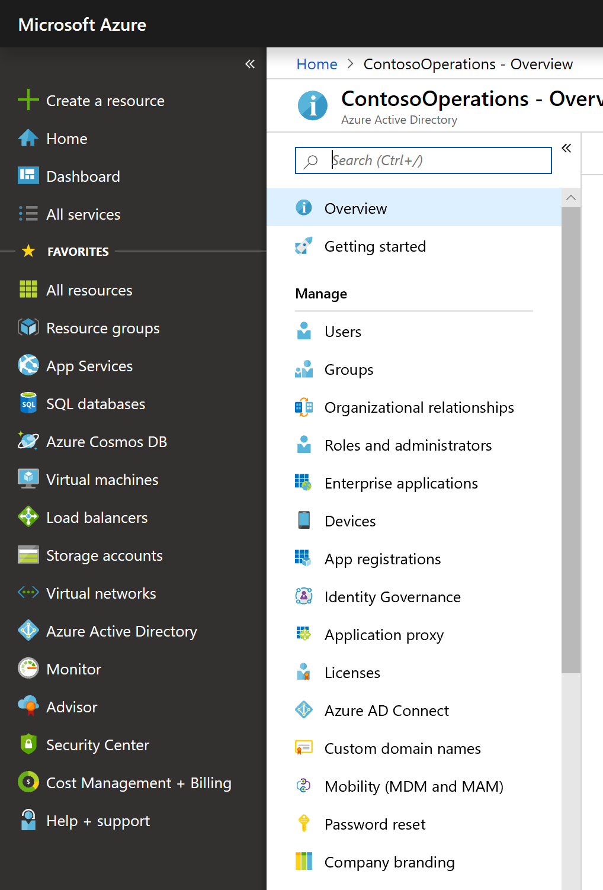
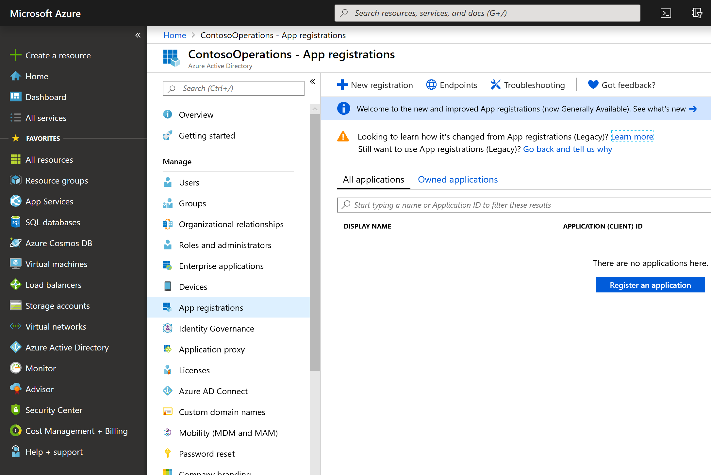
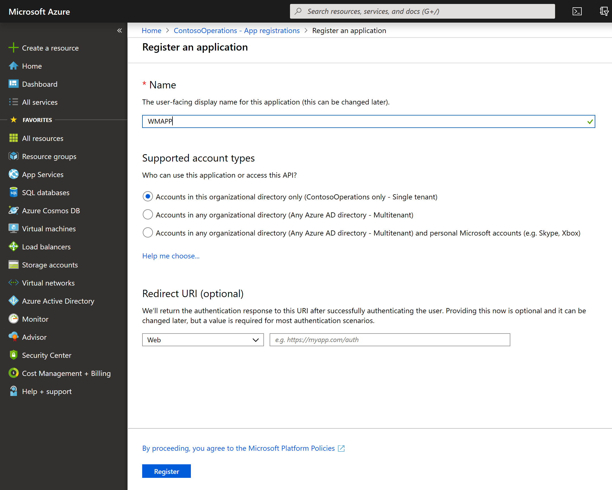
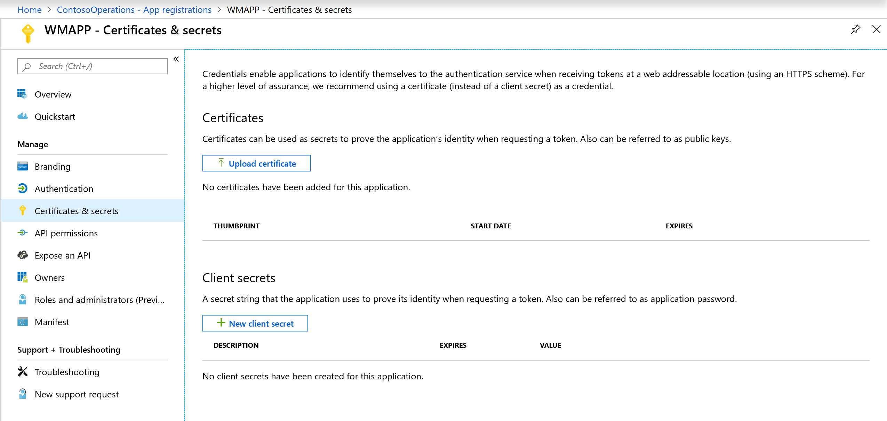
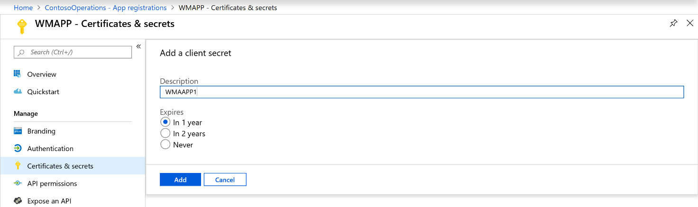
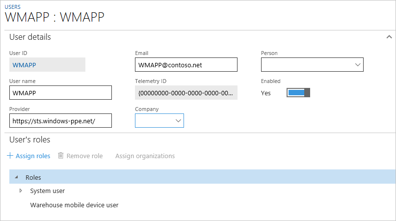
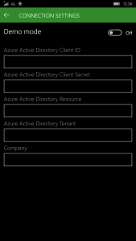
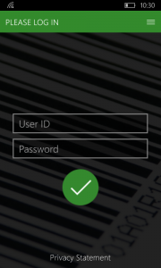

---
# required metadata

title: Install and configure the Warehousing app overview
description: This topic describes how to install and configure Dynamics 365 for Finance and Operations – Warehousing app.
author: MarkusFogelberg
manager: tfehr
ms.date: 07/25/2019
ms.topic: article
ms.prod: 
ms.service: dynamics-ax-applications
ms.technology: 

# optional metadata

ms.search.form: SysAADClientTable, WHSMobileAppField, WHSMobileAppFieldPriority, WHSRFMenu, WHSRFMenuItem, WHSWorker
# ROBOTS: 
audience: Application User, IT Pro
# ms.devlang: 
ms.reviewer: kamaybac
ms.search.scope: Core, Operations
# ms.tgt_pltfrm: 
ms.custom: 267694
ms.assetid: d95d43b2-13ff-4189-a71a-3a1fb57d55ed
ms.search.region: global
ms.search.industry: Manufacturing
ms.author: mafoge
ms.search.validFrom: 2016-11-30
ms.dyn365.ops.version: Version 1611

---

# Install and configure the Warehousing app overview

[!include [banner](../includes/banner.md)]

> [!NOTE]
> 
> This topic describes how to configure warehousing for cloud deployments. If you are looking for how to configure warehousing for on-premises deployments, please see [Warehousing for on-premises deployments](../../dev-itpro/deployment/warehousing-for-on-premise-deployments.md).

This topic describes how to install and configure Dynamics 365 for Finance and Operations – Warehousing app.

Warehousing app is available on Google Play Store and Windows Store. For the current version of Dynamics 365 Supply Chain Management, this app is provided as a standalone component, which means self-deployment on devices used for warehouse tasks. In order to use the app, you must download the app on each device and configure it to connect to your Supply Chain Management environment. This topic describes how to install the app on your devices. It also explains how to configure the app to connect to your Supply Chain Management environment.

## Prerequisites
The app is available on Android and Windows operating systems. To use this app, you must have one of the following supported operating systems installed on your devices. You must also have one of the following supported versions. Use the information in the following table to evaluate if your hardware and software environment is ready to support the installation.

| Platform                    | Version                                                                                                                                                                     |
|-----------------------------|-----------------------------------------------------------------------------------------------------------------------------------------------------------------------------|
| Android                     | 4.4, 5.0, 6.0, 7.0, 8.0, 9.0                                                                                                                                                     |
| Windows (UWP)               | Windows 10 (all versions)                                                                                                                                                   |
| Finance and Operations | Microsoft Dynamics 365 for Operations, version 1611  -or-  Microsoft Dynamics AX version 7.0/7.0.1 and Microsoft Dynamics AX platform update 2 with hotfix KB 3210014 |

## Get the app
-   Windows (UWP)
     - [Finance and Operations - Warehousing on the Windows Store](https://www.microsoft.com/store/apps/9p1bffd5tstm)
-   Android
    - [Finance and Operations - Warehousing on the Google Play Store](https://play.google.com/store/apps/details?id=com.Microsoft.Dynamics365forOperationsWarehousing)

> [!NOTE]
> The Zebra App Gallery has been retired, which means that the Warehousing app will no longer be available for download from that location.

## Create a web service application in Azure Active Directory
To enable the app to interact with a specific Supply Chain Management server, you must register a web service application in an Azure Active Directory for the Supply Chain Management tenant. For security reasons, we recommend that you create a web service application for each device that you use. To create a web service application in Azure Active Directory (Azure AD), complete the following steps:

1.  In a web browser, go to <https://portal.azure.com>.
2.  Enter the name and password for the user who has access to the Azure subscription.
3.  In Azure Portal, in the left navigation pane, click **Azure Active Directory**.

    

4.  Ensure that the Active Directory instance is the one that is used by Supply Chain Management.
5.  In the list, click **App registrations**. 

    

6.  In the top pane, click **New registration**. The **Register an application wizard** starts.
7.  Enter a name for the application and select **Accounts in this organizational directory only**. Click **Register**.  

    

8.  Your new app registration will open. 

    

9.  Remember the **Application ID**, you will need it later. The **Application ID** will later be referred to as the **Client ID**.
10. Click **Certificate & secrets** in the **Manage** pane. Click on **New client secret**. 

    

11. Create a key by entering a key description and a duration in the **Passwords** section. Click **Add** and copy the key. This key will later be referred to as the **Client secret**. 

    

## Create and configure a user account in Supply Chain Management
To enable Supply Chain Managementto use your Azure AD application, you need to complete the following configuration steps:

1.  Create a user that corresponds to the warehousing app user credentials.
    1.  Go to **System administration** &gt; **Common** &gt; **Users**.
    2.  Create a new user.
    3.  Assign the Warehouse mobile device user, as shown in the following screenshot. 
    
        

2.  Associate your Azure Active Directory application with the warehousing app user.
    1.  In Supply Chain Management, go to **System administration** &gt; **Setup** &gt; **Azure Active Directory applications**.
    2.  Create a new line.
    3.  Enter the **Client ID** (obtained in the last section), give it a name, and select the previously created user. We recommend that you tag all your devices so that you can easily remove their access to Supply Chain Management from this page in case they are lost. 
    
        

## Configure the application
You must configure the app on the device to connect to the Supply Chain Management server through the Azure AD application. To do this, complete the following steps.

1.  In the app, go to **Connection settings**.
2.  Clear the **Demo mode** field.  

    

3.  Enter the following information: 
    + **Azure Active directory client ID** - The client ID is obtained in step 9 in "Create a web service application in Active Directory". 
    + **Azure Active directory client secret** - The client secret is obtained in step 11 in "Create a web service application in Active Directory". 
    + **Azure Active directory resource** - The Azure AD directory resource depicts the Supply Chain Managementroot URL. 
    
        > [!NOTE]
        > Do not end this field with a forward slash character (/). 

    + **Azure Active directory tenant** - The Azure AD directory tenant used with the Supply Chain Management server: `https://login.windows.net/your-AD-tenant-ID`. For example: `https://login.windows.net/contosooperations.onmicrosoft.com.` 
    
        > [!NOTE]
        > Do not end this field with a forward slash character (/). 
    
    + **Company** - Enter the legal entity in Supply Chain Management to which you want the application to connect.  
    
    

4.  Select the **Back** button in the top-left corner of the application. The application will now connect to your Supply Chain Management server and the log-in screen for the warehouse worker will display.

    

For information on how to set up the Warehousing app to scan bar codes using a camera on a mobile device, see [Scan bar codes using a camera in Dynamics 365 for Finance and Operations - Warehousing app](scan-bar-codes-using-a-camera.md).

## Remove access for a device
In case of a lost or compromised device, you must remove access to Supply Chain Management for the device. The following steps describe the recommended process to remove access.

1.  Go to **System administration** &gt; **Setup** &gt; **Azure Active Directory applications**.
2.  Delete the line that corresponds to the device to which you want to remove access. Remember the **Client ID** used for the removed device, you will need it later.
3.  Sign in to the Azure portal at <https://portal.azure.com>.
4.  Click the **Active Directory** icon on the left menu, and ensure that you are in the correct directory.
5.  In the list, click **App registrations**, and then click the application that you want to configure. The **Settings** page will appear with configuration information.
6.  Ensure that the **Client ID** of the application is the same as in step 2 in this section.
7.  Click the **Delete** button in the top pane.
8.  Click **Yes** in the confirmation message.
