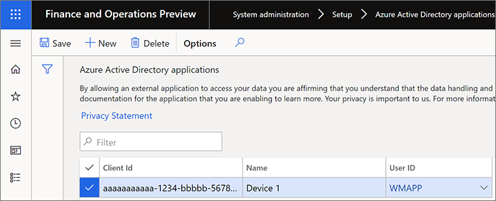

---
# required metadata

title: Install and connect the warehouse app
description: This topic explains how to install the warehouse app on each of your mobile devices and configure it to connect to your Microsoft Dynamics 365 Supply Chain Management environment. You can configure each device manually, or you can import connection settings through a file or by scanning a QR code.
author: Mirzaab
ms.date: 05/25/2020
ms.topic: article
ms.prod: 
ms.technology: 

# optional metadata

ms.search.form: SysAADClientTable, WHSMobileAppField, WHSMobileAppFieldPriority, WHSRFMenu, WHSRFMenuItem, WHSWorker
# ROBOTS: 
audience: Application User, IT Pro
# ms.devlang: 
ms.reviewer: kamaybac
# ms.tgt_pltfrm: 
ms.custom: 267694
ms.assetid: d95d43b2-13ff-4189-a71a-3a1fb57d55ed
ms.search.region: global
ms.search.industry: Manufacturing
ms.author: mirzaab
ms.search.validFrom: 2016-11-30
ms.dyn365.ops.version: Version 1611

---

# Install and connect the warehouse app

[!include [banner](../includes/banner.md)]

> [!NOTE]
> This topic describes how to configure the old warehouse app (which is now deprecated). If you're looking for information about how to configure the new Warehouse Management mobile app, see [Install and connect the Warehouse Management mobile app](install-configure-warehouse-management-app.md).

> [!NOTE]
> This topic describes how to configure the warehouse app for cloud deployments. If you're looking for information about how to configure the warehouse app for on-premises deployments, see [Warehousing for on-premises deployments](../../fin-ops-core/dev-itpro/deployment/warehousing-for-on-premise-deployments.md).

The warehouse app is available from Google Play Store and Microsoft Store. It's provided as a standalone component. Therefore, you must download it on each device and then configure it to connect to your Microsoft Dynamics 365 Supply Chain Management environment.

This topic explains how to install the warehouse app on each of your mobile devices and configure it to connect to your Supply Chain Management environment. You can configure each device manually, or you can import connection settings through a file or by scanning a QR code.

## System requirements

The warehouse app is available for both Windows and Android operating systems. To use the latest version of the app, you must have one of the following operating systems installed on your mobile devices:

- Windows 10 (Universal Windows Platform \[UWP\]) Fall creators update 1709 (build 10.0.16299) or later
- Android 4.4 or later

> [!NOTE]
> If you must support older Windows devices that can't run the latest version of Windows, you can still download version 1.6.3.0 of the warehouse app from Microsoft Store. That version will run on Windows 10 (UWP) November Update 1511 (build 10.0.10586) or later. However, be aware that this version of the warehouse app doesn't support mass deployment of connection settings. Therefore, you must [manually configure the connection](#config-manually) on each device that runs this version of the app.

## Get the warehouse app

Use one of the following links to download the app:

- **Windows (UWP):** [Dynamics 365 for Finance and Operations - Warehousing on Microsoft Store](https://www.microsoft.com/store/apps/9p1bffd5tstm)
- **Android:** [Warehousing - Dynamics 365 on Google Play Store](https://play.google.com/store/apps/details?id=com.Microsoft.Dynamics365forOperationsWarehousing)

For smaller deployments, you might want to install the app from the relevant store on each device and then manually configure the connection to the environments that you're using. However, in version 1.7.0.0 and later of the warehouse app, you can also automate app deployment and/or configuration. You might find this approach convenient if you manage many devices, and you're using a mobile device management and mobile application management solution such as [Microsoft Intune](/mem/intune/fundamentals/what-is-intune). For information about how to use Intune to add applications, see [Add apps to Microsoft Intune](/mem/intune/apps/apps-add).

## <a name="create-service"></a>Create a web service application in Azure Active Directory

To enable the warehouse app to interact with a specific Supply Chain Management server, you must register a web service application for the Supply Chain Management tenant in Azure Active Directory (Azure AD). The following procedure shows one way to complete this task. For detailed information and alternatives, see the links after the procedure.

1. In a web browser, go to [https://portal.azure.com](https://portal.azure.com/).
1. Enter the name and password of the user who has access to the Azure subscription.
1. In the Azure portal, in the left navigation pane, select **Azure Active Directory**.

    

1. Make sure that you're working with the instance of Azure AD that is used by Supply Chain Management.
1. In the **Manage** list, select **App registrations**.

    

1. On the toolbar, select **New registration** to open the **Register an application** wizard.
1. Enter a name for the application, select the **Accounts in this organizational directory only** option, and then select **Register**.

    

1. Your new app registration is opened. Make a note of the **Application (client) ID** value, because you will need it later. This ID will be referred to later in this topic as the *client ID*.

     ID")

1. In the **Manage** list, select **Certificate & secrets**. Then select one of the following buttons, depending on how you want to configure the app for authentication. (For more information, see the [Authenticate by using a certificate or client secret](#authenticate) section later in this topic.)

    - **Upload certificate** – Upload a certificate to use as a secret. We recommend this approach, because it's more secure and can also be automated more completely. If you're running the warehouse app on Windows devices, make a note of the **Thumbprint** value that is shown after you upload the certificate. You will need this value when you configure the certificate on Windows devices.
    - **New client secret** – Create a key by entering a key description and a duration in the **Passwords** section, and then select **Add**. Make a copy of the key, and store it securely.

    

For more information about how to set up web service applications in Azure AD, see the following resources:

- For instructions that show how to use Windows PowerShell to set up web service applications in Azure AD, see [How to: Use Azure PowerShell to create a service principal with a certificate](/azure/active-directory/develop/howto-authenticate-service-principal-powershell).
- For complete details about how to manually create a web service application in Azure AD, see the following topics:

    - [Quickstart: Register an application with the Microsoft identity platform](/azure/active-directory/develop/quickstart-register-app)
    - [How to: Use the portal to create an Azure AD application and service principal that can access resources](/azure/active-directory/develop/howto-create-service-principal-portal)

## Create and configure a user account in Supply Chain Management

To enable Supply Chain Management to use your Azure AD application, follow these steps.

1. Create a user that corresponds to the user credentials for the warehouse app:

    1. In Supply Chain Management, go to **System administration \> Users \> Users**.
    1. Create a user.
    1. Assign the warehousing mobile device user.

    

1. Associate your Azure AD application with the warehouse app user:

    1. Go to **System administration \> Setup \> Azure Active Directory applications**.
    1. Create a line.
    1. Enter the client ID that you made a note of in the previous section, give it a name, and select the user that you just created. We recommend that you tag all your devices. Then, if they are lost, you can easily remove their access to Supply Chain Management from this page.

    

## <a name="authenticate"></a>Authenticate by using a certificate or client secret

Authentication with Azure AD provides a secure way of connecting a mobile device to Supply Chain Management. You can authenticate by using either a client secret or a certificate. If you will import connection settings, we recommend that you use a certificate instead of a client secret. Because the client secret must always be stored securely, you can't import it from a connection settings file or a QR code, as described later in this topic.

Certificates can be used as secrets to prove the application's identity when a token is requested. The public part of the certificate is uploaded to the app registration in the Azure portal, whereas the full certificate must be deployed on each device where the warehouse app is installed. Your organization is responsible for managing the certificate in terms of rotation and so on. You can use self-signed certificates, but you should always use non-exportable certificates.

You must make the certificate available locally on each device where you run the warehouse app. For information about how to manage certificates for Intune-controlled devices if you're using Intune, see [Use certificates for authentication in Microsoft Intune](/mem/intune/protect/certificates-configure).

## Configure the application by importing connection settings

To make it easier to maintain and deploy the application on many mobile devices, you can import the connection settings instead of manually entering them on each device. This section explains how to create and import the settings.

### Create a connection settings file or QR code

You can import connection settings from either a file or a QR code. For both approaches, you must first create a settings file that uses JavaScript Object Notation (JSON) format and syntax. The file must include a connection list that contains the individual connections that have to be added. The following table summarizes the parameters that you must specify in the connection settings file.

| Parameter | Description |
| --- | --- |
| ConnectionName | Specify the name of the connection setting. The maximum length is 20 characters. Because this value is the unique identifier for a connection setting, make sure that it's unique in the list. If a connection that has the same name already exists on the device, it will be overridden by the settings from the imported file. |
| ActiveDirectoryClientAppId | Specify the client ID that you made a note of while you were setting up Azure AD in the [Create a web service application in Azure Active Directory](#create-service) section. |
| ActiveDirectoryResource | Specify the root URL of Supply Chain Management. |
| ActiveDirectoryTenant | Specify the Azure AD domain name that you're using with the Supply Chain Management server. This value has the form `https://login.windows.net/<your-Azure-AD-domain-name>`. Here is an example: `https://login.windows.net/contosooperations.onmicrosoft.com`. For more information about how to find your Azure AD domain name, see [Locate important IDs for a user](/partner-center/find-ids-and-domain-names). |
| Company | Specify the legal entity in Supply Chain Management that you want the application to connect to. |
| ConnectionType | (Optional) Specify whether the connection setting should use a certificate or a client secret to connect to an environment. Valid values are *"certificate"* and *"clientsecret"*. The default value is *"certificate"*.<p>**Note:** Client secrets can't be imported.</p> |
| IsEditable | (Optional) Specify whether the app user should be able to edit the connection setting. Valid values are *"true"* and *"false"*. The default value is *"true"*. |
| IsDefault | (Optional) Specify whether the connection is the default connection. A connection that is set as the default connection will automatically be preselected when the app is opened. Only one connection can be set as the default connection. Valid values are *"true"* and *"false"*. The default value is *"false"*. |
| CertificateThumbprint | (Optional) For Windows devices, you can specify the certificate thumbprint for the connection. For Android devices, the app user must select the certificate the first time that a connection is used. |

The following example shows a valid connection settings file that contains two connections. As you can see, the connection list (named *"ConnectionList"* in the file) is an object that has an array that stores each connection as an object. Each object must be enclosed in braces ({}) and separated by commas, and the array must be enclosed in brackets (\[\]).

```json
{
    "ConnectionList": [
        {
            "ActiveDirectoryClientAppId":"aaaaaaaa-bbbb-ccccc-dddd-eeeeeeeeeeee",
            "ConnectionName": "Connection1",
            "ActiveDirectoryResource": "https://yourenvironment.cloudax.dynamics.com",
            "ActiveDirectoryTenant": "https://login.windows.net/contosooperations.onmicrosoft.com",
            "Company": "USMF",
            "IsEditable": false,
            "IsDefaultConnection": true,
            "CertificateThumbprint": "aaaabbbbcccccdddddeeeeefffffggggghhhhiiiii",
            "ConnectionType": "certificate"
        },
        {
            "ActiveDirectoryClientAppId":"aaaaaaaa-bbbb-ccccc-dddd-eeeeeeeeeeee",
            "ConnectionName": "Connection2",
            "ActiveDirectoryResource": "https://yourenvironment2.cloudax.dynamics.com",
            "ActiveDirectoryTenant": "https://login.windows.net/contosooperations.onmicrosoft.com",
            "Company": "USMF",
            "IsEditable": true,
            "IsDefaultConnection": false,
            "ConnectionType": "clientsecret"
        }
    ]
}
```

You can either save the information as a JSON file or generate a QR code that has the same content. If you save the information as a file, we recommend that you save it by using the default name, *connections.json*, especially if you will store it in the default location on each mobile device.

### Save the connection settings file on each device

Typically, you will use a device management tool or script to distribute the connection settings files to each device that you're managing. If you use the default name and location when you save the connection settings file on each device, the warehouse app will automatically import it, even during the first run after the app is installed. If you use a custom name or location for the file, the app user must specify the values during the first run. However, the app will continue to use the specified name and location afterward.

Every time that the app is started, it reimports the connection settings from their previous location to determine whether there have been any changes. The app will update only connections that have the same names as the connections in the connection settings file. User-created connections that use other names won't be updated.

You can't remove a connection by using the connection settings file.

As has been mentioned, the default file name is *connections.json*. The default file location depends on whether you're using a Windows device or an Android device:

- **Windows:** `C:\Users\<User>\AppData\Local\Packages\Microsoft.Dynamics365forOperations-Warehousing_8wekyb3d8bbwe\LocalState`
- **Android:** `Android\data\com.Microsoft.Dynamics365forOperationsWarehousing\files`

Usually, the paths are automatically created after the first run of the app. However, you can manually create them if you must transfer the connection settings file to the device before installation.

> [!NOTE]
> If the app is uninstalled, the default path and its contents are removed.

### Import the connection settings

Follow these steps to import connection settings from a file or a QR code.

1. Open the warehouse app on your mobile device.
1. Go to **Connection settings**.
1. Set the **Use demo mode** option to _No_.

    

1. Select **Select file** or **Scan QR code**, depending on how you want to import the settings:

    - If you're importing the connection settings from a file, the app might already have found the file if the default name and the default location were used when it was saved. Otherwise, select **Select file**, browse to the file on your local device, and select it. If you select a custom location, the app will store it and automatically use it the next time.
    - If you're importing the connection settings by scanning a QR code, select **Scan QR code**. The app prompts you for permission to use the device's camera. After you give permission, the camera is started, so that you can use it for scanning. Depending on the quality of the device's camera and the complexity of the QR code, you might find it difficult to get a correct scan. In that case, try to reduce the complexity of the QR code by generating only one connection per QR code. (Currently, you can use only the device's camera to scan the QR code.)

    

1. When the connection settings are successfully loaded, select the **Back** (left arrow) button in the upper-left corner of the page.

    

1. If you're using an Android device and are using a certificate for authentication, the device prompts you to select the certificate.

    

1. The app connects to your Supply Chain Management server and shows the sign-in page.

    

## <a name="config-manually"></a>Manually configure the application

You can manually configure the app on the device so that it connects to the Supply Chain Management server through the Azure AD application.

1. Open the warehouse app on your mobile device.
1. Go to **Connection settings**.
1. Set the **Use demo mode** option to _No_.

    

1. Tap in the **Select connection** field to expand the settings that are required to manually enter the connection details.

    

1. Enter the following information:

    - **Use client secret** – Set this option to _Yes_ to use a client secret to authenticate with Supply Chain Management. Set it to _No_ to use a certificate for authentication. (For more information, see [Create a web service application in Azure Active Directory](#create-service).)
    - **Connection name** – Enter a name for the new connection. This name will appear in the **Select connection** field the next time that you open the connection settings. The name that you enter must be unique. (In other words, it must differ from all other connection names that are stored on your device, if any other connection names are stored there.).
    - **Active directory client ID** – Enter the client ID that you made a note of while you were setting up Azure AD in the [Create a web service application in Azure Active Directory](#create-service) section.
    - **Active directory client secret** – This field is available only when the **Use client secret** option is set to _Yes_. Enter the client secret that you made a note of while you were setting up Azure AD in the [Create a web service application in Azure Active Directory](#create-service) section.
    - **Active directory certificate thumbprint** – This field is available for Windows devices only when the **Use client secret** option is set to _No_. Enter the certificate thumbprint that you made a note of while you were setting up Azure AD in the [Create a web service application in Azure Active Directory](#create-service) section.
    - **Active directory resource** – Specify the root URL of Supply Chain Management.

        > [!NOTE]
        > Don't end this value with a slash (/).

    - **Active directory tenant** – Enter the Azure AD domain name that you're using with the Supply Chain Management server. This value has the form `https://login.windows.net/<your-Azure-AD-domain-name>`. Here is an example: `https://login.windows.net/contosooperations.onmicrosoft.com`. For more information about how to find your Azure AD domain name, see [Locate important IDs for a user](/partner-center/find-ids-and-domain-names).

        > [!NOTE]
        > Don't end this value with a slash (/).

    - **Company** – Enter the legal entity in Supply Chain Management that you want the application to connect to.

1. Select the **Save** button in the upper-right corner of the page.
1. If you're using an Android device and are using a certificate for authentication, the device prompts you to select the certificate.
1. The app connects to your Supply Chain Management server and shows the sign-in page.

## Remove access for a device

In the event of a lost or compromised device, you must remove access to Supply Chain Management for the device. The following steps describe the recommended process for removing access.

1. Go to **System administration \> Setup \> Azure Active Directory applications**.
1. Delete the line that corresponds to the device that you want to remove access for. Make a note of the client ID that is used for the removed device, because you will need it later.

    If you've registered only one client ID, and multiple devices use the same client ID, you must push out new connection settings to those devices. Otherwise, they will lose access.

1. Sign in to the Azure portal at [https://portal.azure.com](https://portal.azure.com/).
1. In the left navigation pane, select **Active Directory**, and make sure that you're in the correct directory.
1. In the **Manage** list, select **App registrations**, and then select the application to configure. The **Settings** page appears and shows configuration information.
1. Make sure that the client ID of the application matches the client ID that you made a note of in step 2.
1. On the toolbar, select **Delete**.
1. In the confirmation message that appears, select **Yes**.


[!INCLUDE[footer-include](../../includes/footer-banner.md)]
