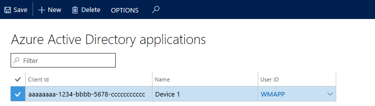

---
# required metadata

title: Install and configure Microsoft Dynamics 365 for Finance and Operations &#8211; Warehousing
description: This topic describes how to install and configure Microsoft Dynamics 365 for Finance and Operations - Warehousing.
author: MarkusFogelberg
manager: AnnBe
ms.date: 11/02/2017
ms.topic: article
ms.prod: 
ms.service: dynamics-ax-applications
ms.technology: 

# optional metadata

ms.search.form: SysAADClientTable, WHSMobileAppField, WHSMobileAppFieldPriority, WHSRFMenu, WHSRFMenuItem, WHSWorker
# ROBOTS: 
audience: Application User, IT Pro
# ms.devlang: 
ms.reviewer: bis
ms.search.scope: Core, Operations
# ms.tgt_pltfrm: 
ms.custom: 267694
ms.assetid: d95d43b2-13ff-4189-a71a-3a1fb57d55ed
ms.search.region: global
ms.search.industry: Manufacturing
ms.author: mafoge
ms.search.validFrom: 2016-11-30
ms.dyn365.ops.version: Version 1611

---

# Install and configure Microsoft Dynamics 365 for Finance and Operations &#8211; Warehousing

[!include[banner](../includes/banner.md)]

> [!NOTE]
> This topic describes how to configure warehousing for cloud deployments. If you are looking for how to configure warehousing for on-premises deployments, please see [Warehousing for on-premises deployments](https://docs.microsoft.com/en-us/dynamics365/unified-operations/dev-itpro/deployment/warehousing-for-on-premise-deployments).

This topic describes how to install and configure Microsoft Dynamics 365 for Finance and Operations - Warehousing.

Finance and Operations - Warehousing is an application available on Google Play Store and Windows Store. For the current version of Finance and Operations, this app is provided as a standalone component, which means self-deployment on devices used for warehouse tasks. In order to use the app in your Finance and Operations environment, you must download the app on each device and configure it to connect to your Finance and Operations environment. This topic describes how to install the app on your devices. It also explains how to configure the app to connect to your Finance and Operations environment.

## Prerequisites
The app is available on Android and Windows operating systems. To use this app, you must have one of the following supported operating systems installed on your devices. You must also have one of the following supported versions of Finance and Operations. Use the information in the following table to evaluate if your hardware and software environment is ready to support the installation.

| Platform                    | Version                                                                                                                                                                     |
|-----------------------------|-----------------------------------------------------------------------------------------------------------------------------------------------------------------------------|
| Android                     | 4.4, 5.0, 6.0                                                                                                                                                               |
| Windows (UWP)               | Windows 10 (all versions)                                                                                                                                                   |
| Finance and Operations | Microsoft Finance and Operations version 1611  -or-  Microsoft Dynamics AX version 7.0/7.0.1 and Microsoft Dynamics AX platform update 2 with hotfix KB 3210014 |

## Get the app
-   Windows (UWP): [Finance and Operations - Warehousing on the Windows Store](https://www.microsoft.com/store/apps/9p1bffd5tstm)
-   Android:
    - [Finance and Operations - Warehousing on the Google Play Store](https://play.google.com/store/apps/details?id=com.Microsoft.Dynamics365forOperationsWarehousing)
    - [Finance and Operations - Warehousing on the Zebra App Gallery](https://appgallery.zebra.com/showcase/apps/146?type=showcase)

## Create a web service application in Active Directory
To enable the app to interact with a specific Finance and Operations server, you must register a web service application in an Azure Active Directory for the Finance and Operations tenant. For security reasons, we recommend that you create a web service application for each device that you use. To create a web service application in Azure Active Directory (Azure AD), complete the following steps:

1.  In a web browser, go to <https://portal.azure.com>.
2.  Enter the name and password for the user who has access to the Azure subscription.
3.  In Azure Portal, in the left navigation pane, click **Active Directory**.
4.  Ensure that the Active Directory instance is the one that is used by Finance and Operations.
5.  In the list, click **App registrations**. 
6.  In the top pane, click **New application registration**. The **Add application** wizard starts.
7.  Enter a name for the application and select **Web application and/or web API**. Enter the sign-on URL, which is your web app URL. This URL is the same as your deployment URL, but oauth is added to the end. Click **Create**. 
8.  Click on the new app in the list. 
9.  Make a note of the **Application ID**. The **Application ID** will later be reffered to as the **Client ID**.
10. Click on Keys in the **Settings pane** - In the **Passwords** section, create a key by entering a Key description and selecting duration. Click **Save** and copy the key. This key will later be referred to as the **Client secret**. 

## Create and configure a user account in Finance and Operations
To enable Finance and Operations to use your Azure AD application, you need to complete the following configuration steps:

1.  Create a new user account in Azure Active Directory for the Finance and Operations tenant. The purpose of this user account is to access the specific custom service of the warehousing app, which the Finance and Operations server exposes. After completing this step, you will have WMDP user credentials, which consist of a WMDP email address and a WMDP password. To learn about the basic steps for adding users to Azure AD and Finance and Operations, refer to this tutorial: [Sign up for a Finance and Operations subscription](../../dev-itpro/dev-tools/sign-up-preview-subscription.md).
2.  Create a Finance and Operations user that corresponds to the warehousing app user credentials.
    1.  In Finance and Operations, go to **System administration** &gt; **Common** &gt; **Users**.
    2.  Create a new user.
    3.  Assign the Warehouse mobile device user, as shown in the following screenshot. 

3.  Associate your Azure Active Directory application with the warehousing app user.
    1.  In Finance and Operations, go to **System administration** &gt; **Setup** &gt; **Azure Active Directory applications**.
    2.  Create a new line.
    3.  Enter the **Client ID** (obtained in the last section), give it a name, and select the previously created user. We recommend that you tag all your devices so that you can easily remove their access to Finance and Operations from this page in case they are lost. 

## Configure the application
You must configure the app on the device to connect to the Finance and Operations server through the Azure AD application. To do this, complete the following steps.

1.  In the app, go to **Connection settings**.
2.  Clear the **Demo mode** field.  
3.  Enter the following information: 
    + **Azure Active directory client ID** - The client ID is obtained in step 13 in "Create a web service application in Active Directory". 
    + **Azure Active directory client secret** - The client secret is obtained in step 13 in "Create a web service application in Active Directory". 
    + **Azure Active directory resource** - The Azure AD directory resource depicts the Finance and Operations root URL. **Note**: Do not end this field with a forward slash character (/). 
    + **Azure Active directory tenant** - The Azure AD directory tenant used with the Finance and Operations server: https://login.windows.net/your-AD-tenant-ID. For example: https://login.windows.net/contosooperations.onmicrosoft.com. 
     **Note**: Do not end this field with a forward slash character (/). 
    + **Company** - Enter the legal entity in Finance and Operations to which you want the application to connect.  
4.  Select the **Back** button in the top-left corner of the application. The application will now connect to your Finance and Operations server and the log-in screen for the warehouse worker will display.  

## Remove access for a device
In case of a lost or compromised device, you must remove access to Finance and Operations for the device. The following steps describe the recommended process to remove access.

1.  In Finance and Operations, go to **System administration** &gt; **Setup** &gt; **Azure Active Directory applications**.
2.  Delete the line that corresponds to the device to which you want to remove access. Note down the **Client ID** used for the removed device.
3.  Sign in to the Azure portal at <https://portal.azure.com>.
4.  Click the **Active Directory** icon on the left menu, and ensure you are in the desired directory.
5.  In the list, click **App registrations**, and then click the application you want to configure. The **Settings** page will appear with configuration information.
6.  Ensure that the **Client ID** of the application is the same as in step 2 in this section.
7.  Click the **Delete** button in the top pane.
8.  Click **Yes** in the confirmation message.

