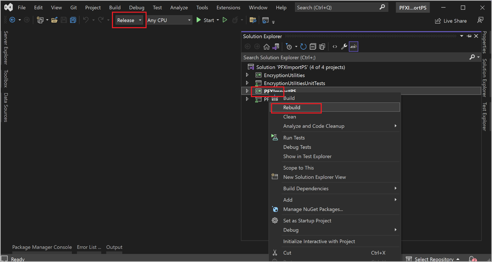
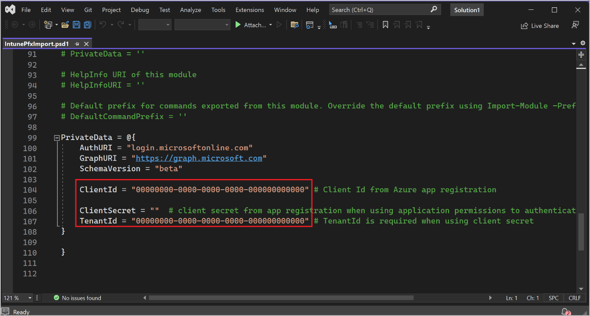

# Mass deploy the Warehouse Management mobile app

[!include [banner](../includes/banner.md)]

Automating the deployment and configuration of Warehouse Management can be more efficient than manual deployment when you have many devices to manage. One solution for this is to use a mobile device management (MDM) solution such as [Microsoft Intune](/mem/intune/fundamentals/what-is-intune). For general information about using Intune to add apps, see [Add apps to Microsoft Intune](/mem/intune/apps/apps-add).

This article shows how to mass deploy the Warehouse Management mobile app using Intune.

## Prerequisites

To use an MDM solution to deploy the Warehouse Management mobile app and the related authentication certificates, the following resources must be available:

- Warehouse Management mobile app version 2.0.41.0 or higher (this version number applies to all mobile platforms)
- A valid store account for each of the mobile platforms you'll support ([Microsoft account](https://account.microsoft.com/account/), [Google Account](https://www.google.com/account/about/) and/or [Apple ID](https://appleid.apple.com/sign-in)).
- [Azure Active Directory](https://portal.azure.com/#view/Microsoft_AAD_IAM/ActiveDirectoryMenuBlade/~/Overview) (Azure AD Premium P2 license)
- [Microsoft Endpoint Manager admin center](https://endpoint.microsoft.com/#home) (the Intune website)
- [Certificate Connector for Microsoft Intune](/mem/intune/protect/certificate-connector-overview) installed on a dedicated Windows PC
- [PowerShell](https://github.com/microsoft/Intune-Resource-Access/tree/develop/src/PFXImportPowershell)
- [Visual Studio 2022](https://visualstudio.microsoft.com/vs/)

You also require the following resources, which you'll set up while following the instructions in this article:

- [PFX certificate](#create-a-self-signed-pfx-certificate) for certificate-based authentication (CBA)
- [Connection settings JSON file](#create-a-connection-json-file) for the Warehouse Management app
- [PFXImport tool](#download-and-build-the-pfximport-project) for the Microsoft Endpoint Manager admin center

## Set up the source files for distribution

Each MDM solution offers several methods for sourcing the apps they deliver to end devices, such as by using locally stored binary files or by fetching binaries from an app store. The preferred method is to use app stores because it's simple and offers the most convenient way to receive updates.

The following subsections show examples of how to set up Microsoft Intune to fetch apps from the various app stores.

### Set up Intune to fetch the app from Google Play

Follow these steps to set up Intune to fetch the Warehouse Management mobile app from [Google Play](https://play.google.com/store/apps/details?id=com.Microsoft.WarehouseManagement).

1. Sign in to the Microsoft Endpoint Manager admin center.
1. Go to **Apps \> Android**.

    

1. The **Android apps** page opens. From the toolbar, select **Add**.
1. The **Select app type** dialog opens. Set **App type** to *Managed Google Play app*. Then select the**Select** button.
1. The **Managed Google Play** page opens. If asked, sign in to Google Play using your Google account (you'll only be asked to do this the first time you set up Google Play).
1. Enter *Warehouse Management* into the**Search** field and then select the **Search** button.
1. When you have found the Warehouse Management app, select **Approve**.
1. The **Approve settings** dialogue opens. Choose how you'd like to handle updates when a new version of the app requests more permissions than the current version. We recommend selecting the **Keep approved when app requests new permissions** options. After choosing an option, select **Done** to continue.
1. Select **Sync**.
1. You now return to the **Android apps** page. Select **Refresh** on the toolbar to refresh the list and then, in the list of applications, select *Warehouse Management*.
1. The **Warehouse Management** page opens. Open the **Properties** tab and then select the **Edit** link next to the **Assignments** heading.

    

1. The **Edit application** page opens, showing the **Assignments** tab. On the assignments page, add the user groups and/or devices for which the Warehouse Management app should be available and/or required. For details about how to use these settings, see [Assign apps to groups with Microsoft Intune](/mem/intune/apps/apps-deploy).
1. Select **Review + save** to proceed to the **Review + save** tab, where you can review your settings. If they look right, select **Save** to save them.

### Set up Intune to fetch the app from the Microsoft Store

Follow these steps to set up Intune to fetch the Warehouse Management mobile app from the [Microsoft Store](https://apps.microsoft.com/store/detail/warehouse-management/9PD35CDQCMG3).

1. Sign in to the Microsoft Endpoint Manager admin center.
1. Go to **Apps \> Windows**.
1. From the toolbar, select **Add**.
1. The **Select app type** dialog opens. Set **App type** to *Microsoft Store app (new)*. Then select the**Select** button.
1. The **Add App** page opens, showing the **App information** tab. Select the **Search the Microsoft Store app (new)** link.
1. The **Search the Microsoft Store app (new)** dialog opens. Enter *Warehouse Management* into the**Search** field.
1. When you have found the Warehouse Management app, select it, and then select the **Select** button.
1. The **App information** tab now shows information about the Warehouse Management app. Select **Next** to continue.
1. The **Assignments** tab opens. Add the user groups and/or devices for which the Warehouse Management app should be available and/or required. For details about how to use these settings, see [Assign apps to groups with Microsoft Intune](/mem/intune/apps/apps-deploy).
1. When you're done assigning groups, select **Next** to open the **Review + save** tab, where you can review your settings. If they look right, select **Create** to save them.

### Set up Intune to fetch the app from the Apple App Store

Follow these steps to set up Intune to fetch the Warehouse Management mobile app from the Apple App Store.

1. Sign in to the Microsoft Endpoint Manager admin center.
1. Go to **Devices \> iOS/iPadOS**.
1. Open the **iOS/iPad enrollment** tab. Then select the **Apple MDM Push certificate** tile.

    

1. The **Apple MDM Push certificate** dialog opens. Follow the instructions given in the dialog to create and upload the required Apple MDM push certificate. For more information about this step, see [Get an Apple MDM push certificate](/mem/intune/enrollment/apple-mdm-push-certificate-get).
1. Go to **Apps \> iOS/iPadOS**.
1. From the toolbar, select **Add**.
1. The **Select app type** dialog opens. Set **App type** to *iOS store app*. Then select the**Select** button.
1. The **Add App** opens, showing the **App information** tab. Select the **Search the App Store** link.
1. The **Search the App Store** dialog opens. Enter *Warehouse Management* into the**Search** field. Then select your country/region from the drop-down list next to the search field.
1. When you have found the Warehouse Management app, select it, and then select the **Select** button.
1. The **App information** tab now shows information about the Warehouse Management app. Select **Next** to continue.
1. The **Assignments** tab opens. Add the user groups and/or devices for which the Warehouse Management app should be available and/or required. For details about how to use these settings, see [Assign apps to groups with Microsoft Intune](/mem/intune/apps/apps-deploy).

1. When you're done assigning groups, select **Next** to open the **Review + save** tab, where you can review your settings. If they look right, select **Create** to save them.

## Manage connection configurations

The Warehouse Management mobile app (version 2.0.41.0 or later) lets you import connection settings as a managed configuration through an MDM solution. The same **ConnectionsJson** configuration key is shared across all platforms.

The following subsections show examples of how to set up Microsoft Intune to provide managed configuration for each of the supported mobile platforms. For more information, see also [App configuration policies for Microsoft Intune](/mem/intune/apps/app-configuration-policies-overview).

### Create a connection JSON file

As a prerequisite for setting up managed configuration of all mobile platforms, you must create a connection JSON file as described in the [Create a connection settings file or QR code](/dynamics365/supply-chain/warehousing/install-configure-warehouse-management-app#create-a-connection-settings-file-or-qr-code). This file enables the mobile app to connect to and authenticate with your Supply Chain Management environment.

> [!TIP]
> If your JSON file includes more than one connection, then one of them should be set as the default (**IsDefaultConnection=true**). If no default is set, the app will ask the user to manually choose an initial connection from the available options.

### Set up Intune to support managed configuration for Android devices

Follow these steps to set up Intune to support managed configuration for Android devices.

1. Sign in to the Microsoft Endpoint Manager admin center.
1. Go to **Apps \> App configuration policies** to open the **App configuration policies** page. Then, from the toolbar, select **Add \> Managed devices**.

    

1. The **Create app configuration policy** page opens, showing the **Basics** tab. Make the following settings:

    - **Name** – Enter a name for the policy.
    - **Platform** – Select *Android Enterprise*.
    - **Profile type** – Select the device profile types that this app configuration profile will apply to.
    - **Targeted app** – Select the **Select app** link to open the **Associated app** dialog. Select the Warehouse Management app in the list and then select **OK** to apply the setting and close the dialog.
1. Select **Next** to continue to the **Settings** tab.

    

1. Select the **Add** button to open the **Add permissions** dialog. In the dialog, select the check boxes for **Camera**, **External storage (read)**, and **External storage (write)**. Then select **OK** to close the dialog and add those permissions to the **Settings** tab.
1. Set each of the **Permission state** for each of the permissions you just added to *Auto grant*.
1. Set **Configuration settings format** to *Use configuration designer*.
1. In the **Configuration settings** section, select **Add** to open a dialog box. In the dialog, select the check box for **ConnectionsJson** and then select **OK**.
1. A new row with a **Configuration key** value of *ConnectionsJason* is now added to the**Settings** tab. For this row, set **Value type** to *String* and then paste the entire contents of the JSON file you created in [Create a connection JSON file](#create-a-connection-json-file) into the **Configuration value** field.
1. Select **Next** to continue to the **Assignments** tab.
1. The **Assignments** tab opens. Add the user groups and/or devices for which the configuration policy should apply. For details about how to use these settings, see [Add app configuration policies for managed Android Enterprise devices](/mem/intune/apps/app-configuration-policies-use-android).
1. Select **Next** to open the **Review + save** tab, where you can review your settings. If they look right, select **Create** to save them.

### Set up Intune to support managed configuration for Windows devices

Follow these steps to set up Intune to support managed configuration for Microsoft Windows devices.

1. Sign in to the Microsoft Endpoint Manager admin center.
1. Go to **Devices \> Windows** to open the **Windows devices** page. Then, open the **Configuration profiles** tab.

    

1. Select **Create profile** from the toolbar to open the **Create a profile** dialog. Then make the following settings:
    - **Platform** – Select *Windows 10 and later*.
    - **Profile type** – Select *Templates*.
    - **Template name** – Select *Custom*.

1. Select **Create** to apply your settings and close the dialog.
1. The **Custom** page opens, showing the **Basics** tab. Enter a Name for the configuration profile and select **Next**.
1. The **Configuration settings** tab opens. Select **Add** to open the **Add Row** dialog and make the following settings:
    - **Name** – Enter a name for the new row.
    - **Description** – Enter a short description for the new row.
    - **OMA-URI** – Enter the following value: *./User/Vendor/MSFT/EnterpriseModernAppManagement/AppManagement/AppStore/Microsoft.WarehouseManagement\_8wekyb3d8bbwe/AppSettingPolicy/ConnectionsJson*
    - **Data type** – Select *String*.
    - **Value** – Paste the entire contents of the JSON file you created in [Create a connection JSON file](#create-a-connection-json-file) into the **Configuration value** field.

1. Select **Save** to apply your settings and close the dialog.
1. Select **Next** to continue to the **Assignments** tab.
1. The **Assignments** tab opens. Add the user groups and/or devices for which the configuration profile should apply.
1. Select **Next** to continue to the **Applicability rules** tab. Here, you can limit the set of devices this configuration profile applies to. Leave these settings blank to apply this profile to all qualifying Windows devices. For more information about these settings, see [Create a device profile in Microsoft Intune](/mem/intune/configuration/device-profile-create#applicability-rules).
1. Select **Next** to open the **Review + save** tab, where you can review your settings. If they look right, select **Create** to save them.

### Set up Intune to support managed configuration for iOS devices

Follow these steps to set up Intune to support managed configuration for iOS devices.

1. Sign in to the Microsoft Endpoint Manager admin center.
1. Go to **Apps \> App Configuration policies** to open the **App configuration policies** page. Then, from the toolbar, select **Add \> Managed devices**.
1. The **Create app configuration policy** page opens, showing the **Basics** tab. Make the following settings:
    - **Name** – Enter a name for the policy.
    - **Platform** – Select *iOS/iPadOS*.
    - **Profile type** – Select the device profile types that this app configuration profile will apply to.
    - **Targeted app** – Select the **Select app** link to open the **Associated app** dialog. Select the Warehouse Management app in the list and then select **OK** to apply the setting and close the dialog.

1. Select **Next** to continue to the **Settings** tab.
1. Set **Configuration settings format** to *Use configuration designer*.
1. In the table at the bottom of the page, make the following settings for the first row:

    - **Configuration key** – Enter *ConnectionsJson*.
    - **Value type** – Select *String*.
    - **Configuration value** – Paste the entire contents of the JSON file you created in [Create a connection JSON file](#create-a-connection-json-file) into the **Configuration value** field.

1. Select **Next** to continue to the **Assignments** tab.
1. The **Assignments** tab opens. Add the user groups and/or devices for which the configuration policy should apply. For details about how to use these settings, see [Add app configuration policies for managed iOS/iPadOS devices](/mem/intune/apps/app-configuration-policies-use-ios).
1. Select **Next** to open the **Review + save** tab, where you can review your settings. If they look right, select **Create** to save them.

## Set up certificate-based authentication

Certificate-based authentication is widely used for secure and efficient methods of authentication. In mass deployment scenarios, it's advantageous due to its ability to provide secure access alongside the simplicity of deploying certificates to end devices. This helps reduce the risk of security breaches, which can be a significant concern in large-scale deployments.

To use the Warehouse Management mobile app, you must have a certificate stored on each device. If you're using Intune to manage your devices, you can find instructions and more information in [Use certificates for authentication in Microsoft Intune](/mem/intune/protect/certificates-configure).

The goal is to transfer a personal information exchange (PFX) certificate with the thumbprint specified in the ConnectionsJson file to each of your target devices. To achieve this, the solution uses an imported public-key cryptography standards (PKCS) certificate configuration profile, which enables the same certificate to be delivered across devices.

### Create and import a certificate

The following subsections walk you through the process of creating the required certificate, setting up the required tools, and importing the certificate into the Certificate Connector for Microsoft Intune.

#### Create a self-signed PFX certificate

Obtain a self-signed PFX certificate (a .pfx file) either through the Windows Server Certificate Authority (see also [Install the Certification Authority](/windows-server/networking/core-network-guide/cncg/server-certs/install-the-certification-authority)) or by using PowerShell (as described in [New-SelfSignedCertificate](/powershell/module/pki/new-selfsignedcertificate?view=windowsserver2022-ps)). When you export the certificate from one of these sources, be sure to include the private key and protect it with a password.

#### Create an app registration in Azure Active Directory for PFXImport PowerShell

Follow these steps to create an app registration in Azure Active Directory for PFXImport PowerShell.

1. Sign in to Azure.
1. From the **Home** page, go to **Manage Azure Active Directory**.
1. Select **App registrations** in the navigation pane.
1. Select **New registration** from the toolbar. The **Register an application** page opens. Make the following settings:

    - **Name** – Enter a name.
    - **Supported account types** – Choose who will be able to use your new application.
    - **Redirect URI** – Leave these settings blank for now.

1. Select **Register**.
1. Your new app registration opens. Open the **Certificates & secrets** tab.
1. Select **New client secret** to open the **Add a client secret** dialog.

    

1. Select an expiration date that matches your needs and then select **Add**. The **Certificates & secrets** page now shows details about your new client secret. These details will only be shown once, and will be hidden when the page reloads, so you must copy them now. Copy the **Value** and paste it into a temporary text file for now. You'll need this value later when you're [setting up your Certificate Connector machine](#set-up-a-dedicated-machine-for-the-certificate-connector).
1. Open the **Authentication** tab.
1. Select **Add a platform** to open the **Configure platforms** dialog. Select the **Mobile and desktop applications** tile.
1. The **Configure Desktop + devices** dialog opens. Select the check box for each redirect URL you want to use (you can probably select all of them). Then select **Configure**.
1. Open the **Overview** tab. Copy the values shown here for the **Application (client) ID** and **Directory (tenant) ID** and save these values in a text file together with the client secret value you copied earlier. You'll need all three of these values later when you're [setting up your Certificate Connector machine](#set-up-a-dedicated-machine-for-the-certificate-connector).

#### Download and build the PFXImport project

The PFXImport project consists of PowerShell cmdlets that will help you to import PFX certificates to Microsoft Intune. They can be modified and adapted to fit your workflow For more information, see also [S/MIME overview to sign and encrypt email in Intune](/mem/intune/protect/certificates-s-mime-encryption-sign).

Follow these steps to download and build the PFXImport project.

1. Go to the [PFXImport PowerShell Project on GitHub](https://github.com/microsoft/Intune-Resource-Access/tree/develop/src/PFXImportPowershell) and download the project.
1. Launch Visual Studio 2022 and open the **PFXImportPS.sln** file you downloaded from GitHub. Switch to *Release* mode and build the project. For more information, see also [Configure and use imported PKCS certificates with Intune](/mem/intune/protect/certificates-imported-pfx-configure).

    

#### Set up a dedicated machine for the Certificate Connector

Follow these steps to set up your dedicated Certificate Connector machine.

1. Sign in to the machine that you've designated to run the Certificate Connector for Microsoft Intune.
1. Copy the self-signed PFX certificate you created in [Create a self-signed PFX certificate](#create-a-self-signed-pfx-certificate) to the Certificate Connector machine.
1. Copy the PFXImport project binaries that you built in [Download and build the PFXImport project](#download-and-build-the-pfximport-project) to the Certificate Connector machine and save them in the following folder:

    `~\Intune-Resource-Access-develop\src\PFXImportPowershell\PFXImportPS\bin\Release`

1. In the **Release** folder, open the **IntunePfxImport.psd1** file and edit the values of the following variables:

    - **ClientId** – Set equal to the client ID from the Azure app registration.
    - **ClientSecret** – Set equal to the client secret from the Azure app registration.
    - **TenantId** – Set equal to the tenant ID from the Azure app registration. This is required when using a client secret.

    

1. Sign in to the Microsoft Endpoint Manager admin center and go to **Tenant administration \> Connectors and tokens**.
1. Open the **Certificate connectors** tab and select **Add** from the toolbar to open the **Install the certificate connector** dialog.

    

1. In the dialog, select the certificate connector link to download the **IntuneCertificateConnector.exe** file, which is an installer for the Certificate Connector.
1. Transfer the **IntuneCertificateConnector.exe** file to the designated Certificate Connector machine. Then run the file and follow the instructions on your screen. During the installation process, be sure to select the **PKCS imported certificates** checkbox.
1. Sign into your Azure AD account as an admin user. As a result of successful installation, you should see a green checkmark on the **Endpoint Manager** page. For more information, see [Install the Certificate Connector for Microsoft Intune](/mem/intune/protect/certificate-connector-install).

#### Import your PFX certificate to the Certificate Connector

Follow these steps to import your PFX certificate on the Certificate Connector machine so the certificates can be distributed to users.

1. Sign in to the machine that you've designated to run the Certificate Connector for Microsoft Intune.
1. Run PowerShell Terminal as administrator.
1. In the terminal, navigate to the PFXImportPowershell release folder, which should be:

    `~\Intune-Resource-Access-develop\src\PFXImportPowershell\PFXImportPS\bin\Release`

1. Run the following commands in the terminal, in this order:
    1. `Import-Module .\\IntunePfxImport.psd1`
    1. `Set-IntuneAuthenticationToken -AdminUserName "<AdminUserName>"`
    1. `Add-IntuneKspKey -ProviderName "Microsoft Software Key Storage Provider" -KeyName "PFXEncryptionKey"`
    1. `$SecureFilePassword = ConvertTo-SecureString -String "<PFXCertificatePassword>" -AsPlainText -Force`
    1. `$UserPFXObject = New-IntuneUserPfxCertificate -PathToPfxFile "<PFXCertificatePathAndFile>" $SecureFilePassword "<EndUserName>" "Microsoft Software Key Storage Provider" "PFXEncryptionKey" "smimeEncryption"`
    1. `Import-IntuneUserPfxCertificate -CertificateList $UserPFXObject`

    Where:

    - *&lt;AdminUserName&gt;* is the username of the administrator user (typically, an email address).
    - *&lt;PFXCertificatePassword&gt;* is the password of the PFX file.
    - *&lt;PFXCertificatePathAndFile&gt;* is the full folder path (including drive letter) and file name of the PFX file.
    - *&lt;EndUserName&gt;* is the username of the user to whom the system will deliver the certificate (typically, an email address).

    To deliver the certificate to more end users, repeat steps 5 and 6 while including their logins.

1. Run the following command in PowerShell to validate the result:

    `Get-IntuneUserPfxCertificate -UserList "<EndUserName>"`

For more information, see the [PFXImport PowerShell Project on GitHub](https://github.com/microsoft/Intune-Resource-Access/tree/develop/src/PFXImportPowershell).

To troubleshoot this setup, use the Windows Event Viewer to review the CertificateConnectors logs.

### Create configuration profiles to push certificates to end devices

Configuration profiles enable Microsoft Endpoint Manager to push certificates and other settings to devices in your organization (see also [Create a device profile in Microsoft Intune](/mem/intune/configuration/device-profile-create)).

> [!IMPORTANT]
> Unfortunately, the Warehouse Management mobile app for iOS isn't currently able to accept certificates delivered through Intune. Therefore, you must manually transfer certificates to iOS devices, for example through [iCloud](https://www.icloud.com/iclouddrive/), and then [import them using the Warehouse Management app](/dynamics365/supply-chain/warehousing/install-configure-warehouse-management-app#import-the-connection-settings). If you only support iOS devices, then you can skip this section.

Follow these steps to create a configuration profile for each mobile platform you'll support (the process is nearly the same across all platforms).

1. Sign in to the Microsoft Endpoint Manager admin center.
1. Select **Devices** in the navigator and then choose the platform you want to set up (**Windows**, **iOS/iPadOS**, or **Android**).
1. Open the **Configuration profiles** tab and select **Create profile** from the toolbar.
1. The **Create a profile** dialog opens. The settings required here depend on your selected platform.
    - **Windows** – Set **Platform** to *Windows 10 and later*. Set**Profile type** to *Templates*. Then choose the template named *PKCS imported certificate*.
    - **iOS/iPadOS** – Set **Profile type** to *Templates*. Then choose the template named*PKCS imported certificate*.
    - **Android** – Set **Platform** to *Android Enterprise*. Set **Profile type** to *PKCS imported certificate*.

1. Select **Create** to create the profile and close the dialog.
1. The **PKCS import certificate** page opens, showing the **Basics** tab. Specify a **Name** and **Description** for the certificate.
1. Select **Next** to continue to the **Configuration settings** tab.
1. Make the following settings on the **Configuration settings** tab:
    - **Intended purpose** – Select *S/MIME Encryption*.
    - **Key storage provider (KSP)** – If you're creating a profile for the Windows platform, then select *Enroll to Software KSP*. This setting isn't available for other platforms.

1. Select **Next** to continue to the **Assignments** tab. Choose the user groups and/or devices to which the current profile should apply.
1. Select **Next** to open the **Review + save** tab, where you can review your settings. If they look right, select **Create** to create the certificate.

### Verify that certificates have been distributed

Once your certificate system is fully configured and you've created the required configuration profiles, you'll be able to see how your profiles are performing and confirm whether the certificates are being distributed as expected. Follow these steps to monitor the performance of your configuration profiles in the Microsoft Endpoint Manager admin center.

1. In the Microsoft Endpoint Manager admin center, go to **Devices \> Configuration profiles**.
1. The **Configuration profiles** page opens. Select the profile you want to verify.
1. Details for your selected profile now open. From here you can see an overview of how many devices have already received certificates, whether any errors have occurred, and other details.

Another way to verify that your certificates are being distributed correctly is to inspect the end devices. You can check the certificates using:

- For Windows devices, open the Windows menu and type *Manage user certificates* to open the certificate manager, where you can confirm whether the expected certificate has arrived.
- For Android devices, you can install an app such as *My certificates* to view installed certificates. To be able to access certificates distributed from Intune, the *My certificates* app itself must also be installed by Intune and use the same work profile.

## Enroll devices with Intune

Each device that you want to manage using Intune must be *enrolled* with the system. Enrollment involves registering with Microsoft Intune and applying organizational policies for security. The Company Portal app is accessible on multiple devices.

Devices can be enrolled using the Company Portal app, depending on the type of device and platform, and these enrollment programs provide access to work or school resources.

### Android and iOS devices

To enroll an Android or iOS device, install the [Intune Company Portal app](/mem/intune/user-help/sign-in-to-the-company-portal) on it. The local user must then sign in to the Company Portal app using their company account.

### Windows devices

There are several ways to enroll a Windows device, including by installing the [Intune Company Portal app](/mem/intune/user-help/sign-in-to-the-company-portal) on it. For instructions about how to set up the Company Portal and how to use the other options that are available, see [Enroll Windows 10/11 devices in Intune](/mem/intune/user-help/enroll-windows-10-device).
