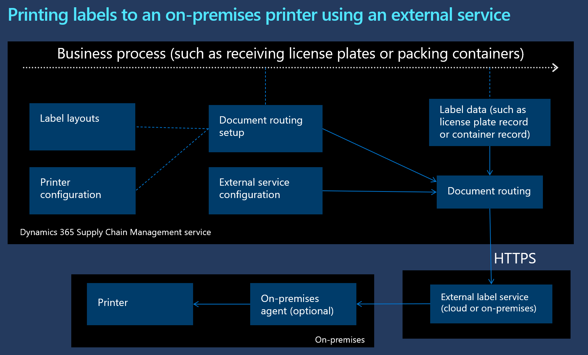

# Print labels using an external service

[!include [banner](../includes/banner.md)]
[!INCLUDE [preview-banner](../includes/preview-banner.md)]

<!-- KFM: Preview until 10.0.34 GA -->

This article describes how to set up and print labels by using an external service. This feature enables direct interaction between Microsoft Dynamics 365 Supply Chain Management and third-party solutions by providing a framework for communicating via HTTP APIs, without requiring the [Document Routing Agent (DRA)](../../fin-ops-core/dev-itpro/analytics/install-document-routing-agent.md). You can design and print different types of labels by using third-party labeling products, such as [Seagull Scientific BarTender®](label-printing-using-bartender.md) and [Loftware NiceLabel](label-printing-using-nicelabel.md).

The following illustrations show how printing through the DRA compares to printing through an external service. They highlight the benefits and drawbacks of each method, and can help you decide which printing solution best fits your business needs.

**Printing labels by using the DRA**

[](media/print-labels-using-dra.png#lightbox)

**Printing labels by using an external service**

[](media/print-labels-using-external-service.png#lightbox)

For more information about the document routing framework, see [Install the Document Routing Agent to enable network printing](../../fin-ops-core/dev-itpro/analytics/install-document-routing-agent.md).

For an example that shows how to set up this feature for a specific third-party label printing service (in this case, Loftware NiceLabel), see [Print labels using the Loftware NiceLabel label service solution](label-printing-using-nicelabel.md).

## Prerequisites

To use the features that are described in this article, you must be running Supply Chain Management version 10.0.34 or later.

## Overview of required configurations

To enable label printing through an external service, you must set up the following elements:

- **[External service definition](#service-definition)** – This element defines how the external API is called. The definition consists of one or more operations.
- **[External service instance](#service-instance)** – This element represents a specific deployment of the service that's described by the external service definition. It specifies the URL of the service and the authentication secret that should be used. For each external service definition, you can use one or more instances. For example, you can set up multiple warehouses, each of which has its own on-premises installation of labeling software.
- **[Label printers](#label-printers)** – This element defines the label printers that are managed by the labeling service.
- **[Document routing setup](#document-routing)** – This element defines which printer is used for which layout in a specific business process.
- **[Label layout](#label-layout)** – This element defines a label layout.

The remaining sections of this article describe how to configure each of these elements.

## <a name="service-definition"></a>Set up an external service definition

An external service definition defines how a specific service must be called. This configuration depends on the API definitions that the external service supports. Typically, those API definitions are provided by the external service provider.

Follow these steps to set up an external service definition.

1. Go to **Warehouse management \> Setup \> External services \> External service definitions**.
1. On the Action Pane, select **New** to create an external service definition.
1. Set the following fields for the new service definition:

    - **External service definition** – Enter a name for the definition (for example, *External*).
    - **Description** – Enter a short description of the definition (for example, *External*).

1. On the Action Pane, select **Save**.
1. On the **External service operations** FastTab, select **Edit operations** on the toolbar.
1. The **External service operations** page appears. External service operations define how the system will format its HTTP requests to the external service. You must add at least one operation, which will be used to print labels. On the Action Pane, select **New** to add a new operation, and then follow these steps for it:

    - On the header of the new record, set the following fields:

        - **External service definition** – This read-only field shows a value of *External*.
        - **External service operation** – Enter a name for the operation.
        - **Description** – Enter a short description of the operation.

    - On the **General** FastTab, set the following fields:

        - **HTTP method** – Select the HTTP method to use (*GET*, *POST*, or *PUT*).
        - **Operation timeout** – Select the time-out period for the operation, in milliseconds (for example, *500*).
        - **Request body type** – Select the type of body that the service expects:

            - *Raw* – The service expects an XML or JSON message.
            - *form-data* – The service expects data that's formatted as an HTTP form.

        - **Relative URL** – Enter the relative part of the URL for calling the service. Your external service provider must provide this value.

    - If you want to express a request entirely in a URL, use the **Request query string** FastTab to define query parameters for authenticating requests.
    - Use the **HTTP request headers** FastTab to define the HTTP authorization header, which is the most common method for providing authentication information.
    - The **Request body (form data)** FastTab is shown when the **Request body type** field is set to *Form-data*. Use it to provide the names of the form data fields and their values. Use the toolbar to add or remove rows in the grid as required. For each row, set the following fields:

        - **Key** – Enter the name of the form data field.
        - **Value** – Enter the value of the form data field.
        - **File name** – This field is required only in special cases where the service expects that the value will resemble an uploaded file. For example, it's required by Zebra's `SendFileToPrinter` service.

    - The **Request body (raw)** FastTab is shown when the **Request body type** field is set to *Raw*. Use it to specify the body content and the content type. Set the following fields:

        - **Content type** – Specify the MIME content type identification (for example *application/xml*, *application/json*, or *text/plain*).
        - **Request body** – Enter the body content.

    You can use the following substitution placeholders in the header values, the form data values, or the request body:

    - `$auth.secret$` – This placeholder will be replaced by the authentication secret that's configured on the external service instance. Use it to store a shared key, token, or password that's required to authenticate with the external service instance.
    - `$label.printer$` – This placeholder will be replaced by the name of the printer that you configure later. Use it to signal to the external service where the label should be printed.
    - `$label.body$` or `$label.body:base64$` – This placeholder will be replaced by the label that's generated from a label layout or document routing layout. Use the base64 formatting version (`$label.body:base64$`) if the externals service expects a base64-encoded Zebra Programming Language (ZPL) script.

1. If you require additional service operations (for example, one for ZPL-based layouts and one for variable-based layouts), repeat the previous step to add them.
1. On the Action Pane, select **Save**. Then select the **Close** button to return to the **External service definitions** page.
1. On the **Label print service** tab, set the following fields:

    - **Print operation** – If you created an operation for printing ZPL-based layouts, select the name of that operation. The operation must already have been defined for the current service definition, as described earlier in this procedure.
    - **Variables print operation** – If you created an operation for printing variable-based layouts, select the name of that operation. This operation must already have been defined for the current service definition, as described earlier in this procedure.
    - **Variable label layout template** – If you're using a variable-based layout, enter the content for the variable-based layout template.

1. On the Action Pane, select **Save**.

## <a name="service-instance"></a>Set up an external service instance

Each external service instance defines a specific instance of an external service.

1. Go to **Warehouse Management \> Setup \> External services \> External service instances**.
1. On the Action Pane, select **New** to create an external service instance.
1. Set the following fields for the new service instance:

    - **External service instance** – Enter a name for the instance (for example, *External*).
    - **Description** – Enter a short description of the definition (for example, *External*).
    - **External service definition** – Select the service definition to use with the instance. The example service definition value that was suggested earlier in this article was *External*.

1. On the **General** tab, set the following fields:

    - **Base URL** – Enter the host name of the external service.
    - **Authentication secret** – Enter the authentication secret (password or shared key) that will be used to authenticate with the service.
    - **Logging level** – Select the level of log entries to generate:

        - *Errors only* – Log only errors.
        - *Successes and errors* – Log both successes and errors (recommended).
        - *None* – Don't generate any log entries.

    - **Log request bodies** – Select how much extra detail to include in log entries:

        - *Errors only* – Include details about errors.
        - *Successes and errors* – Include details about both successes and errors (recommended).
        - *None* – Don't include any details. Show only log headers.

    - **Service offline** – If you know that the service will be offline for some time, set this option to *Yes* to prevent the system from trying to connect to it. This setting can help save system resources, because it will prevent the system from waiting for the service to respond to requests. Set this option back to *No* when the service is back online.

1. On the Action Pane, select **Save**.

For information about how to read the log entries, see the [Review the external service request log](#review-log) section later in this article.

## <a name="label-printers"></a>Set up a printer

Use the following procedure to link a printer with the external print service.

1. Go to **Warehouse Management \> Setup \> Document routing \> Label printers**.
1. On the Action Pane, select **New** to add a printer to the grid.
1. Set the following fields for the new printer:

    - **Connection type** – Select the type of connection that's used to communicate with the printer:

        - *External label service* – Connect to a cloud printer through an external service. Cloud printers include printers that are accessible only through the external label service.
        - *Document routing agent/Hybrid* – Connect to a DRA printer, or use the DRA as a fallback for the external service if the service can't print the label.

    - **Printer name** – Enter or select the printer name. This value represents an internal Supply Chain Management printer name. If the printer is already configured as a DRA printer, you can select its name in the lookup dialog box. To set up an external service, you must specify the printer name. That name must not already be used for a DRA printer. When you enter a name for an external service printer, we recommend that you use a prefix or another method to keep the names of external service printers separate from printers that you might register through the DRA in the future.
    - **Batch print** – Select this checkbox to enable the system to send multiple labels to the selected printer as a single batch job. Clear this checkbox to send one label at a time. Batch jobs will print labels all at once, without being interrupted by other print jobs.
    - **Maximum file size** – If you enabled batch printing for the printer, enter the maximum size, in megabytes, for batch files that are sent to it. The value must be more than 0 (zero). Batches that exceed the maximum size will be split into smaller batches before they're sent. A large file size will let you include more labels in each batch. However, large batches might take a long time to be printed and therefore delay other jobs. Alternatively, they might fail if they exceed the memory capacity of your printer. To find the maximum supported value, see your printer's specifications.
    - **Label print service instance** – Select the service instance to use. The example service instance value that was suggested earlier in this article was *External*.
    - **Label print service printer name** – Enter the printer name as it's defined in the external service. This value represents an external printer name that's used in the external service.
    - **Label print service execution policy** – If the **Connection type** field is set to *Document routing agent/Hybrid*, select one of the following values to specify what the system should do if a request to the external service fails:

        - *Only use the label print service* – The system won't try to print the label by using the DRA, even for printers where using the DRA would otherwise be an option.
        - *Fallback to the Document Routing Agent* – The system will try to print the label by using the DRA.

## <a name="label-layout"></a>Configure a label layout

You can configure a label layout in either of the following ways:

- Use ZPL or another printer command language directly.
- Specify XML, JSON, or a similar data format that the external service uses to generate and print label layouts.

For more information about how to set up label layouts, see [License plate label layouts and printing](print-license-plate-labels-using-label-layouts.md).

The rest of this section provides an example that shows how to use a JSON request body for an external label service. For this example, the external service has an operation that requires the following JSON body (including several variables) to print a label to a specific printer.

```JSON
{
    "printer": "LABELPRINTER",
    "labelfile": "/Labels/SimpleLicensePlateLabel1",
    "variables": {
        "Item": "ITEM1",
        "Container": "CONTAINER1"
    }
}
```

Part of this JSON request body will be generated by the label layout and will include data for a specific label. It will then be embedded in the external service operation's request body definition, which specifies a printer and other data that isn't specific to the label. Because the printer is provided by the `$label.printer$` substitution, this part of the request will go into the external service operation. Because the label file and the variables are specific to each label, this part of the request should be put into the label layout.

The following example shows what the external service operation's request body might look like.

```JSON
{
    "printer": "$label.printer$",
    $label.body$
}
```

The following example shows what the label layout (in this case, the layout for a license plate label) might look like.

```JSON
"labelfile": "/Labels/SimpleLicensePlateLabel1",
"variables": {
    "Item": "$ItemId$",
    "Container": "$LicensePlateId$"
}
```

## <a name="document-routing"></a>Set up document routing

For information about how to set up document routing, see [License plate label layouts and printing](print-license-plate-labels-using-label-layouts.md).

## Run a scenario to print custom labels

If you want to experiment with printing labels, you can set up a scenario for printing location labels. For more information, see [Custom label layouts printing](custom-label-layouts-and-printing.md). Follow the instructions there, and confirm that the scenario that's described in this article is supported.

## <a name="review-log"></a>Review the external service request log

The external service request log contains information about each request that the system sends to an external service. It can help you troubleshoot issues.

The amount of detail that's recorded in the log depends on the **Log level** and **Log request bodies** settings that are specified for each external service instance. (For more information, see the [External service instance configuration](#service-instance) section earlier in this article.)

For each request, the system will confirm that the external service has returned the HTTP success code (200). If a different HTTP code is returned (for example 4xx or 5xx), the system will report an error, provided that you've enabled the relevant logging options.

Follow these steps to review the request log that's generated while labels are printed to the external service.

1. Go to **Warehouse management \> Enquiries and reports \> External service request log**. Alternatively, to review the log for a specific instance, go to **Warehouse Management \> Setup \> External service instances \> Request log**.
1. In the grid, select the request log to review.
1. On the Action Pane, select **Request details**.
1. Review the log.

## Additional resources

- [Label Layouts](print-license-plate-labels-using-label-layouts.md)
- [Document routing label layouts](document-routing-layout-for-license-plates.md)
- [Print labels using the Loftware NiceLabel label service solution](label-printing-using-nicelabel.md)
- [Print labels using the BarTender label service solution](label-printing-using-bartender.md)
