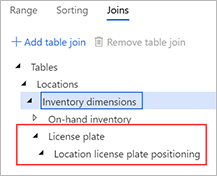
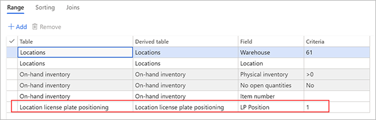

---
# required metadata

title: Location license plate positioning
description: License plate location positioning lets you see where a license plate is located in a multi-pallet location, such as a location that uses double-deep pallet racking.
author: Mirzaab
ms.date: 07/01/2020
ms.topic: article
ms.prod: 
ms.technology: 

# optional metadata
ms.search.form:  WHSLicensePlate, WHSLocationProfile, WHSLocDirTable
audience: Application User
# ms.devlang: 
ms.reviewer: kamaybac
# ms.tgt_pltfrm: 
# ms.custom: [used by loc for articles migrated from the wiki]
ms.search.region: Global
# ms.search.industry: [leave blank for most, retail, public sector]
ms.author: mirzaab
ms.search.validFrom: 2020-07-01
ms.dyn365.ops.version: 10.0.7
---

# Location license plate positioning

[!include [banner](../includes/banner.md)]

License plate location positioning lets you see where a license plate is located in a multi-pallet location, such as a location that uses double-deep pallet racking.

The feature adds a sequence number to each license plate that is put into a storage location. This sequence number is used to order the license plates in the storage location. Therefore, the feature intelligently supports scenarios where customers are using a gravity racking system and must know, for picking purposes, which license plate is front-facing.

This article presents a scenario that shows how to set up and use the feature.

## Turn the Location license plate positioning feature on or off

To use the functionality described in this article, the *Location license plate positioning* feature must be turned on for your system. As of Supply Chain Management 10.0.25, this feature is mandatory and can't be turned off. If you're running a version older than 10.0.25, then admins can turn this functionality on or off by searching for the *Location license plate positioning* feature in the [Feature management](../../fin-ops-core/fin-ops/get-started/feature-management/feature-management-overview.md) workspace.

## Example scenario

### Make sample data available

To work through this scenario by using the values that are suggested here, you must work on a system where sample data is installed. Additionally, you must select the **USMF** legal entity before you start.

### Set up the feature for this scenario

Complete the following procedures to set up the *Location license plate positioning* feature for the scenario that is presented in this article.

#### Location profiles

The feature must be turned on in the location profile for every location where it will be used.

1. Go to **Warehouse management \> Setup \> Warehouse \> Location profiles**.
1. In the list of location profiles in the left pane, select **BULK-06**.
1. On the **General** FastTab, two new options have been added by the feature. Set the following values:

    - **Enable license plate position:** *Yes*

        When this option is set to *Yes*, the license plate position will be maintained for license plates in the location.

    - **Display mobile device LP position:** *Yes*

        When this option is set to *Yes*, the license plate position will be shown to mobile device users during adjustment and counting. You can change the setting of this option only when the feature is turned on.

1. Select **Save**.

#### Location directives

1. Go to **Warehouse management \> Setup \> Location directives**.
1. In the left pane, make sure that the **Work order type** field is set to *Sales orders*.
1. In the list of location directives, select **61 SO Pick order**.
1. On the Action Pane, select **Edit**.
1. On the **Lines** FastTab, select the line that has a **Sequence number** value of *2*.
1. On the **Location Directive Actions** FastTab, select the line that has a **Name** value of *Pick for less than pallet* (it should be the only line), and change its **Sequence number** value to *2*.
1. Select **New** above the grid to add a line for a new location directive action.
1. On the new line, set the following values:

    - **Sequence number:** *1*
    - **Name:** *Pick position 1*

1. While the new line is still selected, select **Edit query** above the grid.
1. In the query editor, select the **Joins** tab.
1. Expand the **Locations** table join to show the join to the **Inventory dimensions** table.
1. Expand the **Inventory dimensions** table join to show the join to the **On-hand inventory** table.
1. Select **Inventory dimensions**, and then select **Add table join**.
1. In the list of tables that appears, in the **Relation** column, select **License plate (License plate)**. Then select **Select** to add **License plate** to the **Inventory dimensions** table join.
1. While **License plate** is still selected, select **Add table join**.
1. In the list of tables that appears, in the **Relation** column, select **Location license plate positioning (License plate)**. Then select **Select** to add **Location license plate positioning** to the **Inventory dimensions** table join.

    

1. Select **OK** to confirm the updated joined tables and close the query editor.
1. On the **Location Directive Actions** FastTab, select **Edit query** again to reopen to the query editor.
1. On the **Range** tab, select **Add** to add a line to the grid.
1. On the new line, set the following values:

    - **Table:** *Location license plate positioning*
    - **Derived table:** *Location license plate positioning*
    - **Field:** *LP Position*
    - **Criteria:** *1*

    

1. Select **OK** to confirm your changes and close the query editor.

### Set up sample data for this scenario

For this scenario, the user must sign in to the warehousing mobile app by using a worker who is set up for warehouse *61* to perform work. The user must also complete transactions.

Because the *Location license plate positioning* feature adds a new identifier for license plate positions in a location, you must first create some data to support the scenario.

#### Spot-count the first location

1. Open the warehousing mobile app, and sign in to warehouse *61*.
1. Go to **Inventory \> Spot Counting**.
1. On the **Spot Counting** page, set the **Location** field to *01A01R1S1B*.
1. Select **OK**.

    The page shows the location that you entered. It also shows the following message: "Location complete, add new LP or Item?"

1. Select **Refresh** to add a count in the location.
1. On the **Cycle Count: Add New LP or Item** page, select the **Item** field, and then enter the value *A0001*.
1. Select **OK**.
1. On the **Cycle Count: Add New LP or Item** page, select the **LP** field, and then enter the value *LP1001* (or any other license plate number of your choice).

    The **Cycle Count: Add New LP or Item** page shows **License Plate Position 1**.

1. Select **OK**.

    You must now specify the quantity of the item that is counted on the license plate.

1. Set the **Qty** field to *10*.
1. Select **OK**.

    The page shows the location that you entered. It also shows the following message: "Location complete, add new LP or Item?"

1. Select **Refresh** to add another count in the location.
1. On the **Cycle Count: Add New LP or Item** page, select the **Item** field, and then enter the value *A0002*.
1. Select **OK**.
1. On the **Cycle Count: Add New LP or Item** page, select the **LP** field, and then enter the value *LP1002* (or any other license plate number of your choice, provided that it differs from the license plate number that you specified earlier).
1. Change the license plate position by setting the **LP Position** field to *2*.
1. Select **OK**.
1. Specify the quantity of the item that is counted on the license plate by setting the **Qty** field to *10*.
1. Select **OK**.

    The page shows the location that you entered. It also shows the following message: "Location complete, add new LP or Item?"

1. Select **OK**.

Work is now completed.

#### Spot-count the second location

1. On the **Spot Counting** page, set the **Location** field to *01A01R1S2B*.
1. Select **OK**.

    The page shows the location that you entered. It also shows the following message: "Location complete, add new LP or Item?"

1. Select **Refresh** to add a count in the location.
1. On the **Cycle Count: Add New LP or Item** page, select the **Item** field, and then enter the value *A0002*.
1. Select **OK**.
1. On the **Cycle Count: Add New LP or Item** page, select the **LP** field, and then enter the value *LP1003* (or any other license plate number of your choice, provided that it differs from the both the license plate numbers that you specified in the previous procedure).

    The **Cycle Count: Add New LP or Item** page shows **License Plate Position 1**.

1. Select **OK**.
1. Specify the quantity of the item that is counted on the license plate by setting the **Qty** field to *10*.
1. Select **OK**.

    The page shows the location that you entered. It also shows the following message: "Location complete, add new LP or Item?"

1. Select **OK**.

Work is now completed.

#### Work details

> [!NOTE]
> Spot counts from the mobile app create cycle counting work in Microsoft Dynamics 365. The work requires that the counts be accepted before they are posted to inventory.

1. Sign in to Dynamics 365 Supply Chain Management.
1. Go to **Warehouse management \> Work \> Work details**.
1. On the **Overview** tab, look for the lines that have the following values:

    - **Work order type:** *Cycle counting*
    - **Warehouse:** *61*
    - **Work status:** *Pending review*

    Two work IDs should have been created for these lines. The counts for both these work IDs must be accepted.

1. In the grid, select the first work ID for the *Cycle counting* work order type.
1. On the Action Pane, on **Work** tab, in the **Work** group, select **Cycle counting**.

    Two lines are shown, one for each item and license plate. The values in the **Counted quantity**, **Location**, **License plate**, and **Item** fields should match the count entries that you created on the mobile device. If any of these fields aren't visible, select **Display dimensions** on the Action Pane to add them to the grid.

1. Select both lines.
1. On the Action Pane, select **Accept count**.
1. You receive a "Posting - Journal" message. Select **Message details** to view the posted journal number.
1. Close the message details.
1. Refresh the **Work** page.

    The first work ID has been closed and is no longer shown.

    > [!TIP]
    > To view closed work, select the **Show closed** check box above the grid.

    You will now accept the work for the license plate in the *01A01R1S2B* location.

1. On the **Overview** tab, select the second work ID for the *Cycle counting* work order type.
1. On the Action Pane, on **Work** tab, in the **Work** group, select **Cycle counting**.

    One line is shown, for the item and license plate. The values in the **Counted quantity**, **Location**, **License plate**, and **Item** fields should match the count entries that you created on the mobile device.

1. Select the line.
1. On the Action Pane, select **Accept count**.
1. You receive a "Posting - Journal" message. Select **Message details** to view the posted journal number.
1. Close the message details.
1. Refresh the **Work** page.

    The second work ID has been closed and is no longer shown.

    > [!TIP]
    > To view closed work, select the **Show closed** check box above the grid.

#### On-hand by location

1. Go to **Warehouse management \> Inquiries and reports \> On-hand by location**.
1. Set the following values:

    - **Site:** *6*
    - **Warehouse:** *61*
    - **Refresh across locations:** *Yes*

1. Notice that location *01A01R1S1B* has two license plates:

    - **A0001**, where the **LP Position** field is set to *1*
    - **A0002**, where the **LP Position** field is set to *2*

1. Notice that location *01A01R1S2B* has one license plate:

    - **A0002**, where the **LP Position** field is set to *1*

### Sales order scenario

Now that the *Location license plate positioning* feature has been set up, and the inventory has been staged, you must create a sales order to generate picking work that will direct the warehouse worker to pick item *A0002* from the inventory location where the pallet ID is in position *1*.

1. Go to **Sales and marketing \> Sales orders \> All sales orders**.
1. On the Action Pane, select **New**.
1. In the **Create sales order** dialog box, set the following values:

    - **Customer account:** *US-004*
    - **Warehouse:** *61*

1. Select **OK**.
1. A new line is added to the grid on the **Sales order lines** FastTab. On this new line, set the following values:

    - **Item number:** *A0002*
    - **Quantity:** *1*

1. On the **Inventory** menu above the grid, select **Reservation**.
1. On the **Reservation** page, on the Action Pane, select **Reserve lot** to reserve inventory for the order line.
1. Close the **Reservation** page.
1. On the Action Pane, on the **Warehouse** tab, in the **Actions** group, select **Release to warehouse**.

    You receive an informational message that indicates the wave ID and shipment ID that were created for the order.

1. On the **Sales order lines** FastTab, on the **Warehouse** menu above the grid, select **Work details**.
1. The **Work** page appears and shows the work that was created for the sales line. Make a note of the work ID that is shown.

### Sales picking scenario

1. Open the mobile app, and sign in to warehouse *61*.
1. Go to **Outbound \> Sales picking**.
1. On the **Scan a work ID / license plate ID** page, select the **ID** field, and then enter the work ID from the sales line.
1. Notice that the picking work directs you to pick item *A0002* from location *01A01R1S2B*. You receive this instruction because item *A0002* is on a license plate that is in position *1* in that location.

    

1. Enter the license plate ID that you created for the location, and then follow the prompts to pick the sales order.

[!INCLUDE[footer-include](../../includes/footer-banner.md)]