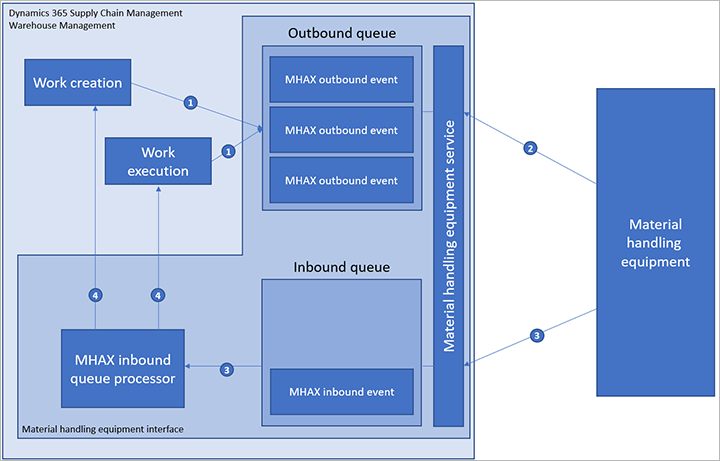

---
# required metadata

title: Material handling equipment interface (MHAX)
description: This article describes how to set up the material handling equipment interface (MHAX) so that you can connect to external physical material handling (MH) systems.
author: Mirzaab
ms.date: 08/09/2022
ms.topic: article
ms.prod: 
ms.technology: 

# optional metadata

ms.search.form: WMHEParameters, WMHESubscription, WMHEQueueManagerWorkspace, WMHEInboundQueue, WMHEOutboundQueue
audience: Application User
# ms.devlang: 
ms.reviewer: kamaybac

# ms.tgt_pltfrm: 
# ms.custom: [used by loc for articles migrated from the wiki]
ms.search.region: Global
# ms.search.industry: [leave blank for most, retail, public sector]
ms.author: mirzaab
ms.search.validFrom: 2021-03-04
ms.dyn365.ops.version: 10.0.17
---

# Material handling equipment interface (MHAX)

[!include [banner](../../includes/banner.md)]

You can use the *material handling equipment interface* (MHAX) to connect external physical material handling (MH) systems to a warehouse that is managed by warehouse management processes (WMS) in Microsoft Dynamics 365 Supply Chain Management. The interface between the WMS and MH systems consists of two queues: one for outbound events (WMS to MH) and one for inbound events (MH to WMS). The WMS system generates outbound events based on work lines that are created during various work creation and execution processes. The MH system then regularly polls the WMS system for new events and processes the responses. After the MH system has finished handling the events in accordance with work instructions, it sends inbound events, such as work line completion and short picking.

> [!IMPORTANT]
> By enabling this feature, your data may be shared with the third-party services that you select. You control what data is shared with the third-party (if any). Your use of the third-party services is your responsibility and is governed by terms agreed between you and the third party. Your privacy is important to us. To learn more, read our [Privacy Statement](https://privacy.microsoft.com/en-us/privacystatement).

The following illustration shows the various elements and the order that processes occur in when you use MHAX integration.

Here is an explanation of the interactions that are shown in the previous illustration:

1. During work creation or work execution, outbound events are created in the outbound queue.
2. The MH equipment connects to the MH equipment service, polls for any new events that are relevant to it, and processes those events.
3. When the MH equipment is ready to report back, it connects to the service again and submits inbound events. Those events are immediately processed by the queue processor.
4. Based on the inbound event data, the queue processor might run existing work, modify it, or create new work.

## Turn on the MHAX feature

Before you can use the MHAX feature, you must turn on both its feature and its configuration key.

1. If you're running Supply Chain Management version 10.0.28 or earlier, do the following steps:
    1. Go to **System administration \> Workspaces \> Feature management**.
    1. In the **[Feature management](../../fin-ops-core/fin-ops/get-started/feature-management/feature-management-overview.md)** workspace, turn on the feature that is named *Material handling equipment interface*. (As of Supply Chain Management 10.0.29, this feature is mandatory and can't be turned off.)
1. Put your system into maintenance mode, as described in [Maintenance mode](../../fin-ops-core/dev-itpro/sysadmin/maintenance-mode.md).
1. Go to **System administration \> Setup \> License configuration**.
1. Expand **Trade \> Warehouse and Transportation management**, and then select the **Material handling equipment interface** check box.
1. Turn off maintenance mode, as described in [Maintenance mode](../../fin-ops-core/dev-itpro/sysadmin/maintenance-mode.md).

## Set MHAX parameters

You must set a few general parameters on the **Material handling equipment interface parameters** page to configure the feature.

1. Go to **Material handling equipment interface \> Setup \> Material handling equipment interface parameters**.
2. On the **General** tab, set the following fields:

    - **User ID** – Select a worker. This worker will be used to run all work operations (picks and puts) that are processed through the inbound queue.
    - **Enable inbound message ID** – When this option is set to *Yes*, if a duplicate inbound message ID is received, the message will be rejected, and an error message will state that the message already exists. When this option set to *No*, duplicate inbound message IDs will be allowed.

3. On the **Number sequences** tab, select the system-wide number sequences that should be used to generate unique IDs for the inbound queue items, outbound queue items, and work line pairs.

## Outbound events

At specific points during work creation or work execution, the system determines whether it must generate outbound events to send to the MH system. If a subscription is configured for a specific point during warehouse processing, the system generates the event according to the setup of the subscription.

### Structure of outbound events

Each outbound event is uniquely identified by an outbound queue ID. The outbound transaction type determines the type of the event. The warehouse and the ID of the subscription that generated the event are also recorded on the event.

To carry data to the MH system, the outbound event contains 10 fields for data (**data01** through **data10**). These data fields have a one-to-one (1:1) mapping to existing database fields. Specifically, they are extracted from fields in the work line and work header tables. The fields can be freely selected. You set them up when you create the subscription.

Besides the 10 data fields that have a 1:1 mapping to existing database fields, the event can contain an additional data field that is known as the *payload*. The contents of this field are generated by custom X++ code that is known as a *payload generator*. Any payload generator that should be used is set up in the subscription.

To ensure that the MH system receives each outbound queue ID only one time, a status field is used to specify whether an event is ready to be sent to the external system or whether it has already been sent.

### Outbound queue subscriptions

Before any events are generated, a subscription must be set up to tell the MHAX feature whether and how to generate events. Generated events are tagged by the subscription identifier. Therefore, multiple MH systems can connect to the same WMS system but keep their events separate. When the MHAX service is polled for new events, a subscription is one of the available options for retrieving the events.

To create a subscription, go to **Material handling equipment interface \> Setup \> Subscriptions**. For each subscription, the following parameters are available:

- **Subscription ID** – A unique name that identifies the subscription.
- **Description** – A free-text description of the subscription.
- **Warehouse** – The specific warehouses that events should be filtered by.
- **Outbound transaction type** – The type of events that the subscription should contain.
- **Payload generator** – An optional code extension that can enter additional information in the **Payload** field of the outbound event.

A query can be associated with each subscription. This query filters work lines and headers to further limit the work that will use the subscription to generate events. To add a query to a subscription, select the **Run query** check box for the relevant subscription on the **Subscriptions** page, and then select **Edit query** on the Action Pane. The standard Supply Chain Management query editor appears.

In addition, the subscription includes a *subscription map* that maps fields from either the work header or the work line to some or all of the 10 free data fields of the outbound event, as required. To return information to the MHAX service, you will typically include the work line record ID or the *work line pair ID*. (The work line pair ID is a new property that enables the system to use a single return command to process pick and put lines.) The remaining fields depend on the use case. Some examples are provided later in this article.

To set up a subscription map, select the relevant subscription on the **Subscriptions** page, and then select **Subscription map** on the Action Pane. In the **Subscription map** dialog box that appears, you can assign a table and field for each available data field as you require.

### Outbound event types

This section describes the various events types that are available. (Event types are also known as *transaction types*.) It also explains when each type of event is created in the WMS system.

#### Work creation events

Work creation events are created after work is generated by the application. This behavior applies to most types of work creation processes, most notably to the creation of picking and replenishment work. In general, if work is created in an *Open* state, which indicates that the work is ready to be run by a worker, a work creation event will be generated. In addition, work creation events will be generated for basic movement work (not movement by template work), even though that work isn't created as open work.

A notable exception to this behavior is cycle counting work, which isn't currently supported. Stock counts in the MH system are outside the scope of MHAX, and the results of counts must be imported into an inventory counting journal.

After work has been created, the MHAX service processes the work lines that are generated and assigns a work line pair ID to all generated work lines for each work header. The objective is to group all the pick work lines with the successive puts under one work line pair ID. (The groups correspond to pick/put pairs in work templates.) In this way, a single ID can be used to report work completion for all related pick and put lines. The grouping process starts with the first line and then continues with the same ID until it encounters a successive pair of put/pick work lines. The running ID is assigned to the put line of that pair. A new ID it then used for the pick line of the pair onward. This process continues until it has processed all lines that belong to the work header.

As a special feature of work creation events, if the **Blocked wave** option is set to *Yes* on the work header, the events that are generated will have a status of *Blocked* instead of the usual status of *Ready* that is used to send them to the MH system. The **Blocked wave** flag on the work header indicates that the work header isn't yet ready for workers to run, perhaps because of unfinished replenishment work. When the **Blocked wave** flag is cleared, events that have already been generated are unblocked and are available for the MH system to retrieve from the queue.

#### Work initiation events

Work initiation events are triggered when the work status changes from *Open* to *In process* during work update.

#### Work completion events

Work completion events are triggered when the work status changes from *In process* to *Closed* during work update.

#### Work cancellation events

Work cancellation events are triggered when the work status changes from any status besides *Canceled* to *Canceled* during work update. In addition, all other events that are related to the work header are deleted from the queue for all subscriptions. In this way, external systems are prevented from processing events that aren't required.

#### Pick/put completion events

Pick/put completion events are triggered when the status of the pick/put line changes from *In process* to *Closed* during work line update.

### Monitor the outbound queue

To review your outbound queue, go to **Material handling equipment interface \> Common \> Outbound queue**. The **Outbound queue** page lists every outbound queue item and its status. Select a queue item to view its details. These details include the item's transaction type, the subscription that it used, and values for each data field (**data01** through **data10**) and the payload.

### Clean up the outbound queue

Eventually, your outbound queue will start to become full of queue items that have already been sent. To remove these items, go to **Material handling equipment interface \> Periodic tasks \> Cleanup \> Outbound queue cleanup**.

## Inbound events

This section describes the various types of inbound events that the MH system can report back to the WMS system. It also explains data must be supplied by the MH system, and what each inbound event does in the WMS system.

### Structure of inbound events

When an inbound event is submitted, the external system must supply the inbound transaction type together with up to 10 parameters (**data01** through **data10**). Optional validation can make sure that the MHAX service hasn't received the same inbound event more than one time. To enable this validation, each inbound event must have a unique message ID. If a duplicate message ID is received, and if the **Enable inbound message ID** option is set to *Yes* on the **Material handling equipment interface parameters** page, the message will be rejected. An error message will state that the message already exists.

In addition to the incoming data fields, the system assigns a unique inbound queue ID to the event.

### Inbound event types

This section describes the inbound event types (transaction types) that are supported and the data that must be supplied for events to be processed.

#### Work-confirm events

Work-confirm events require that the incoming data fields include the following information:

- **data01** – The work line pair ID.
- **data02** – The work line record ID (`RecId` value).

    > [!NOTE]
    > *Either* the **data01** field *or* the **data02** field must be present.

- **data03** – The ID of the license plate to pick from.
- **data04** – The work header's target license plate ID.

If the work line pair ID is provided, all pick, put, or custom work lines that are marked by the work line pair ID, and that have a status of *Open* or *In process*, are run sequentially. If a work line record ID (`RecId` value) is provided, the work line must be a pick, put, or custom work line that has a status of *Open* or *In process*.

Pick lines from license plate–controlled locations require that the **data03** specify the license plate that should be picked from, regardless of whether the lines are marked by the work line record ID or the work line pair ID. The **data04** field must specify the work header's target license plate for the pick.

Put lines don't accept further information. They are run based only on the current work line's location and the work's target license plate. If the put must be done to a different location, change the location of the work line as described in the [Override events](#override-events) section later in this article.

Custom work lines don't require, or support, any additional information in the inbound event.

#### Short pick events

Short pick events require that the incoming data fields include the following information:

- **data02** – The work record ID (`RecId` value).
- **data03** – The ID of the license plate to pick from.
- **data04** – The quantity to pick.
- **data05** – The short pick exception code.
- **data06** – The work header's target license plate ID.

> [!NOTE]
> The **data01** field isn't used for short pick events.

This event resembles the work confirmation event, but it applies only to pick lines.

#### Override events

Override events require that the incoming data fields include the following information:

- **data01** – The work record ID (`RecId` value).
- **data02** – The new location ID.

The work line must have a status of either *Open* or *In process*, and the new location must exist.

#### License plate receipt events

License plate receipt events require that the incoming data fields include the following information:

- **data01** – The ID of the inbound license plate to receive.

The system performs a license plate receiving operation, based on the license plate that is passed in as the value of the **data01** field.

### Monitor the inbound queue

To review your inbound queue, go to **Material handling equipment interface \> Common \> Inbound queue**. The **Inbound queue** page lists every inbound queue item and its status. Select a queue item to view its details. These details include the item's transaction type, the message ID, and values for each data field (**data01** through **data10**).

If an error or another type of log item occurred while inbound events were processed, you can inspect the log by selecting **Error log** on the Action Pane.

### Inbound event processing

Inbound events are first written to the database, and they are then immediately (synchronously) run. If an error occurs during processing, the event is still written to the queue, but the status is set to *Errored*. The MHAX service returns an error message to the MH system and stores the error log in the inbound event record for later investigation.

Events that have a status of *Errored* can be reprocessed later if the error condition is fixed. To reprocess them, follow one of these steps:

- Go to **Material handling equipment interface \> Common \> Inbound queue**. Select the relevant inbound queue, and then select **Reprocess** on the Action Pane.
- Go to **Material handling equipment interface \> Common \> Reprocess errored inbound queue**. A standard batch job dialog box appears. There, you can set up a record filter, and schedule or run a batch job to reprocess the queue.

All work operations (picks and puts) are run by using the worker who is selected in the **User ID** field on the **Material handling equipment interface parameters** page.

### Clean up the inbound queue

Eventually, your inbound queue will start to become full of queue items that have already been processed. To remove these items, go to **Material handling equipment interface \> Periodic tasks \> Cleanup \> Inbound queue cleanup**.

## Get a quick overview by using the queue manager

To get a quick overview of all the activity that is related to your inbound and outbound queues, go to **Material handling equipment interface \> Workspaces \> Queue manager**. The **Queue manager** page provides a set of tabs and tiles that you can use to monitor and explore your queues. It also provides useful links to most of the other pages that are mentioned in this article.

## Connect to the MHAX service

MHAX is implemented as a custom service. Therefore, it's accessible via SOAP and REST calls. Here are the addresses of the SOAP and REST endpoints:

- **SOAP:** `https://base_environment_URL/soap/services/WMHEServices`
- **REST:** `https://base_environment_URL/api/services/WMHEServices/WMHEService`

## Retrieve messages from the outbound queue

To retrieve messages from the outbound queue, use one of the following methods:

- Use `readOutboundSubscriptionQueue` to retrieve the events based on the subscription ID.
- Use `readOutboundWarehouseQueue` to retrieve the events based on the event type and warehouse ID across multiple subscriptions.
