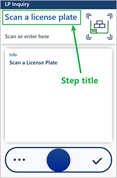
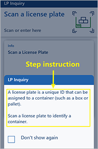

# Customize step titles and instructions for the Warehouse Management mobile app

> [!IMPORTANT]
> The features that are described in this article apply only to the new Warehouse Management mobile app. They do not affect the old warehouse app, which is now deprecated.

This article describes how to create and show custom instructions for every step of every task flow that you set up for the Warehouse Management mobile app. When warehouse workers receive well-written instructions, they can immediately start to use new flows without requiring previous training. This feature provides the following benefits:

- **Ramp up workers faster by letting them follow simple instructions for every task step.** Every step of a flow provides instructions that enable front-line workers to understand the task.
- **Provide instructions that match your own processes.** Write your own instructions to match your business and warehouse processes. For example, you can make the terminology fit your physical space and local abbreviations.

## Turn the Warehouse app step instructions feature on or off

Before you can use this feature, it must be turned on for your system. As of Supply Chain Management version 10.0.29, this feature is mandatory and can't be turned off. If you're running a version older than 10.0.29, then admins can turn this functionality on or off by searching for the *Warehouse app step instructions* feature in the [Feature management](../../fin-ops-core/fin-ops/get-started/feature-management/feature-management-overview.md) workspace.

## Step titles and step instructions in the app

Every step in a task flow on the Warehouse Management mobile app is identified by a step ID. Additionally, every step has a title, icon, and instruction. (For more information, see [Assign step icons and titles for the Warehouse Management mobile app](step-icons-titles.md).)

### Step titles

A *step title* is a short description of what a worker should do during a step. It appears as large text at the top of the screen, as shown in the following illustration.

> [!TIP]
> Because of the large text size, you should try to keep step titles as short as possible. Otherwise, the text might be cut off. However, for long titles, workers can still press and hold the title to open a dialog box that shows the full text.

### Step instructions

A *step instruction* is a longer description that provides more information about what a worker should do during a step. It appears in a pop-up dialog box, as shown in the following illustration.

The step instruction is automatically shown when a step is opened. Workers can dismiss it by tapping anywhere outside the pop-up dialog box. Additionally, the dialog box includes a **Don't show again** checkbox that workers can select to prevent the instruction from appearing the next time that they perform the same task.

## Load the default setup

When you first turn on the *Warehouse app step instructions* feature, your system won't contain any customizable step titles or instructions. Therefore, the first thing that you should do is load the default setup. The default setup provides texts for all the available step IDs in every supported language. To load the default setup, follow these steps.

1. Go to **Warehouse management \> Setup \> Mobile device \> Mobile device steps**.
1. On the Action Pane, select **Create default setup**. The page is filled in with the standard steps.

## Customize step titles and instructions

To customize the title and/or instruction for a step in any number of languages, follow these steps.

1. Go to **Warehouse management \> Setup \> Mobile device \> Mobile device steps**.

    The **Mobile device steps** page lists every step that is available for your system. Each step ID can be shared among any number of mobile device menu items. If a step ID is shared among multiple menu items, the same title and instruction are shown for all those menu items. However, you can create overrides to customize the title and instruction for specific menu items. (For more information, see the next section.)

    The grid includes the following columns:

    - **Menu item name** – Rows where this column is blank use the default step title and instruction that apply to all mobile device menu items that no override is defined for. Rows where this column is set to the name of a menu item have overrides that apply only to the specified menu item.
    - **Step ID** – The unique ID of the step.
    - **Title for input** – The title that is shown when the app requests new information. Typically, the fields on the page are blank (that is, they have no preset values).
    - **Title for confirmation** – The title that is shown when the app requests confirmation of a value that is already stored in the system. Typically, the fields on the page have preset values.

1. Find the combination of **Step ID** and **Menu item name** values that you want to edit, and select the value in the **Step ID** column. The page that is opened lists all the available translations for the title and instruction of the selected step.
1. Follow one of these steps to customize the text for any language. Both options let you edit texts for existing languages. However, only the first option lets you to add texts for new languages, whereas only the second option lets you view and edit texts for all existing menu-specific overrides of the selected language.

    - On the toolbar, select **Add** to open a dialog box where you can add or edit texts for any supported language. Set the **Reference language** field to the language that you want to view values for. The values are shown in the left column. Set the **Language of the translations** field to the language that you want to add or customize. In the right column, edit the values of the **Title for input**, **Instruction for input**, **Title for confirmation**, and **Instruction for confirmation** fields as you require. Then select **OK**.
    - In the grid, find and select the row where the **Language** field is set to the language that you want to edit. On the toolbar, select **View &lt;language&gt; translations of this step** to open a dialog box where you can edit texts for all available overrides for the selected language. The dialog box includes a grid that has rows for both the standard texts (where the **Menu item name** field is blank) and for each available override text (where the **Menu item name** field is set to the name of the menu item that the override applies to). Edit the values of the **Title for input**, **Instruction for input**, **Title for confirmation**, and **Instruction for confirmation** fields as you require. Then select **OK**.

1. Continue to work until you've defined every required title and instruction for every required language.

## Add menu-specific overrides

As was mentioned in the previous section, you can create any number of menu-specific overrides for each step ID. You might use this capability to edit and change the instruction so that it better fits your local business process for a specific menu item. For example, for sales picking, if your company usually provides work IDs to workers on a printed document, you can provide a hint that workers should start by scanning a work ID.

Each override applies to a specific mobile device menu item and can contain any number of translations. If no override exists for a menu item, the menu item uses the standard texts. If no override translation is defined for a language, the standard texts are used, even for menu items where an override is defined for other languages.

To create and configure an override, follow these steps.

1. Go to **Warehouse management \> Setup \> Mobile device \> Mobile device steps**.
1. In the grid, find and select the row to create an override for.
1. On the Action Pane, select **Add step configuration**.
1. In the **Add step configuration** drop-down dialog box, set the **Menu item** field to the name of the mobile device menu item that your override applies to. Then select **OK**.
1. The page that appears shows all the texts that are available for the new override. Initially, just one language is created. All other languages will continue to use the standard texts unless you add those languages here. Edit the texts and add new languages as you require, as described in the previous section.
