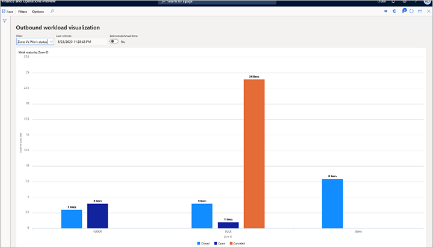
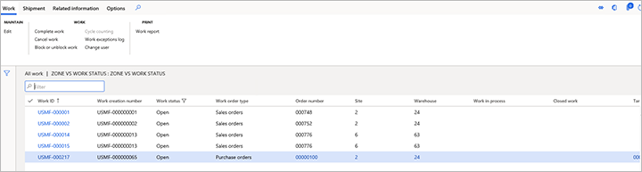

---
# required metadata

title: Outbound workload visualization
description: This article provides information about outbound workload visualization. This functionality lets warehouse managers and supervisors create custom workload charts that can be used to monitor the progress of current work and the amount of it that remains. Warehouse managers can create multiple views and set up automatic refresh as they require.
author: Mirzaab
ms.date: 08/09/2022
ms.topic: article
ms.prod: 
ms.technology: 

# optional metadata

# ms.search.form:  [Operations AOT form name to tie this article to]
audience: Application User
# ms.devlang: 
ms.reviewer: kamaybac
# ms.tgt_pltfrm: 
# ms.custom: [used by loc for articles migrated from the wiki]
ms.search.region: Global
# ms.search.industry: [leave blank for most, retail, public sector]
ms.author: mirzaab
ms.search.validFrom: 2020-08-28
ms.dyn365.ops.version: 10.0.13
---

# Outbound workload visualization

[!include [banner](../includes/banner.md)]

Advanced setup capabilities that are accessible from the **Outbound workload visualization** page let warehouse managers and supervisors create custom workload charts that can be used to monitor the progress of current work and the amount of it that remains. Warehouse managers can create multiple views and set up automatic refresh as they require. Outbound workload visualizations are suitable for display on warehouse performance pages.

This functionality can be used to track the progress of picking work. The feature is integrated with labor management, and if labor management is set up, outbound workload visualizations can show a calculation of the number of hours that remain for the picking work that is shown (filtered).

## Turn the Outbound workload visualization feature on or off

To use this feature, it must be turned on for your system. As of Supply Chain Management version 10.0.25, the feature is turned on by default. As of Supply Chain Management version 10.0.29, the feature is mandatory and can't be turned off. If you're running a version older than 10.0.29, then admins can turn this functionality on or off by searching for the *Outbound workload visualization* feature in the [Feature management](../../fin-ops-core/fin-ops/get-started/feature-management/feature-management-overview.md) workspace.

## Set up outbound workload visualizations

To set up your visualizations, you create a collection of filters (views) and design each filter so that it shows a different type of analysis. You use the **Configure filters** page to design the filters.

To set up an outbound workload visualization, follow these steps.

1. Go to **Warehouse management \> Warehouse monitoring reports \> Outbound workload visualization**.

    The **Outbound workload visualization** page appears. After you create some filters, this page will show your visualization. You can create as many filters as you want. All the filters that you create are saved under your user account, so that you can use them later. In other words, each user will have their own set of filters that they created. Those filters won't be shared with other users.

1. On the **Outbound workload visualization** page, on the Action Pane, on the **Filters** tab, select **Configure filters**.
1. On the **Configure filters** page, on the Action Pane, select **New** to add a filter, and then set the following fields for it:

    - **X-axis group table** – Select the table that contains the field that should be used to group the X-axis values.
    - **X-axis group field** – From among the fields of the table that you selected in the **X-axis group table** field, select the field that should be used to group the X-axis values.
    - **X-axis value table** – Select the table that contains the field that should be used to further analyze the groups.
    - **X-axis value field** – From among the fields of the table that you selected in the **X-axis value table** field, select the field that provides the values that should be analyzed for each group.
    - **Auto-refresh** – Select whether the visualization should automatically be refreshed.
    - **Refresh interval (minutes)** – Enter the number of minutes between automatic refreshes.
    - **Display level** – Select whether the chart should show open lines or open header counts.
    - **Picking type** – If you set the **Display level** field to _Open lines_, select whether the count of open work lines in the chart should include initial picks, staged picks, or both initial picks and staged picks.
    - **Site** – Select the site to load the chart for.
    - **Warehouse** – Select the warehouse to load the chart for.
    - **Days to include** – Enter the number of days in the past that the chart should be generated for.
    - **Work order type** – Select the outbound work order types to filter on.

    

1. Close the **Configure filters** page to return to the **Outbound workload visualizations** page.

    The **Outbound workload visualizations** page now shows data, based on your new filter settings. Your new filter is now available and is selected in the **Filter** field. The following fields are available at the top of the chart:

    - **Filter** – This field includes all the filters that you've created so far. Select a filter to view its data in the chart.
    - **Last refreshed** – This field shows the date and time when the information in the chart was last updated.
    - **Estimated/actual time** – If labor standards are set up in your system, set this option to *Yes* to show accumulated estimated picking times at the top of each column in the chart. If you aren't using labor standards, this option is unavailable.

    

1. Select any bar in the chart to view the associated work line details.

    

## Example: Outbound workload visualization for zones

For this example, you want to set up a visualization that shows work lines for each zone, and the status of each work line (_Open_, _Closed_, or _Canceled_). In this case, you can set up a filter that has the following settings:

- **Filter name** – Enter a name for this filter (such as _Zone vs. work status_).
- **Description** – Enter a short description for this filter (such as _Zone vs. work status_).
- **X-axis group table** – Select _Locations._
- **X-axis group** – Select _Zone ID_.
- **X-axis value table** – Select _Work_, because you want to view work per zone.
- **X-axis value field** – Select _Work status_, because you want to view work status.
- **Auto refresh** – Select whether the visualization should automatically be refreshed.
- **Picking type** – Select _Initial picks and staged picks_, because you want to include both initial picks and picks from staging locations. In other words, you essentially want to include all the pick work lines that you have.
- **Display level** – Select _Open lines_, because you want to view the information per line, not per work header.

The following illustration shows an example of the resulting chart.

This chart shows two zones that are named **FLOOR** and **BULK**, plus a zone that is named **Blank**. The **Blank** zone represents all work lines that aren't members of any zones. The chart always shows all unrelated filtered data as **Blank**, to provide as much visibility as possible. In the **FLOOR** zone, the chart shows three closed lines and four open lines. In the **BULK** zone, the chart shows four closed lines, one open line, and 24 canceled lines. Finally, the chart shows eight closed lines that aren't part of any zone and are therefore listed as **Blank**.

[!INCLUDE[footer-include](../../includes/footer-banner.md)]