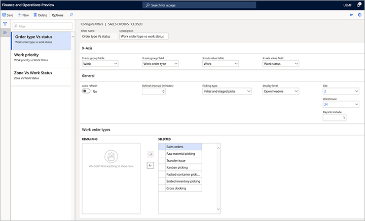

---
# required metadata

title: Outbound workload visualization
description: XXXX
author: Mirzaab
manager: tfehr
ms.date: 08/28/2020
ms.topic: article
ms.prod: 
ms.service: dynamics-ax-applications
ms.technology: 

# optional metadata

# ms.search.form:  [Operations AOT form name to tie this topic to]
audience: Application User
# ms.devlang: 
ms.reviewer: kamaybac
ms.search.scope:  Core, Operations
# ms.tgt_pltfrm: 
# ms.custom: [used by loc for topics migrated from the wiki]
ms.search.region: Global
# ms.search.industry: [leave blank for most, retail, public sector]
ms.author: mirzaab
ms.search.validFrom: yyyy-mm-dd
ms.dyn365.ops.version: Release 10.0.xx
---

# Outbound workload visualization

[!include [banner](../includes/banner.md)]
[!include [preview banner](../includes/preview-banner.md)]
<!-- KFM: I think this is a preview feature, so I added the preview banner. Please confirm. -->

Outbound workload visualization is suitable to be displayed on warehouse performance screens.

Advanced setup capabilities accessible from the **Outbound workload visualization** page enable warehouse managers and supervisors to create custom workload charts that can be used to monitor progress of current work and what is left of it. Warehouse managers can create multiple views and set up auto refresh as needed.

This functionality can be used to track the progress of picking work. The feature is integrated with labor management and, if labor management is set, visualization can show a calculation of the number of left for the displayed picking work (filtered).

## Turn on outbound workload visualization

Before you can use the feature described in this topic, you must add it to your system by adding the flight and then enable the feature in feature management.

### Add the outbound workload visualization flight

To add the outbound workload visualization flight to your system:

- **Flight name**: WHSOutboundWorkLoadVisualizationFeature
- **SQL query**: `INSERT INTO SYSFLIGHTING (FLIGHTNAME, ENABLED) VALUES('WHSOutboundWorkLoadVisualizationFeature', 1);`

<!-- KFM: I borrowed this SQL query from somewhere else. Please confirm. Also, we really should not publish documentation for flighted features. Ideally, we should be able to delete this before we publish. -->

### Enable the outbound workload visualization feature

To enable the feature after adding the flight:

1. Go to **System administration > Workspaces > Feature management**.
1. Select **Check for updates** to update the list after you have added the flight. (You may need to do this a few times before the feature shows up.)
1. Find and enable the **Outbound workload visualization** feature.

## Set up outbound workload visualizations

To set up your visualizations, you will create a collection of filters, and design each of them to show a different type of analysis. You'll use the **Configure filters** page to design your filters.

1. Go to **Warehouse management \> Warehouse monitoring reports \> Outbound workload visualization**.

1. The **Outbound workload visualization** page opens. This is where your visualization will be shown once you create some filters. You can create as many filters (views) as you want, and all are saved under your user account for later use. <!-- KFM: Does this mean that other users won't be able to see my filters? All users must create their own? -->

1. On the Action Pane, open the **Filters** tab and then select **Configure filters**.

1. The **Configure filters** page opens. Select **New** on the Action Pane to add new filter and make the following settings for it: <!-- KFM: I'm guessing about this. Also, we should describe the **Estimated/Actual time** setting -->

    - **X-axis group table** – Select the table that contains the field by which you will group the X-axis values.
    - **X-axis group field** – Select the field (from the selected **X-axis group table** ) by which you will group the X-axis values.
    - **X-axis value table** – Select the table that contains the field by which the groups can be further analyzed.
    - **X-axis value field** –Select the field (from the selected **X-axis value table** ) that provides values to be analyzed for each of the groups
    - **Auto-refresh** – Choose whether the visualization should be auto-refreshed.
    - **Refresh interval (minutes)** – Enter the number of minutes between each auto refresh.
    - **Display level** – Choose whether the chart should display _Open lines_ or _Open header counts_.
    - **Picking type** – If you have set the **Display level** to _Open lines_, then this setting controls whether the count of open work lines on the chart includes _Initial_ picks, _Staged_ picks, or both _Initial and staged picks_.
    - **Site** – Select the site for which the chart should be loaded.
    - **Warehouse** – Select the warehouse for which the chart should be loaded.
    - **Days to include** – Enter the number of days in the past for which the chart is generated.
    - **Work order type** – Select the outbound work order types to filter on.

    

1. Close the **Configure filters** page to return to the **Outbound workload visualizations** page, which now shows data based on your new filter settings. Your new filter is now available and selected in the **Filter** drop-down list.

    

1. The chart is active, so you can select any bar on the chart to view the associated work line details.

    

## Example: Outbound workload visualization for zones

Suppose you want to set up a visualization that shows work lines for each zone and their status (_Open_, _Closed_, or _Cancelled_). To do this, you could set up a filter with the following settings:

- **Filter name** – Enter a name for this filter (such as _Zone vs. work status_).
- **Description** – Enter a short description for this filter (such as _Zone vs. work status_).
- **X-axis group table** – Select _Locations._
- **X-axis group** – Select _Zone ID_.
- **X-axis value table** – Select _Work_ (because we want to view work per zone).
- **X-axis value field** – Select _Work status_ (because we want to see work status).
- **Auto refresh** – Choose whether you would like to auto refresh visualization.
- **Picking type** – Select _Initial picks and staged picks_. This means that we want to include both initial picks and picks from staging locations. So, essentially, all pick work lines we have.
- **Display level** – Select _Open lines_ (because we want to view it per line, not per work header).

The resulting chart might look like this:

This example chart shows two zones identified as **FLOOR** and **BULK**, plus a zone called **Blank**. Zone **Blank** represents all work lines that aren't members of any zones. The chart always shows all unrelated filtered data as **Blank** to provide as much visibility as possible. The chart shows three closed lines and four open lines in zone **FLOOR**; four closed lines, one open line, and 24 cancelled lines in zone **BULK**; and 8 closed lines that aren't part of any zone, which are therefore listed as **Blank**.
