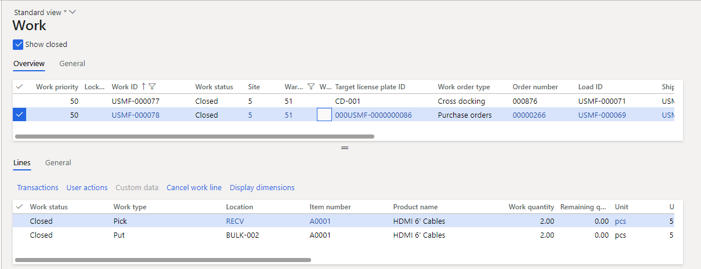

---
# required metadata

title: Planned cross docking
description: This article describes advanced planned cross-docking, where the inventory quantity that is required for an order is directed straight from receipt or creation to the correct outbound dock or staging area. All remaining inventory from the inbound source is directed to the correct storage location through the regular put-away process.
author: Mirzaab
ms.date: 08/09/2022
ms.topic: article
ms.prod: 
ms.technology: 

# optional metadata
ms.search.form:  WHSCrossDockingTemplate, WHSLoadPostMethod, WHSWorkClass, WHSWorkTemplateTable, WHSLocDirTable, WHSPlannedCrossDocking
audience: Application User
# ms.devlang: 
ms.reviewer: kamaybac
# ms.tgt_pltfrm: 
# ms.custom: [used by loc for articles migrated from the wiki]
ms.search.region: Global
# ms.search.industry: [leave blank for most, retail, public sector]
ms.author: mirzaab
ms.search.validFrom: 2020-07-01
ms.dyn365.ops.version: 10.0.7
---

# Planned cross-docking

[!include [banner](../includes/banner.md)]

This article describes advanced planned cross-docking. Cross-docking is a warehouse process where the inventory quantity that is required for an order is directed straight from receipt or creation to the correct outbound dock or staging area. All remaining inventory from the inbound source is directed to the correct storage location through the regular put-away process.

Cross-docking lets workers skip inbound put-away and outbound picking of inventory that is already marked for an outbound order. Therefore, the number of times that inventory is touched is minimized, where possible. Additionally, because there is less interaction with the system, time and space savings on the warehouse shop floor are increased.

Before you can run cross-docking, you must configure a new cross-docking template, where the supply source and other sets of requirements for cross-docking are specified. As the outbound order is created, the line must be marked against an inbound order that contains the same item. You can select the directive code field on the cross-docking template, similar to the way you set up replenishment and purchase orders.

At the time of inbound order receiving, the cross-docking setup automatically identifies the need for cross-docking and creates the movement work for the required quantity, based on the setup of the location directive.

> [!NOTE]
> Inventory transactions are *not* unregistered when crossing-dock work is canceled, even if the setting for this capability is turned on in Warehouse management parameters.

## Turn on the planned cross docking features

If you're running Supply Chain Management version 10.0.28 or earlier, you may need to enable planned cross docking before you can use it. Go to [Feature management](../../fin-ops-core/fin-ops/get-started/feature-management/feature-management-overview.md) and turn on the following features in the following order:

1. *Planned cross docking* (As of Supply Chain Management version 10.0.29, this feature is mandatory and can't be turned off.)
1. *Cross docking templates with location directives* (As of Supply Chain Management version 10.0.29, this feature is turned on by default. As of Supply Chain Management version 10.0.32, it's mandatory and can't be turned off.)
    > [!NOTE]
    > This feature enables the **Directive code** field to be specified on the cross-docking template, similar to the way you set up replenishment templates. Enabling this feature prevents you from adding a directive code on the cross-docking work template lines for the final *Put* line. This ensures that the final put location can be determined during work creation before considering work templates.

## Setup

### Regenerate load posting methods

Planned cross-docking is implemented as a load posting method. After you turn on the feature, you must regenerate the methods.

1. Go to **Warehouse management \> Setup \> Load posting methods**.
1. On the Action Pane, select **Regenerate methods**.

    When regeneration is completed, you should see a method that has a **Method name** value of *planCrossDocking*.

1. Close the page.

### Create a cross-docking template

1. Go to **Warehouse management \> Setup \> Work \> Cross docking templates**.
1. On the Action Pane, select **New** to create a template.
1. In the header, set the following values:

    - **Sequence:** *1*

        This field defines the order that templates are evaluated in.

    - **Cross docking template ID:** *51*
    - **Description:** *Warehouse 51*
    - **Demand release policy:** *Before supply receipt*

1. Use the **Warehouse selection** fast tab to specify the warehouse where the cross docking template will apply.

    - **Warehouse selection** – Select one of the following values:

        - *All* – Use the cross docking template for all warehouses.
        - *Warehouse group* – Use the cross docking template for all warehouses in the warehouse group that's selected in the **Warehouse group** field.
        - *Warehouse* – Use the cross docking template only for the specific warehouse that's selected in the **Warehouse** field.

    - **Warehouse** – If the **Warehouse selection** field is set to *Warehouse*, select the warehouse where the cross docking template applies.
    - **Warehouse group** – If the **Warehouse selection** field is set to *Warehouse group*, select the warehouse group where the cross docking template applies. For more information about how to set up warehouse groups, see [Warehouse groups](warehouse-groups.md).

    For this scenario, set the following values:
    - **Warehouse selection:** *Warehouse*
    - **Warehouse:** *51*

1. The setup on the **Planning** FastTab controls how the template works. Set the following values:

    - **Demand requirements:** *None*

        This field defines the requirements of the demand inventory. If the demand must be linked to the supply before release, select *Marking*. If the demand must be order-reserved against the supply before release, select *Order reservation*.

    - **Locating type:** *Shipment locations*

        This field defines whether the cross-docking work should use the staging/load locations from the shipment, or whether it should use location directives to find its own staging/load locations.

    - **Work template:** Leave this field blank.

        This field defines the work template that should be used when cross-docking work is created.

    - **Revalidate on supply receipt:** *No*

        This option defines whether the supply should be revalidated during receipt. If this option is set to *Yes*, both the maximum time window and the expiration days range are checked.

    - **Directive code:** Leave this field blank

        This option is enabled by the *Cross docking templates with location directives* feature (as of Supply Chain Management version 10.0.29, the feature is turned on by default). The system uses location directives to help determine the best location to move cross-docking inventory to. You can set it up by assigning a directive code to each relevant cross-docking template. If a directive code is set, the system will search location directives by directive code when work is generated. In this way, you can limit location directives that are used for a particular cross-docking template.

    - **Validate time window:** *Yes*

        This option defines whether the maximum time window should be evaluated when a supply source is selected. If this option is set to *Yes*, the fields that are related to the maximum and minimum time windows become available.

    - **Maximum time window:** *5*

        This field defines the maximum period that is allowed between supply arrival and demand departure.

    - **Maximum time window unit:** *Days*
    - **Minimum time window:** *0*

        This field defines the minimum period that is allowed between supply arrival and demand departure.

    - **Minimum time window unit:** *Days*
    - **Expiration days range:** *0*

        *First expiry first out (FEFO) criteria:* This field defines the maximum number of days between the expiration date of the first-expiring batch that is currently in the warehouse and the batch that is being received.

1. On the **Supply sources** FastTab, you specify the types of supply that are valid for this template. Select **New**, and then set the following values:

    - **Sequence number:** *1*
    - **Supply source:** *Purchase order*

> [!NOTE]
> You can set up a query to control when a specific cross docking template is used. The query for cross docking templates has only the *InventTable* (items) table and the inner-joined *WHSInventTable* (WMS items) table. If you want to add other tables to the query, you can join them by using only *exist joins* or *not exist joins*. When you filter on the joined tables, a record from the main table is retrieved for each matching record in the joined table. If the join type is *exist join*, the search ends after the first match has been found. For example, if you join the sales order line table to the items table, the system validates and returns items for which at least one sales order line has the defined condition. Essentially, the data is fetched from the parent (items) table, not from the child (sales order line) table. Therefore, filtering by source documents such as sales order lines or customers can't be done out of the box.

### Create a work class

1. Go to **Warehouse management \> Setup \> Work \> Work classes**.
1. On the Action Pane, select **New** to create a work class.
1. Set the following values:

    - **Work class ID:** *CrossDock*
    - **Description:** *Cross Dock*
    - **Work order type:** *Cross docking*

### Create a work template

1. Go to **Warehouse management \> Setup \> Work \> Work templates**.
1. Set the **Work order type** field to *Cross docking*.
1. On the Action Pane, select **New** to add a line to the **Overview** tab.
1. On the new line, set the following values:

    - **Sequence number:** *1*
    - **Work template:** *51 Cross Dock*
    - **Work template description:** *51 Cross Dock*

1. Select **Save** to make the **Work Template Details** FastTab available.
1. On the **Work Template Details** FastTab, select **New** to add a line to the grid.
1. On the new line, set the following values:

    - **Work type:** *Pick*
    - **Work class ID:** *CrossDock*

1. Select **New** to add another line, and set the following values on it:

    - **Work type:** *Put*
    - **Work class ID:** *CrossDock*

1. Select **Save**, and confirm that the **Valid** check box is selected for the *51 Cross Dock* template.
1. Optional: Select **Edit query** if you want to set criteria to control when and where the work template is used.

    You can set up a query to control when a specific work template is used. For example, you can specify that a template can be used for work only at a specific location. If you want the cross docking work template to be applied at a specific location, you must filter on the **Start location** field, not the **Location** field, because work creation for the inbound processes (purchase, cross docking, and replenishment) starts from the put line. When work is created, the location directive sets the **Location** field to the put location. However, the pick location is stored in the **Start location** field.

> [!NOTE]
> The work class IDs for the *Pick* and *Put* work types must be the same.

### Create location directives

1. Go to **Warehouse management \> Setup \> Location directives**.
1. In the left pane, set the **Work order type** field to *Cross docking*.
1. On the Action Pane, select **New**, and set the following values:

    - **Sequence number:** *1*
    - **Name:** *51 Cross Dock Put*
    - **Work type:** *Put*
    - **Site:** *5*
    - **Warehouse:** *51*

1. Select **Save** to make the **Lines** FastTab available.
1. On the **Lines** FastTab, select **New** to add a line to the grid.
1. On the new line, set the following values:

    - **From quantity:** *1*
    - **To quantity:** *1,000,000*

1. Select **Save** to make the **Location Directive Actions** FastTab available.
1. On the **Location Directive Actions** FastTab, select **New** to add a line to the grid.
1. On the new line, set the following values:

    - **Name:** *Baydoor*
    - **Fixed location usage:** *Fixed and non-fixed locations*

1. Select **Save** to make the **Edit query** button on the **Location Directive Actions** toolbar available.
1. Select **Edit query** to open the query editor.
1. On the **Range** tab, make sure that the following two lines are configured:

    - Line 1:

        - **Table:** *Locations*
        - **Derived Table:** *Locations*
        - **Field:** *Warehouse*
        - **Criteria:** *51*

    - Line 2:

        - **Table:** *Locations*
        - **Derived Table:** *Locations*
        - **Field:** *Location*
        - **Criteria:** *Baydoor*

1. Select **OK** to close the query editor.

### Create a mobile device menu item

1. Go to **Warehouse management \> Setup \> Mobile device \> Mobile device menu items**.
1. In the list of menu items in the left pane, select **Purchase Put-away**.
1. Select **Edit**.
1. On the **Work classes** FastTab, select **New** to add a line to the grid.
1. On the new line, set the following values:

    - **Work class ID:** *CrossDock*
    - **Work order type:** *Cross docking*

1. Select **Save**.

## Scenario

### Create a purchase order

Follow these steps to create a purchase order as a source of supply.

1. Go to **Procurement and sourcing \> Purchase orders \> All purchase orders**.
1. On the Action Pane, select **New**.
1. In the **Create purchase order** dialog box, set the following values:

    - **Vendor account:** *104*
    - **Warehouse:** *51*

1. Select **OK**, and make a note of the order number.
1. A new line is added to the **Purchase order lines** FastTab. On this line, set the following values:

    - **Item number:** *A0001*
    - **Quantity:** *5*

### Create a sales order

Follow these steps to create a sales order as a source of demand.

1. Go to **Sales and marketing \> Sales orders \> All sales orders**.
1. On the Action Pane, select **New**.
1. In the **Create sales order** dialog box, set the following values:

    - **Customer account:** *US-002*
    - **Warehouse:** *51*

1. Select **OK**.
1. A new line is added to the **Sales order lines** FastTab. On this line, set the following values:

    - **Item number:** *A0001*
    - **Quantity:** *3*

### Create planned cross-docking

Follow these steps to create the planned cross-docking from the sales order.

1. In the **Sales order details** page for the sales order that you just created, on the Action Pane, on the **Warehouse** tab, in the **Actions** group, select **Release to warehouse**.

    The release to warehouse action creates a shipment and load line for the sales order line, and tries to allocate inventory.
    
    You receive an informational message. You also receive the following warning message: "No work was created for wave XXXX. See the work creation history log for details." This behavior is expected, because there is no inventory in the warehouse.

1. On the **Sales order lines** FastTab, on the **Warehouse** menu, select **Shipment details**.

    The **Shipment details** page appears and shows the shipment that was created for the sales order.

1. On the **Load lines** FastTab, notice that the **Planned cross docking quantity** field is set to *3*. Because no inventory was available in the warehouse, but a valid supply source will arrive within the time window that is defined in the cross-docking template, the cross-docking quantity was created.
1. On the **Load lines** FastTab, select **Planned cross docking** to view the details of the cross-docking that was created.

## Process the cross-docking

### Purchase order receiving on the warehousing mobile app

The system will receive the quantity of 5 from the purchase order into the receiving location and create two pieces of work.

The first work ID that is created has a **Work order type** value of *Cross docking* and is linked to the sales order. It has a quantity of 3 and is directed to the final shipping location so that it can be shipped out immediately.

The second work ID that is created has a **Work order type** value of *Purchase orders* and is linked to the purchase order. It has the remaining quantity of 2 that wasn't cross-docked and is directed to put-away to storage.

1. Sign in to the mobile device as a user in warehouse *51*.
1. Go to **Inbound \> Purchase Receive**.
1. In the **PONum** field, enter your purchase order number.
1. In the **Qty** field, enter *5*.
1. Select **OK**.
1. On the next page, set the **Item** field to *A0001*.
1. Select **OK**.
1. On the next page, confirm the **PONum**, **Item**, and **Qty** values by selecting **OK**.

    You receive a "Work Completed" message.

1. Select **Cancel** to exit.

### Put-away to cross-docking and bulk

Currently, both work IDs have the same target license plate. To complete the next steps, you must get the work ID and the target license plate ID. You can get this information from the work details for the purchase order line and the sales order line. Alternately, you can go to **Warehouse management \> Work \> Work details** and filter for work where the **Warehouse** value is *51*.

1. On the mobile device, go to **Inbound \> Purchase put-away**, and enter the target license plate from the work.
1. In the **ID** field, enter the target license plate ID from the work details.

    The cross-docking pick page shows the picking location (*RECV*), target license plate (*license plate*), item (*A0001*), and quantity (*3*).

1. Select **OK**.
1. In the **Target LP** field, enter a target license plate for the license plate ID that should be put (cross-docked) to the shipping location. You can select any license plate ID of your choice.
1. Select **OK**.
1. On the next page, in the **ID** field, enter the target license plate ID.
1. Select **OK**.
1. Confirm the work for picking the remaining quantity of 2, and then select **OK**.
1. On the next page, select **Done** to end the picking process and begin the put-away process.

    The mobile app presents you with the location and license plate to put the item to.

1. Confirm the bulk storage **Put** by selecting **OK**.
1. On the next page, confirm the cross-docking **Put** by selecting **OK**.

    You receive a "Work Completed" message.

1. Select **Cancel** to exit.

The following illustration shows how the completed cross-docking work might appear in Microsoft Dynamics 365 Supply Chain Management.

[!INCLUDE[footer-include](../../includes/footer-banner.md)]
