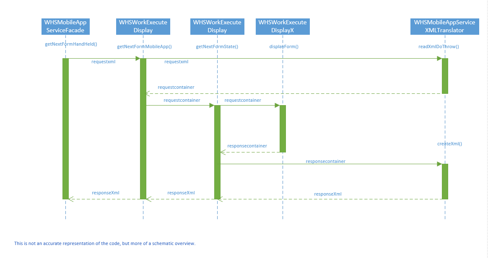
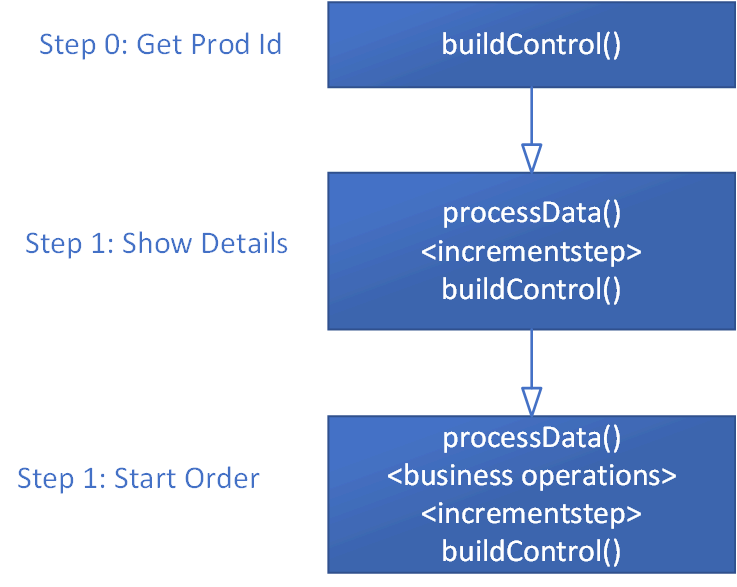
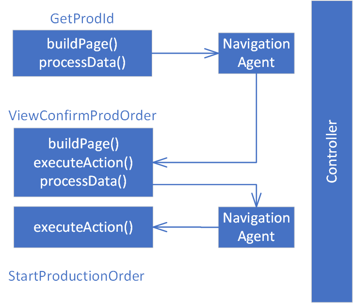
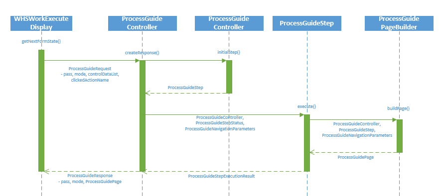
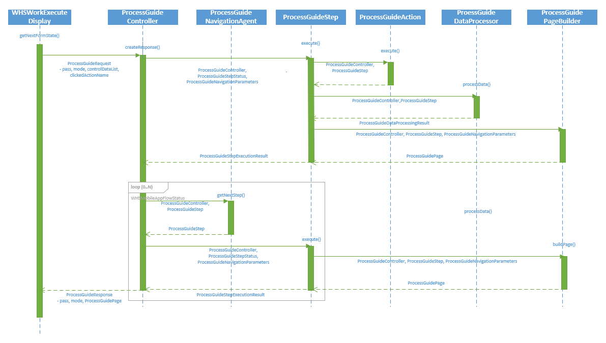
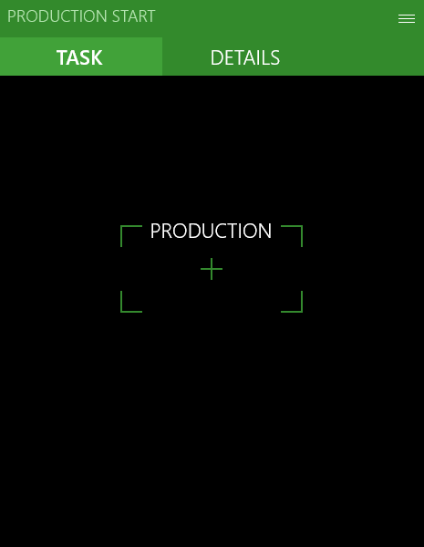

---
# required metadata

title: Process guide framework
description: This topic provides information about the process guide framework for developers who are extending our warehouse mobile processes in X++.
author: Mirzaab
ms.date: 11/01/2018
ms.topic: article
ms.prod: 
ms.technology: 

# optional metadata

# ms.search.form: 
# ROBOTS: 
audience: Application User, Developer, IT Pro
# ms.devlang: 
ms.reviewer: kamaybac
# ms.tgt_pltfrm: 
# ms.custom: 
# ms.assetid: 
ms.search.region: global
ms.search.industry: Manufacturing
ms.author: mirzaab
ms.search.validFrom: 2018-4-30
ms.dyn365.ops.version: 8.0

---

# Process guide framework

[!include [banner](../includes/banner.md)]

This topic provides information about the process guide framework for developers who are extending the warehouse mobile processes in X++. The warehouse mobile processes are extensible as a result of the processes being broken into small steps. The business logic and user interface building of each step has been extracted into individual classes, which allows for extensibility.

## Overview of the existing design

The warehouse mobile execution flows are exposed through a single custom service endpoint. The request arrives from the mobile app in the form of an XML string, which contains the metadata of the user interface presented in the mobile app, as well as the values entered by the user.

When the request is received, the first step is to deserialize this XML. The **WHSMobileAppServiceXMLTranslator** class converts the XML into a container, which contains both the control information, as well as session information.

Following this, the information in the container is used to deduce which warehouse process the user is working on, or about to start (represented by the **WHSWorkExecuteMode** enumeration), and accordingly instantiate a derived class of **WHSWorkExecuteDisplay**. The **displayform()** method is invoked, which then does the following:

-   Processes the data from the user (delegated to the **WHSRFControlData** class, but some processes implement specific logic by overriding the **processControl()** method).

-   Executes business logic.

-   Increments the step.

-   Builds the container representing the new user interface (typically in a **build…()** method).

The container is then returned to the translator, which then serializes the XML, and sends it back as a response to the mobile device.

The following sequence diagram shows an overview of the execution flow. Note that the diagram is more of a schematic overview and is not a 1:1 representation of the actual code.

	

### Reason for the redesign

The above design offers a very simple framework for building processes used in mobile flows. However, as is evident above, the **displayform()** methods take over multiple responsibilities. It does delegate them to other methods and classes, but in the absence of concrete class responsibilities, it is done in an inconsistent manner across classes. Also, as the number of
supported scenarios grows organically, some of those classes can become quite complex. To make matters more interesting, some of those classes/methods are overridden and re-used in multiple modes. The result is extremely long methods with high cyclomatic complexity. These have posed maintenance issues in the past. Fixing bugs in these methods has been risky and regression prone.
For example, the **processWorkLine()** method in the **WhsWorkExecuteDisplay** class is referred from multiple processes (basically, anywhere where work execution is performed).

To make these extensible, one of the options would be to split the **displayForm** methods into smaller methods and introduce extensibility points. However, because of the scenario matrix, it would be challenging for partners to write extensions and validate against regressions. Not only that, because of the lack of structured responsibility distribution noted above, the code would keep growing in unpredictable ways over time, posing challenges in building quality extensions.

As a result, the redesign is the sustainable option, with a goal to have clearly defined classes having independent responsibilities. A class should have one responsibility, one reason to change, and one reason to be extended.

## Design overview

In the redesigned framework, the core strategy revolves around two principles: divide the execution flow into individual components with well-defined responsibilities and have well-defined extension points in each of the components.

The name for the new framework is “ProcessGuide”. This is because the aim of these classes is to guide a user through a business process (as opposed to the rich client which is a form-based experiences where the user has more flexibility in how they interact with the data or in which order they perform tasks).

> [!NOTE]
> One notable detail is the deliberate omission of the “WHS” prefix. While the mobile processes were initially introduced for warehousing, subsequently they have transcended boundaries to support various production and inventory management processes. As a result, the warehouse reference was excluded in the name of the framework.

To identify the components, the first step is to look at the Production Start process (**WhsWorkExecuteDisplayProdStart** class). Here is a schematic of the process.



Looking at the control flow, the following are components needed:

-   A controller to stitch through the entire business process.
-   A step responsible for execution of a step in the process.
-   A data processor for processing the data in a step.
-   A page builder responsible for building the user interface for a step.
-   A navigation agent responsible for step transition.
-   A class responsible for executing the business process.

In the process flow diagram above, if you begin at step 1 and start processing the data from the previous step, and then end with building a UI, data would continue to be processed in the next step. This introduces a tight coupling between consecutive steps, as a result, our new high-level schematic would look like the following:



The following are the key components in the redesigned process:

-   **ProcessGuideController** - This class orchestrates the overall execution of the business process. It defines the factories that instantiate the step and the navigation agent, which subsequently constitute the process execution, as well as the clean-up logic for cancellation or exiting the process.

-   **ProcessGuideStep** - This class represents one single step in the business process. This class contains a definition of the factories that instantiate a page builder, actions, and data processors and is responsible for invoking them in the correct sequence.

-   **ProcessGuideNavigationAgent** - This class is responsible for navigation between the steps. When a step is completed, the navigation agent is responsible for defining the next step and passes any parameters that the previous step may need to communicate to the next one.

-   **ProcessGuidePageBuilder** - This class is responsible for instantiating the user interface.

-   **ProcessGuideAction** - This class represents an action, shown as a button to the user.

-   **ProcessGuideDataProcessor** - This class is responsible for processing the user entered data in a field.

## Execution flow

The starting point of the execution flow remains unchanged. So, the request still arrives through the same endpoints, followed by deserializing the XML into the container. This container is then passed to **getNextFormState()**.

There are three important classes to note:

-  **ProcessGuideSessionState** – This contains the session state information – mode, pass, controller, and step being executed, and so on.

-  **ProcessGuidePage** – This contains a strongly-typed representation of the user interface metadata.

-  **ProcessGuideRequest** – This contains the above two as members and is a strongly-typed representation of the request received from the mobile device.

These classes are created using the container information (both state and user entered control data). This provides a type-safe way to access and manipulate the values. Compared to repeated access of the container during the process, this provides benefit both in terms of readability and performance.

The session state information is used to instantiate the correct **ProcessGuideController** class. Once instantiated, the **createResponse()** method in the **ProcessGuideController** class is invoked. This method is the entry point to the process guide logic, and after execution, comes back with the response (represented in the **ProcessGuideResponse** class). The response is then converted back to the container and handed back to the legacy logic, which then serializes it to the XML and sends the response back to the mobile device.

Next, the controller needs to find the next step to execute. If this is the start of a new process, the controller will call **initialStep()** to get the first step in the process. After that, it would call **execute()** method in the **ProcessGuideStep**. This method would then instantiate a **ProcessGuidePageBuilder** class and call **buildPage()**, which
would return with a **ProcessGuidePage** object, which is a virtual representation of the user interface to be presented to the user. The step would then send the result back to the controller, which would then save the current session state and then return the result back to **getNextFormState()** in the form of the **ProcessGuideResponse** class. Thereafter, the response is converted back to the container, and subsequently serializes to XML and sends back the response to the mobile device.

The following sequence diagram explains this control flow. Note that this is the most common control flow, simplified for explaining the design.



When the user takes an action on the mobile device by clicking a button (or scanning a value – which typically triggers the default action) – the request arrives at the **createResponse()** method in the **ProcessGuideController** class through the same route. This time, however, the controller knows from the session state information which step the user is in. Accordingly, it instantiates the appropriate **ProcessGuideStep** class and invokes the execute method. The **ProcessGuideStep**, in turn, reads the action name invoked by the user and then instantiates the appropriate **ProcessGuideAction** class and calls
**execute()**.

The **ProcessGuideAction** class is responsible for executing the specific action, however there are two notable exceptions.

The first one is the **ProcessGuideOKAction** class. This action implies that the user wants to confirm and move forward in the process. In accordance to that – this method actually does a callback to the ProcessGuideStep class, which means that the step invokes **processData()** in **ProcessGuideDataProcessor**. This processes the data that the user has entered, and then updates the state of the step and sends the
result back to the controller. Depending on the outcome of the processor, the step invokes the page builder to build the appropriate user interface or sets the status of the step as completed. This is reflected in the top half of the sequence diagram below.

The other exception is the cancellation action, implemented in the **ProcessGuideCancelResetProcessAction** and **ProcessGuideCancelExitProcessAction** classes. These actions represent an intent to cancel the process and go back to either the start of the process or exit the process altogether. Similar to the **OK** action, these actions also perform a callback to the step, which signals the intent to the **ProcessGuideController**. The controller then performs the necessary cleanup of state variables and either moves control to the initial step in the process or terminates the process altogether.

After the step is completed, if the status of the step is set to **Completed**, then the controller instantiates the **ProcessGuideNavigationAgent**, which returns the name of the next step. The controller then instantiates this step and invokes the **execute()** method – and the cycle continues. Most commonly, the new step invokes the corresponding **ProcessGuidePageBuilder** to build the user interface for the next screen to be presented to the user, which is then sent back. This flow is depicted in the lower half of the sequence diagram below.



## Building a new process using the ProcessGuide framework

The best way to explain the control flow is by using an example that exists in the application – the Production Start process.

## Overview of the production start process

Let’s start by understanding the process flow. In the first step, the user is prompted for production order ID.



When the user enters the production order ID, the order number is validated. Some of the validations that are run are based on whether the order is in the same warehouse as the user is signed in to, and the status of the order. If the validation fails, the user is shown an error message. If the validation succeeds, then the user is shown details of the production order and item.

The user can either cancel to go back to the start of the process or click **OK** to confirm. In the latter case, the production order is set to **Started** status, the corresponding journals are posted, the control moves back to the first step, and the “Work Completed” message is shown to the user.


## Creating the controller

The first step in building the business process is creating the controller class, extending from the **ProcessGuideController** abstract class which implements the default behaviors of a controller. The new class name is **ProdProcessGuideProductionStartController** and decorated with the **WHSWorkExecuteMode** value of **StartProdOrder**. The same **SysExtension** based instantiation that was used in the **WHSWorkExecuteDisplay** classes is used, which helps instantiate the controller when the user executes a menu item
for this mode.

```xpp
[WHSWorkExecuteMode(WHSWorkExecuteMode::StartProdOrder)]
public class ProdProcessGuideProductionStartController extends ProcessGuideController
```

> [!NOTE]
> The naming pattern of the class is **\<FunctionalArea\>ProcessGuide\<Businessprocessname\>Controller**. This is the pattern that is used for the controller classes and to extend to other classes.


## Building the first step

Next, to define the first step you create the **ProdProcessGuidePromptProductionIdStep** class, extending from **ProcessGuideStep**.

The task of instantiating the class is delegated to a step factory, which is invoked by the **ProcessGuideController** base class. The default implementation of the factory instantiates the step based on name. Therefore, to instantiate **ProdProcessGuidePromptProductionIdStep** as the first step in the controller, you must do two things:

-   Decorate the **ProdProcessGuidePromptProductionIdStep** class with a **ProcessGuideStepName** attribute.

    ```xpp
    [ProcessGuideStepName(classStr(ProdProcessGuidePromptProductionIdStep))] public class ProdProcessGuidePromptProductionIdStep extends ProcessGuideStep
    ```

-   In the controller class, implement the abstract method **initialStepName()** to return the step name.

    ```xpp
    protected final ProcessGuideStepName initialStepName()
    {
        return classStr(ProdProcessGuidePromptProductionIdStep);
    }
    ````   
    
> [!NOTE]
> The value in the **ProcessGuideStepName** attribute does not need to exactly match the class name as shown above. However, implementing this allows for uniformity and type-safety around cross-references when using the class. Using this naming convention is recommended.
>
> The **ProcessGuideStepName** based instantiation of the step is implemented in the **ProcessGuideStepDefaultFactory** class. In the rare case that you want a different strategy for instantiating the step, you need to do the following:
> -   Create a new factory class inheriting from **ProcessGuidStepAbstractFactory**.
> -   Optionally, create a new parameter class implementing the **ProcessGuideIStepCreationParameters** interface, containing the parameters the factory would need.
> -   In your controller class, override the **stepFactory()** and **stepCreationParameters()** methods to return the above factory and parameters.

The next step is to implement the functionality of the **ProdProcessGuidePromptProductionIdStep** class. You need to implement the logic for building the user interface, processing the user-entered data, and determining when the step is complete.

### Building the user interface for the first step

The user interface is built using a class inheriting from the **ProcessGuidePageBuilder** abstract class. For this step, name the class to represent what it does – **ProdProcessGuidePromptProductionIdPageBuilder**.

The instantiation mechanism of the class is similar to how the step was instantiated from the controller. 

-   Decorate the **ProdProcessGuidePromptProductionIdPageBuilder** class with a **ProcessGuidePageBuilderName** attribute.

    ```xpp
    [ProcessGuidePageBuilderName(classStr(ProdProcessGuidePromptProductionIdPageBuilder))] public class ProdProcessGuidePromptProductionIdPageBuilder extends ProcessGuidePageBuilder
    ```

-   In the **ProdProcessGuidePromptProductionIdStep** class, implement the abstract method **pageBuilderName()** to return this name.

    ```xpp
    protected final ProcessGuidePageBuilderName pageBuilderName()
    {
        return classStr(ProdProcessGuidePromptProductionIdPageBuilder);
    }
    ```    

> [!TIP]
> Similar to the step factory, there is also an abstract factory pattern implemented for the page builder factory. So, in the rare case that you want a different strategy for instantiating the page builder, you can do the following:
> - Create a new factory class inheriting from **ProcessGuidePageBuilderAbstractFactory**.
> - Optionally, create a new parameter class implementing the **ProcessGuideIPageBuilderCreationParameters** interface, containing the parameters the factory would need.
> - In your step class, override the **pageBuilderFactory()** and **pageBuilderCreationParameters()** methods to return the above factory and parameters.

To implement the user interface you need a page with one text box to enter the production order ID, plus an **OK** button and a **Cancel** button. The **Cancel** button should exit the process.

To implement this, you need to override two methods in the **ProdProcessGuidePromptProductionIdPageBuilder** class:

-   Use the **addDataControls()** method to add the text box.

    ```xpp
    protected final void addDataControls(ProcessGuidePage _page)
    {
        _page.addTextBox(ProcessGuideDataTypeNames::ProdId, "@SYS4398", extendedTypeNum(ProdId));
    }
    ```   

-   Use the **addActionControls()** method to add the **OK** and **Cancel** buttons.

    ```xpp
    protected final void addActionControls(ProcessGuidePage _page)
    {
        #ProcessGuideActionNames
        _page.addButton(step.createAction(#ActionOK), true);
        _page.addButton(step.createAction(#ActionCancelExitProcess));
    }
    ``` 

This adds the data controls, followed by the buttons. However, if you want to build a screen with interspersed data controls and buttons, you can override the **addControls()** method instead for flexibility.

An additional scenario to consider is how to rebuild the page in case of validation failures, for example if the user enters an incorrect production order ID. The **ProcessGuidePageBuilder** base class implements the default behavior, which rebuilds the user interface, clears out the scanned value, and adds the error control with the error message. Because this is the default behavior that you want to use, you do not need to add any code for handling errors.

> [!TIP]
> If you want to implement custom UI behavior for error situations, you can override one or more of the methods **rebuildFromRequestPage()**, **isErrorState()**, and **reuseRequestPageOnError()**.

### Processing the user-entered data in the first step

The processing of the data is done in the **ProcessGuideDataProcessorDefault** class, which in turn invokes the legacy **WhsRfControlData** class. No changes are needed to this default behavior, and **WhsRfControlData** already has logic for validating the **ProdId** field, so you do not need to write any logic for handling this. In case of required extensions for the validation logic, consider using the **WhsControl** based extension mechanism.

### Determine if the first step is complete

When the validation is successful, it is time to mark the step as completed. This is done in the base class, however, you need to implement the condition to determine the step completion. The following overridden method does that.

```xpp
protected final boolean isComplete()
{
    WhsrfPassthrough pass = controller.parmSessionState().parmPass();
    ProdId prodId = pass.lookup(ProcessGuideDataTypeNames::ProdId);
        return (prodId != '');
}
```   

### Step two: View order details and confirm

In the second step in the process, the user is shown a screen with details about the order. The user can either click the **OK** button to confirm the start of the production order, or click **Cancel** to go back to the start of the process. For this example, name the step **ProdProcessGuideConfirmProductionOrderStep** and the page builder class **ProdProcessGuideConfirmProductionOrderPageBuilder**.

The ProdProcessGuideConfirmProductionOrderStep class looks like the following.

```xpp
[ProcessGuideStepName(classStr(ProdProcessGuideConfirmProductionOrderStep))]
public class ProdProcessGuideConfirmProductionOrderStep extends ProcessGuideStep
{
    protected final ProcessGuidePageBuilderName pageBuilderName()
    {
        return classStr(ProdProcessGuideConfirmProductionOrderPageBuilder);
     }
}
```     

Because the user does not enter any values here, you do not need to override the **isComplete()** method. The step is complete when the user clicks **OK**.

The page builder class overrides the **addDataControls()** method to add three labels. The first label shows the production order ID, the second contains item information (such as item ID, dimensions, or description) and the third contains the quantity and unit of measure.

The **addActionControls()** is then overridden to add 2 buttons – the **OK** button, and the **Cancel** button to cancel the process and go back to the start of the process.

```xpp
/// <summary>
/// The <c>ProdProcessGuideConfirmProductionOrderPageBuilder</c> builds a page that allows the user to see details of a production order
/// and then confirm.
/// </summary>
[ProcessGuidePageBuilderName(classStr(ProdProcessGuideConfirmProductionOrderPageBuilder))]
public class ProdProcessGuideConfirmProductionOrderPageBuilder extends ProcessGuidePageBuilder
{
    protected void addDataControls(ProcessGuidePage _page)
    {
        WhsrfPassthrough pass = controller.parmSessionState().parmPass();
        ProdTable prodTable = ProdTable::find(pass.lookup(ProcessGuideDataTypeNames::ProdId));
        UnitOfMeasureSymbol inventUOM = InventTableModule::find(prodTable.ItemId, ModuleInventPurchSales::Invent).UnitId;
        
        _page.addLabel(ProcessGuideDataTypeNames::ProdIdLabelName, strFmt("@WAX1684", prodTable.ProdId), extendedTypeNum(ProdId));
        _page.addLabel(ProcessGuideDataTypeNames::ItemInfo, this.generateItemInfoForProdId(pass.lookup(ProcessGuideDataTypeNames::ProdId)), extendedTypeNum(WHSRFUndefinedDataType));
        _page.addLabel(ProcessGuideDataTypeNames::QtyLabelName, strFmt("@WAX1685", WHSWorkExecuteDisplay::num2StrDisplay(ProdUpdStartUp::proposalStartUpQty(prodTable.ProdId)), inventUOM), extendedTypeNum(WHSRFQuantityAndUOM));

        if (PdsGlobal::pdsIsCWItem(prodTable.ItemId))
        {
            _page.addLabel(ProcessGuideDataTypeNames::InventQtyLabelName, strFmt("@WAX1685", WHSWorkExecuteDisplay::num2StrDisplay(ProdUpdStartUp::pdsCWProposalStartupQty(prodTable.ProdId)), PdsCatchWeightItem::pdsCWUnitId(prodTable.ItemId)), extendedTypeNum(WHSRFQuantityAndUOM));
        }
    }

    protected void addActionControls(ProcessGuidePage _page)
    {
        #ProcessGuideActionNames
        _page.addButton(step.createAction(#ActionOK), true);
        _page.addButton(step.createAction(#ActionCancelResetProcess));
    }
```

> [!NOTE]
> You can find the same source code for the X++ methods in this topic by using the Application Explorer. Filter on the class name, and then right-click the class name and select **View code**.

### Step 3: Start the production order

The third step is where the business logic of starting the production order is executed. This step is somewhat different from the previous steps, in that, this step does not have a user interface. This step gets executed silently when the user clicks **OK** in the previous step.

The **ProcessGuideStepWithoutPrompt** abstract class implements the default behavior for such steps. The current step, therefore, should extend the **ProcessGuideStepWithoutPrompt** class and override the **doExecute()** method.

The following code example shows the class and the **doExecute()** method implementation. The method simply retrieves the order ID and user ID from the session state and invokes the method to start this production order.

```xpp
/// <summary>
/// The <c>ProdProcessGuideStartProductionOrderStep</c> represents a step that starts a production order.
/// </summary>
[ProcessGuideStepName(classStr(ProdProcessGuideStartProductionOrderStep))]
public class ProdProcessGuideStartProductionOrderStep extends ProcessGuideStepWithoutPrompt
{
    protected final void doExecute()
    {
        WhsrfPassthrough pass = controller.parmSessionState().parmPass();
        WHSUserId userId = pass.lookup(ProcessGuideDataTypeNames::UserId);
        ProdTable prodTable = ProdTable::find(pass.lookup(ProcessGuideDataTypeNames::ProdId));
        WhsWorkExecute workExecute = WhsWorkExecute::construct();
        workExecute.prodStartUp(prodTable.ProdId, ProdUpdStartUp::proposalStartUpQty(prodTable.ProdId), userId);

        this.addProcessCompletionMessage();

        super();
    }

}
```

In case of an exception, the framework exception handling logic ensures that the process is rolled back to the previous step.

> [!NOTE]
> The invoke to **addProcessCompletionMessage()** adds the “Work completed” message to the navigation parameters. The next step (assuming it has a user interface) will display this message. The base classes handle this logic, and no specific code needs to be added to the process classes to achieve this behavior.


### Building the navigation through the steps

The **ProcessGuideController** base class instantiates the **ProcessGuideNavigationAgentDefault** class, which relies on a pre-defined navigation route, which is a simple map of source and destination steps. For the production start scenario, because there is no conditional branching, this implementation would suffice. Therefore, you only need to override the **initializeNavigationRoute()** method to define the navigation route.

```xpp
    protected ProcessGuideNavigationRoute initializeNavigationRoute()
    {
        ProcessGuideNavigationRoute navigationRoute = new ProcessGuideNavigationRoute();
        navigationRoute.addFollowingStep(classStr(ProdProcessGuidePromptProductionIdStep), classStr(ProdProcessGuideConfirmProductionOrderStep));
        navigationRoute.addFollowingStep(classStr(ProdProcessGuideConfirmProductionOrderStep), classStr(ProdProcessGuideStartProductionOrderStep));
        navigationRoute.addFollowingStep(classStr(ProdProcessGuideStartProductionOrderStep), classStr(ProdProcessGuidePromptProductionIdStep));

        return navigationRoute;
    }
```

There are processes where there will be conditional branching (based on user actions, or any other conditions). Such processes need to do the following:

-   Implement specific navigation agents inherited from the **ProcessGuideNavigationAgent** class.

-   Implement the specific navigation agent factory inherited from the **ProcessGuideNavigationAgentAbstractFactory** class, containing logic to instantiate the correct navigation agent based on current step, session state, user action, or other logic.

-   Optionally, override **navigationAgentCreationParameters()** in the controller class to pass suitable parameters.

-   Override **navigationAgentFactory()** in the controller to instantiate the navigation agent factory created above.

### Action classes

Action classes represent user actions, so this example uses the **OK** action to show how the actions are created.

```xpp
[ProcessGuideActionName(#ActionOK)]
public class ProcessGuideOKAction extends ProcessGuideAction
{
    public final str label()
    {
        return "@SYS5473";
     }
     protected final void doExecute()
     {
        step.executeOKAction();
      }
}
```    

The class must implement 2 abstract methods:

-   **label()**, which returns the label to be displayed in a button control tied to this action.

-   **doExecute()**, which performs the action. As mentioned earlier, the **OK** button simply performs a callback to the step. However, other actions might have more complex logic here.

The actions are instantiated using **SysExtension** framework based on the **ProcessGuideActionName** attribute. Similar to the instantiation of page builders, the step class implements the default action factory, and it is possible to override that. The page builder adds a button control like this.

```xpp
_page.addButton(step.createAction(#ActionOK), true);
```

In doing so, it asks the step to create an action class for the passed name and ties that action to the button.

### Summary

To summarize everything that's been explained in this topic, here's a comprehensive summary of the code needed for the process:

1.  **ProdProcessGuideProductionStartController**

    1.  Override **initialStepName()** to provide the name of the first step.
    2.  Override **initializeNavigationRoute()** to construct the navigation map.

        ```xpp
        /// <summary>
        /// The <c>ProdProcessGuideProductionStartController</c> class is the controller class for the production order start process guide.
        /// </summary>
        [WHSWorkExecuteMode(WHSWorkExecuteMode::StartProdOrder)]
        public class ProdProcessGuideProductionStartController extends ProcessGuideController
        {
            protected ProcessGuideStepName initialStepName()
            {
                return classStr(ProdProcessGuidePromptProductionIdStep);
            }

            protected ProcessGuideNavigationRoute initializeNavigationRoute()
            {
                ProcessGuideNavigationRoute navigationRoute = new ProcessGuideNavigationRoute();
                navigationRoute.addFollowingStep(classStr(ProdProcessGuidePromptProductionIdStep), classStr(ProdProcessGuideConfirmProductionOrderStep));
                navigationRoute.addFollowingStep(classStr(ProdProcessGuideConfirmProductionOrderStep), classStr(ProdProcessGuideStartProductionOrderStep));
                navigationRoute.addFollowingStep(classStr(ProdProcessGuideStartProductionOrderStep), classStr(ProdProcessGuidePromptProductionIdStep));

                return navigationRoute;
            }

        }
        ```

2.  **ProdProcessGuidePromptProductionIdStep**

    1.  Override **isComplete()** to specify when the step is considered complete.
    2.  Override **pageBuilderName()** to specify the page builder to be used.

        ```xpp
        /// <summary>
        /// The <c>ProdProcessGuidePromptProductionIdStep</c> represents a step that 
        /// that prompts the user for a production order id.
        /// </summary>
        [ProcessGuideStepName(classStr(ProdProcessGuidePromptProductionIdStep))]
        public class ProdProcessGuidePromptProductionIdStep extends ProcessGuideStep
        {
            protected boolean isComplete()
            {
                WhsrfPassthrough pass = controller.parmSessionState().parmPass();
                ProdId prodId = pass.lookup(ProcessGuideDataTypeNames::ProdId);

                return (prodId != '');
            }

            protected ProcessGuidePageBuilderName pageBuilderName()
            {
                return classStr(ProdProcessGuidePromptProductionIdPageBuilder);
            }

        }
        ```

3.  **ProdProcessGuidePromptProductionIdPageBuilder**

    1.  Override **addDataControls()** to add the **Prod ID** textbox.
    2.  Override **addActionControls()** to add the **OK** and **Cancel** buttons.
        
        ```xpp
        /// <summary>
        /// The <c>ProdProcessGuidePromptProductionIdPageBuilder</c> class builds a page 
        /// that prompts the user for a production order id.
        /// </summary>
        [ProcessGuidePageBuilderName(classStr(ProdProcessGuidePromptProductionIdPageBuilder))]
        public class ProdProcessGuidePromptProductionIdPageBuilder extends ProcessGuidePageBuilder
        {
            protected void addDataControls(ProcessGuidePage _page)
            {
                _page.addTextBox(ProcessGuideDataTypeNames::ProdId, "@SYS4398", extendedTypeNum(ProdId));
            }

            protected void addActionControls(ProcessGuidePage _page)
            {
                #ProcessGuideActionNames
                _page.addButton(step.createAction(#ActionOK), true);
                _page.addButton(step.createAction(#ActionCancelExitProcess));
            }

        }
        ```

4.  **ProdProcessGuideConfirmProductionOrderStep**

    1.  Override **pageBuilderName()** to specify the page builder to be used.
        
        ```xpp
        /// <summary>
        /// The <c>ProdProcessGuideConfirmProductionOrderStep</c> class represents the step for viewing production order
        /// details and confirming the same.
        /// </summary>
        [ProcessGuideStepName(classStr(ProdProcessGuideConfirmProductionOrderStep))]
        public class ProdProcessGuideConfirmProductionOrderStep extends ProcessGuideStep
        {    
            protected ProcessGuidePageBuilderName pageBuilderName()
            {
                return classStr(ProdProcessGuideConfirmProductionOrderPageBuilder);
            }

        }
        ```

3.  **ProdProcessGuideConfirmProductionOrderPageBuilder**

    1.  Override **addDataControls()** to add the order, item, and quantity information labels.

    2.  Override **addActionControls()** to add the **OK** and **Cancel** buttons.
        
        ```xpp
        /// <summary>
        /// The <c>ProdProcessGuideConfirmProductionOrderPageBuilder</c> builds a page that allows the user to see details of a production order
        /// and then confirm.
        /// </summary>
        [ProcessGuidePageBuilderName(classStr(ProdProcessGuideConfirmProductionOrderPageBuilder))]
        public class ProdProcessGuideConfirmProductionOrderPageBuilder extends ProcessGuidePageBuilder
        {
            protected void addDataControls(ProcessGuidePage _page)
            {
                WhsrfPassthrough pass = controller.parmSessionState().parmPass();
                ProdTable prodTable = ProdTable::find(pass.lookup(ProcessGuideDataTypeNames::ProdId));
                UnitOfMeasureSymbol inventUOM = InventTableModule::find(prodTable.ItemId, ModuleInventPurchSales::Invent).UnitId;

                _page.addLabel(ProcessGuideDataTypeNames::ProdIdLabelName, strFmt("@WAX1684", prodTable.ProdId), extendedTypeNum(ProdId));
                _page.addLabel(ProcessGuideDataTypeNames::ItemInfo, this.generateItemInfoForProdId(pass.lookup(ProcessGuideDataTypeNames::ProdId)), extendedTypeNum(WHSRFUndefinedDataType));
                _page.addLabel(ProcessGuideDataTypeNames::QtyLabelName, strFmt("@WAX1685", WHSWorkExecuteDisplay::num2StrDisplay(ProdUpdStartUp::proposalStartUpQty(prodTable.ProdId)), inventUOM), extendedTypeNum(WHSRFQuantityAndUOM));

                if (PdsGlobal::pdsIsCWItem(prodTable.ItemId))
                {
                    _page.addLabel(ProcessGuideDataTypeNames::InventQtyLabelName, strFmt("@WAX1685", WHSWorkExecuteDisplay::num2StrDisplay(ProdUpdStartUp::pdsCWProposalStartupQty(prodTable.ProdId)), PdsCatchWeightItem::pdsCWUnitId(prodTable.ItemId)), extendedTypeNum(WHSRFQuantityAndUOM));
                }
            }

            protected void addActionControls(ProcessGuidePage _page)
            {
                #ProcessGuideActionNames
                _page.addButton(step.createAction(#ActionOK), true);
                _page.addButton(step.createAction(#ActionCancelResetProcess));
            }

        ```

        > [!NOTE]
        > The **generateItemInfoForProdId()** method, which is used for generating the item information labels, is excluded from this topic. This method queries a few tables to get item ID, description, and dimensions. If you want a better understanding of **generateItemInfoForProdId()**, look at the source code.

4.  **ProdProcessGuideStartProductionOrderStep**

    1.  Override **doExecute()** to perform the production start process and add the
        process completion message.

        ```xpp
        /// <summary>
        /// The <c>ProdProcessGuideStartProductionOrderStep</c> represents a step that starts a production order.
        /// </summary>
        [ProcessGuideStepName(classStr(ProdProcessGuideStartProductionOrderStep))]
        public class ProdProcessGuideStartProductionOrderStep extends ProcessGuideStepWithoutPrompt
        {
            protected final void doExecute()
            {
                WhsrfPassthrough pass = controller.parmSessionState().parmPass();
                WHSUserId userId = pass.lookup(ProcessGuideDataTypeNames::UserId);
                ProdTable prodTable = ProdTable::find(pass.lookup(ProcessGuideDataTypeNames::ProdId));
                WhsWorkExecute workExecute = WhsWorkExecute::construct();
                workExecute.prodStartUp(prodTable.ProdId, ProdUpdStartUp::proposalStartUpQty(prodTable.ProdId), userId);

                this.addProcessCompletionMessage();

                super();
            }

        }
        ```

> [!NOTE]
> Note that a lot of the common patterns (regeneration of UI on error, setting process completion message, **OK** and **Cancel** behavior) have been moved to the framework – thus saving the application developer from writing boilerplate code that is both error prone, and has a risk of inconsistent behavior across processes. Where the scenario needs to deviate from the common path, though, the application developer is provided the option of overriding suitable methods – but then that is an intentional deviation that is both explicit and trackable.


### Extending a business process

So far, this topic has highlighted how to build a new process using the **ProcessGuide** framework. In this final section, you will find some examples of how this business process can be extended.

### Add a step in a flow (using ProcessGuideNavigationAgentDefault)

Where to extend:

-   Child of **ProcessGuideController** class for the process.

How to extend:

-   Extend the **initializeNavigationRoute()** method in the controller class, and invoke **addFollowingStep()** in the **ProcessGuideNavigationRoute** class.

### Add a step in a flow (using custom navigation agent)

Where to extend:

-   Child of **ProdProcessGuideNavigationAgentFactory/ProdProcessGuideNavigationAgent**.

How to extend:

-   Create a new child class of **ProcessGuideNavigationAgent** that returns the desired step name.

-   Create a new class deriving from **ProcessGuideNavigationAgentFactory** that conditionally returns the navigation agent created above.

-   Extend the **navigationAgentFactory()** method in the controller class to return the factory created above.

### Add a new control in the UI of an existing step 

Where to extend:

-   Child of **ProdProcessGuidePageBuilder** for the step.

How to extend:

-   Extend the **addDataControls()** method and add the additional control.

### Complete overhaul of the user interface in an existing step

Where to extend:

-   Child of **ProdProcessGuideStep**.

How to extend:

-   Create a new child class of **ProdProcessGuidePageBuilder** class, and implement the desired user interface.

-   Extend the **pageBuildeName()** method in the step class to return the **ProcessGuidePageBuilderNameAttribute** for the class created above.

### Alter logic when a step is considered complete

Where to extend:

-   Child of **ProdProcessGuideStep**.

How to extend:

-   Extend the **isComplete()** method to build the additional logic.


[!INCLUDE[footer-include](../../includes/footer-banner.md)]