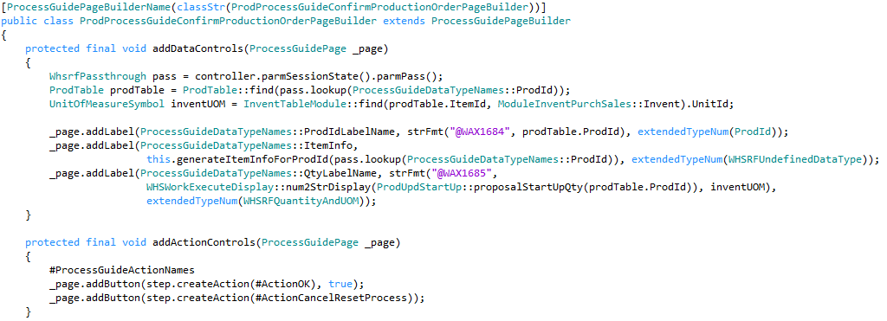
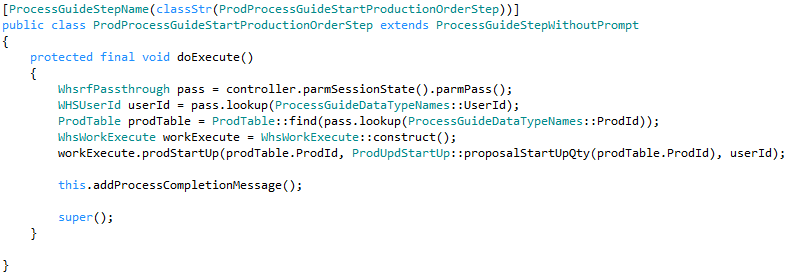
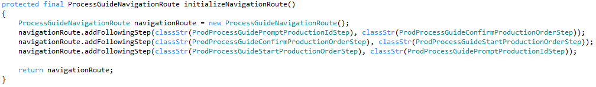

---
# required metadata

title: Process guide framework
description: This topic provides informationa about the process guide framework for developers who are extending our warehouse mobile processes in X++.
author: MarkusFogelberg
manager: AnnBe
ms.date: 11/01/2018
ms.topic: article
ms.prod: 
ms.service: dynamics-ax-applications
ms.technology: 

# optional metadata

# ms.search.form: 
# ROBOTS: 
audience: Developer
# ms.devlang: 
ms.reviewer: shylaw
ms.search.scope: Operations
# ms.tgt_pltfrm: 
# ms.custom: 
# ms.assetid: 
ms.search.region: global
ms.search.industry: Manufacturing
ms.author: mafoge
ms.search.validFrom: 2018-4-30
ms.dyn365.ops.version: 8.0

---

# Process guide framework

[!include [banner](../includes/banner.md)]

Over the last few months, we have been working towards making the warehouse mobile processes more extensible. The way we would achieve this is by breaking down the mobile processes into smaller steps, and extracting the business logic and user interface building of each individual step into their own classes, that would allow extensibility.

## Overview of the existing design

The warehouse mobile execution flows are exposed through a single custom service endpoint. The request arrives from the mobile app in the form of an xml string, which contains the metadata of the user interface presented in the mobile app, as well as the values entered by the user.

Once the request is received, the first step is to deserialize this xml. The WHSMobileAppServiceXMLTranslator class converts this xml into a container – which contains both the control information, as well as some session information.

Following this, the information in the container is used to deduce which warehouse process the user is working on, or about to start (represented by the WHSWorkExecuteMode enumeration), and accordingly instantiate a derived class of WHSWorkExecuteDisplay. The displayform() method is invoked, which then does the following:

-   Processes the data from the user (delegated to the WHSRFControlData class, but some processes implement specific logic by overriding the processControl() method)

-   Executes business logic

-   Increments the step

-   Builds the container representing the new user interface (typically in a build…() method)

The container is then returned to the translator, which then serializes the xml, and sends it back as response to the mobile device.

The sequence diagram below gives an overview of the execution flow. Please note that the diagram is more of a schematic overview and is not a 1:1 representation of the actual code.

	

### Reason for the redesign

The above design offers a very simple framework for building processes used in mobile flows. However, as is evident above, the displayform() methods take over multiple responsibilities. It does delegate them to other methods and classes, but in the absence of concrete class responsibilities, it is done in an inconsistent manner across classes. Also, over the years, as the number of
supported scenarios grew organically, some of those classes became quite complex. To make matters more interesting, some of those classes/methods are overridden and re-used in multiple modes. The result was extremely long methods with high cyclomatic complexity. These have posed maintenance issues in the past. Fixing bugs in these methods has been risky and regression prone.
Although, the one that takes the cake is the processWorkLine() method in the WhsWorkExecuteDisplay class – which is referred from multiple processes (basically, anywhere where work execution is performed).

And now – the question in front of us was, how to make these extensible?

One of the options would be to split the displayForm methods into smaller methods and introduce extensibility points. However, we quickly arrived at the conclusion that because of the scenario matrix, it would be challenging for partners to write extensions and validate against regressions. Not only that, because of the lack of structured responsibility distribution alluded to above, the code would keep growing in unpredictable ways over time, posing challenges in building quality extensions.

Thus, we concluded, redesign is the sustainable option, with a goal to have clearly defined classes having independent responsibilities. A class should have one responsibility, one reason to change, and one reason to be extended.

Design overview
===============

As we created the redesigned framework, the core strategy revolved around two principles: divide the execution flow into individual components with well-defined responsibilities and have well defined extension points in each of the components.

A new framework needs a new name, and we chose the name “ProcessGuide”. This is because, the aim of these classes is to guide a user through a business process (as opposed to the rich client which is a form-based experiences where the user has more flexibility in how they interact with the data or in which order they perform tasks).

> [!NOTE]
> One notable detail here is the deliberate omission of the “WHS” prefix – while the mobile processes were initially introduced for warehousing, subsequently they have transcended boundaries to support various production and inventory management processes. Hence, we dropped the warehouse reference in the name of the framework.

So, we started off by beginning to identify the components. If we take, for example, the Production Start process (WhsWorkExecuteDisplayProdStart class), here is a schematic of the process:

Looking at the control flow, we inferred the need for a few components:

-   A controller to stitch through the entire business process
-   A step responsible for execution of a step in the process
-   A data processor for processing the data in a step
-   A page builder responsible for building the user interface for a step
-   A navigation agent responsible for step transition
-   A class responsible for executing the business process

Once done, we realized the need for another change. In the flow above, if we look closely at step 1, we start by processing the data from the previous step, and end with building a UI, whose data would be processed in the next step. This introduces a tight coupling between consecutive steps, which we would need to break. With this in mind, our new high-level schematic would look like below:

With these concepts explained, now let us start taking a closer look at the actual design. Following are the key players in the redesigned process:

-   **ProcessGuideController**: This class, as the name suggests, orchestrates the overall execution of the business process. It defines the factories that instantiate the step and the navigation agent, which subsequently constitute the process execution, as well as the clean-up logic for cancellation or exiting the process.

-   **ProcessGuideStep**: This class represents one single step in the business process. This class contains definition of the factories that instantiate a page builder, actions, and data processors and is responsible for invoking them in the right sequence.

-   **ProcessGuideNavigationAgent**: This class is responsible for navigation between the steps. When a step is completed, the navigation agent is responsible for defining the next step and pass any parameters that the previous step may want to communicate to the next one.

-   **ProcessGuidePageBuilder**: This class is responsible for instantiating the user interface.

-   **ProcessGuideAction**: This class represents an action, shown as a button to the user.

-   **ProcessGuideDataProcessor**: This class is responsible for processing the user entered data in a field.

Execution flow
==============

The starting point of the execution flow remains unchanged. So, the request still arrives through the same endpoints, followed by deserializing the xml into the container. This container is then passed to getNextFormState().

This is when the changes kick in.

It is important to mention 3 important classes here:*

1.  ProcessGuideSessionState – this contains the session state information – mode, pass, controller and step being executed, and so on.

2.  ProcessGuidePage – this contains a strongly typed representation of the user interface metadata.

3.  ProcessGuideRequest– this contains the above two as members and is a strongly typed representation of the request received from the mobile device.

These classes are created using the container information (both state and user entered control data). This provides a type-safe way to access and manipulate the values. Compared to repeated access of the container during the process, this provides benefit both in terms of readability and performance.

The session state information is used to instantiate the correct ProcessGuideController class. Once instantiated, the createResponse() method in the ProcessGuideController class is invoked. This method is the entry point to the process guide logic, and after execution, comes back with the response (represented in the ProcessGuideResponse class). The response is then converted back to the container and handed back to the legacy logic, which then serializes it to the xml and sends the response back to the mobile device.

Now, what happens in the createResponse method? The controller, to begin with, needs to know which step to execute. If this is the start of a new process, the controller will call initialStep() to get the first step in the process. After that, it would call execute() method in the ProcessGuideStep. This method would then instantiate a ProcessGuidePageBuilder class and call buildPage(), which
would return with a ProcessGuidePage object, which is a virtual representation of the user interface to be presented to the user. The step would then send the result back to the controller, which would then save the current session state and then return the result back to getNextFormState() in the form of the ProcessGuideResponse class. Thereafter, the response is converted back to the container, and subsequently serialize to xml and send back the response to the mobile device.

The sequence diagram below explains this control flow. Please note, though, that this is the most common control flow, simplified for explaining the design.

When the user takes an action on the mobile device by clicking a button (or scanning a value – which typically triggers the default action) – the request arrives at the createResponse() method in the ProcessGuideController class through the same route. This time, however, the controller knows from the session state information which step the user is in. Accordingly, it instantiates the appropriate ProcessGuideStep class and invokes the execute method. The ProcessGuideStep, in turn, reads the action name invoked by the user and then instantiates the appropriate ProcessGuideAction class and calls
execute().

The ProcessGuideAction class is deemed responsible for executing the specific action. However, there are 2 notable exceptions to this rule (although – the term exception is a paradox here, since these are the most common actions you find in the process).*

The first one is the ProcessGuideOKAction class. This action implies the user wants to confirm and move forward in the process. In accordance to that – this method actually does a callback to the ProcessGuideStep class. Therein – the step invokes processData() in ProcessGuideDataProcessor, to process the data that the user has entered, and then updates the state of the step and sends the
result back to the controller. Depending on the outcome of the processor, the step invokes the page builder to build the appropriate user interface or sets the status of the step as completed. This is reflected in the top half of the sequence diagram below.

The other exception is the cancellation action, implemented in the ProcessGuideCancelResetProcessAction and ProcessGuideCancelExitProcessAction classes. These actions represent an intent to cancel the process and go back to either the start of the process or exit the process altogether. Similar to the OK action, these actions also perform a callback to the step, which signals the intent to the ProcessGuideController. The controller then performs the necessary cleanup of state variables and either moves control to the initial step in the process or terminates the process altogether.

Once the execution of the step is done, if the status of the step is set to Completed, then the controller instantiates the ProcessGuideNavigationAgent, which returns the name of the next step. The controller then instantiates this step and invokes the execute() method – and the cycle continues. Most commonly, the new step would invoke the corresponding ProcessGuidePageBuilder to build the user interface for the next screen to be presented to the user, which is then sent back. This flow is depicted in the lower half of the sequence diagram below.

Building a new process using the ProcessGuide framework
=======================================================

Now that we understand the control flow, let us try to build a new process from scratch. The best way to explain it will be with an example – so let us do so with a process that exists in the application – the Production Start process.

Overview of the production start process
----------------------------------------

Let’s start by understanding the process flow. In the first step, the user is prompted for production order Id.

Once the user enters the production order id, the order number is validated. Some of the validations that are the run are whether the order is in the same warehouse as the user is logged in to, and the status of the order. If the validation fails, the user is shown an error message. If the validation succeeds, then the user is shown details of the production order and item.

The user can either cancel from here to go back to the start of the process or hit OK to confirm. In the latter case, the production order is set to Started status, the corresponding journals are posted, and the control moves back to the first step, and the “Work Completed” message is shown to the user.

Creating the controller
-----------------------

The first step in building the business process is creating the controller class, extending from ProcessGuideController abstract class which implements the default behaviors of a controller. We name our new class as ProdProcessGuideProductionStartController and decorate it with the WHSWorkExecuteMode value of StartProdOrder. We use the same SysExtension based instantiation as was used in the WHSWorkExecuteDisplay classes; thus, this attribute helps instantiating the controller when the user executes a menu item
for this mode.

<pre><code>
[WHSWorkExecuteMode(WHSWorkExecuteMode::StartProdOrder)]
public class ProdProcessGuideProductionStartController extends ProcessGuideController</code></pre>

> [!NOTE]
> The naming pattern of the class - we use the convention \<FunctionalArea\>ProcessGuide\<Businessprocessname\>Controller. This is the pattern we intend to use for the controller classes going forward, and extend to other classes as well, as you will see below.

Building the first step
-----------------------

Next, we define the first step in the process. Thereby, we create the ProdProcessGuidePromptProductionIdStep class, extending from ProcessGuideStep.

The task of instantiating the class is delegated to a step factory, which is invoked by the ProcessGuideController base class. The default implementation of the factory instantiates the step based on name. Therefore, to instantiate ProdProcessGuidePromptProductionIdStep as the first step in the controller, we need to do 2 things:

-   Decorate the ProdProcessGuidePromptProductionIdStep class with a ProcessGuideStepName attribute, like this

    ``[ProcessGuideStepName(classStr(ProdProcessGuidePromptProductionIdStep))] public class ProdProcessGuidePromptProductionIdStep extends ProcessGuideStep``

-   In the controller class, implement the abstract method initialStepName() to return the step name.

    ``protected final ProcessGuideStepName initialStepName()
    {
        return classStr(ProdProcessGuidePromptProductionIdStep);
     }``   
    
> [!NOTE]
> that it is not a requirement that the value we put in the ProcessGuideStepName attribute need to exactly match the class name as shown
above. However, implementing this allows us to have uniformity and type-safety around cross-references for usages of the class, so we would encourage using this convention.

> [!TIP]
> The ProcessGuideStepName based instantiation of the step is implemented in the ProcessGuideStepDefaultFactory class. In the very rare case you want a different strategy for instantiating the step, you need to do the following:*
> -   Create a new factory class inheriting from ProcessGuidStepAbstractFactory*
> -   Optionally, create a new parameter class implementing the ProcessGuideIStepCreationParameters interface, containing the parameters the factory would need.
> -   In your controller class, override the stepFactory() and stepCreationParameters() methods to return the above factory and parameters.

Next step is implementing the functionality of the ProdProcessGuidePromptProductionIdStep class. Here, we need to implement the logic for building the user interface, processing the user-entered data, and determining when the step is complete. Let’s look at how each of this is done.

### Building the user interface for the first step

The user interface is built using a class inheriting from the ProcessGuidePageBuilder abstract class. For this step, let us name the class to represent what it does – ProdProcessGuidePromptProductionIdPageBuilder.

The instantiation mechanism of the class is very similar to how the step was instantiated from the controller, i.e. –

-   Decorate the ProdProcessGuidePromptProductionIdPageBuilder class with a ProcessGuidePageBuilderName attribute, like this

``[ProcessGuidePageBuilderName(classStr(ProdProcessGuidePromptProductionIdPageBuilder))] public class ProdProcessGuidePromptProductionIdPageBuilder extends ProcessGuidePageBuilder``

-   In the ProdProcessGuidePromptProductionIdStep class, implement the abstract method pageBuilderName() to return this name

    ``protected final ProcessGuidePageBuilderName pageBuilderName()
    {
        return classStr(ProdProcessGuidePromptProductionIdPageBuilder);
     }``    

> [!TIP]
> Similar to the step factory, we also have an abstract factory pattern implement for the page builder factory. So, in the very rare case you want a different strategy for instantiating the page builder, you can do the following:
> - Create a new factory class inheriting from ProcessGuidePageBuilderAbstractFactory
> - Optionally, create a new parameter class implementing the ProcessGuideIPageBuilderCreationParameters interface, containing the parameters the factory would need.
> - In your step class, override the pageBuilderFactory() and pageBuilderCreationParameters() methods to return the above factory and parameters.

Now, coming to the implementation of the user interface. We need a page with one textbox to enter the production order Id, and an OK and a Cancel button. The cancel button should result in exiting the process.

To implement this, we override 2 methods in the ProdProcessGuidePromptProductionIdPageBuilder class:

-   addDataControls() method, to add the textbox

    ``protected final void addDataControls(ProcessGuidePage _page)
    {
        _page.addTextBox(ProcessGuideDataTypeNames::ProdId, "@SYS4398", extendedTypeNum(ProdId));
     }``   

-   addActionControls() method, to add the OK and cancel buttons

    ``protected final void addActionControls(ProcessGuidePage _page)
    {
        #ProcessGuideActionNames
        _page.addButton(step.createAction(#ActionOK), true);
        _page.addButton(step.createAction(#ActionCancelExitProcess));
     }``   

We will skip explaining the step.createAction() for now – it is enough to know that the above 2 lines add the buttons. We will get back to createAction() later.

What this would do is, add the data controls, followed by the buttons, which is the norm in most screens. If, however, you want to build a screen with interspersed data controls and buttons, you can override the addControls() method instead for that flexibility.

An additional scenario to consider is how to rebuild the page in case of validation failures, e.g. if the user entered an incorrect production order Id. The ProcessGuidePageBuilder base class implements the default behavior, of rebuilding the user interface, clearing out the scanned value and adding the error control with the error message. Since that is the default behavior we want, we do not need to add any code for handling errors.

> [!TIP]
> In case you would want to implement custom UI behavior for error situations, you can override one or more of the methods rebuildFromRequestPage(), isErrorState() and reuseRequestPageOnError().

### Processing the user-entered data in the first step

The processing of the data is done in the ProcessGuideDataProcessorDefault class, which in turn invokes the legacy WhsRfControlData class. No changes are needed to this default behavior, and the WhsRfControlData already has logic for validating the ProdId field, so we do not need to write any logic for handling this. In case of required extensions for the validation logic, consider using the WhsControl based extension mechanism already available with the Fall 2017 release.

### Determine if the first step is complete

Finally, once the validation succeeds, it is time to mark the step as completed. That is done in the base class, however, we need to implement the condition to determine the step completion. The following overridden method does that:

``protected final boolean isComplete()
{
    WhsrfPassthrough pass = controller.parmSessionState().parmPass();
    ProdId prodId = pass.lookup(ProcessGuideDataTypeNames::ProdId);
        return (prodId != '');
 }``   

Step two: view order details and confirm
----------------------------------------

In the second step in the process, the user is shown a screen with details about the order, and the user can either click the OK button to confirm the start of the production order, or cancel, to go back to the start of the process. Let us name the step as ProdProcessGuideConfirmProductionOrderStep and the page builder class as ProdProcessGuideConfirmProductionOrderPageBuilder.

The ProdProcessGuideConfirmProductionOrderStep class looks as below – no surprises here, the code is quite self-explanatory.

``[ProcessGuideStepName(classStr(ProdProcessGuideConfirmProductionOrderStep))]
public class ProdProcessGuideConfirmProductionOrderStep extends ProcessGuideStep
{
    protected final ProcessGuidePageBuilderName pageBuilderName()
    {
        return classStr(ProdProcessGuideConfirmProductionOrderPageBuilder);
     }
 }``     

Since the user does not enter any values here, we do not need to override the isComplete() method – the step is deemed complete when the user clicks the OK button.

The page builder class, unsurprisingly, overrides the addDataControls() method to add 3 labels. The first label shows production order id, the second contains item information (item Id, dimensions, description, etc.) and the third contains the quantity and unit of measure.

The addActionControls() is then overridden to add 2 buttons – the OK button, and the button to Cancel the process and go back to the start of the process.

Step three: start the production order
--------------------------------------

The third step is where the business logic of starting the production order is actually executed. This step is somewhat different from the previous steps, in that, this step does not have a user interface. This step gets executed silently when the user enters OK button in the previous step.

The ProcessGuideStepWithoutPrompt abstract class implements the default behavior for such steps. The current step, therefore, should extend the ProcessGuideStepWithoutPrompt class and override the doExecute() method.

The following code snippet shows the class and the doExecute() method implementation. The method simply retrieves the order id and user id from the session state and invokes the method to start this production order.

In case of an exception, the framework exception handling logic ensures that the process is rolled back to the previous step.

> [!NOTE]
> An interesting line of code is the invoke to addProcessCompletionMessage(). What this does is, adds the “Work completed” message to the navigation parameters. The next step (assuming it has a user interface) will display this message. The base classes handle this logic, and no specific code needs to be added to the process classes to achieve this behavior.

Building the navigation through the steps
-----------------------------------------

So far, we have looked at the implementation of the steps, but skipped the discussion on how to navigate from one step to the next. The
ProcessGuideNavigationAgent class does exactly that. The ProcessGuideController base class instantiates the ProcessGuideNavigationAgentDefault class, which relies on a pre-defined navigation route, which is nothing but a simple map of source and destination steps. For the production start scenario, since there is not conditional branching, this implementation would suffice. Therefore, all we need is to override the initializeNavigationRoute() method to define the navigation route.

Now, there will be processes where there will be conditional branching (based on user actions, or any other conditions). Such processes would need to do the following:

-   Implement specific navigation agents inherited from ProcessGuideNavigationAgent class.

-   Implement specific navigation agent factory inherited from ProcessGuideNavigationAgentAbstractFactory class, containing logic to     instantiate the correct navigation agent based on current step, session state, user action or any other logic.

-   Optionally, override navigationAgentCreationParameters() in the controller class to pass suitable parameters.

-   Override navigationAgentFactory() in the controller to instantiate the navigation agent factory created above.

Action classes
--------------

We mentioned briefly that the Action classes represent user actions. Let us take an example of OK action, as an example of understanding how the actions are created.

``[ProcessGuideActionName(#ActionOK)]
public class ProcessGuideOKAction extends ProcessGuideAction
{
    public final str label()
    {
        return "@SYS5473";
     }
     protected final void doExecute()
     {
        step.executeOKAction();
      }
  }``    

The class must implement 2 abstract methods:

-   label() which returns the label to be displayed in a button control tied to this action

-   doExecute() which performs the action. As mentioned before, the OK button simply performs a callback to the step. However, other actions might have more complex logic here.

The actions are instantiated using SysExtension framework based on the ProcessGuideActionName attribute. Similar to the instantiation of page builders, the step class implements the default action factory, and it is possible to override that. The page builder adds a button control like this:

``_page.addButton(step.createAction(#ActionOK), true);``

In doing so, it asks the step to create an action class for the passed name and ties that action to the button.

To summarize
============

Now that we have gone through all the bits and pieces, let’s make a comprehensive summary of the code we needed for the process:

1.  **ProdProcessGuideProductionStartController**

    1.  Override initialStepName() to provide the name of the first step

    2.  Override initializeNavigationRoute() to construct the navigation map

        

2.  **ProdProcessGuidePromptProductionIdStep**

    1.  Override isComplete() to specify when the step is considered complete

    2.  Override pageBuilderName() to specify the page builder to be used

1.  **ProdProcessGuidePromptProductionIdPageBuilder**

    1.  Override addDataControls() to add the Prod Id textbox.

    2.  Override addActionControls() to add the OK and Cancel buttons.

        

2.  **ProdProcessGuideConfirmProductionOrderStep**

    1.  Override pageBuilderName() to specify the page builder to be used

        

3.  **ProdProcessGuideConfirmProductionOrderPageBuilder**

    1.  Override addDataControls() to add the order, item and qty information labels

    2.  Override addActionControls() to add the OK and Cancel buttons.

        

        > [!NOTE]
        > The generateItemInfoForProdId() method, which is used for generating the item information labels, is excluded from this discussion. This just queries a few tables to get item id, description and dimensions. Feel free to look into the source code if you are curious about how this looks.

4.  **ProdProcessGuideStartProductionOrderStep**

    1.  Override doExecute() to perform the production start process and add the
        process completion message.

> [!NOTE]
> A notable aspect is a lot of the common patterns (regeneration of UI on error, setting process completion message, OK and Cancel behavior) have been moved to the framework – thus saving the application developer from writing boilerplate code that is both error prone, and has a risk of inconsistent behavior across processes. Where the scenario needs to deviate from the common path, though, the application developer is provided the option of overriding suitable methods – but then that is an intentional deviation that is both explicit and trackable.

Extending a business process
============================

So far, we have looked at how to build a new process using the ProcessGuide framework. In this final section, let us look at some examples of how this business process can be extended.

Add a step in a flow (using ProcessGuideNavigationAgentDefault)
---------------------------------------------------------------

Where to extend:

-   Child of ProcessGuideController class for the process

How:

-   Extend the initializeNavigationRoute() method in the controller class, and invoke addFollowingStep() in the ProcessGuideNavigationRoute class.

Add a step in a flow (using custom navigation agent)
----------------------------------------------------

Where to extend:

-   Child of ProdProcessGuideNavigationAgentFactory/ProdProcessGuideNavigationAgent.

How:

-   Create a new child class of ProcessGuideNavigationAgent that returns the desired step name.

-   Create a new class deriving from ProcessGuideNavigationAgentFactory, that conditionally returns the navigation agent created above.

-   Extend the navigationAgentFactory() method in the controller class to return the factory created above.

Add a new control in the UI of an existing step 
------------------------------------------------

Where to extend:

-   Child of ProdProcessGuidePageBuilder for the step.

How:

-   Extend the addDataControls() method and add the additional control.

Complete overhaul of the user interface in an existing step
-----------------------------------------------------------

Where to extend:

-   Child of ProdProcessGuideStep.

How:

-   Create a new child class of ProdProcessGuidePageBuilder class, and implement the desired user interface.

-   Extend the pageBuildeName() method in the step class to return the ProcessGuidePageBuilderNameAttribute for the class created above.

Alter logic when a step is considered complete
----------------------------------------------

Where to extend:

-   Child of ProdProcessGuideStep.

How:

-   Extend the isComplete() method to build the additional logic.
