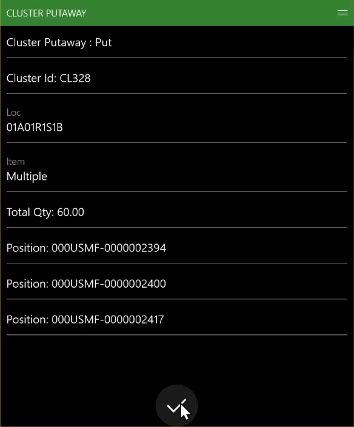

---
# required metadata

title: Putaway clusters
description: Putaway clusters offer a way to pick multiple license plates at the same time and then take them for putaway in different locations. They can be very useful for retail businesses, where license plates typically aren't full pallets of inventory.
author: Mirzaab
ms.date: 10/19/2020
ms.topic: article
ms.prod: 
ms.technology: 

# optional metadata

# ms.search.form:  [Operations AOT form name to tie this article to]
audience: Application User
# ms.devlang: 
ms.reviewer: kamaybac
# ms.tgt_pltfrm: 
# ms.custom: [used by loc for articles migrated from the wiki]
ms.search.region: Global
# ms.search.industry: [leave blank for most, retail, public sector]
ms.author: mirzaab
ms.search.validFrom: 2020-10-19
ms.dyn365.ops.version: 10.0.7
---

# Putaway clusters

[!include [banner](../includes/banner.md)]

Putaway clusters offer a way to pick multiple license plates at the same time and then take them for putaway in different locations. This process is often referred to as a *milk run*. Putaway clusters can be very useful for retail businesses, where license plates typically aren't full pallets of inventory. 

## Turn the cluster putaway feature on or off

To use the functionality described in this article, the *Cluster putaway feature* feature must be turned on for your system. As of Supply Chain Management 10.0.25, this feature is mandatory and can't be turned off. If you're running a version older than 10.0.25, then admins can turn this functionality on or off by searching for the *Cluster putaway feature* feature in the [Feature management](../../fin-ops-core/fin-ops/get-started/feature-management/feature-management-overview.md) workspace.

## Setup for the example scenario

### Cluster profiles

The putaway cluster profile determines where an item will go, based on the location that is assigned to the item at the time of receipt. If different clusters are required, different putaway clusters should be created, one for each mobile device menu item.

1. Go to **Warehouse management \> Setup \> Mobile device \> Cluster profiles**.
1. On the Action Pane, select **New**.
1. In the **Header** view, set the following values:

    - **Putaway cluster profile ID:** *Cluster putaway*
    - **Putaway cluster profile ID Name:** *Cluster putaway*
    - **Cluster type:** *Putaway*
    - **Sequence number:** Accept the default value.

1. Select **Save** to make the required fields on the **General** FastTab available.
1. On the **General** FastTab, set the following values:

    - **Cluster assignment timing:** *At receipt*

        This field defines whether the putaway cluster should be assigned immediately when the inventory is received, or whether it should be sorted later.

    - **Cluster assignment rule:** *Manual*

        This field defines whether the cluster assignment should be determined automatically by the system or manually by the user.

    - **Directive code:** Leave this field blank.
    - **Putaway cluster locate:** *Receipt*

        The following values are available:

        - **Receipt** – A location is found immediately during receipt.
        - **Cluster close** – A location is found when the cluster is closed.
        - **User directed** – A location is found when the license plate is picked from the cluster for putaway. In this case, no location is specified when the putaway work is created. During the putaway itself, the user must scan the license plate or work ID to initiate the put step. The system then finds the put location again and tells the user where to put the picked quantity.

    - **Putaway cluster per user:** *No*

        This field defines whether each cluster should be unique per user when clusters are automatically assigned. It's available only when the **Cluster assignment rule** field is set to *Automatic*.

    - **Unit restriction:** Leave this field blank.

        This field defines the unit that must be received for the profile to be valid. If it's left blank, all units are valid.

    - **Work unit break:** *Individual*

        This field defines whether all inventory should be consolidated (by using the cluster ID and the license plate) onto one license plate when a cluster is closed, and whether it should be put away as a single license plate or separately on the license plates that were received. This field is unavailable when the **Putaway cluster locate** field is set to *Receipt*.

    - **Cluster persists as Parent License Plate:** *No*

        If this option is set to *Yes*, when the put step is completed, the cluster ID will become a parent license plate, and all items on the cluster ID will be linked to that parent license plate.

1. On the **Cluster sorting** FastTab, you can define putaway sorting criteria. Select **New** on the toolbar to add a line, and then set the following values:

    - **Sequence number:** Accept the default value.
    - **Field name:** *WMSLocationId*

        This field defines the field that this line should use as a sorting criterion.

    - **Sorting:** *Ascending*

        This field defines whether sorting should be done in ascending or descending order.

1. On the **Cluster work template** FastTab, select **New** on the toolbar to add a line, and then set the following values:

    - **Work order type:** *Purchase orders*
    - **Work template:** *61 PO Direct*

1. On the Action Pane, select **Save**, and then select **Edit query**.
1. In the **Cluster putaway** dialog box, on the **Range** tab, select **Add** to add a second line to the query. Then update the query lines as shown in the following table.

    | Table | Derived table | Field | Criteria |
    |---|---|---|---|
    | Work | Work | Warehouse | *61* |
    | Work | Work | Work ID | Leave this field blank. |

1. Select **OK** to save the query and close the dialog box.
1. On the Action Pane, select **Save**, and close the page.

> [!IMPORTANT]
> Fields in the cluster profile that appear dimmed when **Generate cluster ID** is set to *Yes* are unavailable and won't be considered when this feature is used.

### Mobile device menu items

Two new mobile device menu items are available for this feature. The **Receive and sort cluster** menu item is used to sort the received inventory into a putaway cluster upon receipt. The **Cluster putaway** menu item is used to put the cluster away after it has been assigned.

#### Receive and sort cluster

Create a new mobile device menu item for receiving inventory and sorting into a cluster. This menu item will create inbound work after inventory is received, which indicates that the receiving menu item will be used for putaway clusters.

> [!NOTE]
> The **Receive and sort cluster** menu item can be used with the following receiving menu items:
>
> - Purchase order line receiving
> - Purchase order item receiving
> - Load item receiving

1. Go to **Warehouse management \> Setup \> Mobile device \> Mobile device menu items**.
1. On the Action Pane, select **New**.
1. In the **Header** view, set the following values:

    - **Menu item name:** *Receive and sort cluster*
    - **Title:** *Receive and sort cluster*
    - **Mode:** *Work*
    - **Use existing work:** *No*

1. On the **General** FastTab, set the following values:

    - **Work creation process:** *Purchase order item receiving*
    - **Generate license plate:** *Yes*
    - **Assign putaway cluster:** *Yes*

        > [!NOTE]
        > The **Assign putaway cluster** option is available only for the one-step *Work creation process* activity for receiving.

    Accept the default values for the remaining fields.

1. On the Action Pane, select **Save**.

#### Cluster putaway

Create a new mobile device menu item for putting the cluster away after it has been assigned.

1. Go to **Warehouse management \> Setup \> Mobile device \> Mobile device menu items**.
1. On the Action Pane, select **New**.
1. In the **Header** view, set the following values:

    - **Menu item name:** *Cluster putaway*
    - **Title:** *Cluster putaway*
    - **Mode:** *Work*
    - **Use existing work:** *Yes*

1. On the **General** FastTab, set the **Directed by** field to *Cluster putaway*. Accept the default values for the remaining fields.
1. On the **Work classes** FastTab, set up the valid work class for this mobile device menu item:

    - **Work class ID:** *Purchase*
    - **Work order type:** *Purchase orders*

1. On the Action Pane, select **Save**.

### Mobile device menu

Add the menu items that you just created to the inbound menu of the mobile app.

1. Go to **Warehouse management \> Setup \> Mobile device \> Mobile device menu**.
1. On the Action Pane, select **Edit**.
1. In the menu list, select **Inbound**.
1. In the **Available menus and menu items** list, find and select **Receive and sort cluster**.
1. Select the right arrow button to move the selected menu item to the **Menu structure** list.
1. Use the up arrow or down arrow button to move the menu item into the desired position in the menu.
1. On the Action Pane, select **Save**.
1. Repeat steps 4 through 7 to add the remaining menu items:

    - Assign cluster
    - Cluster putaway

## Example scenario

This scenario simulates putaway cluster processing.

### Create a purchase order

1. Go to **Accounts payable \> Purchase orders \> All purchase orders**.
1. On the Action Pane, select **New**.
1. In the **Create purchase order** dialog box, set the following values:

    - **Vendor account:** *1001*
    - **Warehouse:** *61*

1. Select **OK**.

    The **All purchase orders** page appears.

1. On the **All purchase orders** page, on the **Purchase order lines** FastTab, use the **Add line** button to add the following lines:

    - Purchase order line 1:

        - **Item number:** *A0001*
        - **Quantity:** *10*

    - Purchase order line 2:

        - **Item number:** *A0002*
        - **Quantity:** *20*

    - Purchase order line 3:

        - **Item number:** *M9215*
        - **Quantity:** *30*

1. On the Action Pane, select **Save**.
1. Make a note of the purchase order number.

### Receive inventory and put it away from the mobile device

#### Receive and sort the inventory into a cluster

1. Sign in to the Warehouse Management mobile app as a user who is set up for warehouse *61*.
1. On the main menu, select **Inbound**.
1. On the **Inbound** menu, select **Receive and sort cluster**.
1. In the **Ponum** field, enter the purchase order number.
1. Select **OK** (the check mark button).
1. Select the **Item** field, enter item number *A0001*, and then select **OK**.
1. Select the **Qty** field, enter *10* by using the number pad, and then select the check mark button.
1. On the **Qty** task page, select **OK** (the check mark button) to confirm the quantity that you entered.
1. On the **Item** task page, select **OK** to confirm that item *A0001* was entered.
1. Select the **Cluster ID** field, and enter a value to assign an ID for the cluster that you're creating.

    The ID that you enter here will be used when the two remaining items on the purchase order are received.

1. Select **OK**.

    The **Ponum** task page appears and shows a "Work completed" message.

    Item *A0001* has now been received into the *RECV* location and assigned to the cluster ID that you entered in step 10.

1. Repeat steps 4 through 11 to receive the remaining two items from the purchase order and assign them to the cluster ID:

    - A quantity of *20* for item *A0002*
    - A quantity of *30* for item *M9215*

#### Close the cluster

Before the items in the cluster can be put away, the cluster must be closed.

1. In Supply Chain Management, go to **Warehouse management \> Work \> Outbound \> Work clusters**.
1. On the **Work clusters** page, in the **Work cluster** section, search the **Cluster ID** field for the cluster ID that you entered earlier.
1. If the cluster isn't shown, it might already have been closed. To determine whether the cluster was closed, select the **Show closed work** check box, and search for the cluster ID that you entered earlier. Then follow one of these steps:

    - If the cluster has been closed, skip the remaining steps of this procedure, and move on to the next procedure, [Put the cluster away](#put-the-cluster-away).
    - If the cluster hasn't been closed, follow the remaining steps of this procedure to manually close the cluster. Then move on to the next procedure.

1. In the **Work cluster** section, select the cluster ID that you entered earlier.
1. On the Action Pane, select **Close cluster**.

    After the cluster has been closed, it's no longer shown in the **Work cluster** section (unless the **Show closed work** check box is selected).

#### Put the cluster away

1. Sign in to the Warehouse Management mobile app as a user who is set up for warehouse *61*.
1. On the main menu, select **Inbound**.
1. On the **Inbound** menu, select **Cluster putaway**.
1. Select **Cluster ID**, and enter the cluster ID that you entered earlier for the closed cluster.
1. Select **OK**.

    The **Cluster putaway: Pick** page appears. It shows the cluster ID, the picking location, the items (the value *Multiple* will be shown), and the total quantity in the cluster that must be picked.

1. Select **OK**.

    The **Cluster putaway: Put** page appears. The **Put** instructions identify the cluster ID, the put location, the items, the total quantity, and the license plate IDs for the items that have been received on the cluster.

    You have the standard options to override or pass this step.

    

1. Select **OK** to confirm the putaway of the cluster.

    A "Cluster completed" message is shown.

## Notes and tips

For cases where the cluster ID becomes the parent license plate for a nested pallet, the put position is automatically given when the cluster ID is scanned. No further license plate must be scanned, even if license plate generation is set to manual.

[!INCLUDE[footer-include](../../includes/footer-banner.md)]