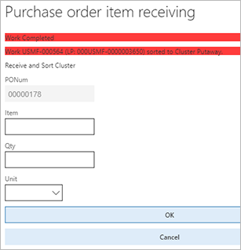
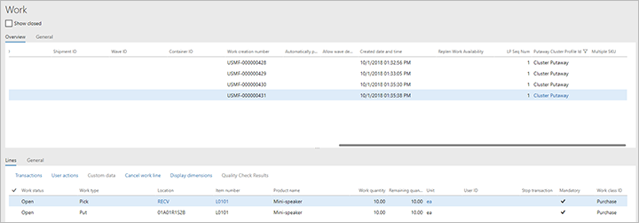
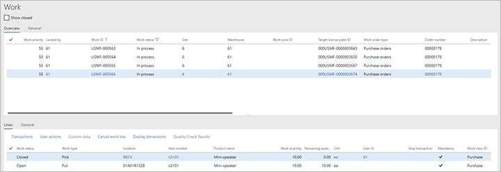
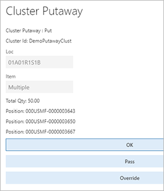
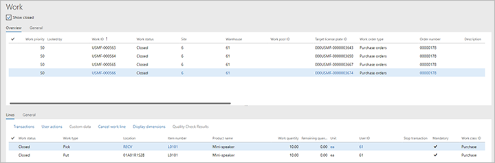

---
# required metadata

title: Putaway clusters
description: Putaway clusters are a way to pick multiple license plates at once and take them for putaway at different locations. It can be very useful for retail businesses, where license plates typically aren't full pallets of inventory.
author: Mirzaab
manager: tfehr
ms.date: 07/13/2020
ms.topic: article
ms.prod: 
ms.service: dynamics-ax-applications
ms.technology: 

# optional metadata

# ms.search.form:  [Operations AOT form name to tie this topic to]
audience: Application User
# ms.devlang: 
ms.reviewer: kamaybac
ms.search.scope:  Core, Operations
# ms.tgt_pltfrm: 
# ms.custom: [used by loc for topics migrated from the wiki]
ms.search.region: Global
# ms.search.industry: [leave blank for most, retail, public sector]
ms.author: mirzaab
ms.search.validFrom: 2020-07-18
ms.dyn365.ops.version: Release 10.0.7
---

# Putaway clusters

[!include [banner](../includes/banner.md)]

Putaway clusters are a way to pick multiple license plates at once and take them for putaway at different locations. It can be very useful for retail businesses, where license plates typically aren't full pallets of inventory. This process is often called a _Milk run_.

## Setup for the example scenario

<!-- HHM: The setup does not include the standard warehouse configuration required for processing of the inbound flow. Make sure that is set up correctly before processing the example scenario. -->

### Cluster profiles

The Putaway cluster profile determines where the item will go based on the location assigned to the item at receipt. If different clusters are needed, different Putaway clusters should be created, one for each mobile device menu item.

1. Go to **Advanced Warehouse management \> Setup \> Mobile device \> Cluster profiles**.
1. Select **New** in the Action Pane.
1. In the **Header**, enter the following:

    - **Putaway Cluster profile ID** – *Cluster putaway*
    - **Putaway Cluster profile ID Name** – *Cluster putaway*
    - **Cluster type** – *Putaway*
    - **Sequence number** - *Accept default*

1. Select **Save** to enable the required fields on the **General** FastTab.
1. On the **General** FastTab, specify the following:

    - **Cluster assignment timing** - *At receipt*
        - Should the putaway cluster be assigned immediately when the inventory is being received, or sorted later?

    - **Cluster assignment rule** - *Manual*
        - Should the cluster assignment be determined automatically by the system, or manually by the user?

    - **Directive code** - *Leave blank*
    - **Putaway cluster locate** - *Receipt*
        - **Receipt**: Location found immediately during receipt.
        - **Cluster close**: Location found when cluster is closed.
        - **User directed**: Location found when LP is picked from cluster to putaway.
            - The putaway work is created without location and during the putaway itself, the user has to scan the LP or Work ID to initiate the Put step. The system finds the put location again and tells the user where to put the picked quantity.

    - **Putaway cluster per user** – *No*
        - When assigning clusters automatically, should each cluster be unique per user? Only enabled when **Cluster assignment rule** is set to *Automatic*.

    - **Unit restriction** - *Leave blank*
        - Unit that is required to be received for the profile to valid. If left blank, all units will be valid.

    - **Work unit break** – *Individual*
        - When closing a cluster, should all inventory be consolidated onto one license plate (using the cluster ID and the LP), and putaway as a single LP, or putaway separately on the LPs that were received? Disabled when **Putaway cluster locate** is set to *Receipt*.

    - **Cluster persists as Parent License Plate** – *No*
        - If *Yes*, when the Put step is complete, the Cluster ID will become a Parent License Plate and all items on the Cluster ID will be tied to that Parent license plate.

1. On the **Cluster sorting** FastTab, putaway sorting criteria can be determined. Select **New** in the Toolbar and enter the following:

    - **Sequence number** – *Accept default*
    - **Field name** – *WMSLocationId*
        - Determines what field this line will use for sorting criteria.

    - **Sorting** – *Ascending*
        - Determines whether sorting should be Ascending or Descending.

1. On the **Cluster work template** FastTab, select **New** in the Toolbar to add a line. Enter the following:
    - **Work order type** - *Purchase orders* : **Work template** - *61 PO Direct*

1. In the Action Pane, select **Save**, then select **Edit query**.
1. In the **Cluster putaway** dialog box, on the **Range** tab, select **Add** to add a second line to the query, then update the query lines as follows:

    | Table | Derived table | Field | Criteria |
    | -- | -- | -- | -- |
    | Work | Work | Warehouse | 61 |
    | Work | Work | Work ID | *Leave blank* |

10. Select **OK** to save the query and close the dialog box.
1. Select **Save** in the Action Pane and exit the form.

### Mobile device menu items

Three new mobile device menu items are available for this functionality. *Menu item 1* is used to sort the received inventory to a putaway cluster upon receipt. *Menu item 2* is used to assign multiple license plates to a cluster for putaway. *Menu item 3* is used to put away the cluster once it has been assigned.

#### 1 – Receive and Sort Cluster

Go to **Warehouse management \> Setup \> Mobile device \> Mobile device menu items**

Create new mobile device menu item for Receive and Sort Cluster, which will create Inbound Work after receiving the inventory. This where it is indicated that the receiving menu item will be used for Putaway clusters.

> [!NOTE]
> **Sort & assign putaway cluster** can be used with the following menu items:

- PO line receiving,
- PO item receiving,
- Load item receiving.

In **Header** , specify the following:

- Menu item name – _Receive and Sort Cluster_
- Title – _Receive and Sort Cluster_
- Mode – _Work_
- Use existing work – _No_

In **General** FastTab, the following setting can be specified:

- **Work creation process** – _Purchase order item receiving_
- **Generate license plate** – _Yes_
- **Sort & assign putaway cluster** – _Yes_

> [!NOTE]
> The **Sort & assign putaway cluster** parameter is only available on the one-step item receiving.

#### 2 – Assign cluster

This menu item must only be used if _Assign putaway cluster at receipt_ is not marked for use on the Putaway cluster profile.

Go to **Warehouse management \> Setup \> Mobile device \> Mobile device menu items**

Create new mobile device menu item to be used for Assigning received inventory to a Cluster.

In **Header** , specify the following:

- **Menu item name** – _Assign Cluster_
- **Title** – _Assign Cluster_
- **Mode** – _Indirect_

In **General** FastTab, the following setting can be specified:

- **Activity Code** – _Assign to putaway cluster_

#### 3 – Cluster Putaway

Go to **Warehouse management \> Setup \> Mobile device \> Mobile device menu items**

Create new mobile device menu item to be used for putting away the Cluster once it has been assigned.

In **Header** , specify the following:

- **Menu item name** – _Cluster putaway_
- **Title** – _Cluster putaway_
- **Mode** – _Work_
- **Use existing work** – _Yes_

In **General** FastTab, the following setting can be specified:

- Directed by – _Cluster Putaway_

In **Work classes** FastTab, set up the valid work class for this mobile device menu item:

- **Work class ID** – _Purchase_
- **Work order type** – _Purchase orders_

### Mobile device menu

Go to **Warehouse management \> Setup \> Mobile device \> Mobile device menu** and add the newly created menu items to the desired menu.

## Example scenario procedure

This scenario simulates putaway cluster processing. The setup did not include the standard warehouse configuration required for inbound flow.

### Create Purchase order

Before system directed cluster picking, some inbound orders must be created.

Go to **Accounts payable \> Purchase orders \> All purchase orders**. Select **New** to create a new sales order. Pick any vendor account. On the **General** FastTab, specify warehouse 61.

Sales order 1: Add a new line to the sales order, item A0001, quantity 10 pcs. Add a second line for item A0002, quantity 20 pcs; and a third line for item L0101, quantity 30 pcs.

### Mobile device flow execution

#### Receive the inventory

1. Enter mobile device menu where the _Receive and Sort_ menu item was added during the setup.

1. Select the _Receive and Sort_ menu and initiate the receiving. The mobile device will display the Putaway Cluster profile that the inventory is assigned to.

1. As each Purchase order line is processed, the user is presented with the _"Work completed"_ message on the mobile device and an indication that the _"Work has been sorted to Cluster Putaway"_.

    

1. All created Work orders will have a Putaway Cluster Profile ID assigned.

    

#### Assign to Putaway Cluster

Enter mobile device menu where the _Assign to cluster_ menu item was added during the setup.

Select the _Assign to cluster_ menu and initiate next flow.

1. Enter the Cluster ID (or have the system generate one automatically)
1. Add previously created Work IDs/License plates to the Cluster. Repeat for all Work IDs.
    - The user will see a message on the mobile device _"Work was assigned to cluster"_
1. After the last Work has been added to the Cluster, initiate the _Close Cluster._ The user will be presented with the message _"Cluster Close Succesfully"_.
    - Unlike outbound cluster picking, Putaway Clusters do not have maximum number of positions assigned. The user can decide when to close the Cluster manually.

This Cluster is now ready for putaway processing.

#### Cluster putaway

Enter mobile device menu where the _Cluster putaway_ menu item was added during the setup.

Select the _Cluster putaway_ menu and initiate next flow. Remember, the Cluster sorting criteria from the Putaway Cluster Profile setup will be used here to determine the putaway flow.

1. Enter the previously created Cluster ID

1. Pick screen will show the Pick location and under _Items_ field it will state _Multiple_, indicating that multiple items are being picked. Total quantity will reflect the sum of quantity from all Work IDs. At this time, all Work IDs' status will be updated to _In process_

    

1. The Put step will indicate which item(s) should be put to a specific location. The screen will also show which License plates this includes.

    

    The user has the standard option to **Override** or **Pass** this step.

1. Repeat the Put to location process as many times as required. Once finished, the user will be presented with the message _"Cluster completed"_ which indicates the flow has been completed successfully. The work is now _Closed_.

    

## Notes and tips

- Another option for one-step receiving and cluster assignment is to set the _Assign Putaway Cluster at Receipt_ on the _Putaway cluster profile_ to _Yes_ and then set the _Putaway Cluster Assignment_ to _Manual_. After the license plate is entered on the receiving screen, the Cluster ID will be requested from the receiver. This eliminates the menu item step _Assign to Putaway Cluster_.
- For the instances where the Cluster ID becomes the Parent LP for a nested pallet, when the Cluster ID is scanned, the Put position is automatically given and no further LP needs to be scanned, even if generating LP is set to be manual.
