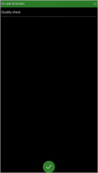

---
# required metadata

title: Quality check
description: This article provides information about the Quality check feature. This feature lets warehouse workers do quick spot checks for quality while they receive items to the inbound dock area.
author: Mirzaab
ms.date: 07/16/2020
ms.topic: article
ms.prod: 
ms.technology: 

# optional metadata

ms.search.form:  WHSQualityCheckTemplate, WHSWorkClass, WHSWorkTemplateTable, WHSLocDirTable, WHSQualityCheckResult
audience: Application User
# ms.devlang: 
ms.reviewer: kamaybac
# ms.tgt_pltfrm: 
# ms.custom: [used by loc for articles migrated from the wiki]
ms.search.region: Global
# ms.search.industry: [leave blank for most, retail, public sector]
ms.author: mirzaab
ms.search.validFrom: 2020-07-16
ms.dyn365.ops.version: 10.0.8
---

# Quality check

[!include [banner](../includes/banner.md)]

The *Quality check* feature lets warehouse workers do quick spot checks for quality while they receive items to the inbound dock area. These spot checks are beneficial when workers inspect packaging or other easily recognizable parts of an item. The feature guides workers to take a quick look to see whether anything is obviously faulty or damaged before they stock the inventory in its putaway location.

This feature is an alternative to the standard quality check process. It offers more flexibility and faster processing.

When you use this feature, the arrival and quality check occur in the following way:

1. When a shipment arrives, a warehouse worker registers the arrival. The worker also scans a license plate to register the location.
1. The worker does a quick quality check and records the result (pass or fail) for that license plate.
1. One of the following actions occurs:

    - If the quality check is passed, the license plate is accepted and guided to a receiving location, as usual.
    - If the quality check is failed, the license plate is rejected, and existing putaway work for it is redirected to an alternate location for further inspection. A new quality order is created. To view the quality order that is created from the failed quality check, go to **Inventory management \> Periodic tasks \> Quality management \> Quality orders**.

This process can also be set up so that all scanned license plates are immediately diverted to the quality check location.

## Turn the Quality check feature on or off

To use the functionality described in this article, the *Quality check* feature must be turned on for your system. As of Supply Chain Management 10.0.25, this feature is mandatory and can't be turned off. If you're running a version older than 10.0.25, then admins can turn this functionality on or off by searching for the *Quality check* feature in the [Feature management](../../fin-ops-core/fin-ops/get-started/feature-management/feature-management-overview.md) workspace.

## Set up the feature for the example scenario

This section provides guidelines and an example that shows how to set up the *Quality check* feature and prepare sample data for the example scenario that is provided later in this article.

### Make sample data available

To work through the [example scenario](#example-scenario) by using the sample records and values that are specified here, you must be on a system where the standard [demo data](../../fin-ops-core/fin-ops/get-started/demo-data.md) is installed. Additionally, you must select the **USMF** legal entity before you begin.

### Quality check template

The quality check template defines the rules for doing quick spot checks for quality at the time of receiving.

1. Go to **Warehouse management \> Setup \> Work \> Quality check template**.
1. Select **New** to add a template to the grid.
1. Set the following values to define the new template:

    - **Quality check template name:** *Dock check*

        Enter a name that identifies the policies applied for this template.

    - **Acceptance policy:** *Prompt user*

        Specify whether users should be prompted to accept or reject the quality of the inventory while they process the work, or whether the quality should automatically be rejected. The available options are *Auto reject* and *Prompt user*.

    - **Quality processing policy:** *Create quality order*

        Select the policy that should be used when the quality of the inventory is rejected. The following options are available:

        - *Create work only* – Just create work to facilitate inventory movement.
        - *Create quality order* – Create a quality order to facilitate quality tests.

    - **Test group:** *Enclosure*

        Specify the test group that should be used in the quality order that is created. Test groups are set up in the **Inventory management** module.

        Leave the **Destructive text** option turned off for the test group. This option defines whether the sample will be destroyed as part of the tests in the test group. If a destructive test is used, the system generates an inventory transaction when a quality order is created for an item. The new inventory transaction predicts the inventory reduction for the test quantity. The inventory reduction occurs when the quality order is completed through the validation step. The inventory transaction is identified as a quality order.

### Work class – Quality check

Work classes are used to direct and/or limit the type of work order lines that warehouse workers can process on a mobile device.

1. Go to **Warehouse management \> Setup \> Work \> Work classes**.
1. Select **New** to create a work class.
1. In the header, set the following values:

    - **Work class ID:** *QC Check*

        Enter a name that identifies the work class.

    - **Description:** *QC Check*

        Enter a short description that indicates what the work class is used for.

    - **Work order type:** *Quality in quality check*

        Select the type of work order that is created by the work class. When you set up quality control work, always select *Quality in quality check*.

1. On the **Valid put location types** FastTab, leave the **Location type** field blank.

    If you select a location type, you limit the locations where items can be put after they are picked. This field is used when a location directive tries to resolve the location, or when a warehouse worker manually specifies the location for the mobile device menu item.

For more information about work classes and how to create them, see [Create a work class](tasks/create-work-class.md).

### Work template

Work templates let you define the work operations that must be performed in the warehouse. Typically, warehouse work operations consist of a pair of actions: a warehouse worker picks on-hand inventory up in one location and then puts the picked inventory down in another location. A work template for quality control defines the work operations for doing quality checks.

#### Purchase orders

1. Go to **Warehouse management \> Setup \> Work \> Work templates**.
1. In the header, set the **Work order type** field to *Purchase orders*.
1. On the Action Pane, select **Edit**.
1. Select a work template that should include a quality check step. In the **Overview** section, in the **Work template** field, select *51 PO Receipt*.
1. In the **Work template details** section, notice that the grid has two existing lines: one for *Pick* and one for *Put*.
1. In the **Work template details** section, select **New** to add a row for quality control to the grid. Notice that the **Line number** field for the new line is set to *3*.
1. On the new line, set the following values. Accept the default values for the remaining fields.

    - **Work type:** *Quality check*
    - **Work class ID:** *Purchase*
    - **Quality check template name:** *Dock check*

        Select the unique ID for the work class. You use this value to configure the menu items on the mobile device and the types of work that those menu items can process.

1. On the Action Pane, select **Save** to save your work so far.

    You receive an informational message that states, "Invalid - Quality check must come directly after a pick." Therefore, you must change the **Line number** value for the line that you just added.

1. Follow these steps to change the **Line number** value for the new line:

    1. In the **Work template details** section, select the line where the **Work type** field is set to *Quality check*.
    2. Select the **Move up** or **Move down** button to move the *Quality check* line so that it's after the *Pick* line.

1. On the Action Pane, select **Save**.

#### Quality in quality check

Next, create a work template for the quality check.

1. In the header of the **Work templates** page, change the value of the **Work order type** field to *Quality in quality check*.
1. On the Action Pane, select **New** to add a row to the grid in the **Overview** section.
1. In the new row, set the following values:

    - **Work template:** *51 Quality Check*

        Enter a name for the template.

    - **Work template description:** *51 Quality Check*

1. On the Action Pane, select **Save** to make the **Work template details** section available.
1. While the new template is still selected in the **Overview** section, select **New** in the **Work template details** section to add a row to the grid there.
1. In the new row, set the following values:

    - **Work type:** *Pick*
    - **Work class ID:** *QC Check*

        Select the name of the [work class](#work-class) that you created earlier for quality control work.

1. In the **Work template details** section, select **New** again to add another row.
1. In the new row, set the following values:

    - **Work type:** *Put*
    - **Work class ID:** *QC Check*

        Select the name of the [work class](#work-class) that you created earlier for quality control work.

1. On the Action Pane, select **Save**.

For more information about work templates, see [Control warehouse work by using work templates and location directives](control-warehouse-location-directives.md)

### Location directive – Quality failures

Location directives are rules that help identify pick and put locations for inventory movement. For example, in a sales order transaction, a location directive determines where the items will be picked and where the picked items will be put. You must configure a location directive rule to define how failed quality checks will be handled.

1. Go to **Warehouse management \> Setup \> Location directives**.
1. In the left pane, set the **Work order type** field to *Purchase orders* to work with location directives of that type.
1. On the Action Pane, select **New** to create a location directive for quality checks.
1. In the header, set the following values:

    - **Sequence number:** Accept the default value.
    - **Name:** *51 To Quality*

1. On the **Location directives** FastTab, set the following values. Accept the default values for the remaining fields.

    - **Work type:** *Put*
    - **Site:** *5*
    - **Warehouse:** *51*

1. On the Action Pane select **Save** to save your directive and make the **Lines** FastTab available.
1. On the **Lines** FastTab, select **New** to add a line to the grid.
1. On the new line, set the following values. Accept the default values for the remaining fields.

    - **From quantity:** *1*
    - **To quantity:** *1000000*

1. On the Action Pane, select **Save** to save the new line and make the **Location directive actions** FastTab available.
1. While the new line is still selected on the **Lines** FastTab, select **New** on the **Location directive actions** FastTab to add a row to the grid there, so that you can set up an action for the line.
1. In the new row, set the **Name** field to *Quality*. Accept the default values for the remaining fields.
1. On the Action Pane, select **Save** to make the **Edit query** button on the **Location directive actions** FastTab available.
1. While the line that you just added is still selected on the **Location directive actions** FastTab, select **Edit query** to open a dialog box where you can edit the query for the action.
1. On the **Range** tab, select **Add** to add a row to the query.
1. In the new row, set the following values:

    - **Table:** *Locations*
    - **Derived table:** *Locations*
    - **Field:** *Location*
    - **Criteria:** *QMS*

    The *QMS* location is a warehouse location for quality.

1. Select **OK** to close the dialog box.
1. You must now change the sequence of purchase order location directives for warehouse *51*. Save the new *51 To Quality* location directive, refresh the page, and select the location directive in the list. Then use the **Move up** and **Move down** buttons on the Action Pane to put the location directive for warehouse *51* in the following order. (Before you select **Move up** or **Move down**, you must select a location directive in the list.)

    1. 51 To Quality
    2. 51 PO Direct
    3. 51 QMS

### Mobile device menu items

Configure a menu item so that mobile devices can perform the **Quality Check** function.

#### Purchase putaway

1. Go to **Warehouse management \> Setup \> Mobile device \> Mobile device menu items**.
1. In the list, select the **Purchase put-away** menu item.
1. On the Action Pane, select **Edit**.
1. In the **Work classes** section, select **New** to add a row to the grid.
1. In the new row, set the following values:

    - **Work class ID:** *QC Check*

        Enter the name of the [work class](#work-class) that you created earlier for quality control work.

    - **Work order type:** *Quality in quality check*

1. On the Action Pane, select **Save**.

#### Purchase order line receiving

1. Go to **Warehouse management \> Setup \> Mobile device \> Mobile device menu items**.
1. On the Action Pane, select **New**.
1. In the header, set the following values:

    - **Menu item name:** *PO line receiving*
    - **Title:** *PO line receiving*
    - **Mode:** *Work*
    - **Use existing work:** *No*

1. On the **General** FastTab, set the following values. Accept the default values for the remaining fields.

    - **Work creation process:** *Purchase order line receiving and put away*
    - **Generate license plate:** *Yes*
    - **Work template:** *51 PO Receipt*

1. On the Action Pane, select **Save**.

#### Add the menu item to a mobile device menu

1. Go to **Warehouse management \> Setup \> Mobile device \> Mobile device menu**.
1. In the left pane, select the **Inbound** menu.
1. On the Action Pane, select **Edit**.
1. In the **Available menus and menu items** column, select the new **PO line receiving** menu item.
1. Select the right arrow button to move **PO line receiving** to the **Menu structure** column.
1. In the **Menu structure** column, select **PO line receiving**, and then select the up arrow or down arrow button to move the menu item to the desired position on the mobile device menu.
1. On the Action Pane, select **Save**.

## Example scenario

After you've made all the previously described sample data available and set it up, you can work through this scenario to try out the *Quality check* feature. The values that are shown in this scenario assume that you're working with the standard demo data, that you selected the **USMF** legal entity, and that you prepared the sample records that are described earlier in this article. This scenario also serves as an example that shows how the feature can be used in a production setting.

### Create a purchase order

1. Go to **Procurement and sourcing \> Purchase orders \> All purchase orders**.
1. On the Action Pane, select **New**.
1. In the **Create purchase order** dialog box, set the following values:

    - **Vendor account:** *104*
    - **Warehouse:** *51*

1. Select **OK** to close the dialog box and open the new purchase order.
1. On the **Purchase order lines** FastTab, the grid contains a new, blank line. On this line, set the following values:

    - **Item number:** *M9203*
    - **Quantity:** *3*
    - **Unit:** *PL*

1. On the Action Pane, select **Save**.

### Process quality check receiving

After the purchase order has been created, it can be received by using the **PO line receiving** menu item and the functionality of the *Quality check* feature.

#### Receive pallet 1

1. Sign in to the Warehouse Management mobile app as a user for warehouse *51*. (Enter *51* as the user ID and *1* as the password.)
1. Go to **Inbound \> PO line receiving**.
1. In the **PONUM** field, enter the purchase order number.
1. Confirm the purchase order number.
1. In the **LINENUM** field, enter the number of the purchase order line that is being received. Because the order has only one line in this scenario, you will enter *1* in the **LINENUM** field for each receiving step.
1. Confirm the line number.
1. In the **QTY** field, enter the quantity to receive. Because the purchase order is for three pallets (*PL*) in this scenario, and there are three receiving steps, you will enter *1* in the **QTY** field for each receiving step.
1. Confirm the quantity.

    The **Quality check** page that appears has no entry fields. It has only the confirmation (check mark) button at the bottom and the Menu button (**≡**) at the top. (The Menu button is sometimes referred to as the hamburger or the hamburger button.) To expedite the quality check process, when the pallet passes the quality check, the user just confirms the **Quality check** page.

    

1. Select the confirmation button to pass the quality check for pallet 1 from line 1.

    The **Purchase orders: Put** page that appears shows details of the put work:

    - **LOC:** The system determined location

        This location is the designated putaway location for purchase order receiving.

    - **LP:** The system-generated License plate ID
    - **Item:** *M9203*
    - **Qty:** *1 PL: 100 ea*

    The item description is also shown.

1. Confirm the putaway work.

    On the **Task** page for purchase order line receiving, you receive a "Work Completed" message. The **LINENUM** field is available so that you can start to receive the next pallet.

#### Receive pallet 2

For this scenario, pallet 2 will be rejected.

1. In the **LINENUM** field, enter *1*, and confirm the line number.
1. The **QTY** field is now available. Enter *1*, and confirm the quantity.

    The **Quality check** page appears. For this receipt, the pallet will be rejected for quality, and it will be put into the *QMS* quality location.

1. Select the Menu button (**≡**) at the top of the page, and then, on the menu, select **Reject**.
1. On the **Task** page that appears, enter **QMS** as the *Put* location to send the pallet to for further inspection.

    The **Quality in quality check: Put** page that appears shows details of the put work:

    - **LOC:** *QMS*

        This location is the designated putaway location for rejected quality receiving.

    - **LP:** The system-generated License plate ID
    - **Item:** *M9203*
    - **Qty:** *1 PL: 100 ea*

    The item description is also shown.

1. Confirm the putaway work.

    On the **Task** page for purchase order line receiving, you receive a "Work Completed" message. The **LINENUM** field is available so that you can start to receive the next pallet.

You've now completed the quality check and created a quality order for the rejected pallet. To view the order that was created, go to **Inventory management \> Periodic tasks \> Quality management \> Quality orders**.

Quality order testing can now be processed. Quality testing isn't covered in this article.

For more information about quality management, see [Quality management overview](../inventory/enable-quality-management.md)

#### Receive pallet 3

For this scenario, pallet 3 will be accepted.

1. In the **LINENUM** field, enter *1*, and confirm the line number.
1. The **QTY** field is now available. Enter *1*, and confirm the quantity.

    The **Quality check** page appears. For this receipt, the pallet will be accepted for quality, and it will be put into a bulk putaway location.

1. Select the confirmation button to pass the quality check.

    The **Purchase orders: Put** page that appears shows details of the put work:

    - **LOC:** The system determined location

        This location is the designated putaway location for purchase order receiving.

    - **LP:** The system-generated License plate ID
    - **Item:** *M9203*
    - **Qty:** *1 PL: 100 ea*

    The item description is also shown.

1. Confirm the putaway work.

    On the **Task** page for purchase order line receiving, you receive a "Work Completed" message. The **LINENUM** field is available so that you can start to receive the next pallet.

1. Select the Menu button (**≡**) at the top of the page, and then, on the menu, select **Cancel** to return to the menu.

You can now close the mobile app.

[!INCLUDE[footer-include](../../includes/footer-banner.md)]